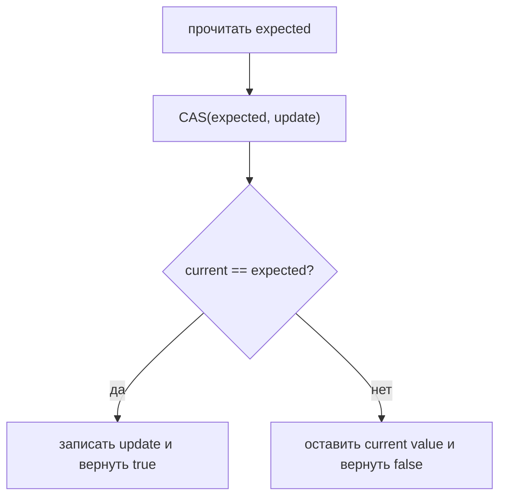
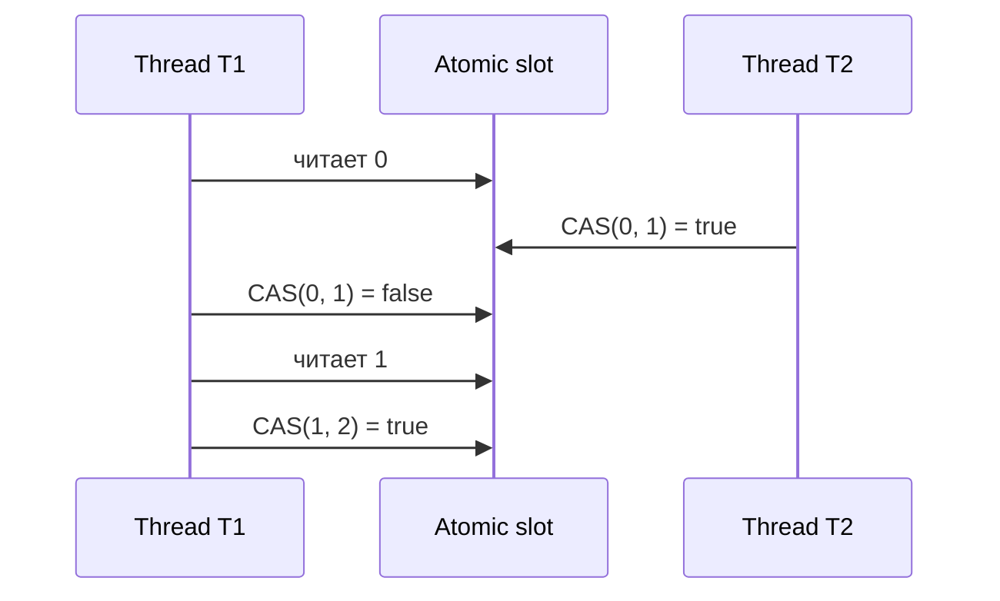
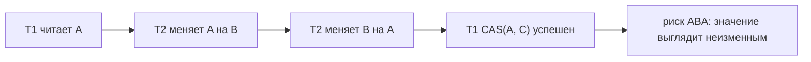

# Compare-And-Set (CAS)

## Интуиция

Compare-and-set, обычно сокращают до CAS, это атомарная операция такого вида: «если текущее значение все еще равно expected value, замени его на новое; иначе ничего не меняй и сообщи failure». Представь сотрудника почты, который меняет адресную наклейку на посылке только если на ней все еще тот адрес, который ты записал. Проверка и замена происходят как одно действие у стойки, поэтому никто не может вклиниться между проверкой и изменением.

В Java ты обычно встречаешь CAS через `AtomicInteger.compareAndSet(expected, update)`, `AtomicReference.compareAndSet(expected, update)`, `VarHandle.compareAndSet(...)` и внутри lock-free структур данных. Это один из строительных блоков безопасных обновлений в concurrent code, рядом с locks и [critical sections](topic:critical-section). Кухонная аналогия: повар меняет один ticket заказа только если на нем все еще написано «pending»; если другой повар уже отметил его как «served», изменение отклоняется и не перезаписывает реальность.



## Зачем Это Нужно

Общее обновление вроде `count = count + 1` не является одним шагом. Оно читает старое значение, вычисляет следующее, затем записывает его обратно. Это классическое место для lost update, который подробно разбирается в [thread-safe numeric addition](topic:thread-safe-addition) и [race-condition avoidance](topic:race-condition-avoidance). Бытовая версия: два кассира читают с доски один и тот же остаток товара и оба записывают «9»; одна продажа исчезает.

CAS превращает запись в защищенную запись. Thread говорит: «Я прочитал 10, поэтому поставь значение 11 только если оно все еще 10». Если другой thread уже изменил его на 11, CAS завершается failure, и thread должен решить, что делать дальше. Как контроллер светофора: он меняет сигнал только если сигнал все еще в том состоянии, которое он проверил мгновение назад.



## Retry Loops

CAS часто появляется в loop:

```java
while (true) {
    int current = value.get();
    int next = current + 1;
    if (value.compareAndSet(current, next)) {
        return;
    }
}
```

Такой loop не является ошибкой. Он означает: «если кто-то изменил значение первым, прочитай новое значение и пересчитай». На кухне это похоже на проверку счетчика заказов, попытку обновить ticket, и если другой повар обновил его первым, чтение свежего ticket перед своей правкой.

Код внутри loop должен быть безопасен для повторного выполнения. Чистое вычисление подходит; списание денег с карты, отправка email или запись в файл внутри retry body не подходят, потому что failed CAS может запустить body снова. Почтовая аналогия простая: перепроверить наклейку безвредно, а печатать и отправлять новую посылку при каждом retry нельзя.

## ABA Problem

CAS сравнивает только то значение, которое ему дали. Если thread прочитал `A`, другой thread изменил `A` на `B`, затем изменил `B` обратно на `A`, CAS первого thread все равно может быть успешным, потому что значение выглядит неизменным. Это ABA problem. Представь табло очереди в поликлинике: ты видел ticket 42, кто-то обслужил 42, потом 43, а затем табло снова показывает 42, потому что новый ticket переиспользовал номер. Номер совпадает, но ситуация уже другая.



Типичные исправления: добавить version stamp, использовать `AtomicStampedReference`, избегать переиспользуемых identities или взять lock, если invariant охватывает больше одного значения. В бытовых терминах, не проверяй только наклейку на банке, если содержимое могли дважды поменять; добавь датированную пломбу или защити всю полку.

## Ответ За 60 Секунд

Compare-and-set это атомарное условное обновление. Оно читает текущее значение, сравнивает его с expected value, который передал caller, и только если они совпадают, записывает новое значение и возвращает `true`; иначе оставляет значение неизменным и возвращает `false`. В Java оно доступно через классы вроде `AtomicInteger` и `AtomicReference`, и используется для non-blocking updates и concurrent data structures. CAS предотвращает lost updates, потому что stale writer не может тихо перезаписать более новое значение; stale CAS завершается failure и может повториться после fresh read. Главные ловушки: retry loops при contention, повторные side effects внутри retry body, защита только одного значения вместо целого invariant и ABA problem.

## Практическая Польза

CAS полезен для counters, flags, одноразовых transitions состояния и небольших lock-free algorithms. Он сохраняет многие обновления быстрыми, потому что thread не обязан блокироваться на monitor, когда за значение никто не конкурирует. У почтовой стойки один сотрудник может проштамповать один бланк, не закрывая все здание.

CAS также используется внутри более высокоуровневых инструментов. `ConcurrentHashMap` использует тонкие concurrent mechanics для безопасных обновлений, это можно сравнить в [ConcurrentHashMap vs synchronized HashMap](topic:concurrenthashmap-vs-synchronized-map). В реальных системах предпочитай такие высокоуровневые классы, когда они прямо выражают задачу. Это как использовать нормальный автомат очереди в загруженном офисе вместо того, чтобы каждый посетитель вручную договаривался о номерах tickets.

Используй lock, когда операция должна обновить несколько fields вместе, поддержать сложный invariant или выполнить blocking work. [Critical section](topic:critical-section) часто понятнее, чем хитрый CAS loop. На кухне, если нужно перенести суп, хлеб и ticket заказа вместе, защити весь поднос, а не одну липкую записку.

## Частые Заблуждения

- «CAS означает, что synchronization нет». CAS это synchronization, просто не Java monitor. Он опирается на atomicity hardware и JVM, как турникет, который дает одному человеку обновить счетчик без закрытия всего коридора.
- «`volatile` достаточно для `count++`». `volatile` дает visibility, но `count++` все равно остается read, compute, write. CAS добавляет условную атомарную запись. Доска объявлений видна всем, но два человека все равно могут скопировать одно и то же старое число, если запись не защищена.
- «CAS всегда делает код быстрее». При сильном contention множество retries может тратить CPU. Это как десять кассиров, которые снова и снова хватают и переписывают одну маленькую карточку остатков.
- «CAS защищает весь object graph». Один CAS защищает одну variable или reference. Если два fields должны измениться вместе, используй lock, immutable holder object или другой дизайн. Одна наклейка на одной коробке не защищает весь склад.
- «`compareAndSet` может случайно завершиться failure». Обычный strong `compareAndSet` должен завершаться failure только если сравнение не прошло. Варианты `weakCompareAndSet` могут иметь spurious failure и применяются в специализированных loops. Это разница между сотрудником, который отклонил наклейку потому что она изменилась, и сканером, который иногда просит отсканировать еще раз.
