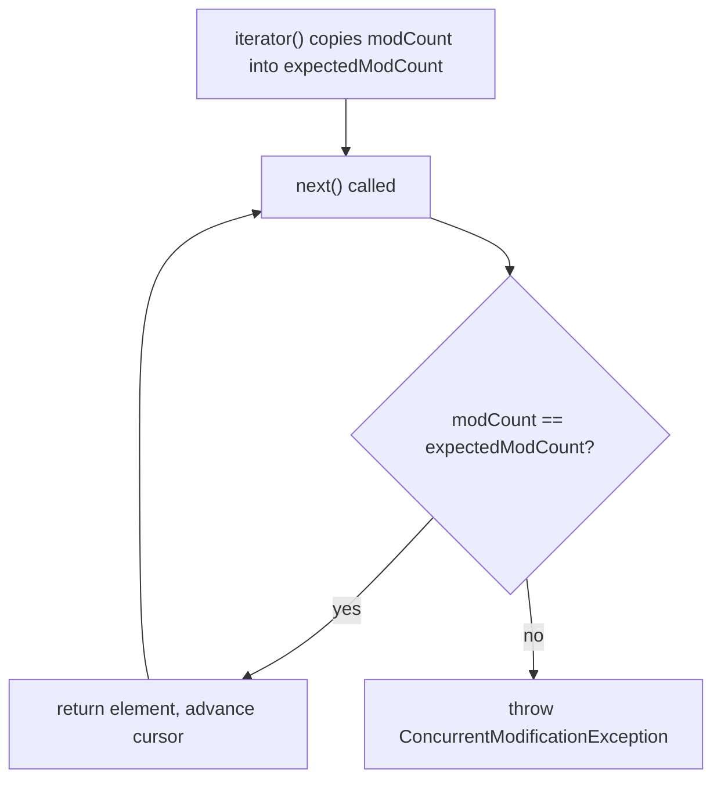
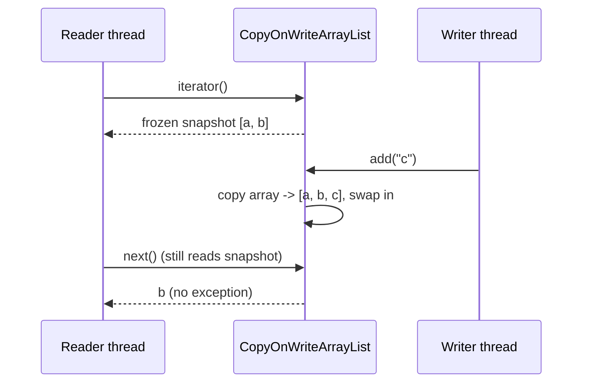
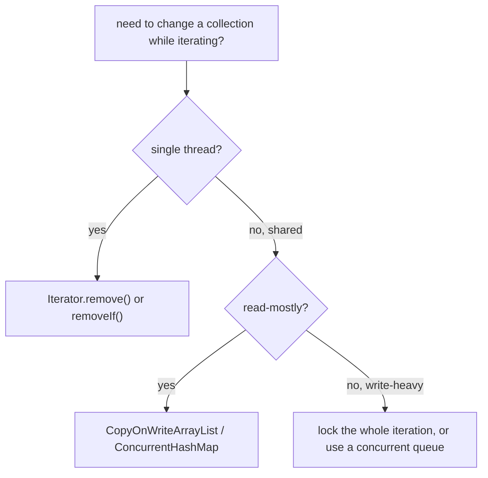

# ConcurrentModificationException and Safe Collection Changes

`ConcurrentModificationException` (CME) is the exception a collection throws when
it notices that its structure changed *while you were iterating over it*. Despite
the name, it is not really about concurrency — it is about a **fail-fast iterator**
catching a rug being pulled out from under it.

Think of a librarian walking down a shelf with a clipboard, copying every book
title in order. Before starting, she notes the shelf's "edit number" on her
clipboard. If someone inserts or removes a book mid-walk, the shelf's edit number
changes, her clipboard no longer matches, and she stops immediately rather than
silently skipping or double-counting a book. That refusal to continue is the CME.

This topic builds on [Java Collections Overview](topic:java-collections-overview)
and [ArrayList Growth Internals](topic:arraylist-internals); for the threading
side see [Java Multithreading](topic:java-multithreading) and
[Avoiding Race Conditions](topic:race-condition-avoidance).

## What actually causes it: modCount

A fail-fast collection like `ArrayList`, `HashMap` or `HashSet` keeps an internal
counter called `modCount` that is incremented on every **structural** change (an
add or remove that changes the size). When you create an iterator (which a
for-each loop does for you), it copies the current `modCount` into its own
`expectedModCount` — that is the number on the librarian's clipboard.

Every call to `next()` first checks `modCount == expectedModCount`. If they
differ, the structure changed behind the iterator's back, so it throws CME *before*
returning anything. It is a guard, not a guarantee: fail-fast is a best-effort
debugging aid, not a reliable lock.



The classic trap is **single-threaded** — no second thread in sight:

```java
for (String task : tasks) {
    if (task.equals("skip")) {
        tasks.remove(task); // bumps modCount -> next next() throws CME
    }
}
```

The for-each loop hides an iterator, and `tasks.remove(...)` changes the list
behind that iterator. It is the librarian pulling a book off the very shelf she is
copying.

## Safe change #1: Iterator.remove() (single thread)

If you only need to delete while looping in one thread, use the iterator's own
`remove()`. It removes the current element **and** updates `expectedModCount` to
the new `modCount`, so the clipboard and the shelf stay in agreement.

```java
Iterator<String> it = tasks.iterator();
while (it.hasNext()) {
    if (it.next().equals("skip")) {
        it.remove(); // the one blessed way to mutate during iteration
    }
}
```

This is the librarian asking the shelf to remove the book *through her*, so she
updates her clipboard number in the same motion. (`List.removeIf(...)` is a clean
modern shortcut for exactly this case.) Note this only solves the *single-threaded*
problem — it does nothing for two threads touching the list at once.

## Safe change #2: CopyOnWriteArrayList (shared between threads)

When a collection is genuinely **shared between threads** and reads vastly
outnumber writes, reach for `CopyOnWriteArrayList`. Its trick:

- **Every write copies the entire backing array.** Add, remove and set build a
  brand-new array and atomically swap it in. The old array is never mutated.
- **Each iterator reads a frozen snapshot** of the array as it was when the
  iterator was created. Later writes produce a *different* array the iterator
  never looks at, so it can never observe a mid-change and **never throws CME**.



This is like photocopying the whole shelf list for each reader: the writer can
rearrange the real shelf freely, and every reader calmly finishes their own paper
copy. The cost is obvious — copying the whole array on each write is `O(n)`, so it
is only sensible for **read-mostly** data (listeners, config, routing tables), not
a hot write path. A second consequence: the iterator is read-only, so
`iterator.remove()` throws `UnsupportedOperationException`.

## Other safe options

`CopyOnWriteArrayList` is one tool, not the only one. The broader menu:

- **`ConcurrentHashMap`** for maps — its iterators are *weakly consistent*: they
  never throw CME, traverse without locking, and may or may not reflect writes
  made after the iterator was created. See
  [ConcurrentHashMap vs synchronized HashMap](topic:concurrenthashmap-vs-synchronized-map).
- **`Collections.synchronizedList(...)`** wraps a list so each method is
  synchronized — but **iteration is not atomic**, so you must hold the wrapper's
  lock yourself for the whole loop or you are back to a CME. See
  [Concurrent vs Synchronized Collections](topic:concurrent-synchronized-collections).
- **Concurrent queues** like `ConcurrentLinkedQueue` / `LinkedBlockingQueue` when
  the access pattern is really producer–consumer.
- **External locking** — guard every access with the same lock so writes and the
  whole iteration form one [critical section](topic:critical-section).



## 60-second interview answer

`ConcurrentModificationException` is thrown by fail-fast iterators when a
collection is structurally modified during iteration. Collections like `ArrayList`
and `HashMap` track a `modCount`; the iterator snapshots it as `expectedModCount`
and checks them on every `next()` — a mismatch throws. It commonly happens in a
single thread by calling `list.remove(...)` inside a for-each loop. To delete
safely in one thread, use `Iterator.remove()` or `removeIf()`. For a collection
shared across threads, use a concurrent collection: `CopyOnWriteArrayList` gives
each iterator a frozen snapshot and copies the array on every write, so it never
throws but costs `O(n)` per write — ideal for read-mostly data. Other options are
`ConcurrentHashMap` (weakly consistent iterators) or locking the whole iteration.

## Common misconceptions

- **"CME means two threads touched the list."** No — it is most often a single
  thread mutating a list inside its own for-each loop.
- **"Fail-fast guarantees detection."** It is best-effort; the check is not a
  contract, and unlucky timing across threads can miss or mislabel it.
- **"`Collections.synchronizedList` lets me iterate safely."** Each *method* is
  synchronized, but a multi-step iteration is not — you must lock around the whole
  loop yourself.
- **"`CopyOnWriteArrayList` is just a thread-safe ArrayList, use it everywhere."**
  Every write copies the whole array; on a write-heavy list it is a performance
  trap.
- **"A `CopyOnWriteArrayList` iterator sees later writes."** It sees only the
  snapshot from when it was created, and `iterator.remove()` is unsupported.
