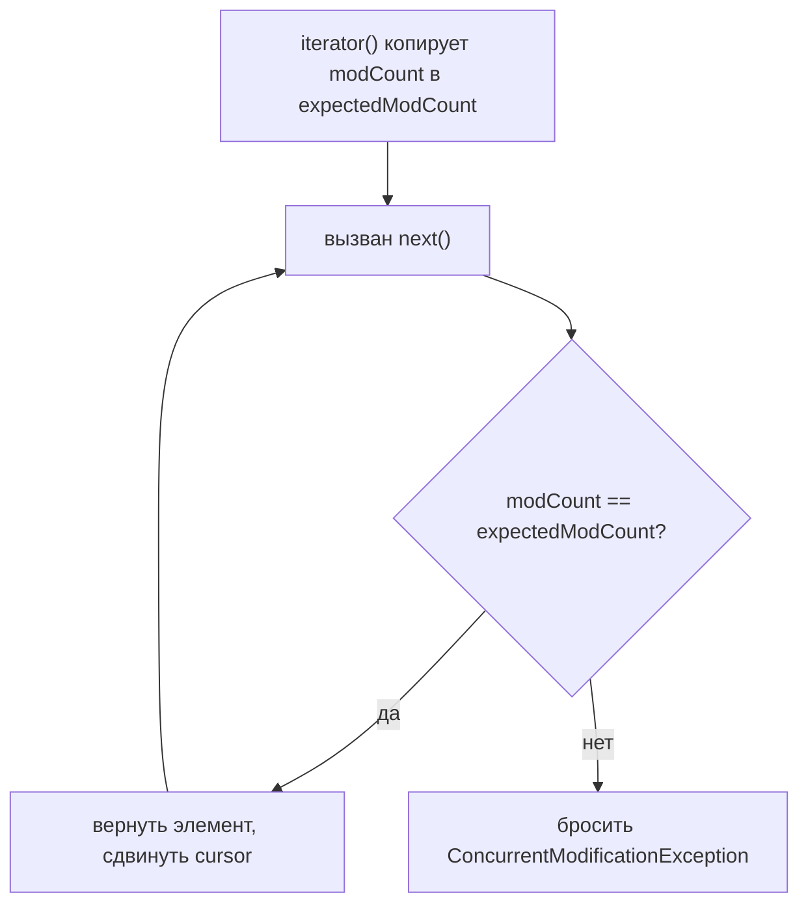
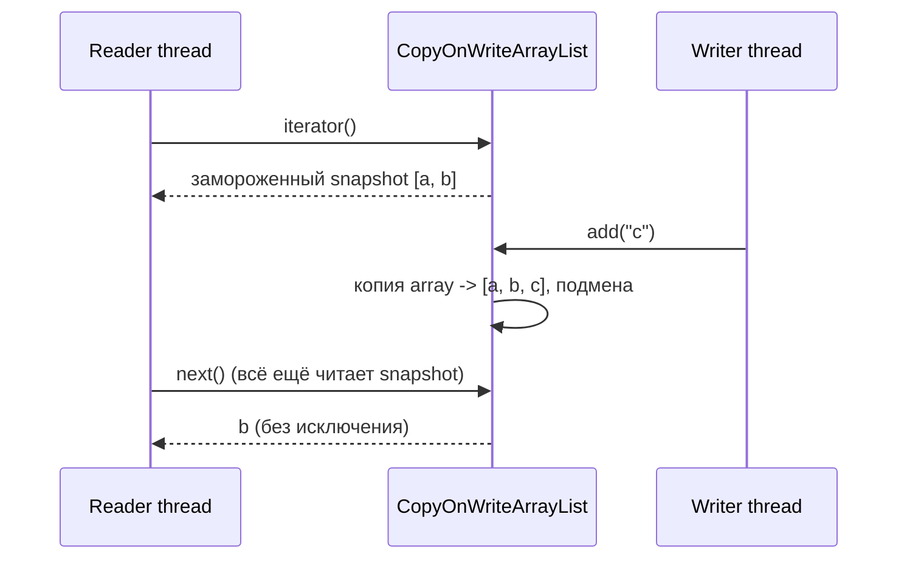
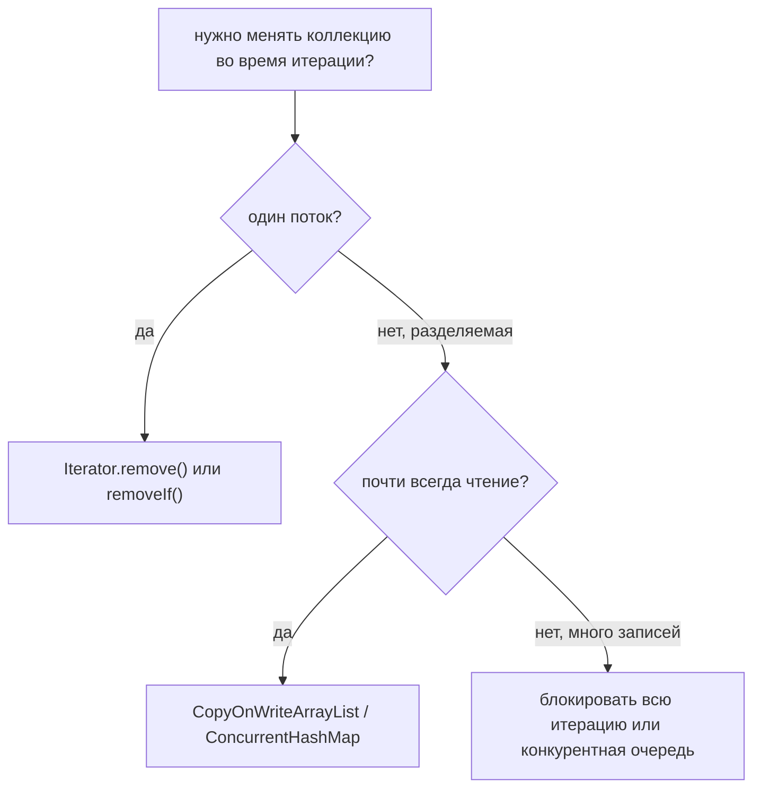

# ConcurrentModificationException и безопасное изменение коллекций

`ConcurrentModificationException` (CME) — это исключение, которое коллекция
бросает, когда замечает, что её структура изменилась *во время итерации по ней*.
Несмотря на название, дело не столько в многопоточности — это **fail-fast
iterator**, который ловит момент, когда «ковёр выдёргивают у него из-под ног».

Представьте библиотекаря, который идёт вдоль полки с планшетом и по порядку
переписывает названия книг. Перед началом он записывает на планшет «номер
изменения» полки. Если кто-то вставит или уберёт книгу посреди обхода, номер
изменения полки поменяется, планшет перестанет совпадать, и он немедленно
остановится, вместо того чтобы молча пропустить или посчитать книгу дважды. Этот
отказ продолжать и есть CME.

Тема опирается на [Java Collections Overview](topic:java-collections-overview) и
[ArrayList Growth Internals](topic:arraylist-internals); по части потоков см.
[Java Multithreading](topic:java-multithreading) и
[Avoiding Race Conditions](topic:race-condition-avoidance).

## Что на самом деле вызывает CME: modCount

Fail-fast коллекция вроде `ArrayList`, `HashMap` или `HashSet` хранит внутренний
счётчик `modCount`, который увеличивается при каждом **структурном** изменении
(add или remove, меняющий размер). Когда вы создаёте iterator (а for-each цикл
делает это за вас), он копирует текущий `modCount` в свой `expectedModCount` — это
число на планшете библиотекаря.

Каждый вызов `next()` сначала проверяет `modCount == expectedModCount`. Если они
различаются, значит структура изменилась за спиной iterator, и он бросает CME
*до* того, как что-либо вернуть. Это охранник, а не гарантия: fail-fast — это
вспомогательное средство отладки по принципу best-effort, а не надёжная блокировка.



Классическая ловушка — **однопоточная**, второго потока и близко нет:

```java
for (String task : tasks) {
    if (task.equals("skip")) {
        tasks.remove(task); // увеличивает modCount -> следующий next() бросит CME
    }
}
```

For-each цикл прячет iterator, а `tasks.remove(...)` меняет список за спиной этого
iterator. Это библиотекарь, который снимает книгу с той самой полки, которую сам
переписывает.

## Безопасное изменение №1: Iterator.remove() (один поток)

Если нужно только удалять во время цикла в одном потоке, используйте собственный
`remove()` у iterator. Он удаляет текущий элемент **и** обновляет
`expectedModCount` до нового `modCount`, поэтому планшет и полка остаются
согласованными.

```java
Iterator<String> it = tasks.iterator();
while (it.hasNext()) {
    if (it.next().equals("skip")) {
        it.remove(); // единственный «благословлённый» способ менять во время итерации
    }
}
```

Это библиотекарь, который просит убрать книгу *через себя*, так что обновляет номер
на планшете тем же движением. (`List.removeIf(...)` — аккуратный современный
короткий путь ровно для этого случая.) Учтите: это решает только *однопоточную*
проблему — для двух потоков, трогающих список одновременно, оно ничего не даёт.

## Безопасное изменение №2: CopyOnWriteArrayList (разделяемый между потоками)

Когда коллекция действительно **разделяется между потоками** и чтений намного
больше, чем записей, берите `CopyOnWriteArrayList`. Его приём:

- **Каждая запись копирует весь backing array.** Add, remove и set создают
  совершенно новый array и атомарно подменяют его. Старый array не мутируется.
- **Каждый iterator читает замороженный snapshot** array на момент создания
  iterator. Последующие записи создают *другой* array, на который iterator не
  смотрит, поэтому он не может увидеть изменение посередине и **никогда не бросает
  CME**.



Это как сделать фотокопию всего списка полки для каждого читателя: писатель может
свободно переставлять реальную полку, а каждый читатель спокойно дочитывает свою
бумажную копию. Цена очевидна — копирование всего array на каждую запись это
`O(n)`, поэтому он разумен только для данных, где **почти всегда читают**
(слушатели, конфигурация, таблицы маршрутизации), а не для горячего пути записи.
Второе следствие: iterator доступен только для чтения, поэтому `iterator.remove()`
бросает `UnsupportedOperationException`.

## Другие безопасные варианты

`CopyOnWriteArrayList` — один инструмент, но не единственный. Более широкое меню:

- **`ConcurrentHashMap`** для map — его iterators *слабо согласованные* (weakly
  consistent): они никогда не бросают CME, обходят без блокировки и могут
  отражать или не отражать записи, сделанные после создания iterator. См.
  [ConcurrentHashMap vs synchronized HashMap](topic:concurrenthashmap-vs-synchronized-map).
- **`Collections.synchronizedList(...)`** оборачивает список так, что каждый метод
  синхронизирован — но **итерация не атомарна**, поэтому вы должны сами держать
  блокировку обёртки на весь цикл, иначе снова получите CME. См.
  [Concurrent vs Synchronized Collections](topic:concurrent-synchronized-collections).
- **Конкурентные очереди** вроде `ConcurrentLinkedQueue` / `LinkedBlockingQueue`,
  когда паттерн доступа действительно producer–consumer.
- **Внешняя блокировка** — защищайте каждый доступ одной и той же блокировкой,
  чтобы записи и вся итерация образовали одну
  [критическую секцию](topic:critical-section).



## Ответ за 60 секунд

`ConcurrentModificationException` бросается fail-fast iterators, когда коллекция
структурно изменяется во время итерации. Коллекции вроде `ArrayList` и `HashMap`
отслеживают `modCount`; iterator снимает его как `expectedModCount` и проверяет
их при каждом `next()` — расхождение приводит к исключению. Чаще всего это
случается в одном потоке при вызове `list.remove(...)` внутри for-each цикла.
Чтобы безопасно удалять в одном потоке, используйте `Iterator.remove()` или
`removeIf()`. Для коллекции, разделяемой между потоками, используйте конкурентную
коллекцию: `CopyOnWriteArrayList` даёт каждому iterator замороженный snapshot и
копирует array на каждую запись, поэтому никогда не бросает CME, но стоит `O(n)`
на запись — идеально для данных, где почти всегда читают. Другие варианты —
`ConcurrentHashMap` (слабо согласованные iterators) или блокировка всей итерации.

## Частые заблуждения

- **«CME значит, что список трогали два потока».** Нет — чаще всего это один поток,
  меняющий список внутри собственного for-each цикла.
- **«Fail-fast гарантирует обнаружение».** Это best-effort; проверка не контракт, и
  при неудачном тайминге между потоками её можно пропустить или неверно
  интерпретировать.
- **«`Collections.synchronizedList` позволяет безопасно итерировать».** Каждый
  *метод* синхронизирован, но многошаговая итерация — нет; нужно самому держать
  блокировку вокруг всего цикла.
- **«`CopyOnWriteArrayList` — просто thread-safe ArrayList, используй везде».**
  Каждая запись копирует весь array; на списке с частыми записями это ловушка
  производительности.
- **«Iterator у `CopyOnWriteArrayList` видит более поздние записи».** Он видит
  только snapshot на момент создания, а `iterator.remove()` не поддерживается.
