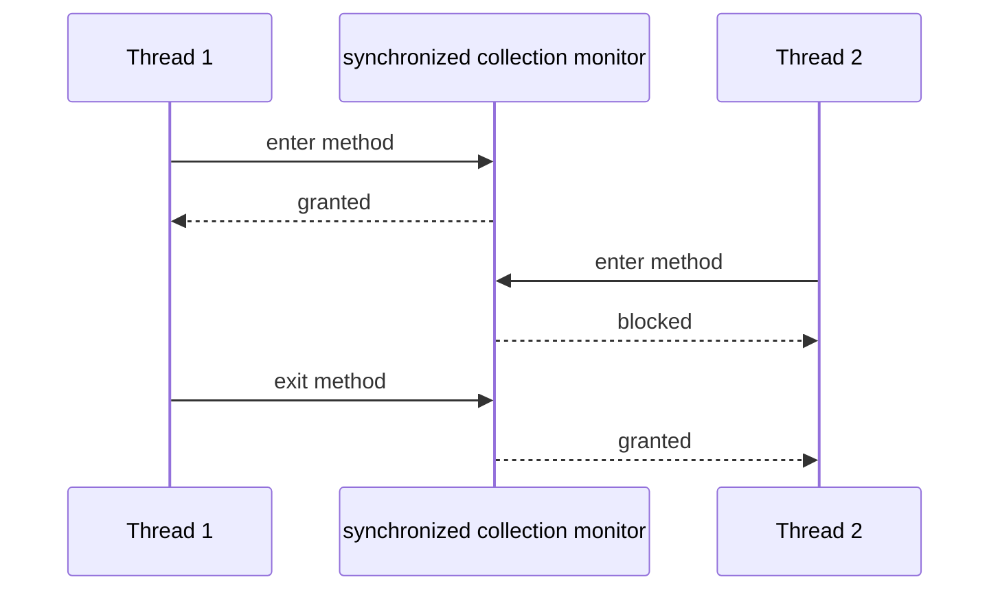
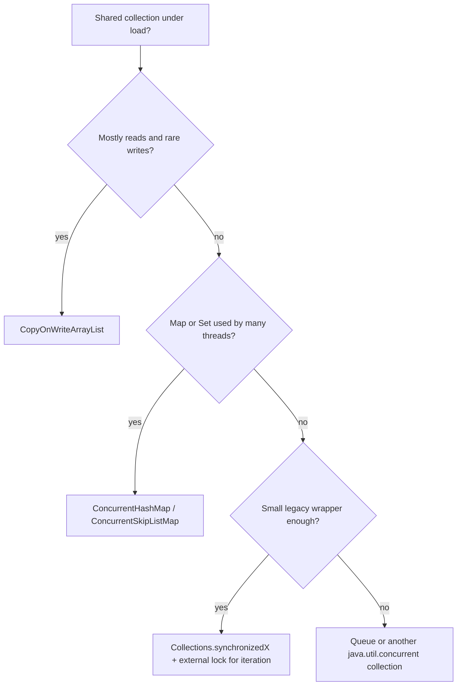

# Concurrent vs Synchronized Collections

This interview question is about two different ways to make shared collections usable from multiple threads. A synchronized collection is usually an ordinary collection wrapped by `Collections.synchronizedList`, `Collections.synchronizedMap`, `Collections.synchronizedSet`, or an older class such as `Vector` or `Hashtable`. A concurrent collection is designed for concurrency from the inside, for example `ConcurrentHashMap`, `CopyOnWriteArrayList`, `ConcurrentLinkedQueue`, or `BlockingQueue`.

Analogy: a synchronized wrapper is a kitchen with one key for the whole counter; every cook must take the key before touching anything. A concurrent collection is a larger kitchen with separate workstations, where several cooks can prepare different orders without standing in one line.



## What a synchronized collection gives you

`Collections.synchronizedMap(map)` returns a wrapper where each individual method is synchronized on one monitor. `put`, `get`, `remove`, and `size` are protected as separate method calls. That prevents two threads from executing those wrapper methods at the same time, which is useful for small shared state or legacy code.

Analogy: the post office has one service window. Every customer is served correctly, but all customers wait behind the same window even if one only wants to buy a stamp.

The important limit is that only one method call is protected. A sequence such as `if (!map.containsKey(k)) map.put(k, v)` is not atomic unless the caller synchronizes around the whole sequence using the same wrapper lock. Iteration also needs external locking:

```java
synchronized (list) {
    Iterator<String> it = list.iterator();
    while (it.hasNext()) {
        use(it.next());
    }
}
```

Analogy: checking that a mailbox is empty and then placing a letter must be one guarded action. If you unlock the room between the check and the placement, another clerk can change the mailbox.

The iterator of a synchronized wrapper is still the underlying collection's iterator. For `ArrayList` or `HashMap`, that usually means fail-fast behavior: if another thread modifies the collection while you iterate without the external lock, you can get `ConcurrentModificationException`. The wrapper did not turn the traversal into a safe long transaction.

Analogy: the kitchen key protects each quick visit to the fridge, but it does not protect a whole recipe unless you keep the key for the entire recipe.

## What a concurrent collection gives you

Classes in `java.util.concurrent` are built with concurrency in mind. They use internal techniques such as volatile fields, CAS, fine-grained locking, immutable snapshots, or non-blocking queues. The exact mechanism depends on the class, but the goal is the same: reduce contention and provide operations with clear thread-safety guarantees.

Analogy: instead of one locked post-office window, there are several windows, parcel lockers, and a queue system. Customers still follow rules, but one slow parcel does not block every stamp purchase.

`ConcurrentHashMap` is the usual replacement for a shared `HashMap`. It allows many reads and updates to proceed without one global monitor around the whole map. Its iterators are weakly consistent: they do not throw fail-fast exceptions, and they may reflect some updates made during iteration. Use atomic methods such as `putIfAbsent`, `compute`, `computeIfAbsent`, and `merge` for compound actions.

Analogy: while one clerk adds a new address card, another clerk can still look up a different address. For "create the card only if it is missing", the clerk uses one official form instead of asking, walking away, and coming back later.

`CopyOnWriteArrayList` is a different trade-off. Reads and iteration are very cheap and stable because iterators see an old array snapshot. Writes are expensive because each write copies the backing array. It is good for listener lists and configuration snapshots, not for hot write-heavy lists.

Analogy: a restaurant prints a menu. Diners can read their copy without locks. Updating one dish means printing a new menu, which is fine if menu changes are rare and reads are frequent.

`ConcurrentHashMap` also rejects `null` keys and values. In a concurrent map, `get(k) == null` must reliably mean "no mapping now". If `null` values were allowed, a racing read could not distinguish "absent" from "present with null".

Analogy: a parcel tracking screen needs a blank result to mean "no parcel with this id". If blank could also mean "parcel exists but its label is blank", clerks would make unsafe decisions.

## The practical difference

| Question | Synchronized collections | Concurrent collections |
|---|---|---|
| Main idea | Wrap each method with one monitor | Design operations for multi-threaded access |
| Contention | High under load because one lock protects the wrapper | Usually lower because implementation is specialized |
| Compound actions | Caller must lock the full sequence | Prefer atomic APIs such as `putIfAbsent` or `compute` |
| Iteration | Must externally synchronize; often fail-fast | Weakly consistent or snapshot, depending on class |
| Best use | Small shared state, legacy APIs, low contention | Shared maps, queues, listener lists, high concurrency |

Analogy: a synchronized wrapper is like closing the whole road for every delivery truck. A concurrent collection is like adding lanes, traffic lights, and delivery bays designed for traffic.



## 60-second interview answer

Synchronized collections are ordinary collections guarded by synchronization, usually one monitor per wrapper. Individual method calls are thread-safe, but iteration and compound actions are not automatically atomic; callers must synchronize externally on the same lock. Concurrent collections are purpose-built for multi-threaded access. They reduce contention, provide safe concurrent reads and updates, and often expose atomic operations such as `putIfAbsent`, `computeIfAbsent`, or `merge`. Their iterators are usually weakly consistent or snapshot-based instead of fail-fast. In production, I would usually choose `ConcurrentHashMap` or another `java.util.concurrent` class for shared hot data, and use synchronized wrappers only for simple low-contention or legacy cases.

## Production relevance

In services with worker threads, caches, registries, in-memory deduplication maps, or listener lists, the collection choice affects correctness and throughput. A synchronized wrapper can turn a busy service into a single-lane road. It can still be correct, but every caller waits for the same monitor. This connects directly to the idea of a [critical section](topic:critical-section): all access to the same shared state must use the same guard.

Analogy: if every kitchen order needs the manager's only key, the food is correct but slow. Adding specialized stations lets salad, grill, and packing move at the same time.

For shared maps, `ConcurrentHashMap` is usually the default because it avoids global locking and gives atomic methods for common races. This is especially relevant when you already understand [Java Multithreading](topic:java-multithreading), [Thread vs Runnable](topic:thread-vs-runnable), and the difference between manually creating threads and using a [ThreadPool](topic:thread-vs-threadpool).

Analogy: a dispatcher with many counters works better than asking every delivery driver to queue at one desk.

Do not use `HashMap` directly from multiple threads without a lock. Its internal structure is not thread-safe, and this is separate from its bucket mechanics described in [HashMap Internals](topic:hashmap). If the shared state is a map, choose a concurrent map or protect the whole map consistently.

Analogy: a shelf layout can be clever, but if two clerks rearrange the same shelf without rules, the shelf still becomes unreliable.

## Common misconceptions

**"Synchronized collection means every use is safe."** No. Individual wrapper methods are synchronized, but compound logic and iteration need external synchronization around the whole operation.

Analogy: locking the kitchen for each single ingredient does not protect a whole recipe if you release the key between steps.

**"Concurrent collections are always faster."** No. They reduce contention for concurrent access, but they can have overhead. `CopyOnWriteArrayList` is excellent for many reads and rare writes, and poor for frequent writes.

Analogy: printing a new menu for every tiny edit is wasteful if the menu changes every minute.

**"Weakly consistent iterator means broken iterator."** No. It means the iterator is safe to continue while updates happen, but it does not promise a perfect frozen view unless the class documents snapshot behavior.

Analogy: a traffic camera may show cars that passed while you were watching, but it will not crash because another car entered the road.

**"ConcurrentHashMap makes every multi-step workflow atomic."** No. Use the provided atomic methods for the exact workflow, or add a higher-level lock when one collection operation is not enough.

Analogy: one official form for "reserve this mailbox if empty" is safe; asking one clerk, leaving, and then returning to reserve it is not.

**"Synchronized wrappers are obsolete."** Not completely. They are acceptable for small, low-contention cases or compatibility with APIs that expect a classic collection. For hot shared state, prefer purpose-built concurrent collections.

Analogy: one post-office window is fine in a small village. It is a bottleneck in a central station at rush hour.
