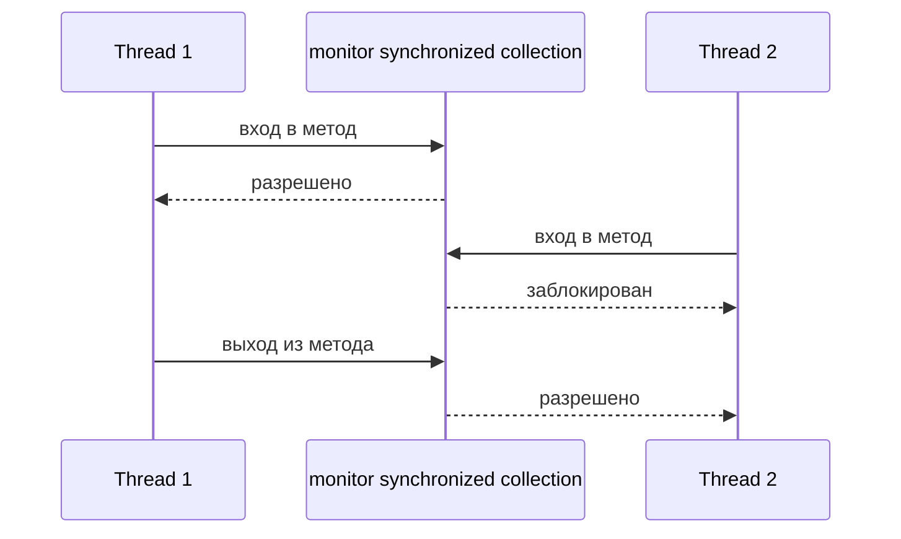
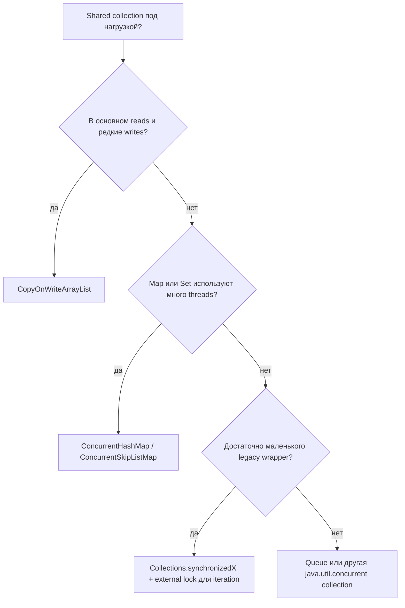

# Concurrent и synchronized коллекции

Этот вопрос на собеседовании про два разных способа сделать shared collections пригодными для нескольких threads. Synchronized collection обычно означает обычную коллекцию, обёрнутую через `Collections.synchronizedList`, `Collections.synchronizedMap`, `Collections.synchronizedSet`, или старые классы вроде `Vector` и `Hashtable`. Concurrent collection спроектирована для concurrency изнутри, например `ConcurrentHashMap`, `CopyOnWriteArrayList`, `ConcurrentLinkedQueue` или `BlockingQueue`.

Аналогия: synchronized wrapper — это кухня с одним ключом от всей рабочей поверхности; каждый повар должен взять ключ, прежде чем что-то трогать. Concurrent collection — это большая кухня с отдельными станциями, где несколько поваров могут готовить разные заказы без одной общей очереди.



## Что даёт synchronized collection

`Collections.synchronizedMap(map)` возвращает wrapper, где каждый отдельный метод синхронизируется на одном monitor. `put`, `get`, `remove` и `size` защищены как отдельные вызовы методов. Это не даёт двум threads одновременно выполнять эти методы wrapper и подходит для небольшого shared state или legacy-кода.

Аналогия: на почте есть одно окно обслуживания. Каждого клиента обслуживают корректно, но все ждут у одного окна, даже если кто-то хочет только купить марку.

Главное ограничение в том, что защищён только один вызов метода. Последовательность вроде `if (!map.containsKey(k)) map.put(k, v)` не атомарна, если caller не синхронизирует всю последовательность на том же lock wrapper. Iteration тоже требует внешнего locking:

```java
synchronized (list) {
    Iterator<String> it = list.iterator();
    while (it.hasNext()) {
        use(it.next());
    }
}
```

Аналогия: проверить, что почтовый ящик пуст, и положить письмо нужно как одно защищённое действие. Если открыть комнату между проверкой и размещением письма, другой сотрудник может изменить ящик.

Iterator у synchronized wrapper остаётся iterator исходной коллекции. Для `ArrayList` или `HashMap` это обычно fail-fast поведение: если другой thread изменит коллекцию во время обхода без внешнего lock, можно получить `ConcurrentModificationException`. Wrapper не превращает весь traversal в безопасную длинную transaction.

Аналогия: ключ от кухни защищает каждый быстрый поход к холодильнику, но не защищает весь рецепт, если не держать ключ до конца рецепта.

## Что даёт concurrent collection

Классы из `java.util.concurrent` изначально рассчитаны на concurrency. Они используют внутренние техники вроде volatile fields, CAS, fine-grained locking, immutable snapshots или non-blocking queues. Конкретный механизм зависит от класса, но цель одна: снизить contention и дать операциям понятные thread-safety guarantees.

Аналогия: вместо одного окна на почте есть несколько окон, ячейки для посылок и система очередей. Клиенты всё ещё следуют правилам, но одна медленная посылка не блокирует каждую покупку марки.

`ConcurrentHashMap` — обычная замена shared `HashMap`. Она позволяет многим reads и updates идти без одного global monitor вокруг всей map. Её iterators weakly consistent: они не выбрасывают fail-fast exceptions и могут отразить часть updates, сделанных во время iteration. Для compound actions используй атомарные методы `putIfAbsent`, `compute`, `computeIfAbsent` и `merge`.

Аналогия: пока один сотрудник добавляет новую адресную карточку, другой всё ещё может искать другой адрес. Для "создать карточку, только если её нет" сотрудник использует один официальный бланк, а не спрашивает, уходит и возвращается позже.

`CopyOnWriteArrayList` — другой trade-off. Reads и iteration очень дешёвые и стабильные, потому что iterators видят старый array snapshot. Writes дорогие, потому что каждая запись копирует backing array. Это хорошо для listener lists и configuration snapshots, но плохо для горячих write-heavy lists.

Аналогия: ресторан печатает меню. Гости читают свою копию без locks. Обновить одно блюдо значит напечатать новое меню, что нормально, если меню меняется редко, а читают его часто.

`ConcurrentHashMap` также запрещает `null` keys и values. В concurrent map `get(k) == null` должен надёжно означать "mapping сейчас нет". Если бы `null` values были разрешены, racing read не отличил бы "нет записи" от "запись есть, но value равен null".

Аналогия: экран отслеживания посылок должен понимать пустой результат как "нет посылки с таким id". Если пустота могла бы значить ещё и "посылка есть, но label пустой", сотрудники принимали бы небезопасные решения.

## Практическая разница

| Вопрос | Synchronized collections | Concurrent collections |
|---|---|---|
| Основная идея | Обернуть каждый метод одним monitor | Спроектировать операции для multi-threaded access |
| Contention | Высокий под нагрузкой, потому что wrapper защищён одним lock | Обычно ниже, потому что реализация специализированная |
| Compound actions | Caller должен залочить всю последовательность | Лучше использовать атомарные API вроде `putIfAbsent` или `compute` |
| Iteration | Нужна внешняя синхронизация; часто fail-fast | Weakly consistent или snapshot, зависит от класса |
| Где лучше | Маленький shared state, legacy APIs, низкий contention | Shared maps, queues, listener lists, высокая concurrency |

Аналогия: synchronized wrapper похож на перекрытие всей дороги для каждого грузовика. Concurrent collection похожа на добавление полос, светофоров и зон разгрузки, рассчитанных на поток.



## Ответ за 60 секунд

Synchronized collections — это обычные collections, защищённые synchronization, обычно одним monitor на wrapper. Отдельные вызовы методов thread-safe, но iteration и compound actions не становятся автоматически атомарными; callers должны синхронизироваться снаружи на том же lock. Concurrent collections специально созданы для multi-threaded access. Они снижают contention, дают безопасные concurrent reads и updates и часто имеют атомарные операции вроде `putIfAbsent`, `computeIfAbsent` или `merge`. Их iterators обычно weakly consistent или snapshot-based, а не fail-fast. В production для горячих shared data я чаще выберу `ConcurrentHashMap` или другой класс из `java.util.concurrent`, а synchronized wrappers оставлю для простых low-contention или legacy случаев.

## Почему это важно в production

В сервисах с worker threads, caches, registries, in-memory deduplication maps или listener lists выбор collection влияет на корректность и throughput. Synchronized wrapper может превратить busy service в однополосную дорогу. Он может быть корректным, но каждый caller ждёт один и тот же monitor. Это напрямую связано с идеей [критической секции](topic:critical-section): весь доступ к одному shared state должен использовать одну и ту же защиту.

Аналогия: если для каждого кухонного заказа нужен единственный ключ менеджера, еда будет правильной, но медленной. Специализированные станции позволяют салату, грилю и упаковке двигаться одновременно.

Для shared maps обычно выбирают `ConcurrentHashMap`, потому что она избегает global locking и даёт атомарные методы для частых races. Это особенно важно, если ты уже понимаешь [Java Multithreading](topic:java-multithreading), [Thread vs Runnable](topic:thread-vs-runnable) и разницу между ручным созданием threads и использованием [ThreadPool](topic:thread-vs-threadpool).

Аналогия: диспетчер с несколькими стойками работает лучше, чем очередь всех водителей доставки к одному столу.

Не используй `HashMap` напрямую из нескольких threads без lock. Её внутренняя структура не thread-safe, и это отдельный вопрос от механики buckets, разобранной в [HashMap Internals](topic:hashmap). Если shared state — это map, выбери concurrent map или последовательно защищай всю map.

Аналогия: раскладка полок может быть умной, но если два сотрудника переставляют одну полку без правил, полка всё равно становится ненадёжной.

## Частые заблуждения

**"Synchronized collection значит, что любое использование безопасно."** Нет. Отдельные методы wrapper синхронизированы, но compound logic и iteration требуют внешней синхронизации вокруг всей операции.

Аналогия: запирать кухню для каждого отдельного ингредиента не защищает весь рецепт, если отпускать ключ между шагами.

**"Concurrent collections всегда быстрее."** Нет. Они снижают contention при concurrent access, но тоже имеют overhead. `CopyOnWriteArrayList` отлична для многих reads и редких writes, но плоха для частых writes.

Аналогия: печатать новое меню после каждой маленькой правки расточительно, если меню меняется каждую минуту.

**"Weakly consistent iterator значит сломанный iterator."** Нет. Это значит, что iterator безопасно продолжает работу во время updates, но не обещает идеально замороженный вид, если класс не документирует snapshot behavior.

Аналогия: дорожная камера может показать машины, которые проехали, пока ты смотрел, но она не ломается из-за того, что на дорогу въехала ещё одна машина.

**"ConcurrentHashMap делает любой многошаговый workflow атомарным."** Нет. Используй готовые атомарные методы для конкретного workflow или добавляй lock уровнем выше, если одной операции collection недостаточно.

Аналогия: один официальный бланк для "зарезервировать этот ящик, если он пуст" безопасен; спросить одного сотрудника, уйти и вернуться резервировать — нет.

**"Synchronized wrappers устарели полностью."** Не совсем. Они подходят для маленьких low-contention случаев или совместимости с APIs, которые ожидают classic collection. Для горячего shared state лучше выбирать purpose-built concurrent collections.

Аналогия: одно почтовое окно нормально в маленькой деревне. На центральной станции в час пик это bottleneck.
