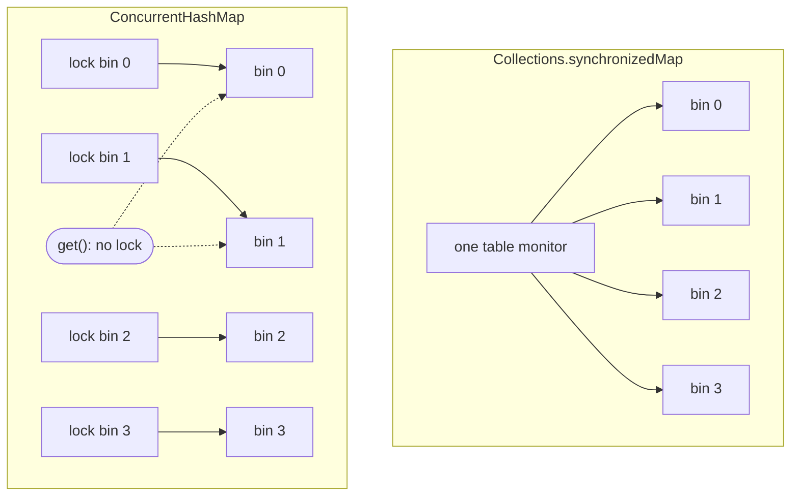

# ConcurrentHashMap vs synchronized HashMap

Both give you a thread-safe map, but they buy that safety in very different ways —
and the difference shows up the moment more than one thread is busy.

Think of a busy **post office**. A plain `HashMap` is the back room where parcels
are sorted into pigeonholes; it is fast but has no rules about who may walk in. The
two thread-safe options are two different ways to put a guard on that room.

## Collections.synchronizedMap — one master key

`Collections.synchronizedMap(new HashMap<>())` wraps the map so that **every**
method body runs inside `synchronized (mutex)`. There is exactly one lock for the
whole table.

> **Analogy.** The post office hangs a single master key by the door. To do
> *anything* — drop off a parcel or just peek into a pigeonhole — you must take
> that one key. While one clerk holds it, every other clerk waits at the door,
> even if they only wanted to read a different pigeonhole.

That last point surprises people: **reads serialize too.** `get()` also takes the
one monitor, so a reader blocks behind a writer and vice versa. Under a few threads
this is fine; under many, the single lock becomes the bottleneck — everyone queues
for the same key. See [Critical Section](topic:critical-section) for why a single
guarded region throttles throughput.

## ConcurrentHashMap — a key per room

`ConcurrentHashMap` is built for concurrency from the inside. A write locks only the
**one bin** (the bucket the key hashes to), not the whole table — this is *lock
striping*. And reads take **no lock at all**: they ride on `volatile` fields and
always see a consistent value.

> **Analogy.** Now each pigeonhole has its own little key. Two clerks filing into
> different pigeonholes work at the same time without bumping into each other. And
> anyone *reading* a pigeonhole just looks — no key needed — so readers never wait
> in line behind a writer.

Lock striping is not free parallelism, though: two keys that hash to the **same**
bin still serialize — but only the writers of that one bin wait, not the whole map.
The bin index comes from the same hashing you saw in
[HashMap Internals](topic:hashmap): the key's hash is spread and masked to a bucket.



Here is the contended case drawn out — the same two operations, two outcomes:

```mermaid
sequenceDiagram
  participant T1
  participant T2
  Note over T1,T2: synchronized map — one lock
  T1->>+Map: lock, put(alice)
  T2->>Map: get(bob) — blocked, waits
  T1-->>-Map: unlock
  T2->>Map: get(bob) runs now
  Note over T1,T2: ConcurrentHashMap — bin locks + lock-free read
  T1->>Map: lock bin 1, put(alice)
  T2->>Map: get(bob) — no lock, runs immediately
```

## The 60-second interview answer

`Collections.synchronizedMap` is a plain `HashMap` wrapped so every method holds one
table-wide lock. It is correct but coarse-grained: all operations, including reads,
serialize on that single monitor, so it scales poorly under contention. You must also
lock externally while iterating, and its iterators are fail-fast
(`ConcurrentModificationException`).

`ConcurrentHashMap` is designed for concurrency. Writes lock only the single bin the
key maps to (lock striping), so writes to different bins proceed in parallel, and
reads are lock-free. Its iterators are weakly consistent — they never throw
`ConcurrentModificationException` and reflect some state during traversal. It also
exposes atomic compound operations (`putIfAbsent`, `computeIfAbsent`, `merge`) that
a synchronized wrapper cannot, since with the wrapper a *check-then-act* across two
calls is still racy unless you lock around both. One catch: `ConcurrentHashMap`
forbids `null` keys and values. For anything multi-threaded and read-heavy, prefer
`ConcurrentHashMap`.

## Why it matters in production

- A shared cache, session store, or rate-limiter counter map is hit by every request
  thread. With a synchronized map they all queue on one lock; `ConcurrentHashMap`
  lets them spread across bins. This is the same throughput argument as
  [Avoiding Race Conditions](topic:race-condition-avoidance) and
  [Java Multithreading](topic:java-multithreading).
- Counters: `chm.merge(key, 1, Integer::sum)` or `computeIfAbsent` are atomic.
  Doing `if (!map.containsKey(k)) map.put(k, v)` on a synchronized map is **two**
  locked calls with a gap between them — another thread can slip in. Related:
  [Thread Safety of Numeric Addition](topic:thread-safe-addition).
- For the broader family (lists, sets, copy-on-write, iterator semantics) see
  [Concurrent vs Synchronized Collections](topic:concurrent-synchronized-collections).

## Common traps and misconceptions

- **"A synchronized map only locks writes."** No — `get()` locks too. Reads
  serialize against everything.
- **"ConcurrentHashMap locks the whole map on write."** No — it locks one bin. Only
  keys colliding into the same bin contend.
- **"Each individual call is atomic, so my code is safe."** Atomicity of one call
  does not make a *sequence* of calls atomic. `containsKey` then `put` is a race;
  use `putIfAbsent` / `computeIfAbsent` / `merge`.
- **"Iterating a synchronized map is automatically thread-safe."** No — you must
  hold the wrapper's lock manually around the whole iteration, or you risk
  `ConcurrentModificationException`. `ConcurrentHashMap` iterators are weakly
  consistent and need no external lock.
- **"size() is exact under load."** On `ConcurrentHashMap`, `size()` is an estimate
  computed without locking the whole map; treat it as approximate while writers run.
- **"I can store null."** A synchronized `HashMap` allows one `null` key and `null`
  values; `ConcurrentHashMap` rejects both, so a `null` from `get()` is never
  ambiguous between "absent" and "mapped to null".
