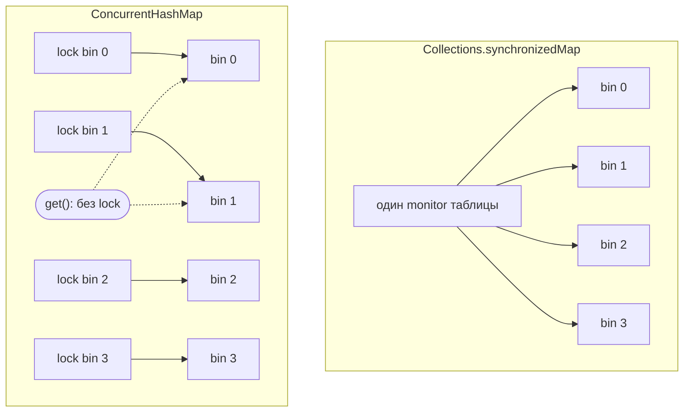

# ConcurrentHashMap и синхронизированный HashMap

Оба дают потокобезопасную map, но добиваются этой безопасности совершенно
по-разному — и разница проявляется в тот же момент, когда работает больше одного
потока.

Представьте загруженное **почтовое отделение**. Обычный `HashMap` — это задняя
комната, где посылки раскладывают по ячейкам; она быстрая, но не имеет правил, кто
туда может зайти. Два потокобезопасных варианта — это два разных способа поставить
у этой комнаты охрану.

## Collections.synchronizedMap — один главный ключ

`Collections.synchronizedMap(new HashMap<>())` оборачивает map так, что тело
**каждого** метода выполняется внутри `synchronized (mutex)`. На всю таблицу
существует ровно один lock.

> **Аналогия.** Почта вешает у двери один-единственный главный ключ. Чтобы сделать
> *что угодно* — положить посылку или просто заглянуть в ячейку — нужно взять этот
> один ключ. Пока один сотрудник держит его, все остальные ждут у двери, даже если
> хотели всего лишь прочитать другую ячейку.

Последний момент удивляет: **чтения тоже сериализуются.** `get()` тоже берёт этот
единственный monitor, поэтому читатель блокируется за писателем и наоборот. При
нескольких потоках это нормально; при многих единственный lock становится узким
местом — все стоят в очереди за одним ключом. См.
[Critical Section](topic:critical-section) — почему один защищённый участок
ограничивает throughput.

## ConcurrentHashMap — ключ на каждую комнату

`ConcurrentHashMap` устроен для concurrency изнутри. Запись блокирует только **один
bin** (бакет, в который хэшируется ключ), а не всю таблицу — это *lock striping*. А
чтения **вообще не берут lock**: они опираются на `volatile`-поля и всегда видят
согласованное значение.

> **Аналогия.** Теперь у каждой ячейки свой маленький ключ. Два сотрудника,
> раскладывающие в разные ячейки, работают одновременно, не мешая друг другу. А тот,
> кто *читает* ячейку, просто смотрит — ключ не нужен — поэтому читатели никогда не
> стоят в очереди за писателем.

Но lock striping — это не бесплатная параллельность: два ключа, попадающие в **один**
bin, всё равно сериализуются — но ждут только писатели этого одного bin, а не вся
map. Индекс bin берётся из того же хэширования, что и в
[Устройство HashMap](topic:hashmap): хэш ключа «размешивается» и маскируется до
бакета.



Вот спорный случай по шагам — те же две операции, два исхода:

```mermaid
sequenceDiagram
  participant T1
  participant T2
  Note over T1,T2: synchronized map — один lock
  T1->>+Map: lock, put(alice)
  T2->>Map: get(bob) — заблокирован, ждёт
  T1-->>-Map: unlock
  T2->>Map: get(bob) выполняется
  Note over T1,T2: ConcurrentHashMap — lock на bin + чтение без lock
  T1->>Map: lock bin 1, put(alice)
  T2->>Map: get(bob) — без lock, сразу выполняется
```

## Ответ за 60 секунд

`Collections.synchronizedMap` — это обычный `HashMap`, обёрнутый так, что каждый
метод держит один lock на всю таблицу. Это корректно, но грубо: все операции,
включая чтения, сериализуются на этом единственном monitor, поэтому плохо масштаби‑
руется при contention. Также нужно блокировать вручную во время итерации, а его
iterators — fail-fast (`ConcurrentModificationException`).

`ConcurrentHashMap` спроектирован для concurrency. Запись блокирует только один bin,
в который маппится ключ (lock striping), поэтому записи в разные bins идут
параллельно, а чтения — без lock. Его iterators — weakly consistent: они никогда не
бросают `ConcurrentModificationException` и отражают некоторое состояние во время
обхода. Он также даёт атомарные compound-операции (`putIfAbsent`, `computeIfAbsent`,
`merge`), которых нет у synchronized wrapper, ведь с обёрткой *check-then-act* через
два вызова всё равно гоночный, если не держать lock вокруг обоих. Один нюанс:
`ConcurrentHashMap` запрещает `null`-ключи и `null`-значения. Для всего
многопоточного и с преобладанием чтений выбирайте `ConcurrentHashMap`.

## Почему это важно в production

- Общий кэш, хранилище сессий или map-счётчиков rate-limiter дёргает каждый поток
  запроса. С synchronized map все стоят в очереди на одном lock; `ConcurrentHashMap`
  распределяет их по bins. Это тот же аргумент про throughput, что и в
  [Избегание состояний гонки](topic:race-condition-avoidance) и
  [Многопоточность в Java](topic:java-multithreading).
- Счётчики: `chm.merge(key, 1, Integer::sum)` или `computeIfAbsent` атомарны. А
  `if (!map.containsKey(k)) map.put(k, v)` на synchronized map — это **два**
  заблокированных вызова с разрывом между ними, и другой поток может вклиниться. См.
  [Потокобезопасность сложения чисел](topic:thread-safe-addition).
- Про более широкое семейство (lists, sets, copy-on-write, семантика iterator) см.
  [Concurrent и synchronized коллекции](topic:concurrent-synchronized-collections).

## Частые ловушки и заблуждения

- **«Synchronized map блокирует только записи».** Нет — `get()` тоже берёт lock.
  Чтения сериализуются со всем остальным.
- **«ConcurrentHashMap блокирует всю map на запись».** Нет — он блокирует один bin.
  Конкурируют только ключи, попавшие в один bin.
- **«Каждый отдельный вызов атомарен, значит мой код безопасен».** Атомарность одного
  вызова не делает атомарной *последовательность* вызовов. `containsKey`, затем `put`
  — это гонка; используйте `putIfAbsent` / `computeIfAbsent` / `merge`.
- **«Итерация по synchronized map автоматически потокобезопасна».** Нет — нужно
  вручную держать lock обёртки вокруг всей итерации, иначе риск
  `ConcurrentModificationException`. Iterators у `ConcurrentHashMap` weakly
  consistent и внешнего lock не требуют.
- **«size() точен под нагрузкой».** У `ConcurrentHashMap` `size()` — это оценка,
  посчитанная без блокировки всей map; считайте её приблизительной, пока работают
  писатели.
- **«Я могу хранить null».** Synchronized `HashMap` допускает один `null`-ключ и
  `null`-значения; `ConcurrentHashMap` запрещает оба, поэтому `null` из `get()`
  никогда не двусмыслен между «отсутствует» и «замаплен в null».
