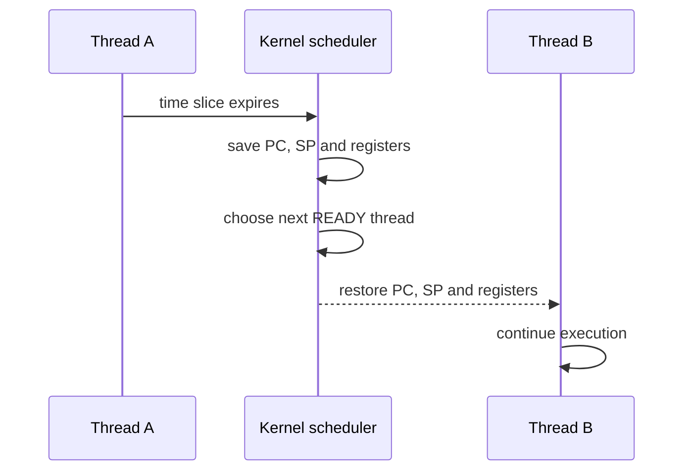
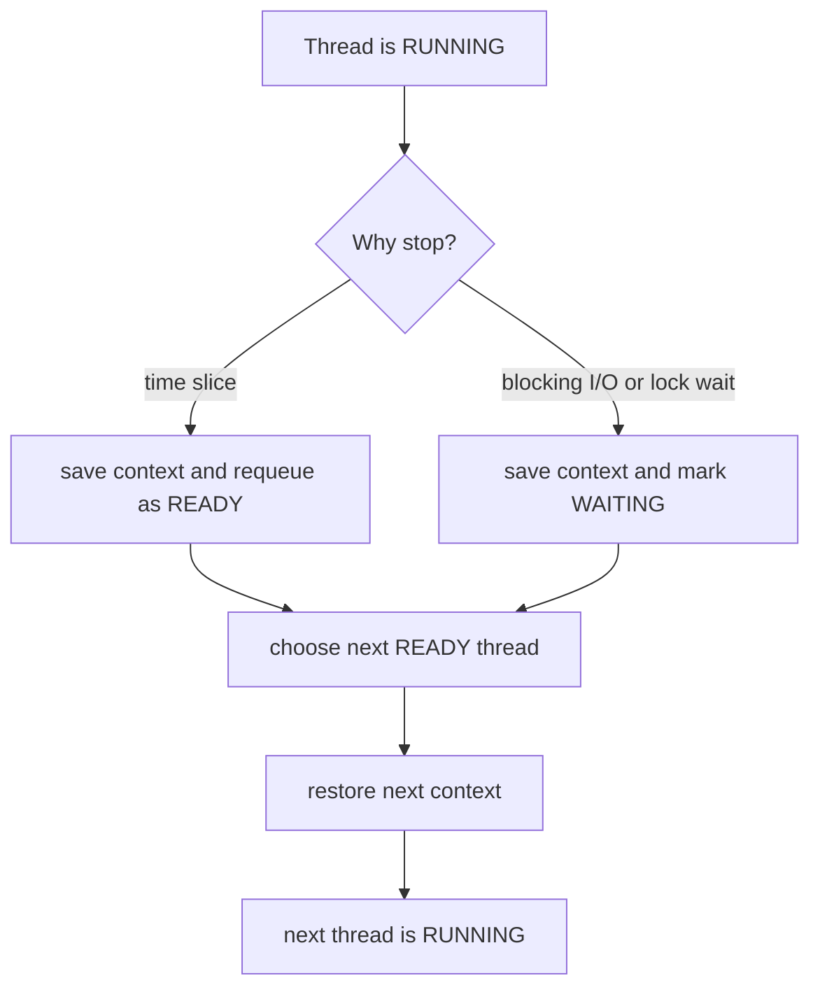

# Context Switch

A context switch is the operating system stopping one running thread or process
and letting another one continue on the CPU. The important word is **continue**:
the old thread is not restarted from the beginning. Its execution context is
saved, and another saved context is restored. Think of a cook leaving one recipe
mid-step: the page number, pan position, timer and ingredients must be left in a
known place before another cook can use the same stove.

In Java this matters because platform threads are scheduled by the OS. A Java
thread can be `RUNNABLE`, but only a limited number of threads can actually run
at the same moment: roughly one per CPU core. [Java Multithreading](topic:java-multithreading)
and [Thread vs Runnable](topic:thread-vs-runnable) explain the Java-side API;
context switch is the OS-side handoff underneath it. It is like a post office
with many customers holding tickets but only a few service windows.

## What Gets Saved

The OS saves enough CPU state for the old thread to resume later: program
counter (`PC`), stack pointer (`SP`), CPU registers, and scheduler metadata such
as thread state. The JVM stack frames live in the thread's stack; the context
switch saves where the CPU should resume using them. In kitchen terms, the cook
does not rewrite the recipe; they mark the exact line, keep the utensils where
they belong, and clear the stove for someone else.

The kernel then chooses another `READY` thread and restores that thread's saved
state into the CPU. Execution continues from the restored `PC`, not from
`main()`. The post office analogy: the clerk closes one customer's folder at the
current form, opens the next customer's folder at its saved page, and continues.

## Why Switches Happen

A time slice can expire. The OS preempts the running thread so other runnable
threads get a fair turn. This is like traffic lights: even if one car could keep
going, the intersection changes priority so another lane moves.

A thread can block on I/O, sleep, wait for a monitor, or wait for a lock around a
[critical section](topic:critical-section). Then keeping it on the CPU would be
wasteful, so the scheduler runs something else. This is like a kitchen station
waiting for an oven: the cook should not stand at the stove doing nothing if
another order can be prepared.

Creating too many active platform threads increases the chance that the OS spends
more time switching than doing useful work. A [Java Thread Pool](topic:java-thread-pool)
helps cap concurrency, and [Thread vs ThreadPool](topic:thread-vs-threadpool)
explains why reusing a bounded set of workers is usually better than creating
uncontrolled threads. In post-office terms, opening a thousand ticket lines with
four clerks only creates more shuffling.

## Cost

A context switch is fast, but not free. The CPU spends cycles in kernel code, the
old thread's hot cache data may become less useful, the new thread may warm up
different cache lines, and some platforms may touch TLB or branch-prediction
state. It is like moving a cook between stations: the walk is short, but the
next station still needs tools, ingredients and mental context.

This is why CPU-bound work usually wants about as many runnable workers as CPU
cores, while I/O-bound work can tolerate more waiting threads. The exact number
depends on workload, blocking ratio and latency goals. Like a kitchen, more cooks
help when many dishes are waiting on ovens, but too many cooks around one cutting
board slow each other down.

## 60-Second Interview Answer

A context switch is when the OS scheduler stops one running thread or process and
continues another one on the CPU. To make that possible, the kernel saves the
current execution context, such as `PC`, `SP`, registers and scheduling state,
then restores another thread's saved context. It happens because of preemption,
blocking I/O, sleeping, lock waits, or a thread finishing. It has overhead:
kernel work, cache effects and lost CPU locality. In Java, platform threads are
OS-scheduled, so too many runnable threads can reduce throughput; a properly
sized `ThreadPool` often helps.

## Production Relevance

High context-switch rates can show up as CPU usage that does not translate into
throughput. You may see many runnable threads, lock contention, tiny tasks, or
oversized pools. It is like a post office where clerks constantly swap counters
but the queue barely moves.

When debugging, look at thread dumps, OS metrics for voluntary and involuntary
context switches, CPU saturation, blocking calls, and lock contention. If shared
state is the root cause, connect this topic with [Avoiding Race Conditions](topic:race-condition-avoidance)
instead of only tuning pool size. The kitchen version: if cooks keep fighting for
one knife, hiring more cooks will not fix the bottleneck.

## Common Misconceptions

- **"A method call is a context switch."** No. A Java method call changes stack
  frames inside the same running thread. A context switch changes which thread or
  process owns the CPU.
- **"`Thread.yield()` guarantees a switch."** No. It is only a hint to the
  scheduler. The same thread can run again.
- **"More threads always make code faster."** No. More runnable platform threads
  can increase scheduler overhead and contention.
- **"Context switch means a data race happened."** No. A switch is scheduling.
  A race happens when shared mutable state is accessed without correct
  synchronization.
- **"Blocking is always bad."** Not always. Blocking I/O can be acceptable when
  concurrency is bounded and the system is designed for it; unbounded blocking
  threads are the usual problem.
