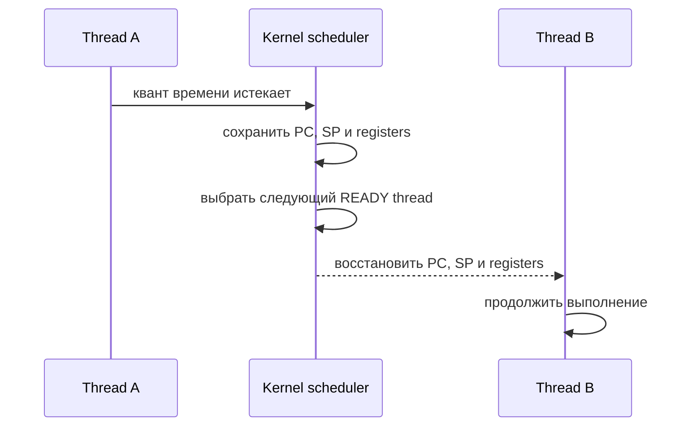
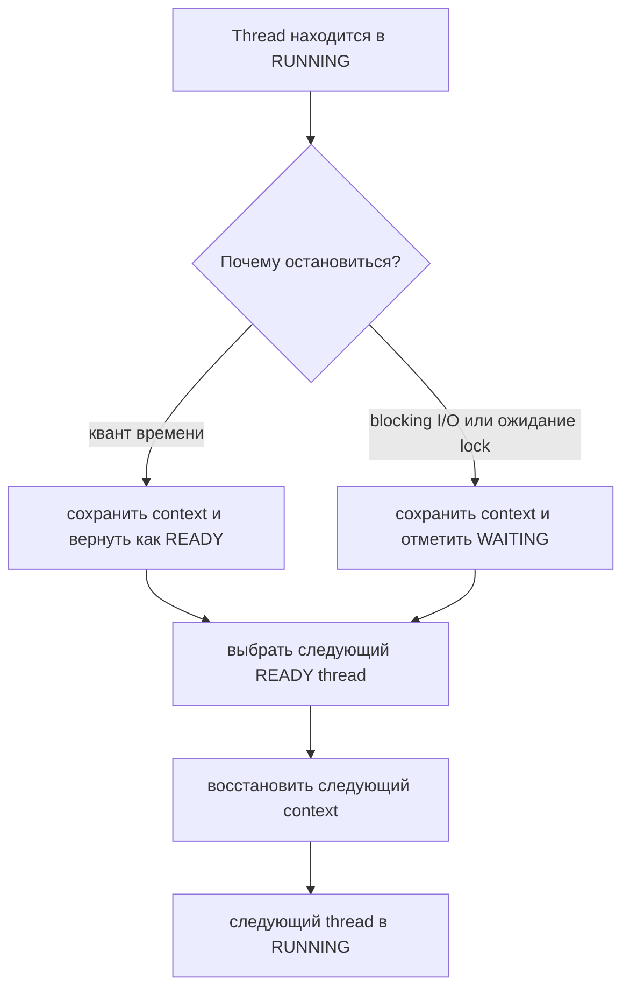

# Context Switch

Context switch - это ситуация, когда операционная система останавливает один
выполняющийся thread или process и дает другому продолжить работу на CPU. Важно
слово **продолжить**: старый thread не запускается сначала. Его execution context
сохраняется, а другой сохраненный context восстанавливается. Представь повара,
который оставляет рецепт на середине шага: номер строки, положение сковороды,
таймер и ингредиенты нужно оставить в понятном состоянии, прежде чем другой повар
займет ту же плиту.

В Java это важно, потому что platform threads планируются операционной системой.
Java thread может быть `RUNNABLE`, но одновременно реально выполняется только
ограниченное число threads: примерно по одному на CPU core. [Java Multithreading](topic:java-multithreading)
и [Thread vs Runnable](topic:thread-vs-runnable) объясняют Java-side API; context
switch - это OS-side handoff под ним. Это похоже на почту: клиентов с талонами
много, но окон обслуживания всего несколько.

## Что Сохраняется

OS сохраняет достаточно CPU state, чтобы старый thread мог продолжиться позже:
program counter (`PC`), stack pointer (`SP`), CPU registers и scheduler metadata,
например состояние thread. JVM stack frames лежат в stack этого thread; context
switch сохраняет место, с которого CPU должен продолжить их использовать. В
кухонной аналогии повар не переписывает рецепт: он отмечает точную строку,
оставляет инструменты на своих местах и освобождает плиту для другого.

Затем kernel выбирает другой `READY` thread и восстанавливает его сохраненное
state в CPU. Выполнение продолжается с восстановленного `PC`, а не с `main()`.
Аналогия с почтой: сотрудник закрывает папку одного клиента на текущей форме,
открывает папку следующего клиента на сохраненной странице и продолжает работу.

## Почему Происходят Switches

Может истечь квант времени. OS прерывает running thread, чтобы другие runnable
threads получили честную очередь. Это как светофор: даже если одна машина могла
бы ехать дальше, перекресток меняет приоритет, чтобы поехала другая полоса.

Thread может заблокироваться на I/O, `sleep`, ожидании monitor или lock вокруг
[critical section](topic:critical-section). Тогда держать его на CPU бессмысленно,
и scheduler запускает что-то другое. Это как кухонная станция, которая ждет
духовку: повар не должен стоять у плиты без дела, если можно готовить другой
заказ.

Слишком много активных platform threads повышает шанс, что OS тратит больше
времени на переключения, чем на полезную работу. [Java Thread Pool](topic:java-thread-pool)
помогает ограничить concurrency, а [Thread vs ThreadPool](topic:thread-vs-threadpool)
объясняет, почему переиспользование ограниченного набора workers обычно лучше
неконтролируемого создания threads. В аналогии с почтой тысяча очередей при
четырех сотрудниках только добавит перекладывания папок.

## Цена

Context switch быстрый, но не бесплатный. CPU тратит cycles в kernel code, hot
cache data старого thread может стать менее полезной, новый thread может
прогревать другие cache lines, а на некоторых платформах затрагиваются TLB или
branch-prediction state. Это как переход повара между станциями: пройти недолго,
но на новой станции все равно нужны инструменты, ингредиенты и восстановление
контекста в голове.

Поэтому CPU-bound work обычно хочет примерно столько runnable workers, сколько
есть CPU cores, а I/O-bound work может выдерживать больше ожидающих threads.
Точное число зависит от workload, доли blocking и требований к latency. Как на
кухне: больше поваров помогают, когда много блюд ждут духовку, но слишком много
поваров вокруг одной доски начинают мешать друг другу.

## Ответ за 60 Секунд

Context switch - это когда OS scheduler останавливает один running thread или
process и продолжает другой на CPU. Чтобы это было возможно, kernel сохраняет
текущий execution context, например `PC`, `SP`, registers и scheduling state, а
затем восстанавливает сохраненный context другого thread. Это происходит из-за
preemption, blocking I/O, `sleep`, ожидания lock или завершения thread. У этого
есть overhead: работа kernel, cache effects и потеря CPU locality. В Java
platform threads планируются OS, поэтому слишком много runnable threads может
снижать throughput; правильно подобранный `ThreadPool` часто помогает.

## Значение В Production

Высокая частота context switches может выглядеть как CPU usage, который не
превращается в throughput. Причиной могут быть множество runnable threads, lock
contention, слишком мелкие tasks или слишком большие pools. Это как почта, где
сотрудники постоянно меняются окнами, а очередь почти не движется.

При разборе смотри thread dumps, OS metrics для voluntary и involuntary context
switches, CPU saturation, blocking calls и lock contention. Если корень проблемы
в shared state, свяжи эту тему с [Avoiding Race Conditions](topic:race-condition-avoidance),
а не только настраивай размер pool. Кухонная версия: если повара спорят за один
нож, новые повара не уберут bottleneck.

## Частые Заблуждения

- **"Method call - это context switch."** Нет. Java method call меняет stack
  frames внутри того же running thread. Context switch меняет thread или process,
  которому принадлежит CPU.
- **"`Thread.yield()` гарантирует switch."** Нет. Это только подсказка scheduler.
  Тот же thread может снова продолжить выполнение.
- **"Больше threads всегда ускоряет код."** Нет. Больше runnable platform threads
  может увеличить scheduler overhead и contention.
- **"Context switch означает, что случилась data race."** Нет. Switch - это
  планирование. Race возникает, когда shared mutable state используется без
  корректной synchronization.
- **"Blocking всегда плохо."** Не всегда. Blocking I/O может быть нормальным,
  если concurrency ограничена и система под это спроектирована; обычная проблема
  - неограниченное число blocking threads.
