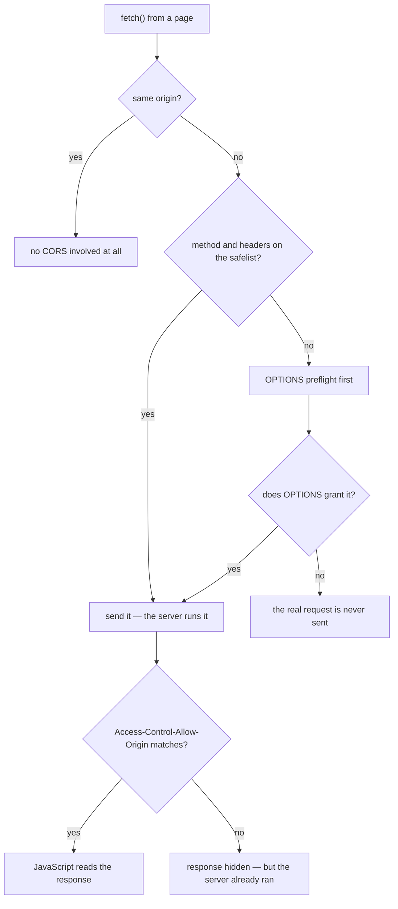
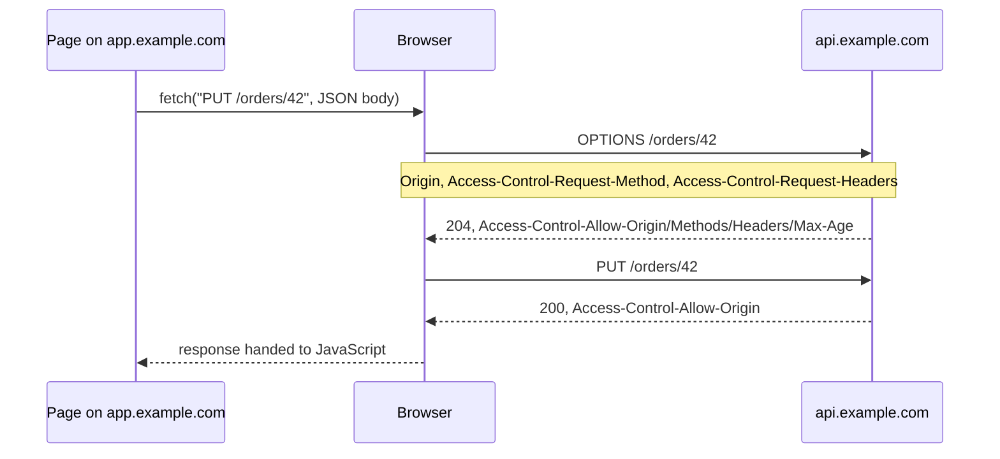
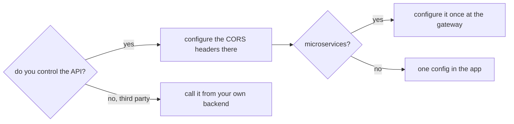

# What is CORS

**CORS — Cross-Origin Resource Sharing — is how a server tells the browser which
other websites are allowed to read its responses.** It is a set of HTTP response
headers, and it exists to *relax* a browser rule that is on by default.

That rule is the **same-origin policy**: JavaScript running on one origin may
not read data from another origin. Without it, any tab you happen to have open
could `fetch("https://your-bank.example/accounts")` with your cookies attached
and read the result. CORS is the server's way of saying "actually, this
particular page may".

## First: what is an origin?

An origin is the triple **scheme + host + port**. All three must match.

| Page | `https://app.example.com/orders` | |
|---|---|---|
| `https://app.example.com/api` | same origin | only the path differs |
| `http://app.example.com` | **different** | scheme |
| `https://api.example.com` | **different** | host |
| `https://app.example.com:8443` | **different** | port |

The last row is the one every developer meets on their first day: a Vite dev
server on `localhost:5173` calling a Spring Boot API on `localhost:8080` is a
cross-origin call, even though both are "localhost".

## What is actually blocked

This is the single most misunderstood part of CORS, and the most common
interview follow-up.

For a request the browser considers **simple** — one a plain HTML `<form>` could
already have submitted — the browser **sends it, the server executes it**, and
only *then* checks whether the response may be handed to JavaScript. A missing
`Access-Control-Allow-Origin` makes `fetch()` reject with a `TypeError`, while
the network tab happily shows the `200`.

So a cross-origin `POST /orders` that "failed with a CORS error" may well have
created the order. What was blocked is *your code reading the reply*.

## Simple requests vs preflighted requests

A request is **simple** (no preflight) when *all* of the following hold:

- the method is `GET`, `HEAD` or `POST`;
- every header is on the CORS safelist — `Accept`, `Accept-Language`,
  `Content-Language`, `Content-Type`, and a few more;
- `Content-Type` is one of `application/x-www-form-urlencoded`,
  `multipart/form-data`, `text/plain`.

The logic behind the list: an HTML form could already send those requests
cross-origin long before `fetch()` existed, so blocking them now would break the
web. Anything *else* is new power, and the browser asks permission first.

Which is why, in practice, almost every real API call preflights:
`Content-Type: application/json` is not on the list, `Authorization` is not on
the list, and [PUT and PATCH](topic:put-vs-patch) are not simple methods.

The preflight is a separate `OPTIONS` request:

Note the asymmetry with the simple case: **a failed preflight means the real
request is never sent**, so nothing was written. A failed check on a *simple*
request means it was already executed.

## The headers, and what each one answers

| Header (response) | Question it answers |
|---|---|
| `Access-Control-Allow-Origin` | Who may read this response? One origin, or `*` |
| `Access-Control-Allow-Methods` | Which methods may this origin use? (preflight only) |
| `Access-Control-Allow-Headers` | Which request headers may it set? (preflight only) |
| `Access-Control-Allow-Credentials` | May it send cookies and act as the logged-in user? |
| `Access-Control-Expose-Headers` | Which response headers may JavaScript read? |
| `Access-Control-Max-Age` | How long may the browser reuse this preflight answer? |

And two request headers the browser adds by itself, which your code can neither
set nor forge: `Origin` on every cross-origin request, plus
`Access-Control-Request-Method` and `Access-Control-Request-Headers` on the
preflight.

## Credentials change every rule

`credentials: 'include'` (or `withCredentials: true`) attaches the API's cookies.
The moment it does:

- `Access-Control-Allow-Origin: *` becomes **illegal**. The wildcard means "any
  page on the internet may read this", and no server can honestly say that about
  a signed-in user's data. The server must echo the exact origin instead.
- `Access-Control-Allow-Credentials: true` must be present as well. Allowing an
  origin to *read* is not the same as allowing it to *act as the user*.
- `*` stops being a wildcard in `Allow-Methods` and `Allow-Headers` too — it is
  matched literally.

Echoing the origin back has a trap of its own: reflecting *any* `Origin` you
receive, combined with `Allow-Credentials: true`, is equivalent to having no
protection at all. Reflect only origins from an allow-list.

## Reading the body and reading a header are two permissions

A cross-origin response exposes only a safelist of headers to JavaScript:
`Cache-Control`, `Content-Language`, `Content-Length`, `Content-Type`,
`Expires`, `Last-Modified`, `Pragma`. Everything else — `X-Total-Count`,
`Location`, `X-RateLimit-Remaining` — reads back as `null` until the server adds
it to `Access-Control-Expose-Headers`.

This one is usually misdiagnosed, because the request *succeeded*: the body is
there, and only the pagination header is mysteriously missing.

## CORS is not authorization

CORS is a **browser** mechanism protecting **the user**, not a server-side guard
protecting **your API**. `curl`, Postman, a mobile app, a server-to-server call
and any script outside a browser ignore CORS completely — they simply do not
implement it.

Consequences worth saying out loud in an interview:

- A public endpoint with a strict CORS policy is still public. Authentication
  and authorization remain entirely your job.
- CORS does **not** prevent CSRF. A classic CSRF attack is a form post or an
  image tag — exactly the "simple" requests CORS lets through — and the attacker
  never needs to read the response. `SameSite` cookies and CSRF tokens are the
  defence there.
- Conversely, CORS *is* what stops a malicious page from reading your
  authenticated API responses, which is a real and different protection.

## Fixing it in practice

- **You own the API**: configure it there. In Spring Boot that is a
  `WebMvcConfigurer` `addCorsMappings` or a `CorsFilter` (annotation-level
  `@CrossOrigin` works but scatters the policy across controllers). Remember
  that preflights are unauthenticated `OPTIONS` requests, so a security filter
  that rejects them will produce a CORS error that looks like a misconfigured
  origin.
- **Local development**: a dev-server proxy (Vite's `server.proxy`) makes the
  browser see one origin, so CORS never applies. This is usually better than
  loosening the production policy to make development work.
- **Microservices**: configure CORS once at the edge —
  see [why an API gateway is needed](topic:api-gateway). Per-service policies
  drift, and two services answering with different `Allow-Origin` values for the
  same frontend is a long debugging session. The same reasoning applies when
  [sharing endpoints across an organization](topic:sharing-api-endpoints).
- **A third-party API that has no CORS headers**: you cannot fix that from the
  frontend. Call it from your own backend and expose your own endpoint.

## The 60-second interview answer

> Browsers enforce the same-origin policy: JavaScript on one origin — scheme,
> host and port — cannot read responses from another. CORS is the set of
> response headers with which the server opts out of that restriction for
> specific origins, chiefly `Access-Control-Allow-Origin`. If the request is
> "simple" — GET/HEAD/POST with only safelisted headers — the browser sends it,
> the server executes it, and the browser blocks *reading the response* if the
> header is missing; that is why a failed CORS call still shows up in the server
> logs. Anything else — a JSON `Content-Type`, an `Authorization` header, PUT,
> PATCH or DELETE — is preflighted with an `OPTIONS` request first, and a failed
> preflight means the real request is never sent. Cookies require the exact
> origin plus `Access-Control-Allow-Credentials: true`; the `*` wildcard is
> rejected. Reading a custom response header needs
> `Access-Control-Expose-Headers`. And CORS is a browser protection for the
> user, not authorization for the API — `curl` ignores it entirely.

## Why it matters in production

- **Latency.** Every preflight is an extra round trip on top of the real
  request. Set `Access-Control-Max-Age` (browsers cap it — roughly 2 hours in
  Chromium, 24 in Firefox) and you pay for it once per session instead of once
  per call.
- **Preflights bypass your auth.** `OPTIONS` carries no cookies and no
  `Authorization` header. A gateway or security filter that demands
  authentication on every request will 401 the preflight, and the browser will
  report a generic CORS failure that sends people looking in the wrong place.
- **Origins are environment-specific.** Hard-coding one production origin means
  staging breaks; a wildcard means credentials break. This belongs in
  configuration, per environment.
- **Redirects lose it.** A cross-origin request that gets redirected must have
  CORS headers on *every* hop, including the redirect response.
- **Caching.** If a cached response can be served to more than one origin, the
  cache needs `Vary: Origin`, or one origin gets another's
  `Access-Control-Allow-Origin` value and breaks.

## Common misconceptions

- **"CORS blocked my request."** Usually it blocked your *reading of the
  response*. For a simple request the server already ran the handler.
- **"CORS protects my API."** It protects the browser's user. Anything that is
  not a browser ignores it entirely, so it is never a substitute for
  authentication and authorization.
- **"I can disable CORS in my frontend."** The permission is issued by the
  server being called. Browser flags and extensions only change your own
  machine, which makes the bug invisible to you and present for everyone else.
- **"`Access-Control-Allow-Origin: *` is the easy fix."** It works until the
  first request that carries cookies, at which point it becomes the one value
  the browser will not accept.
- **"A CORS policy prevents CSRF."** It does not. CSRF rides on exactly the
  simple requests CORS permits, and the attacker never reads the response.
- **"The 401 on OPTIONS is a CORS bug."** It is an auth bug. Preflights are
  unauthenticated by design and must be answered before your security filters
  run.
- **"CORS is a fetch/XHR thing only."** Web fonts, WebGL textures, canvas image
  data and ES module scripts are subject to it too, which is why `crossorigin`
  attributes exist.
- **"If I can see the JSON in the network tab, my code can read it."** DevTools
  shows what arrived on the wire; JavaScript is given what CORS permits.
