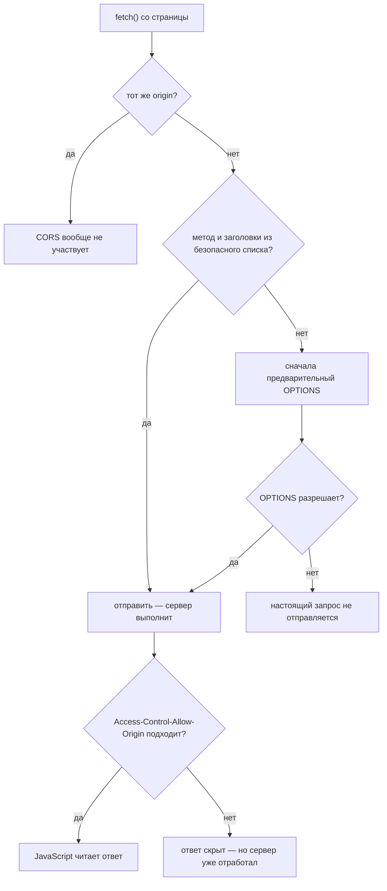
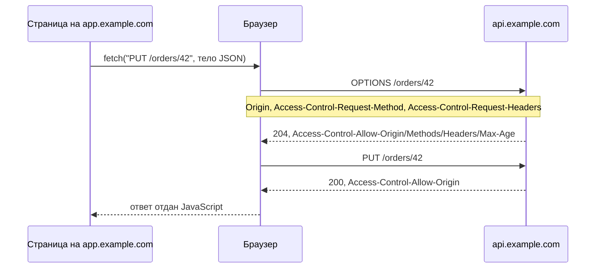
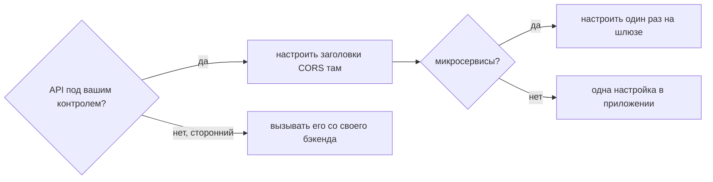

# Что такое CORS

**CORS — Cross-Origin Resource Sharing — это способ, которым сервер сообщает
браузеру, каким другим сайтам разрешено читать его ответы.** Это набор
HTTP-заголовков ответа, и существует он для того, чтобы *ослабить* правило
браузера, включённое по умолчанию.

Это правило — **правило одного источника** (same-origin policy): JavaScript,
работающий на одном origin, не может прочитать данные с другого origin. Без него
любая случайно открытая вкладка могла бы вызвать
`fetch("https://your-bank.example/accounts")` вместе с вашими куками и прочитать
результат. CORS — это способ сервера сказать: «вот именно этой странице —
можно».

## Сначала: что такое origin?

Origin — это тройка **схема + хост + порт**. Совпадать должны все три.

| Страница | `https://app.example.com/orders` | |
|---|---|---|
| `https://app.example.com/api` | тот же origin | отличается только путь |
| `http://app.example.com` | **другой** | схема |
| `https://api.example.com` | **другой** | хост |
| `https://app.example.com:8443` | **другой** | порт |

Последняя строка — та, с которой каждый разработчик сталкивается в первый же
день: dev-сервер Vite на `localhost:5173`, обращающийся к API Spring Boot на
`localhost:8080`, — это кросс-доменный вызов, хотя и там и там «localhost».

## Что на самом деле блокируется

Это самая непонятая часть CORS и самый частый уточняющий вопрос на собеседовании.

Запрос, который браузер считает **простым** — такой, какой могла бы отправить и
обычная HTML-форма `<form>`, — браузер **отправляет, а сервер выполняет**, и лишь
*потом* проверяется, можно ли отдать ответ JavaScript. Отсутствующий
`Access-Control-Allow-Origin` приводит к тому, что `fetch()` падает с
`TypeError`, тогда как во вкладке Network спокойно виден `200`.

То есть кросс-доменный `POST /orders`, «упавший с ошибкой CORS», вполне мог
создать заказ. Заблокировано было то, что *ваш код читает ответ*.

## Простые запросы и запросы с предварительной проверкой

Запрос считается **простым** (без предварительного запроса), когда выполняется
*всё* перечисленное:

- метод — `GET`, `HEAD` или `POST`;
- все заголовки входят в безопасный список CORS — `Accept`, `Accept-Language`,
  `Content-Language`, `Content-Type` и ещё несколько;
- `Content-Type` — это `application/x-www-form-urlencoded`,
  `multipart/form-data` или `text/plain`.

Логика этого списка такова: HTML-форма могла отправлять такие кросс-доменные
запросы задолго до появления `fetch()`, поэтому запретить их сейчас — сломать
веб. Всё *остальное* — новая возможность, и браузер сначала спрашивает
разрешение.

Именно поэтому на практике почти каждый реальный вызов API проходит
предварительную проверку: `Content-Type: application/json` в списке нет,
`Authorization` в списке нет, а [PUT и PATCH](topic:put-vs-patch) — не простые
методы.

Предварительная проверка — это отдельный запрос `OPTIONS`:

Обратите внимание на асимметрию с простым случаем: **провалившаяся
предварительная проверка означает, что настоящий запрос вообще не отправляется**,
то есть ничего не записано. А провалившаяся проверка у *простого* запроса
означает, что он уже выполнен.

## Заголовки и на какой вопрос отвечает каждый

| Заголовок (ответа) | На какой вопрос отвечает |
|---|---|
| `Access-Control-Allow-Origin` | Кому можно прочитать этот ответ? Один origin или `*` |
| `Access-Control-Allow-Methods` | Какие методы можно использовать? (только в предв. запросе) |
| `Access-Control-Allow-Headers` | Какие заголовки запроса можно задать? (только в предв. запросе) |
| `Access-Control-Allow-Credentials` | Можно ли слать куки и действовать от имени пользователя? |
| `Access-Control-Expose-Headers` | Какие заголовки ответа может прочитать JavaScript? |
| `Access-Control-Max-Age` | Сколько браузер может переиспользовать этот ответ на предв. запрос? |

И два заголовка запроса, которые браузер добавляет сам и которые ваш код не
может ни задать, ни подделать: `Origin` — в каждом кросс-доменном запросе, а
также `Access-Control-Request-Method` и `Access-Control-Request-Headers` — в
предварительном.

## Куки меняют все правила

`credentials: 'include'` (или `withCredentials: true`) прикрепляет куки API. Как
только это происходит:

- `Access-Control-Allow-Origin: *` становится **недопустимым**. Звёздочка
  означает «читать может любая страница в интернете», а про данные залогиненного
  пользователя ни один сервер честно такого сказать не может. Сервер обязан
  вернуть точный origin.
- `Access-Control-Allow-Credentials: true` тоже обязан присутствовать. Разрешить
  origin *читать* — не то же самое, что разрешить ему *действовать от имени
  пользователя*.
- `*` перестаёт быть подстановочным знаком и в `Allow-Methods`, и в
  `Allow-Headers` — он сравнивается буквально.

У возврата origin обратно есть своя ловушка: отражать *любой* пришедший `Origin`
в сочетании с `Allow-Credentials: true` равносильно полному отсутствию защиты.
Отражайте только origin из белого списка.

## Прочитать тело и прочитать заголовок — два разных разрешения

Кросс-доменный ответ открывает JavaScript лишь безопасный список заголовков:
`Cache-Control`, `Content-Language`, `Content-Length`, `Content-Type`,
`Expires`, `Last-Modified`, `Pragma`. Всё остальное — `X-Total-Count`,
`Location`, `X-RateLimit-Remaining` — читается как `null`, пока сервер не
добавит его в `Access-Control-Expose-Headers`.

Такое обычно диагностируют неверно, потому что запрос *успешен*: тело на месте,
и загадочным образом отсутствует лишь заголовок пагинации.

## CORS — это не авторизация

CORS — это механизм **браузера**, защищающий **пользователя**, а не серверная
защита **вашего API**. `curl`, Postman, мобильное приложение, вызов между
серверами и любой скрипт вне браузера полностью игнорируют CORS — они просто его
не реализуют.

Выводы, которые стоит проговорить на собеседовании вслух:

- Публичный эндпоинт со строгой политикой CORS всё равно остаётся публичным.
  Аутентификация и авторизация целиком остаются вашей задачей.
- CORS **не** предотвращает CSRF. Классическая CSRF-атака — это отправка формы
  или тег изображения, то есть ровно те «простые» запросы, которые CORS
  пропускает, а читать ответ атакующему и не нужно. Здесь защита — куки
  `SameSite` и CSRF-токены.
- И наоборот, именно CORS не даёт вредоносной странице прочитать ответы вашего
  API от имени пользователя, и это настоящая, но другая защита.

## Как это чинят на практике

- **API ваш**: настраивайте там. В Spring Boot это `addCorsMappings` у
  `WebMvcConfigurer` или `CorsFilter` (аннотация `@CrossOrigin` работает, но
  размазывает политику по контроллерам). Помните, что предварительные запросы —
  это неаутентифицированные `OPTIONS`, поэтому фильтр безопасности, который их
  отклоняет, породит ошибку CORS, выглядящую как неверно настроенный origin.
- **Локальная разработка**: прокси dev-сервера (`server.proxy` у Vite) делает
  так, что браузер видит один origin, и CORS вообще не применяется. Обычно это
  лучше, чем ослаблять продакшен-политику ради удобства разработки.
- **Микросервисы**: настраивайте CORS один раз на границе — см.
  [зачем нужен API Gateway](topic:api-gateway). Политики отдельных сервисов
  расходятся, и два сервиса, отвечающие разными значениями `Allow-Origin` одному
  и тому же фронтенду, — это долгая отладка. Те же соображения действуют и при
  [совместном использовании эндпоинтов в организации](topic:sharing-api-endpoints).
- **Сторонний API без заголовков CORS**: из фронтенда это не исправить.
  Вызывайте его со своего бэкенда и открывайте собственный эндпоинт.

## Ответ на собеседовании за 60 секунд

> Браузеры применяют правило одного источника: JavaScript на одном origin —
> схема, хост и порт — не может читать ответы с другого. CORS — это набор
> заголовков ответа, которыми сервер отказывается от этого ограничения для
> конкретных origin, прежде всего `Access-Control-Allow-Origin`. Если запрос
> «простой» — GET/HEAD/POST только с безопасными заголовками, — браузер его
> отправляет, сервер выполняет, а браузер блокирует *чтение ответа*, если
> заголовка нет; именно поэтому упавший из-за CORS вызов всё равно виден в логах
> сервера. Всё остальное — `Content-Type` с JSON, заголовок `Authorization`,
> PUT, PATCH или DELETE — сначала проходит предварительную проверку запросом
> `OPTIONS`, и при её провале настоящий запрос вообще не отправляется. Для кук
> нужен точный origin плюс `Access-Control-Allow-Credentials: true`, а
> подстановочный `*` отвергается. Чтобы прочитать нестандартный заголовок
> ответа, нужен `Access-Control-Expose-Headers`. И CORS — это защита
> пользователя средствами браузера, а не авторизация для API: `curl` игнорирует
> его полностью.

## Почему это важно в продакшене

- **Задержки.** Каждый предварительный запрос — это лишнее обращение по сети
  сверх настоящего. Задайте `Access-Control-Max-Age` (браузеры его ограничивают
  — примерно 2 часа в Chromium и 24 в Firefox), и вы заплатите за него один раз
  за сессию, а не на каждый вызов.
- **Предварительные запросы обходят вашу аутентификацию.** `OPTIONS` не несёт ни
  кук, ни заголовка `Authorization`. Шлюз или фильтр безопасности, требующий
  аутентификации на каждом запросе, вернёт 401 на предварительный запрос, а
  браузер сообщит об общей ошибке CORS, из-за чего люди пойдут искать проблему
  не там.
- **Origin зависят от окружения.** Зашитый один продакшен-origin ломает
  staging, а звёздочка ломает работу с куками. Это место для конфигурации,
  отдельной на каждое окружение.
- **Редиректы всё теряют.** Кросс-доменный запрос, который перенаправляют,
  должен нести заголовки CORS на *каждом* шаге, включая сам ответ-редирект.
- **Кеширование.** Если закешированный ответ может быть отдан более чем одному
  origin, кешу нужен `Vary: Origin`, иначе один origin получит чужое значение
  `Access-Control-Allow-Origin` и сломается.

## Частые заблуждения

- **«CORS заблокировал мой запрос».** Обычно он заблокировал *чтение ответа*.
  У простого запроса сервер уже выполнил обработчик.
- **«CORS защищает мой API».** Он защищает пользователя браузера. Всё, что не
  браузер, игнорирует его полностью, поэтому он никогда не заменяет
  аутентификацию и авторизацию.
- **«Я могу отключить CORS во фронтенде».** Разрешение выдаёт вызываемый сервер.
  Флаги и расширения браузера меняют только вашу машину, из-за чего баг
  становится невидимым для вас и остаётся у всех остальных.
- **«`Access-Control-Allow-Origin: *` — это простое решение».** Оно работает до
  первого запроса с куками, после чего становится единственным значением,
  которое браузер не примет.
- **«Политика CORS предотвращает CSRF».** Не предотвращает. CSRF ездит ровно на
  тех простых запросах, которые CORS разрешает, и читать ответ атакующему не
  нужно.
- **«401 на OPTIONS — это баг CORS».** Это баг аутентификации. Предварительные
  запросы по своей природе неаутентифицированы и должны получать ответ до того,
  как отработают фильтры безопасности.
- **«CORS относится только к fetch и XHR».** Веб-шрифты, текстуры WebGL, данные
  изображения в canvas и ES-модули тоже ему подчиняются — именно поэтому
  существуют атрибуты `crossorigin`.
- **«Раз я вижу JSON во вкладке Network, мой код может его прочитать».**
  DevTools показывает то, что пришло по сети; JavaScript получает то, что
  разрешает CORS.
