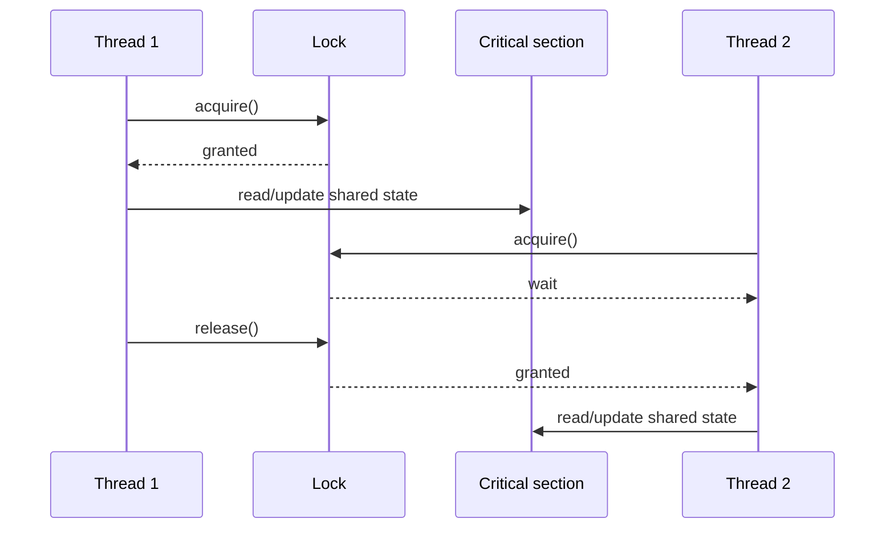
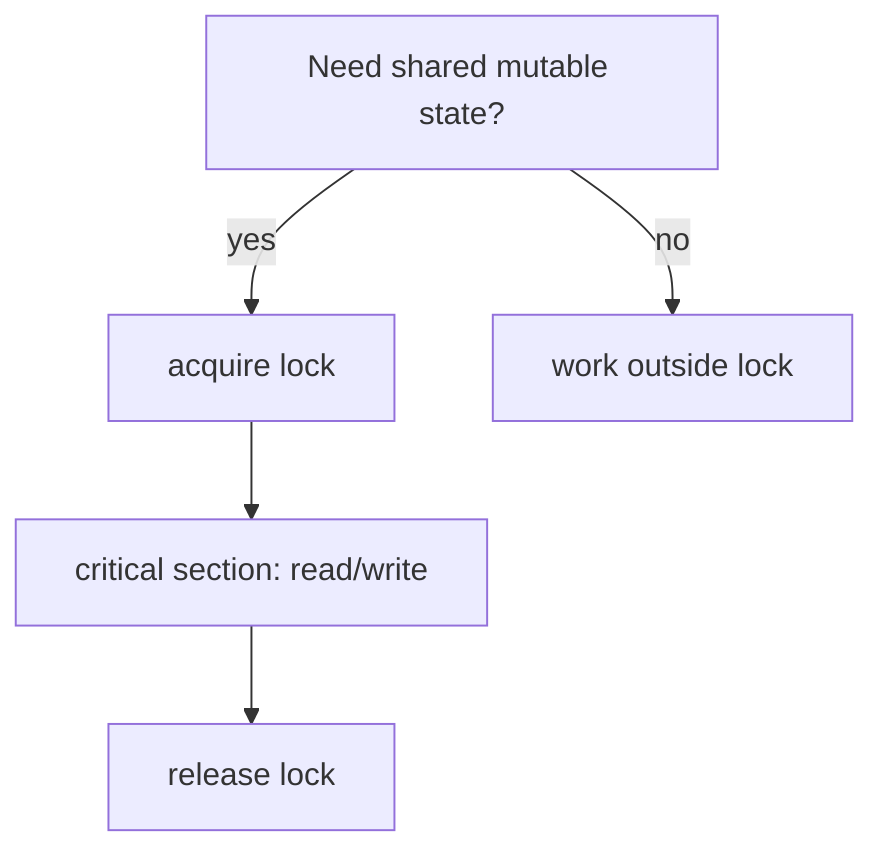

# Critical Section

A **critical section** is a piece of code that touches shared mutable state and
therefore must not be executed by several threads at the same time. Think of one
kitchen knife on a busy counter: many cooks may need it, but only one cook should
chop with it at a time, otherwise the result is unsafe and unpredictable.

In Java, the shared state can be a counter, cache, collection, file handle, or any
object whose state can change. The protection can be `synchronized`,
`ReentrantLock`, an atomic class, a queue, or another concurrency mechanism. The
important part is the rule: every thread that reads or writes the same protected
state must follow the same access protocol. In a post office analogy, every clerk
must use the same ticket window rule; a second private line does not protect the
same cash drawer.

## What Must Be Inside

Put the smallest read-modify-write operation inside the critical section: read
the shared value, calculate the new value, write it back, and release the lock.
Work that does not touch shared state should stay outside. It is like stepping
away from a narrow kitchen sink before drying plates: the sink is the scarce
place, not the whole kitchen.

A classic trap is `counter++`. It looks like one operation, but it is really:
read the old value, add one, write the new value. Without synchronization, two
threads can both read `0`, both compute `1`, and both write `1`; one increment is
lost. It is like two postal clerks reading the same old queue number and both
calling the next customer as number `1`.

Use the same lock for the same data. Locking on different objects is like two
traffic lights controlling the same one-lane bridge independently: each light
looks organized, but cars can still meet in the middle. This is especially
important when protecting shared collections such as [HashMap](topic:hashmap) or
when async code can run on different threads, as in [@Async and Self-Invocation](topic:spring-async-self-invocation).

## 60-Second Interview Answer

A critical section is the part of code that accesses shared mutable state and
must be executed with mutual exclusion. If two threads can enter it at the same
time, operations such as read-modify-write can interleave and produce race
conditions like lost updates. In Java I protect it with a consistent mechanism,
for example `synchronized`, `ReentrantLock`, or an atomic/lock-free abstraction
when it fits. The critical section should be as small as possible: hold the lock
only while touching the shared state, then release it reliably, usually with
structured `synchronized` code or `try/finally` for explicit locks.

## Production Relevance

Critical sections show up in caches, metrics counters, singleton initialization,
connection pools, schedulers, in-memory queues, and mutable request/session state.
In a restaurant, the recipe may be shared, but the single cash register needs a
rule; production systems are the same when many requests touch one mutable
object.

Short critical sections reduce contention. If a thread holds a lock while doing
I/O, sleeping, calling another service, or running expensive code, other threads
wait even though they only need a quick state update. That is like one customer
filling out a long form while blocking the only post office window.

Correctness comes before speed. If the state must stay consistent, protect the
whole invariant, not just one field. For example, moving money between two
balances requires both balances to be updated under the same consistency rule,
similar to [ACID Principles](topic:acid-principles) in databases: partial updates
are the danger.

## Common Misconceptions

- **"A critical section is a Java keyword."** No. It is a concept. Java gives you
  tools such as `synchronized`, `Lock`, atomics, and concurrent collections.
- **"Only writes need protection."** Not always. Reads that participate in a
  check-then-act or read-modify-write decision must see a consistent state. A
  cook checking an empty oven and another cook putting a tray in it must follow
  the same kitchen rule.
- **"Any lock works."** No. Threads must coordinate through the same lock or the
  same concurrency abstraction for the same data.
- **"Make the whole method synchronized and forget it."** Sometimes that is fine,
  but it can create unnecessary waiting. Lock the shared-state part, like using
  the sink only while washing, not while chatting.
- **"volatile makes a compound update safe."** `volatile` improves visibility for
  a variable, but it does not make `counter++` atomic. It is like a clear display
  board at the post office: everyone sees the number, but two clerks can still
  update it incorrectly without a rule.
