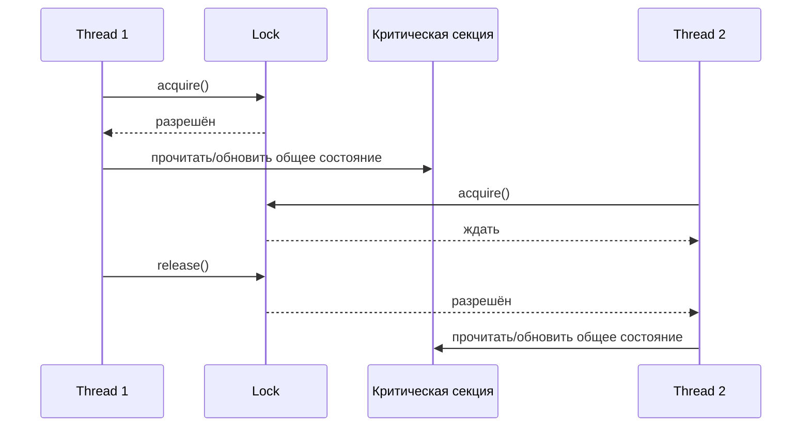
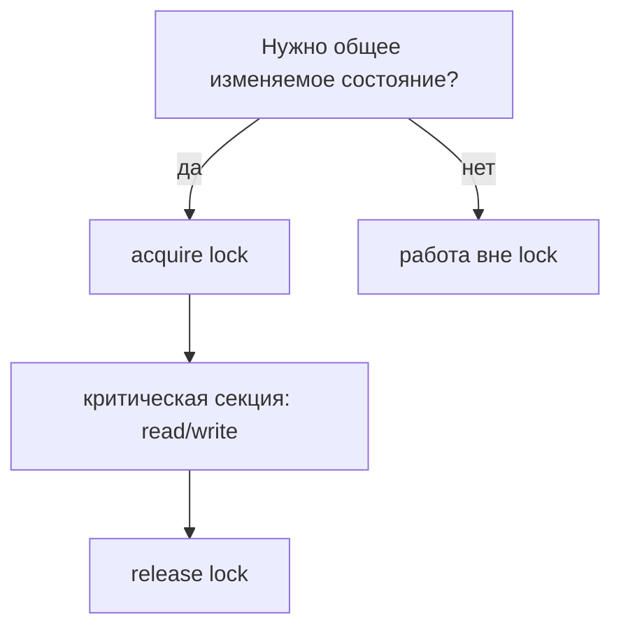

# Критическая секция

**Критическая секция** — это участок кода, который обращается к общему
изменяемому состоянию и поэтому не должен выполняться несколькими threads
одновременно. Представь один кухонный нож на busy counter: многим поварам он
может понадобиться, но резать им должен только один повар за раз, иначе результат
будет небезопасным и непредсказуемым.

В Java общим состоянием может быть counter, cache, collection, file handle или
любой объект, состояние которого меняется. Защитой может быть `synchronized`,
`ReentrantLock`, atomic class, queue или другой механизм concurrency. Главное
правило: каждый thread, который читает или пишет одно и то же защищаемое
состояние, должен соблюдать один и тот же протокол доступа. В аналогии с почтой:
каждый clerk должен пользоваться одним правилом ticket window; вторая личная
очередь не защищает тот же cash drawer.

## Что Должно Быть Внутри

В критическую секцию помещают минимальную операцию read-modify-write: прочитать
общее значение, вычислить новое, записать его обратно и освободить lock. Работа,
которая не трогает общее состояние, должна оставаться снаружи. Это как отойти от
узкой кухонной раковины перед тем, как вытирать тарелки: дефицитное место —
раковина, а не вся кухня.

Классическая ловушка — `counter++`. Выглядит как одна операция, но на деле это:
прочитать старое значение, прибавить один, записать новое значение. Без
синхронизации два threads могут оба прочитать `0`, оба вычислить `1` и оба
записать `1`; один increment потеряется. Это как два почтовых clerk читают один
и тот же старый номер очереди и оба зовут следующего клиента как номер `1`.

Используй один и тот же lock для одних и тех же данных. Lock на разных объектах
похож на два traffic lights, которые независимо управляют одним однополосным
мостом: каждый light выглядит упорядоченно, но машины всё равно могут встретиться
посередине. Это особенно важно при защите общих коллекций вроде
[HashMap](topic:hashmap) или когда async-код может выполняться на разных threads,
как в [@Async и self-invocation](topic:spring-async-self-invocation).

## Ответ За 60 Секунд

Критическая секция — это часть кода, которая обращается к общему изменяемому
состоянию и должна выполняться с mutual exclusion. Если два threads могут войти в
неё одновременно, операции вроде read-modify-write могут перемешаться и дать race
conditions, например потерянные обновления. В Java я защищаю её единым
механизмом: например `synchronized`, `ReentrantLock` или atomic/lock-free
абстракцией, если она подходит. Критическая секция должна быть как можно меньше:
удерживать lock только пока код трогает общее состояние, а затем надёжно
освобождать его, обычно через структурированный `synchronized` или `try/finally`
для явных locks.

## Значение В Production

Критические секции встречаются в caches, metrics counters, singleton
initialization, connection pools, schedulers, in-memory queues и изменяемом
request/session state. В ресторане recipe может быть общей, но для единственной
cash register нужно правило; production-системы устроены так же, когда много
requests трогают один изменяемый object.

Короткие критические секции уменьшают contention. Если thread держит lock во
время I/O, sleep, вызова другого service или дорогого вычисления, другие threads
ждут, хотя им нужно только быстро обновить state. Это как клиент, который
заполняет длинную форму и при этом блокирует единственное окно почты.

Корректность важнее скорости. Если состояние должно оставаться согласованным,
защищай весь invariant, а не одно поле. Например, перевод денег между двумя
balances требует обновить оба balances под одним правилом согласованности, похоже
на [ACID Principles](topic:acid-principles) в databases: опасны частичные
обновления.

## Частые Заблуждения

- **«Критическая секция — это keyword Java».** Нет. Это concept. Java даёт
  инструменты: `synchronized`, `Lock`, atomics и concurrent collections.
- **«Защищать нужно только записи».** Не всегда. Чтения, участвующие в
  check-then-act или read-modify-write, должны видеть согласованное состояние.
  Повар, который проверяет пустую oven, и другой повар, который ставит туда tray,
  должны соблюдать одно kitchen rule.
- **«Подойдёт любой lock».** Нет. Threads должны координироваться через один и
  тот же lock или одну и ту же concurrency abstraction для одних данных.
- **«Сделай весь method synchronized и забудь».** Иногда это нормально, но может
  создать лишнее ожидание. Блокируй часть с общим состоянием: как пользоваться
  раковиной только во время мытья, а не во время разговора.
- **«volatile делает составное обновление безопасным».** `volatile` улучшает
  visibility переменной, но не делает `counter++` atomic. Это как понятное табло
  на почте: все видят номер, но два clerks всё равно могут обновить его неверно
  без общего правила.
