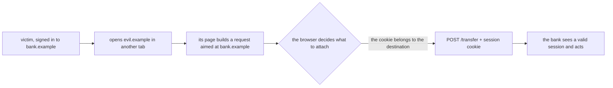
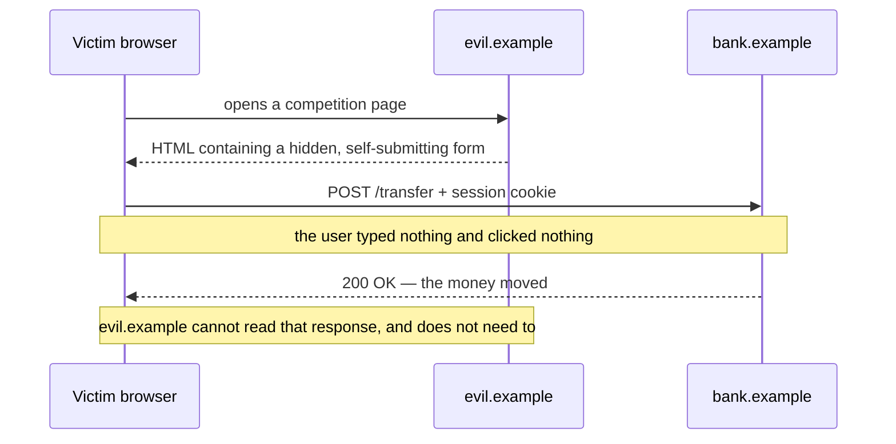
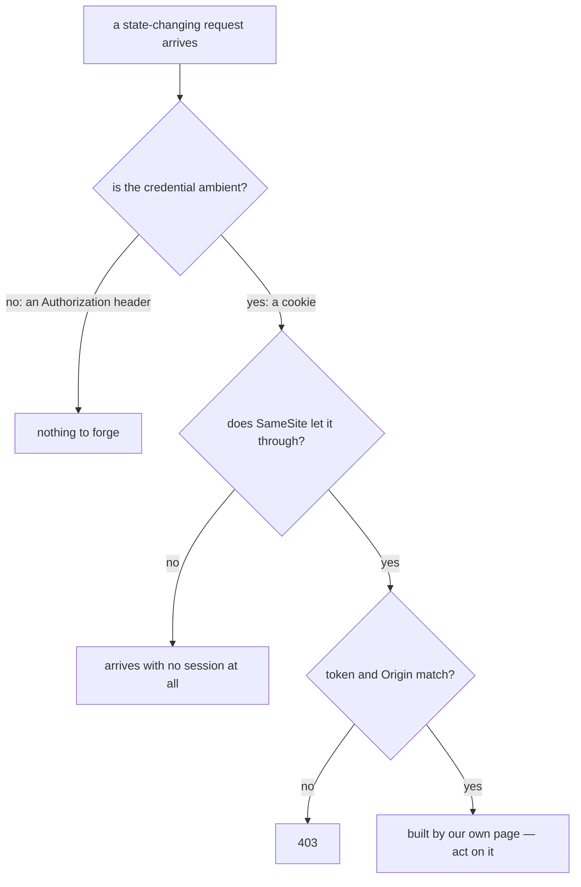

# What is cross-site request forgery (CSRF)

**CSRF is what happens when a page on another site makes your user's browser send
a request to you, and the browser attaches the session cookie because the request
is addressed to you.** The server receives an action nobody asked for, wearing a
perfectly valid session.

The impact is not "someone can call my endpoint" — it is "someone else can act as
my user, and nothing in my logs will ever look wrong". The session is real. The IP
is the user's. The device is the user's. The audit row says the user did it.

## Where the bug actually is

A cookie is **ambient authority**: the browser applies it by *destination*, not by
*intent*. Any page in the world may cause a request to `bank.example`, and every
one of those requests gets the `bank.example` cookie.

Nobody wrote that attachment step; it is what cookies have always done, and it is
the entire vulnerability. Which is why CSRF is **not an authentication bug**:
stronger passwords, MFA, shorter sessions and [HTTPS](topic:http-vs-https) all
leave it exactly where it was. The request really is in the user's session — what
it is missing is the user's *intent*.

## The attack, start to finish

The last note is the part people miss. The same-origin policy does its job
perfectly: the attacker's page cannot read a single byte of the answer, so it
never learns the balance and never even finds out whether the request worked.
**CSRF is a write attack.** The side effect has already happened.

That also tells you which endpoints are worth protecting: the ones that *change*
something. A [safe method](topic:http-methods) that only reads is not a CSRF
target — and an endpoint that changes state on a `GET` is the easiest target
there is.

## How the request gets delivered

The attacker's page does not need your cooperation, and mostly does not need the
victim's either:

| Delivery | Method | Needs a click? | Needs JavaScript? |
|---|---|---|---|
| `` | GET | no | no |
| `<a href="…">Claim your prize</a>` | GET | yes | no |
| a hidden `<form>` that submits itself | POST | no | yes (one line) |
| `fetch()` with a JSON body | POST | no | yes, **and** the browser's permission |

The first three are why "we only accept POST" is not a defence: a cross-site form
has been allowed to POST anywhere since HTML had forms, and the browser sends it
without asking anyone. Only the last row is different, and it is different for a
reason worth understanding — see below.

## Why CORS does not save you (and how it sometimes helps)

[CORS](topic:cors) governs whether one origin may **read another origin's
response**. It was never about whether the request may be *sent*. A cross-site
form POST is a "simple" request: it goes out, the server acts on it, and CORS only
steps in afterwards to hide the reply — which the attacker did not want.

Where CORS genuinely helps is the shape a form cannot produce. A `fetch()` with
`Content-Type: application/json`, or with a custom header, is not simple, so the
browser sends a [preflight](topic:preflight-requests) first and refuses to send
the real request when the answer does not name the attacker's origin. That is why
a JSON API which *rejects* form content types is hard to forge — note the verb:
it must refuse `application/x-www-form-urlencoded` and `multipart/form-data`, not
merely prefer JSON.

And the misconfiguration that undoes all of it: reflecting whatever `Origin` asked
for together with `Access-Control-Allow-Credentials: true`. That hands the
browser's verdict to the attacker.

## The defences that actually work

Each one answers the same question — *was this request assembled by a page of
ours?* — in a different place.

**`SameSite` cookies.** One attribute, enforced by the browser *before the request
is sent*, protecting endpoints you have forgotten you have.

- `Strict` — the cookie is left out of anything not started on your own site,
  including a plain link from an email, so users arrive looking logged out.
- `Lax` — what browsers now default to. It withholds the cookie from cross-site
  subresource loads and cross-site POSTs, but **still attaches it to a top-level
  `GET` navigation**, because blocking those would log everyone out of every link
  from mail and search. So the gap `Lax` leaves is exactly: any `GET` that changes
  something.
- `None` — the legacy behaviour, and it now requires `Secure`.

`Lax` by default is why CSRF is much rarer than it was. It is not a reason to drop
the other defences: it does nothing about a same-site subdomain you do not
control, some clients still ignore it, and it is one browser update away from
being your only layer.

**A synchronizer token.** The server puts an unpredictable value in the page it
renders and demands it back with every state-changing request. It works for one
reason only: the same-origin policy stops the attacker's page from *reading* your
HTML, so it can never learn the value. The token proves nothing about the user —
it proves the request was assembled by a page that could read your markup. This is
what Spring Security's `CsrfFilter` does out of the box.

**An `Origin` / `Referer` check.** Stateless, and the natural fit for an API that
renders no HTML to hide a token in. `Origin` is a *forbidden header name*: page
JavaScript cannot set it and the browser fills it in honestly. Decide in advance
what you do with the requests that carry neither header.

**Stop using an ambient credential.** Every other defence detects the forgery;
this one removes the material it is made of. If the session is a value your own
JavaScript attaches (`Authorization: Bearer …`), another site's page has nothing
to borrow — the request arrives with no identity at all. The trade is real and you
should say it out loud in an interview: what JavaScript can attach, an
[XSS](topic:xss) can read. Cookie sessions survive XSS better; header sessions
survive CSRF better; `HttpOnly` cookies plus a token gets you most of both.

## What is not a defence

- **Checking `POST`.** A cross-site form posts happily.
- **A secret-looking URL or obscure parameter names.** The attacker writes the
  request; they read your JavaScript to learn the shape.
- **HTTPS, MFA, short sessions, IP pinning.** The request comes from the real
  user, on the real device, in the real session.
- **CAPTCHA or re-authentication.** These *are* effective, because they demand
  proof of intent — but only where you are willing to put them, which is a handful
  of critical operations, not every endpoint.
- **A CSRF token, once the site has XSS.** The injected script runs on your
  origin, so it reads the token straight off the page. Fix the two independently.

## The 60-second interview answer

> CSRF is when another site causes my user's browser to send a request to my
> application, and the browser attaches the session cookie automatically because
> the cookie belongs to my domain. The server sees a fully authenticated request
> the user never made — so it is not an authentication problem, and MFA or HTTPS
> do not touch it. The attacker can't read the response, thanks to the same-origin
> policy, but they don't need to: it's a write attack, so any state-changing
> endpoint is a target. Delivery is trivial — an `` tag if a `GET` changes
> state, a self-submitting form for POST. The fixes prove the request came from my
> own page: `SameSite=Lax` or `Strict` on the session cookie, which the browser
> enforces before the request is sent; a synchronizer token, which works because
> the same-origin policy stops the attacker reading my HTML; and an `Origin` check
> for APIs. Best of all, stop using an ambient credential — a token my own
> JavaScript attaches can't be forged this way, though it can be stolen by XSS.
> And `SameSite=Lax` still permits a top-level `GET`, which is one more reason
> `GET` must never change state.

## Why it matters in production

CSRF is the reason every server-side framework ships a CSRF filter switched on by
default, and the reason a spectacular number of applications switch it off with
one line when a stateless endpoint starts returning 403. Before you do that, be
sure the endpoint is genuinely not cookie-authenticated — the filter is not what
is broken, the session model is.

What this buys you in practice:

- put `SameSite` on session cookies today; it is one attribute and it covers
  endpoints you have not audited;
- keep `GET` read-only, everywhere. It is [good HTTP](topic:http-idempotency) and
  it deletes the deliveries that need neither script nor a click;
- keep the framework's CSRF protection on for anything cookie-authenticated, and
  when you disable it for an API, disable it *because* that API uses bearer
  tokens;
- for the few operations that really matter — changing an email, a password, a
  payout account — require the current password or a second factor. That is a
  check on intent, and it survives every mistake above.

## Common misconceptions

- **"The session cookie is `HttpOnly`, so we're fine."** `HttpOnly` stops
  JavaScript reading the cookie. CSRF never reads it; the browser sends it.
- **"We use POST, so we're safe."** A cross-site form POSTs without asking anyone.
- **"CORS blocks it."** [CORS](topic:cors) governs reading responses. The request
  is sent, the action happens, and the attacker never wanted the reply.
- **"Our API is JSON, so it can't be forged."** Only if it *refuses* form content
  types. If it happily parses `application/x-www-form-urlencoded`, a form will
  reach it with no preflight at all.
- **"`SameSite=Lax` is on by default, CSRF is dead."** It still permits top-level
  `GET` navigations, so a state-changing `GET` is still forgeable — and
  `SameSite` is same-*site*, not same-*origin*, so a subdomain you do not control
  is on the inside.
- **"We validate the session properly."** That is exactly what makes CSRF work.
  See [designing a security scheme for your endpoints](topic:endpoint-security-design):
  authentication answers *who*, and this attack needs *why*.
- **"It's a frontend problem."** The forged request is judged by your server. How
  the two sides split this is worth being explicit about — see
  [frontend and backend interaction](topic:frontend-backend-interaction).
- **"XSS and CSRF are the same class of bug."** [XSS](topic:xss) runs the
  attacker's code *on your origin* and therefore beats every CSRF defence. CSRF
  runs no code of yours at all — it only borrows the browser's willingness to
  attach a cookie.
