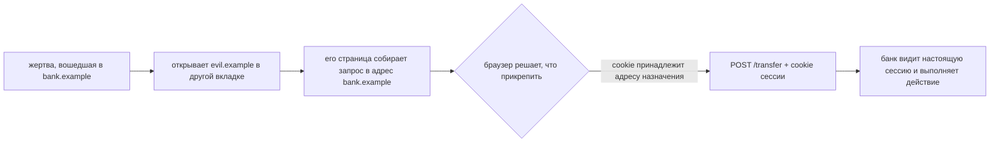
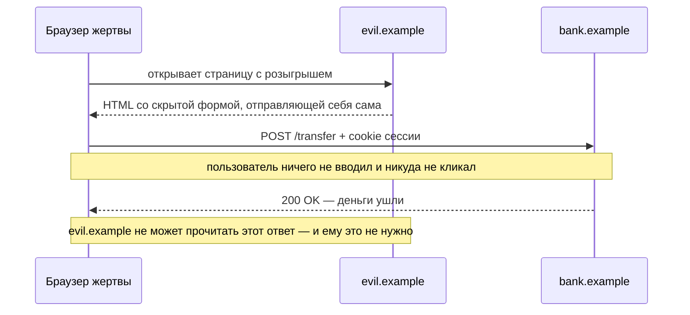
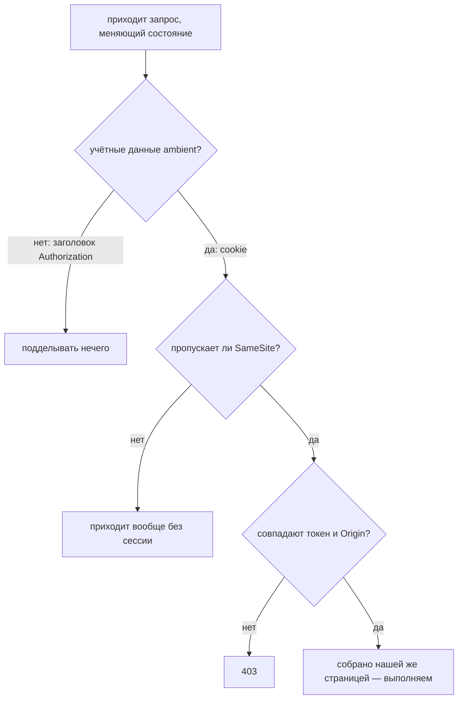

# Что такое межсайтовая подделка запроса (CSRF)

**CSRF — это когда страница на другом сайте заставляет браузер вашего пользователя
отправить запрос вам, а браузер прикрепляет к нему cookie сессии, потому что
запрос адресован вам.** Сервер получает действие, о котором никто не просил, — и
на нём совершенно настоящая сессия.

Последствие не «кто-то может дёрнуть мой эндпоинт», а «кто-то другой может
действовать от имени моего пользователя, и в логах ничто никогда не будет выглядеть
подозрительно». Сессия настоящая. IP пользовательский. Устройство пользовательское.
В журнале аудита написано, что это сделал пользователь.

## Где на самом деле ошибка

Cookie — это **ambient-полномочия**: браузер применяет её по *адресу назначения*, а
не по *намерению*. Любая страница в мире может вызвать запрос к `bank.example`, и к
каждому такому запросу прикрепится cookie для `bank.example`.

Этот шаг прикрепления никто не писал: cookie всегда так и работали, и в этом вся
уязвимость. Поэтому CSRF — **не ошибка аутентификации**: более сильные пароли, MFA,
короткие сессии и [HTTPS](topic:http-vs-https) оставляют её ровно на месте. Запрос
действительно идёт в сессии пользователя — в нём нет только *намерения*
пользователя.

## Атака от начала до конца

Последнее примечание — как раз то, что чаще всего упускают. Правило одного источника
отрабатывает безупречно: страница злоумышленника не может прочитать ни байта ответа,
поэтому не узнаёт ни баланса, ни даже того, сработал ли запрос. **CSRF — атака на
запись.** Побочный эффект уже случился.

Отсюда же видно, какие эндпоинты стоит защищать: те, что что-то *меняют*.
[Безопасный метод](topic:http-methods), который только читает, целью CSRF не
является, — а эндпоинт, меняющий состояние по `GET`, это самая лёгкая цель из
возможных.

## Как доставляется запрос

Странице злоумышленника не нужно ваше содействие, а чаще всего не нужно и участие
жертвы:

| Способ доставки | Метод | Нужен клик? | Нужен JavaScript? |
|---|---|---|---|
| `` | GET | нет | нет |
| `<a href="…">Заберите приз</a>` | GET | да | нет |
| скрытая `<form>`, отправляющая себя сама | POST | нет | да (одна строка) |
| `fetch()` с телом JSON | POST | нет | да, **и ещё** разрешение браузера |

Первые три строки и объясняют, почему «мы принимаем только POST» — не защита:
кросс-сайтовой форме разрешено отправлять POST куда угодно с тех пор, как в HTML
появились формы, и браузер отправляет его, ни у кого не спрашивая. Отличается только
последняя строка, и отличается по причине, которую стоит понять, — об этом ниже.

## Почему CORS вас не спасает (и когда всё-таки помогает)

[CORS](topic:cors) определяет, может ли один источник **прочитать ответ другого
источника**. Он никогда не был про то, можно ли *отправить* запрос. Кросс-сайтовый
POST формы — «простой» запрос: он уходит, сервер по нему действует, и CORS
вмешивается только потом, чтобы спрятать ответ, который злоумышленнику и не был
нужен.

По-настоящему CORS помогает там, где форма не может выдать нужную форму запроса.
`fetch()` с `Content-Type: application/json` или с собственным заголовком не
является простым, поэтому браузер сначала отправляет
[предварительный запрос](topic:preflight-requests) и отказывается отправлять
настоящий, если в ответе не назван origin злоумышленника. Именно поэтому JSON API,
который *отвергает* формовые типы содержимого, трудно подделать, — обратите внимание
на глагол: он должен именно отказывать в `application/x-www-form-urlencoded` и
`multipart/form-data`, а не просто предпочитать JSON.

И та самая ошибка настройки, которая всё это отменяет: отражать любой присланный
`Origin` вместе с `Access-Control-Allow-Credentials: true`. Так вердикт браузера
передаётся в руки злоумышленнику.

## Защиты, которые действительно работают

Каждая из них отвечает на один и тот же вопрос — *собрала ли этот запрос наша
страница?* — только в разных местах.

**Cookie `SameSite`.** Один атрибут, который применяет браузер *ещё до отправки
запроса*, защищая в том числе эндпоинты, о которых вы забыли.

- `Strict` — cookie не попадает никуда, что начато не на вашем сайте, включая
  обычную ссылку из письма, поэтому пользователи приходят «разлогиненными».
- `Lax` — то, что браузеры теперь ставят по умолчанию. Он не отправляет cookie при
  кросс-сайтовой загрузке подресурсов и при кросс-сайтовом POST, но **по-прежнему
  прикрепляет её к переходу верхнего уровня методом `GET`**: иначе все оказывались бы
  разлогинены при переходе по любой ссылке из почты и поиска. Значит, дыра, которую
  оставляет `Lax`, — это ровно любой `GET`, который что-то меняет.
- `None` — унаследованное поведение, и теперь оно требует `Secure`.

`Lax` по умолчанию — причина, по которой CSRF встречается куда реже, чем раньше. Но
это не повод отказываться от остальных защит: он ничего не делает с поддоменом того
же сайта, который вам не подконтролен, часть клиентов его игнорирует, и он окажется
вашим единственным уровнем защиты сразу же, как только вы уберёте остальные.

**Синхронизирующий токен.** Сервер кладёт в отдаваемую страницу непредсказуемое
значение и требует его обратно с каждым изменяющим состояние запросом. Работает это
ровно по одной причине: правило одного источника не даёт странице злоумышленника
*прочитать* ваш HTML, поэтому значение ему не узнать. Токен ничего не доказывает про
пользователя — он доказывает, что запрос собрала страница, сумевшая прочитать вашу
разметку. Именно это из коробки делает `CsrfFilter` в Spring Security.

**Проверка `Origin` / `Referer`.** Не требует хранения состояния и естественно
подходит API, который не отдаёт HTML, чтобы спрятать в нём токен. `Origin` —
*запрещённое для скрипта имя заголовка*: JavaScript страницы его не выставит, а
браузер заполняет честно. Заранее решите, что вы делаете с запросами, в которых нет
ни того, ни другого заголовка.

**Отказаться от ambient-полномочий.** Все прочие защиты распознают подделку — эта
убирает материал, из которого она делается. Если сессия — это значение, которое
прикрепляет ваш собственный JavaScript (`Authorization: Bearer …`), странице чужого
сайта нечего позаимствовать: запрос приходит вообще без личности. Обмен при этом
настоящий, и на собеседовании это стоит проговорить: то, что может прикрепить
JavaScript, может прочитать [XSS](topic:xss). Сессия в cookie лучше переживает XSS,
сессия в заголовке — CSRF, а cookie с `HttpOnly` плюс токен дают почти всё сразу.

## Что защитой не является

- **Проверка на `POST`.** Кросс-сайтовая форма прекрасно отправляет POST.
- **«Секретный» URL или неочевидные имена параметров.** Запрос пишет злоумышленник,
  а форму запроса он узнаёт из вашего же JavaScript.
- **HTTPS, MFA, короткие сессии, привязка к IP.** Запрос идёт от настоящего
  пользователя, с настоящего устройства, в настоящей сессии.
- **CAPTCHA или повторная аутентификация.** Вот они *работают*, потому что требуют
  доказательства намерения, — но только там, где вы готовы их поставить, а это
  несколько критичных операций, а не каждый эндпоинт.
- **CSRF-токен, если на сайте есть XSS.** Внедрённый скрипт выполняется на вашем
  origin и просто считывает токен со страницы. Чинить эти две вещи нужно
  независимо.

## Ответ на собеседовании за 60 секунд

> CSRF — это когда чужой сайт заставляет браузер моего пользователя отправить запрос
> в моё приложение, а браузер автоматически прикрепляет cookie сессии, потому что
> cookie принадлежит моему домену. Сервер видит полностью аутентифицированный
> запрос, которого пользователь не делал, — поэтому это не проблема аутентификации,
> и MFA с HTTPS тут ничего не меняют. Прочитать ответ злоумышленник не может, за это
> отвечает правило одного источника, но ему и не нужно: это атака на запись, поэтому
> целью является любой эндпоинт, меняющий состояние. Доставка тривиальна: тег ``,
> если состояние меняется по `GET`, или самоотправляющаяся форма для POST. Все
> починки доказывают, что запрос собрала моя страница: `SameSite=Lax` или `Strict` на
> cookie сессии, который браузер применяет ещё до отправки запроса; синхронизирующий
> токен, который работает потому, что правило одного источника не даёт злоумышленнику
> прочитать мой HTML; и проверка `Origin` для API. Лучше же всего вообще отказаться от
> ambient-полномочий: токен, который прикрепляет мой собственный JavaScript, так не
> подделаешь, — правда, его может украсть XSS. И ещё: `SameSite=Lax` по-прежнему
> пропускает `GET` верхнего уровня, а это лишняя причина, по которой `GET` не должен
> менять состояние.

## Почему это важно в продакшене

Из-за CSRF каждый серверный фреймворк поставляет CSRF-фильтр включённым по
умолчанию — и из-за него же поразительное количество приложений выключает его одной
строкой, когда stateless-эндпоинт начинает отдавать 403. Прежде чем так делать,
убедитесь, что эндпоинт действительно не аутентифицируется через cookie: сломан не
фильтр, сломана модель сессии.

Что это даёт на практике:

- поставьте `SameSite` на cookie сессии уже сегодня: это один атрибут, и он
  покрывает даже те эндпоинты, которые вы не проверяли;
- держите `GET` только читающим, везде. Это [правильный HTTP](topic:http-idempotency),
  и это убирает те способы доставки, которым не нужны ни скрипт, ни клик;
- оставляйте защиту фреймворка включённой для всего, что аутентифицируется через
  cookie, а если выключаете её для API, то выключайте *потому*, что этот API
  использует bearer-токены;
- для немногих действительно важных операций — смены почты, пароля, реквизитов
  выплаты — требуйте текущий пароль или второй фактор. Это проверка намерения, и она
  переживает любую ошибку выше.

## Частые заблуждения

- **«Cookie сессии `HttpOnly`, значит всё в порядке».** `HttpOnly` не даёт JavaScript
  прочитать cookie. CSRF её и не читает — её отправляет браузер.
- **«У нас POST, значит мы защищены».** Кросс-сайтовая форма отправляет POST, ни у
  кого не спрашивая.
- **«CORS это блокирует».** [CORS](topic:cors) управляет чтением ответов. Запрос
  уходит, действие происходит, а ответ злоумышленнику и не был нужен.
- **«Наш API на JSON, его нельзя подделать».** Только если он *отвергает* формовые
  типы содержимого. Если он спокойно разбирает `application/x-www-form-urlencoded`,
  форма дойдёт до него вообще без предварительного запроса.
- **«`SameSite=Lax` теперь по умолчанию, CSRF мёртв».** Он по-прежнему пропускает
  переходы верхнего уровня методом `GET`, поэтому меняющий состояние `GET` всё ещё
  подделывается, — а `SameSite` — это про same-*site*, а не про same-*origin*,
  поэтому неподконтрольный вам поддомен находится «внутри».
- **«Мы аккуратно проверяем сессию».** Именно это и заставляет CSRF работать. См.
  [проектирование схемы безопасности эндпоинтов](topic:endpoint-security-design):
  аутентификация отвечает на вопрос *кто*, а этой атаке нужен вопрос *зачем*.
- **«Это проблема фронтенда».** Поддельный запрос оценивает ваш сервер. Как эти две
  стороны делят работу, стоит проговорить явно — см.
  [взаимодействие фронтенда и бэкенда](topic:frontend-backend-interaction).
- **«XSS и CSRF — это один класс ошибок».** [XSS](topic:xss) выполняет код
  злоумышленника *на вашем origin* и поэтому побеждает любую защиту от CSRF. CSRF же
  не выполняет вашего кода вообще — он лишь пользуется готовностью браузера
  прикрепить cookie.
