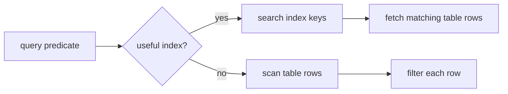
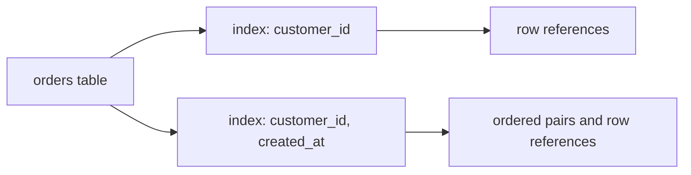
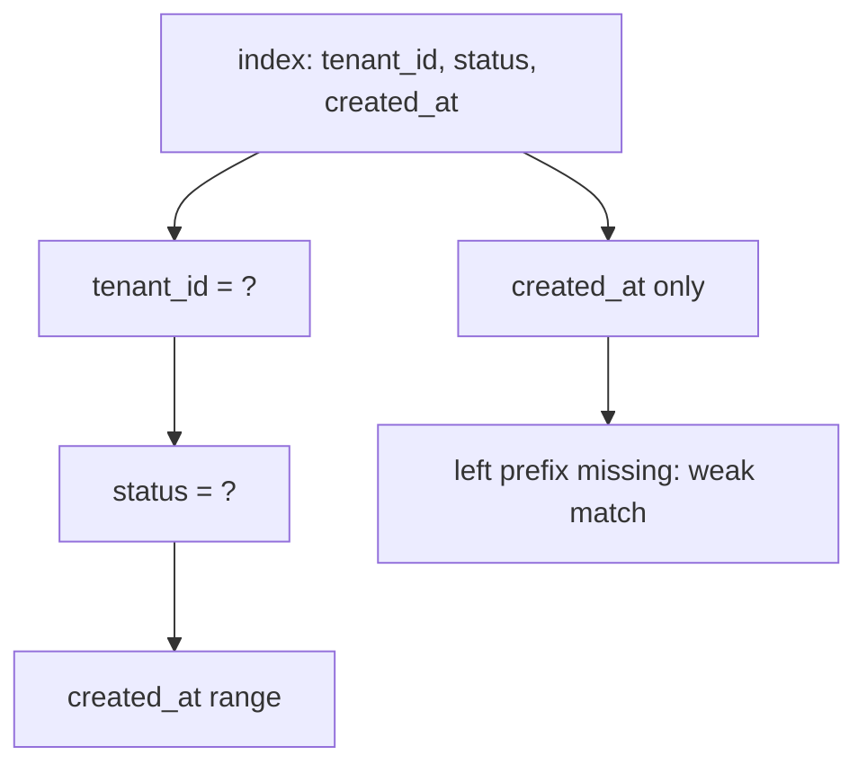

# Database Indexes

## Intuition

An index is an extra data structure that stores selected column values in a searchable order and points back to the table rows. Without an index, the database may need a full table scan: read row after row and check the predicate. With a useful index, it can first search the smaller ordered structure, then visit only the matching rows. Think of a post office sorting letters by street name: the letters still exist in the bags, but the sorted shelf lets the worker jump to the right street instead of opening every bag.

Most relational databases use B-tree or B+tree indexes for common equality and range queries. The tree keeps keys sorted, so `WHERE email = ?`, `WHERE created_at >= ?`, and `ORDER BY created_at` can become guided walks through the index instead of blind scans. It is like a kitchen recipe binder sorted by dish name and then by section: finding "soup" or all recipes after "salad" is much faster than checking every loose paper.

An index is not a copy of the whole table by default. A simple index on `email` stores `email` values plus row references. A composite index on `(customer_id, created_at)` stores pairs ordered first by `customer_id`, then by `created_at`. This is like a warehouse shelf labeled first by aisle and then by date: it is excellent when you know the aisle, but weak if you only ask for all items from a date across every aisle.

## What Indexes Speed Up

Indexes can help `WHERE`, `JOIN`, `ORDER BY`, `GROUP BY`, and uniqueness checks. A foreign key used in a join often benefits from an index, especially in join-heavy schemas such as a [many-to-many SQL model](topic:sql-many-to-many). The real benefit depends on the query shape and data distribution. A city map helps when you know the street; it helps much less if the request is "visit almost every house anyway."

Selectivity matters. A highly selective index narrows the result to a small part of the table, for example a unique email. A low-selectivity column, such as `active = true` when 95% of users are active, may not help because the database would still fetch most rows. This is like a traffic lane sign saying "cars" on a road where almost everything is a car: the sign does not separate much.

Composite indexes follow the leftmost-prefix idea in many engines. An index on `(tenant_id, status, created_at)` is strong for `tenant_id = ?`, stronger for `tenant_id = ? AND status = ?`, and useful for ranges on `created_at` after the earlier columns are constrained. It is like sorting mail by country, then city, then street: you cannot efficiently jump straight to a street name without first knowing the country and city.

## Costs and Trade-offs

Every index must be maintained. `INSERT`, `UPDATE`, and `DELETE` have to change the table and also adjust each affected index. More indexes can mean slower writes, more locks or page work inside the engine, and more disk usage. The post office analogy cuts both ways: sorted shelves make lookup fast, but every new letter must be put onto every relevant shelf.

Indexes also interact with transactions and visibility rules. In MVCC databases, an index can point to candidate rows, but the engine still checks whether each row version is visible to the current transaction; see [MVCC](topic:mvcc) and [PostgreSQL isolation levels](topic:postgresql-isolation-levels) for the transaction side. A kitchen ticket board may show an order number, but the cook still checks whether that ticket is current or already replaced.

A covering index contains all columns needed by a query, so the database may answer from the index alone. For example, an index on `(customer_id, created_at, total)` can cover `SELECT created_at, total FROM orders WHERE customer_id = ? ORDER BY created_at`. It is like a parcel pickup slip that already includes shelf, recipient, and weight: the clerk may not need to open the box to answer the question.

## 60-second Interview Answer

A database index is an auxiliary structure, usually a B-tree, that stores selected column values in sorted form with references to table rows. It lets the optimizer avoid scanning the whole table for selective predicates, joins, ranges, sorting, grouping, and uniqueness checks. The key trade-off is that indexes are not free: they consume storage and must be updated on writes, so too many indexes can slow `INSERT`, `UPDATE`, and `DELETE`.

Good index design starts from real queries: which columns are filtered, joined, sorted, or grouped, how selective they are, and in what order predicates appear. Composite index order matters because the leading columns determine how well the index can be searched. Even if an index exists, the optimizer may choose a scan when the query returns a large part of the table or the statistics say the index path is more expensive.

## Production Relevance

In production, indexes are one of the biggest levers for query latency. A missing index can turn a small request into a full table scan, while a good index can make an endpoint feel instant. This is like adding clear signs in a parking garage: drivers stop circling every level and go straight to the right row.

The safe workflow is to inspect slow queries, check the execution plan, add the narrowest useful index, and measure again. Do not add indexes just because a column appears in code. A warehouse does not create a separate sorted shelf for every label on every box; it creates shelves for the searches workers actually perform.

Indexes are also part of data integrity. Unique indexes enforce rules such as one account per email, supporting the consistency side of [ACID](topic:acid-principles). That is like a cloakroom ticket system that refuses to issue the same number twice, not just a faster lookup shelf.

## Common Misconceptions

- "An index always makes a query faster." Not always: if the query returns most rows, scanning can be cheaper than bouncing between index pages and table pages. A delivery driver may skip the address book when every house on the street needs a package.
- "Index every column." Too many indexes waste storage and slow writes. A kitchen with a separate checklist for every ingredient spends more time updating checklists than cooking.
- "Column order in a composite index does not matter." It matters because the index is sorted left to right. A phone book sorted by last name then first name is not efficient for searching only by first name.
- "A unique constraint and an index are unrelated." In many databases, a unique constraint is backed by a unique index. The rule and the lookup structure work together, like a guest list that both checks names and prevents duplicates.
- "Hash indexes and database indexes are basically [HashMap](topic:hashmap)." Hash indexes use hashing ideas, but common relational indexes are usually B-tree based because they support ranges and ordering. A hash locker can jump to one box, but it cannot easily list every box between 10:00 and 11:00.
