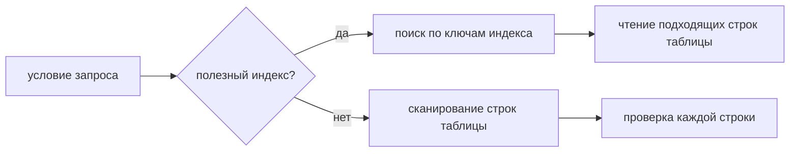
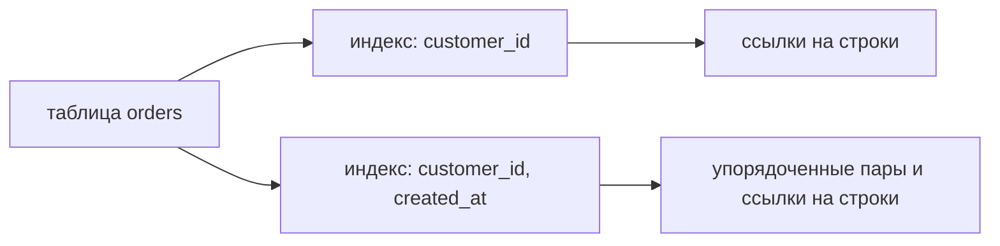
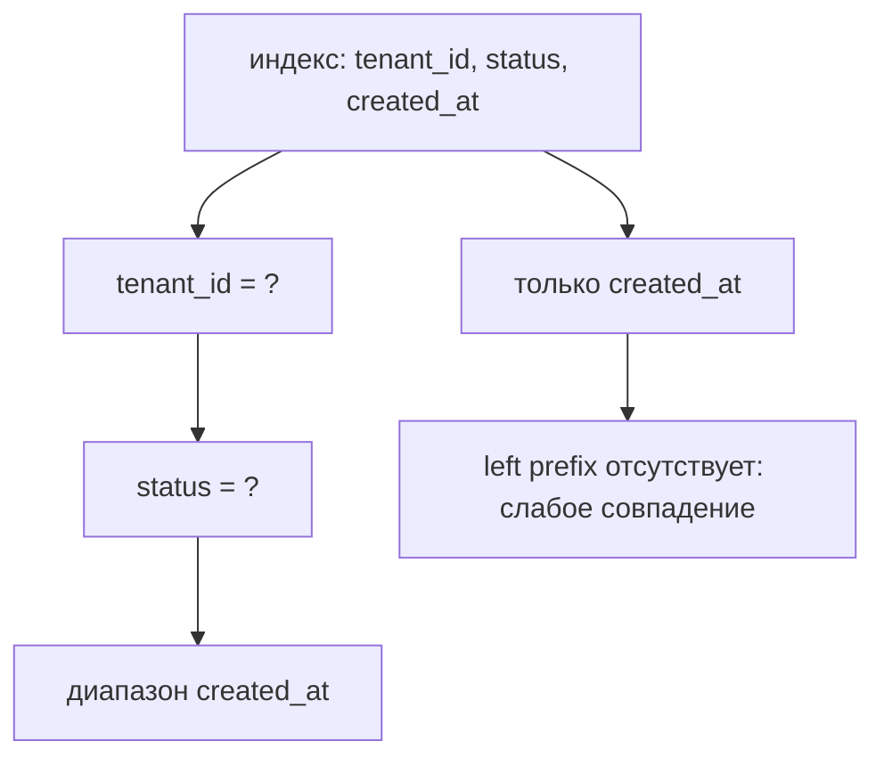

# Индексы в базе данных

## Интуиция

Индекс - это дополнительная структура данных, которая хранит значения выбранных колонок в удобном для поиска порядке и указывает обратно на строки таблицы. Без индекса базе может понадобиться full table scan: читать строку за строкой и проверять условие. С полезным индексом она сначала ищет в меньшей упорядоченной структуре, а затем обращается только к подходящим строкам. Представь почтовое отделение, где письма разложены по названиям улиц: письма всё ещё лежат в мешках, но отсортированная полка помогает сотруднику перейти к нужной улице, а не открывать каждый мешок.

В большинстве реляционных баз для обычных запросов на равенство и диапазон используются B-tree или B+tree индексы. Дерево хранит ключи отсортированными, поэтому `WHERE email = ?`, `WHERE created_at >= ?` и `ORDER BY created_at` могут стать направленным проходом по индексу, а не слепым сканированием. Это похоже на кухонную папку рецептов, отсортированную по названию блюда и разделу: найти "суп" или все рецепты после "салата" быстрее, чем перебирать отдельные листки.

Индекс обычно не является копией всей таблицы. Простой индекс по `email` хранит значения `email` и ссылки на строки. Составной индекс по `(customer_id, created_at)` хранит пары, отсортированные сначала по `customer_id`, затем по `created_at`. Это похоже на складскую полку, подписанную сначала проходом, а затем датой: она отлично работает, когда известен проход, но слаба, если нужно найти все товары за дату сразу по всем проходам.

## Что ускоряют индексы

Индексы могут помогать `WHERE`, `JOIN`, `ORDER BY`, `GROUP BY` и проверкам уникальности. Внешний ключ, участвующий в join, часто выигрывает от индекса, особенно в схемах с большим количеством соединений, например в [many-to-many модели SQL](topic:sql-many-to-many). Реальная польза зависит от формы запроса и распределения данных. Карта города помогает, когда известна улица; она намного менее полезна, если задача всё равно звучит как "обойти почти каждый дом".

Важна селективность. Высокоселективный индекс сужает результат до небольшой части таблицы, например до уникального email. Низкоселективная колонка, например `active = true`, когда 95% пользователей активны, может почти не помогать, потому что базе всё равно придётся читать большинство строк. Это как дорожный знак "легковые машины" на дороге, где почти всё - легковые машины: знак мало что разделяет.

Составные индексы во многих движках следуют идее leftmost prefix. Индекс по `(tenant_id, status, created_at)` силён для `tenant_id = ?`, сильнее для `tenant_id = ? AND status = ?` и полезен для диапазонов по `created_at`, когда предыдущие колонки уже ограничены. Это похоже на сортировку почты по стране, затем городу, затем улице: нельзя эффективно прыгнуть прямо к названию улицы, если сначала не известны страна и город.

## Издержки и компромиссы

Каждый индекс нужно поддерживать. `INSERT`, `UPDATE` и `DELETE` должны изменить таблицу и также поправить каждый затронутый индекс. Большее количество индексов может означать более медленную запись, больше блокировок или работы со страницами внутри движка и больше места на диске. Почтовая аналогия работает в обе стороны: отсортированные полки ускоряют поиск, но каждое новое письмо нужно положить на каждую нужную полку.

Индексы также взаимодействуют с транзакциями и правилами видимости. В MVCC базах индекс может указывать на строки-кандидаты, но движок всё равно проверяет, видима ли каждая версия строки текущей транзакции; смотри [MVCC](topic:mvcc) и [уровни изоляции PostgreSQL](topic:postgresql-isolation-levels) для транзакционной части. На кухне доска заказов может показывать номер блюда, но повар всё равно проверяет, актуален ли этот талон или уже заменён.

Covering index содержит все колонки, нужные запросу, поэтому база иногда может ответить только по индексу. Например, индекс по `(customer_id, created_at, total)` может покрыть `SELECT created_at, total FROM orders WHERE customer_id = ? ORDER BY created_at`. Это как квитанция на выдачу посылки, где уже есть полка, получатель и вес: сотруднику может не понадобиться открывать коробку, чтобы ответить на вопрос.

## Ответ за 60 секунд

Индекс в базе данных - это вспомогательная структура, обычно B-tree, которая хранит значения выбранных колонок в отсортированном виде со ссылками на строки таблицы. Он позволяет оптимизатору не сканировать всю таблицу для селективных условий, join, диапазонов, сортировки, группировки и проверок уникальности. Главный компромисс: индексы не бесплатны, они занимают место и обновляются при записи, поэтому слишком много индексов может замедлить `INSERT`, `UPDATE` и `DELETE`.

Хороший дизайн индексов начинается с реальных запросов: какие колонки фильтруются, соединяются, сортируются или группируются, насколько они селективны и в каком порядке идут условия. Порядок колонок в составном индексе важен, потому что ведущие колонки определяют, насколько хорошо по индексу можно искать. Даже если индекс существует, оптимизатор может выбрать сканирование, когда запрос возвращает большую часть таблицы или статистика показывает, что путь через индекс дороже.

## Значение в production

В production индексы - один из самых сильных рычагов для задержки запросов. Отсутствующий индекс может превратить небольшой запрос в full table scan, а хороший индекс может сделать endpoint почти мгновенным. Это как понятные указатели в многоуровневом паркинге: водители перестают кружить по всем этажам и сразу едут к нужному ряду.

Безопасный рабочий процесс: найти медленные запросы, посмотреть execution plan, добавить самый узкий полезный индекс и снова измерить. Не стоит добавлять индексы только потому, что колонка встречается в коде. Склад не создаёт отдельную отсортированную полку для каждой надписи на каждой коробке; он делает полки под те поиски, которые сотрудники действительно выполняют.

Индексы также участвуют в целостности данных. Unique indexes обеспечивают правила вроде одного аккаунта на один email, поддерживая сторону consistency в [ACID](topic:acid-principles). Это похоже на систему номерков в гардеробе, которая не только ускоряет поиск, но и не выдаёт один номер дважды.

## Частые заблуждения

- "Индекс всегда ускоряет запрос." Не всегда: если запрос возвращает большую часть строк, сканирование может быть дешевле, чем прыжки между страницами индекса и страницами таблицы. Курьер может не открывать адресную книгу, если посылку нужно доставить в каждый дом на улице.
- "Нужно индексировать каждую колонку." Слишком много индексов тратит место и замедляет запись. Кухня с отдельным чек-листом для каждого ингредиента тратит больше времени на обновление чек-листов, чем на готовку.
- "Порядок колонок в составном индексе не важен." Он важен, потому что индекс отсортирован слева направо. Телефонная книга, отсортированная по фамилии, затем имени, неэффективна для поиска только по имени.
- "Unique constraint и индекс никак не связаны." Во многих базах unique constraint поддерживается unique index. Правило и структура поиска работают вместе, как список гостей, который и проверяет имена, и запрещает дубликаты.
- "Hash indexes и индексы базы данных - это примерно [HashMap](topic:hashmap)." Hash indexes используют идею hashing, но обычные реляционные индексы чаще основаны на B-tree, потому что поддерживают диапазоны и порядок. Hash-ячейка может быстро привести к одной коробке, но ей трудно перечислить все коробки между 10:00 и 11:00.
