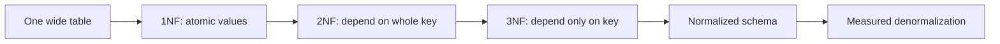
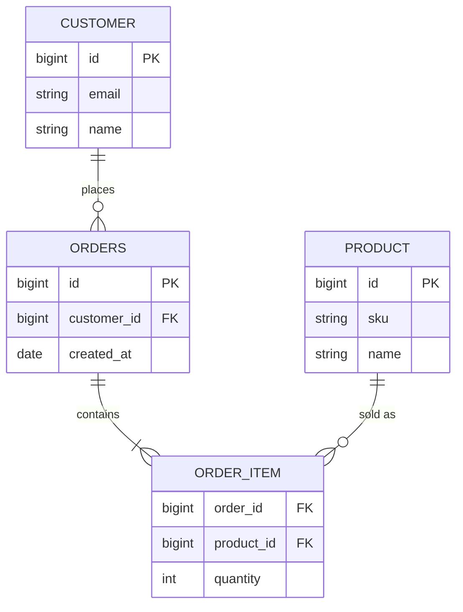

# Database Normalization and Denormalization

**Normalization** is the process of designing tables so each fact has one clear
home, and other tables refer to that fact by keys. Think of a kitchen where flour,
sugar and salt each live in one labeled container; recipes point to the container
instead of copying the ingredient into every recipe card.

**Denormalization** is the deliberate decision to store some data redundantly, or
store precomputed results, after you understand the normalized model. Think of a
restaurant putting today's prepared portions on a service counter: orders are
faster, but the counter must be kept in sync with the pantry.

A **normal form** is a named level of rules for table design. Each normal form
limits which functional dependencies are allowed: if one set of columns determines
another column, that dependency must belong in the right table. A barcode
determining a product name is like a post office code determining one delivery
route; you keep that rule in one official place.

## Why normalization exists

Normalization reduces duplicated facts and prevents common data anomalies. If a
customer address is copied into every order row, changing the address is like
changing the same apartment number on twenty delivery slips: miss one slip and
your data disagrees with itself.

- **Update anomaly**: the same fact is stored in many rows and only some copies
  are changed. Real life: several notice boards show different opening hours.
- **Insert anomaly**: you cannot store one fact until an unrelated fact exists.
  Real life: a post office refuses to record a new street until someone ships a
  parcel there.
- **Delete anomaly**: deleting one row accidentally removes another fact. Real
  life: throwing away the last delivery receipt also loses the only copy of the
  customer's phone number.

A normalized order model usually separates customers, orders, order items and
products. The model uses more tables, but each fact has a stable shelf.

For many-to-many relationships, normalization often means using a junction table,
as in [Many-to-Many in SQL](topic:sql-many-to-many). This is like a cloakroom
ticket connecting one guest to one coat without writing every guest's details on
every coat hanger.

## Common normal forms

**1NF - First Normal Form** means columns hold atomic values for the model you
need to query, and the table has no repeating column groups like `phone1`,
`phone2`, `phone3`. Like a pantry inventory, each shelf label names one thing
instead of hiding a mixed shopping bag.

**2NF - Second Normal Form** matters when a table has a composite key. Every
non-key column must depend on the whole key, not only part of it. In an
`order_id, product_id` table, `quantity` depends on both columns, but `product_name`
depends only on `product_id`; it belongs with products. Like a delivery manifest,
the number of boxes belongs to the route plus parcel, while the parcel's catalog
name belongs in the catalog.

**3NF - Third Normal Form** says non-key columns should depend on the key, the
whole key and nothing but the key. If `customer_id` determines `city`, and `city`
determines `tax_rate`, then `tax_rate` should not be copied into every customer
row. Like an address book, you do not rewrite the city tax table on every contact
card.

**BCNF - Boyce-Codd Normal Form** is a stricter version of 3NF: every determinant
should be a candidate key. It matters in tricky schemas where multiple candidate
keys overlap. Like a warehouse, only an official shelf identifier should decide
where an item lives; informal labels should not secretly control placement.

## What denormalization changes

Denormalization moves in the other direction: it keeps a duplicated or derived
value because a specific read path is important. Examples include storing
`customer_name` on an invoice, keeping `order_total` on an order, or maintaining a
read model for a dashboard. It is like printing a daily route sheet for drivers:
they work faster, but someone must regenerate it when the master schedule changes.

The trade-off is not "normalization good, denormalization bad". The real trade-off
is **read simplicity versus write complexity**. Denormalized data can reduce joins
and speed up read-heavy screens, but writes must update every copy consistently.
This is where transaction guarantees such as [ACID](topic:acid-principles) matter:
if the pantry changes, every service counter copy needs the same update or a clear
repair process.

Before denormalizing, usually check query shape and [database indexes](topic:database-indexes).
An index can be like a library catalog: it helps you find the right shelf without
photocopying the whole book into the front desk. In high-concurrency databases,
concepts such as [MVCC](topic:mvcc) affect what readers see while writes happen,
but MVCC does not remove the need to keep denormalized copies correct.

## 60-second interview answer

> Normalization is the process of organizing relational tables so each fact is
> stored in the right place, usually by splitting data into related tables and
> using keys. A normal form is a named rule set for that design: 1NF requires
> atomic values, 2NF removes partial dependency on a composite key, and 3NF removes
> transitive dependency between non-key columns. This reduces duplication and
> insert, update and delete anomalies. Denormalization is the intentional
> reintroduction of redundancy, such as copied fields, cached totals or read
> models, usually to make reads faster or simpler. It can be valid, but it adds
> write complexity, storage cost and consistency risk, so I would do it after
> measuring and after considering indexes or query changes.

## Production relevance

In OLTP systems, normalized schemas are a strong default because they protect the
source of truth. A payments or orders database should not behave like a messy
checkout counter where the same price tag is handwritten in five places.

In reporting, search and read-heavy APIs, denormalized projections can be useful.
A dashboard can keep totals ready like a station display keeps train departures
visible, instead of making every passenger ask the dispatcher each time.

The practical design is often mixed: keep the write model normalized, then build
controlled denormalized read models where measurements show a real need. This is
like running a tidy kitchen plus a prepared serving line, with clear rules for
when food moves from one to the other.

## Common misconceptions

- **"Normalization means more tables are always better."** No. Tables should
  represent real entities and dependencies, not arbitrary splitting. A kitchen
  with one spoon per drawer is organized poorly, even though it has many drawers.
- **"Denormalization means the schema is bad."** No. It can be a deliberate
  optimization when the read path is known and consistency is managed. A printed
  delivery route is useful as long as it is refreshed from the official schedule.
- **"3NF automatically gives the best performance."** No. It gives cleaner data
  dependencies, not free speed. A perfectly organized pantry can still need a
  good index card to find ingredients quickly.
- **"Foreign keys alone mean the database is normalized."** No. Foreign keys
  enforce references, but normal forms are about dependencies between columns. A
  post office can verify addresses and still duplicate the same route rule on
  every envelope.
- **"A list or JSON column always violates 1NF."** Not always. If the value is
  stored and used as one opaque document, it can be acceptable; if you need to
  filter and join individual items, model them as rows. A sealed lunchbox is fine
  as one item until the kitchen needs to count every sandwich inside it.
