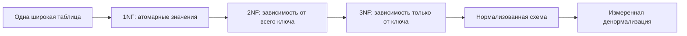
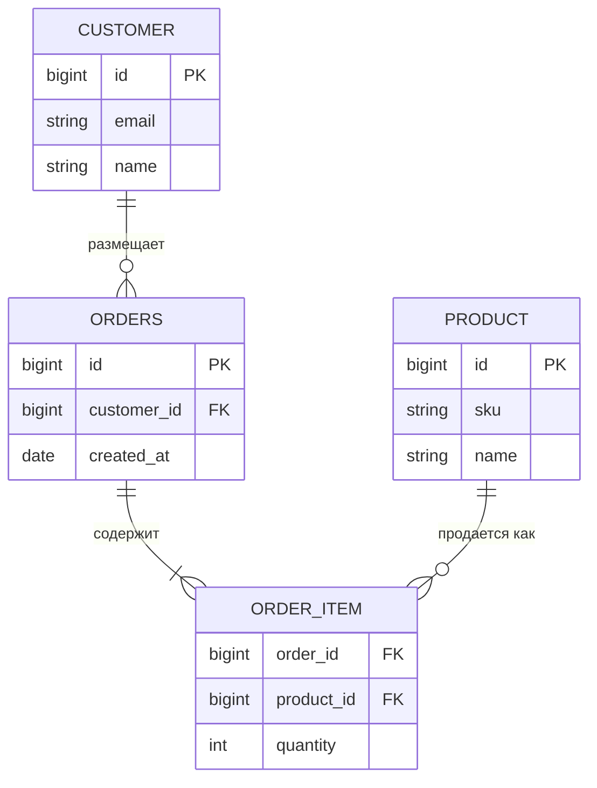

# Нормализация и денормализация базы данных

**Нормализация** - это процесс проектирования таблиц так, чтобы у каждого факта
было одно понятное место, а другие таблицы ссылались на этот факт по ключам.
Представь кухню, где мука, сахар и соль лежат в отдельных подписанных контейнерах:
рецепты ссылаются на контейнер, а не переписывают ингредиент на каждой карточке.

**Денормализация** - это осознанное решение хранить часть данных избыточно или
хранить заранее посчитанные результаты после того, как понятна нормализованная
модель. Представь ресторан, который выкладывает подготовленные порции на линию
выдачи: заказы собираются быстрее, но линию нужно синхронизировать с кладовой.

**Нормальная форма** - это именованный уровень правил для проектирования таблиц.
Каждая нормальная форма ограничивает, какие функциональные зависимости допустимы:
если один набор колонок определяет другую колонку, эта зависимость должна жить в
правильной таблице. Штрихкод, определяющий название товара, похож на почтовый
индекс, определяющий один маршрут доставки: правило держат в одном официальном
месте.

## Зачем нужна нормализация

Нормализация уменьшает дублирование фактов и предотвращает типичные аномалии
данных. Если адрес клиента скопирован в каждую строку заказа, его изменение
похоже на исправление одного номера квартиры на двадцати доставочных бланках:
пропустишь один бланк, и данные начнут противоречить сами себе.

- **Аномалия обновления**: один и тот же факт хранится во многих строках, а
  изменили только часть копий. Из жизни: несколько досок объявлений показывают
  разные часы работы.
- **Аномалия вставки**: нельзя сохранить один факт, пока не существует другой,
  не связанный с ним факт. Из жизни: почта отказывается записать новую улицу,
  пока туда не отправили посылку.
- **Аномалия удаления**: удаление одной строки случайно удаляет другой факт. Из
  жизни: выбросили последний чек доставки и потеряли единственную копию телефона
  клиента.

Нормализованная модель заказов обычно разделяет клиентов, заказы, позиции заказа
и товары. Таблиц становится больше, зато у каждого факта есть стабильная полка.

Для связей многие-ко-многим нормализация часто означает отдельную таблицу-связку,
как в теме [Many-to-Many in SQL](topic:sql-many-to-many). Это похоже на номерок в
гардеробе, который связывает одного гостя с одним пальто, не переписывая данные
гостя на каждую вешалку.

## Распространенные нормальные формы

**1NF - первая нормальная форма** означает, что колонки содержат атомарные
значения для той модели, по которой нужно делать запросы, и в таблице нет
повторяющихся групп колонок вроде `phone1`, `phone2`, `phone3`. Как в учете
кладовой: каждая подпись на полке называет одну вещь, а не прячет смешанный пакет
покупок.

**2NF - вторая нормальная форма** важна, когда у таблицы составной ключ. Каждая
неключевая колонка должна зависеть от всего ключа, а не только от его части. В
таблице `order_id, product_id` поле `quantity` зависит от обеих колонок, а
`product_name` зависит только от `product_id`; ему место у товаров. Как в
маршрутном листе доставки: количество коробок относится к маршруту плюс посылке,
а название товара из каталога должно лежать в каталоге.

**3NF - третья нормальная форма** говорит, что неключевые колонки должны зависеть
от ключа, всего ключа и ни от чего кроме ключа. Если `customer_id` определяет
`city`, а `city` определяет `tax_rate`, то `tax_rate` не стоит копировать в каждую
строку клиента. Как в адресной книге: таблицу городских налогов не переписывают
на каждой карточке контакта.

**BCNF - нормальная форма Бойса-Кодда** - более строгий вариант 3NF: каждый
детерминант должен быть кандидатным ключом. Она важна в сложных схемах, где
несколько кандидатных ключей пересекаются. Как на складе: только официальный
идентификатор полки должен решать, где лежит товар; неформальные ярлыки не должны
тайно управлять размещением.

## Что меняет денормализация

Денормализация движется в обратную сторону: она оставляет дублированное или
вычисленное значение, потому что важен конкретный сценарий чтения. Примеры:
хранить `customer_name` в счете, держать `order_total` в заказе или поддерживать
read model для дашборда. Это похоже на распечатанный дневной маршрут для
водителей: им быстрее работать, но кто-то должен пересоздать маршрут, когда
главное расписание изменится.

Компромисс не в том, что "нормализация хорошая, денормализация плохая". Настоящий
компромисс - это **простота чтения против сложности записи**. Денормализованные
данные могут уменьшить число JOIN и ускорить экраны с частым чтением, но записи
должны согласованно обновлять каждую копию. Здесь важны транзакционные гарантии
вроде [ACID](topic:acid-principles): если кладовая изменилась, каждая копия на
линии выдачи должна получить то же обновление или понятный процесс исправления.

Перед денормализацией обычно стоит проверить форму запросов и [индексы базы
данных](topic:database-indexes). Индекс похож на библиотечный каталог: он помогает
найти нужную полку без того, чтобы копировать всю книгу на стойку выдачи. В
высоконагруженных конкурентных базах такие концепции, как [MVCC](topic:mvcc),
влияют на то, что видят читатели во время записей, но MVCC не отменяет обязанность
держать денормализованные копии корректными.

## Ответ на собеседовании за 60 секунд

> Нормализация - это процесс организации реляционных таблиц так, чтобы каждый
> факт хранился в правильном месте, обычно через разбиение данных на связанные
> таблицы и использование ключей. Нормальная форма - это именованный набор правил
> для такого дизайна: 1NF требует атомарных значений, 2NF убирает частичную
> зависимость от составного ключа, а 3NF убирает транзитивную зависимость между
> неключевыми колонками. Это уменьшает дублирование и аномалии вставки,
> обновления и удаления. Денормализация - это осознанное возвращение
> избыточности, например скопированных полей, кэшированных итогов или read model,
> обычно ради более быстрых или простых чтений. Она может быть оправдана, но
> добавляет сложность записи, стоимость хранения и риск рассогласования, поэтому
> я бы делал ее после измерений и после проверки индексов или изменения запросов.

## Значение в production

В OLTP-системах нормализованные схемы - сильный вариант по умолчанию, потому что
они защищают источник истины. База платежей или заказов не должна вести себя как
неаккуратная касса, где один и тот же ценник от руки записан в пяти местах.

В отчетности, поиске и API с частым чтением денормализованные проекции могут быть
полезны. Дашборд может держать итоги готовыми, как табло на станции показывает
отправления поездов, вместо того чтобы каждый пассажир каждый раз спрашивал
диспетчера.

Практический дизайн часто смешанный: модель записи держат нормализованной, а
контролируемые денормализованные модели чтения строят там, где измерения показали
реальную необходимость. Это похоже на аккуратную кухню плюс подготовленную линию
выдачи с понятными правилами, когда еда переходит из одной зоны в другую.

## Частые заблуждения

- **"Нормализация означает, что чем больше таблиц, тем лучше."** Нет. Таблицы
  должны отражать реальные сущности и зависимости, а не произвольное дробление.
  Кухня с одной ложкой в каждом ящике организована плохо, хотя ящиков много.
- **"Денормализация означает плохую схему."** Нет. Это может быть осознанная
  оптимизация, когда сценарий чтения известен, а согласованность управляется.
  Распечатанный маршрут доставки полезен, пока он обновляется из официального
  расписания.
- **"3NF автоматически дает лучшую производительность."** Нет. Она дает более
  чистые зависимости данных, а не бесплатную скорость. Даже идеально
  организованной кладовой может понадобиться хорошая карточка-указатель, чтобы
  быстро найти ингредиенты.
- **"Одних foreign key достаточно, чтобы база была нормализована."** Нет. Foreign
  key проверяют ссылки, а нормальные формы описывают зависимости между колонками.
  Почта может проверять адреса и все равно дублировать одно и то же правило
  маршрута на каждом конверте.
- **"Список или JSON-колонка всегда нарушает 1NF."** Не всегда. Если значение
  хранится и используется как один непрозрачный документ, это может быть
  допустимо; если нужно фильтровать и соединять отдельные элементы, моделируй их
  строками. Запечатанный ланчбокс нормален как один предмет, пока кухне не нужно
  считать каждый бутерброд внутри.
