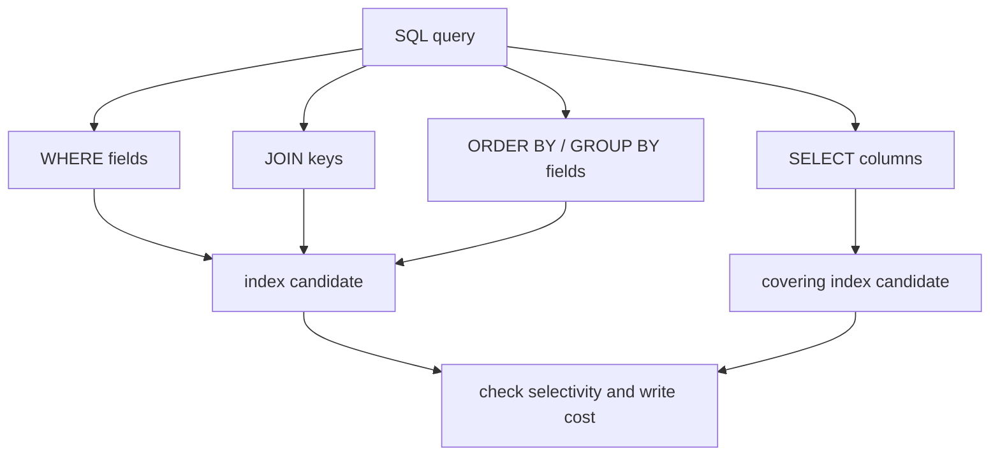
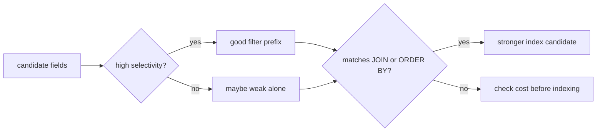

# Fields That Matter in Database Queries

When an interviewer asks, "Which fields are important for queries?", they are usually checking whether you can look at a SQL query like an engineer, not like a text search. The important fields are the ones that decide which rows are found, how tables are connected, how the result is ordered or grouped, and whether the database can answer without extra table reads.

Think of a busy post office. The clerk does not start by admiring every sentence on every parcel label. They first check the fields that route the parcel: city, street, postal code, and recipient. A database does the same with query fields.

## The Main Fields To Inspect

1. **Filtering columns: `WHERE`**

   These columns decide which rows are candidates. If a query says `WHERE status = 'PAID' AND created_at >= ?`, then `status` and `created_at` are immediately interesting. They often drive index choice, but their usefulness depends on selectivity: filtering by one rare order is different from filtering by a boolean flag that matches half the table.

   Post office analogy: `WHERE` is the first sorting bin. A bin for one exact apartment is useful; a bin labeled "has paper inside" is too broad.

2. **Join columns: `JOIN ... ON`**

   Join fields connect rows between tables, such as `orders.customer_id = customers.id`. These are usually foreign keys and primary keys. A missing or weak index on the join side can turn one request into many table scans.

   Kitchen analogy: join keys are matching order tickets between the waiter and the cook. If tickets are not numbered clearly, everyone walks around asking who ordered what.

3. **Sorting and grouping columns: `ORDER BY`, `GROUP BY`, `DISTINCT`**

   These fields decide whether the database can reuse index order or must sort/hash intermediate rows. `ORDER BY created_at DESC` and `GROUP BY customer_id` may need different index shapes from a simple filter.

   Traffic analogy: sorting is like arranging cars into one lane by exit number. If the cars already arrive in that order, traffic moves; otherwise someone must stop everything and rearrange them.

4. **Projected columns: `SELECT`**

   The selected columns do not usually help find rows, but they decide how much data is read and whether a covering index is possible. `SELECT *` can force extra table reads and move unnecessary data through the network.

   Warehouse analogy: after finding the shelf, taking one small box is cheaper than loading the whole shelf onto a cart.

5. **Key columns and constraints**

   Primary keys, foreign keys, unique constraints, and not-null constraints tell the optimizer about row relationships. They also tell you what assumptions are safe in application code.

   Kitchen analogy: a unique order number prevents two dishes from sharing the same ticket. Without it, the staff must guess.

6. **Data distribution: cardinality, selectivity, and NULLs**

   A field with many distinct values, such as `email`, is often more selective than a field with two values, such as `is_active`. `NULL` also changes predicates: `= NULL` is wrong SQL; you need `IS NULL`, and indexes may behave differently depending on the database.

   Library analogy: a catalog drawer for exact book ISBNs is precise. A drawer for "red cover" is crowded and less helpful.

7. **Write frequency and update cost**

   Fields that change often are expensive to index because every `INSERT`, `UPDATE`, or `DELETE` must maintain the index. A good query discussion balances read speed against write cost.

   Post office analogy: adding a special sorting card for every tiny label helps lookups, but every incoming parcel now takes longer to file.

## 60-Second Interview Answer

For a database query I first inspect the fields used in `WHERE`, because they filter rows, and the fields used in `JOIN ... ON`, because they connect tables. Then I check `ORDER BY`, `GROUP BY`, and `DISTINCT`, because they may require sorted or grouped access. After that I look at the `SELECT` list: it affects how much data is read and whether a covering index can satisfy the query. I also check primary keys, foreign keys, uniqueness, nullability, data types, cardinality/selectivity, and how often those fields are updated. The goal is not "index every field"; the goal is to understand which fields reduce work for this query and whether the read benefit is worth the write and storage cost.

Short analogy: in a post office, you first care about the label parts that route the parcel, then about how parcels are grouped for delivery, then about how much cargo the courier must carry.

## How This Relates To Indexes

This question often leads directly to [Database Indexes](topic:database-indexes). Indexes are useful when they match the access pattern: equality filters, range filters, joins, sort order, and sometimes projected columns. For clustered storage, the physical row order can matter too; that is why [clustered vs non-clustered indexes](topic:clustered-vs-nonclustered-indexes) is a related follow-up.

Composite indexes are especially sensitive to column order. A common beginner answer is "add an index on every column in the query." A better answer is "build an index around the most useful prefix for filtering, joining, and ordering." Like a kitchen prep line, putting the most-used ingredients nearest the cook saves movement; putting every ingredient on the counter creates clutter.

## Production Relevance

In production, slow queries usually come from one of three places: reading too many rows, combining tables inefficiently, or sorting/grouping too much data. The fields above tell you where to look first. They also help you have a precise conversation with a DBA or teammate: "the query filters by `tenant_id` and `created_at`, joins by `customer_id`, orders by `created_at DESC`, and returns five columns."

This is also connected to transaction behavior. In systems with [MVCC](topic:mvcc), each query may see a snapshot, and indexes still need to point to visible row versions. For isolation-level questions, [PostgreSQL Transaction Isolation Levels](topic:postgresql-isolation-levels) is the deeper topic. The field-level query analysis stays the same, but the database may need extra work to decide which row versions are visible.

Real-world analogy: traffic planning is easier when you know which streets people enter from, where they merge, and which exits they need. Counting all roads equally produces a bad plan.

## Common Misconceptions

- **"Only `SELECT` fields matter."** Not enough. `SELECT` controls what is returned, but `WHERE` and `JOIN` usually control how much work is needed to find rows.
- **"Every queried field needs an index."** Indexes cost storage and slow writes. A low-selectivity column may be useless by itself.
- **"`ORDER BY` is just presentation."** It can be a major cost if the database must sort many rows.
- **"`NULL` behaves like a normal value."** SQL uses three-valued logic. `col = NULL` does not match rows; use `IS NULL`.
- **"Column order in a composite index does not matter."** It matters because the database can only use the index efficiently according to its ordered key prefix.
- **"Foreign keys are automatically indexed everywhere."** Some databases create supporting indexes in some cases, but you should verify the actual schema and plan.

Interview memory hook: first route the parcel (`WHERE`), match it to the right truck (`JOIN`), arrange delivery order (`ORDER BY`/`GROUP BY`), then decide how much cargo to carry (`SELECT`).
