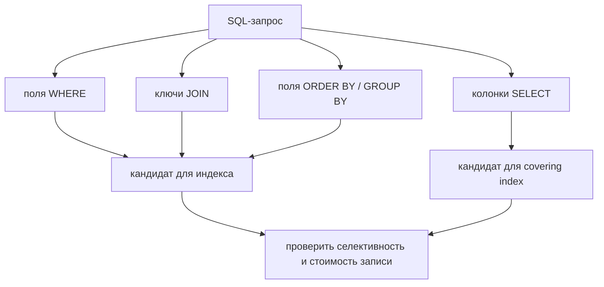
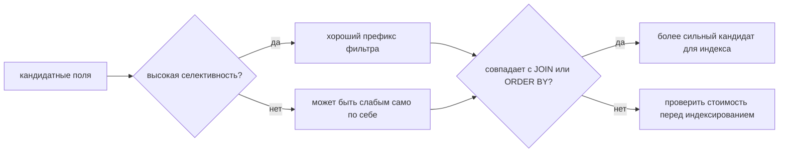

# Поля, важные для запросов к базе данных

Когда на собеседовании спрашивают: «Какие поля важны при запросах?», обычно проверяют, умеешь ли ты смотреть на SQL-запрос инженерно, а не как на обычный текст. Важны поля, которые решают, какие строки будут найдены, как таблицы соединяются, как результат сортируется или группируется, и сможет ли база ответить без лишних чтений таблицы.

Представь загруженное почтовое отделение. Сотрудник не начинает с чтения каждой фразы на наклейке посылки. Сначала он смотрит на поля, которые направляют посылку: город, улицу, индекс и получателя. База данных делает то же самое с полями запроса.

## Основные поля, на которые нужно смотреть

1. **Колонки фильтрации: `WHERE`**

   Эти колонки решают, какие строки станут кандидатами. Если запрос содержит `WHERE status = 'PAID' AND created_at >= ?`, то `status` и `created_at` сразу важны. Они часто определяют выбор индекса, но их полезность зависит от селективности: фильтр по одному редкому заказу отличается от фильтра по boolean-флагу, который совпадает с половиной таблицы.

   Аналогия с почтой: `WHERE` - это первый сортировочный ящик. Ящик для одной точной квартиры полезен; ящик с надписью «внутри есть бумага» слишком широкий.

2. **Колонки соединения: `JOIN ... ON`**

   Поля JOIN связывают строки между таблицами, например `orders.customer_id = customers.id`. Обычно это foreign key и primary key. Отсутствующий или слабый индекс на стороне соединения может превратить один запрос во множество сканов таблицы.

   Аналогия с кухней: ключи JOIN - это совпадающие номера заказов у официанта и повара. Если номера не видны, все ходят и спрашивают, кто что заказал.

3. **Колонки сортировки и группировки: `ORDER BY`, `GROUP BY`, `DISTINCT`**

   Эти поля решают, сможет ли база использовать порядок индекса или ей придется сортировать либо хешировать промежуточные строки. `ORDER BY created_at DESC` и `GROUP BY customer_id` могут требовать другой формы индекса, чем простой фильтр.

   Аналогия с дорогой: сортировка похожа на расстановку машин в одну полосу по номеру съезда. Если машины уже приехали в нужном порядке, движение идет; иначе нужно всех остановить и переставить.

4. **Выбираемые колонки: `SELECT`**

   Выбираемые колонки обычно не помогают найти строки, но определяют, сколько данных нужно прочитать и возможен ли covering index. `SELECT *` может заставить базу читать лишние данные из таблицы и передавать их по сети.

   Аналогия со складом: после нахождения нужной полки взять одну маленькую коробку дешевле, чем грузить всю полку на тележку.

5. **Ключевые колонки и ограничения**

   Primary key, foreign key, unique constraints и not-null constraints говорят оптимизатору о связях между строками. Они также подсказывают, какие предположения безопасны в коде приложения.

   Аналогия с кухней: уникальный номер заказа не дает двум блюдам оказаться на одном билете. Без него персоналу приходится угадывать.

6. **Распределение данных: кардинальность, селективность и NULL**

   Поле с большим числом разных значений, например `email`, часто селективнее поля с двумя значениями, например `is_active`. `NULL` тоже меняет предикаты: `= NULL` - неверный SQL; нужен `IS NULL`, а индексы могут вести себя по-разному в зависимости от базы.

   Аналогия с библиотекой: картотека по точному ISBN очень точная. Ящик «красная обложка» переполнен и помогает хуже.

7. **Частота записи и стоимость обновлений**

   Поля, которые часто меняются, дорого индексировать, потому что каждый `INSERT`, `UPDATE` или `DELETE` должен поддерживать индекс. Хороший разбор запроса балансирует скорость чтения со стоимостью записи.

   Аналогия с почтой: отдельная сортировочная карточка для каждой мелкой наклейки помогает поиску, но теперь каждую входящую посылку дольше раскладывать.

## Ответ за 60 секунд

В запросе к базе данных я сначала смотрю на поля из `WHERE`, потому что они фильтруют строки, и на поля из `JOIN ... ON`, потому что они связывают таблицы. Затем проверяю `ORDER BY`, `GROUP BY` и `DISTINCT`, потому что они могут требовать сортированного или сгруппированного доступа. После этого смотрю на список `SELECT`: он влияет на объем чтения и на то, может ли covering index полностью обслужить запрос. Также важны primary key, foreign key, уникальность, nullability, типы данных, кардинальность/селективность и то, как часто эти поля обновляются. Цель не в том, чтобы «индексировать каждое поле», а в том, чтобы понять, какие поля уменьшают работу именно этого запроса и стоит ли выигрыш в чтении затрат на запись и хранение.

Короткая аналогия: в почтовом отделении сначала важны части наклейки, которые направляют посылку, затем то, как посылки группируются для доставки, и только потом - сколько груза понесет курьер.

## Как это связано с индексами

Этот вопрос часто напрямую ведет к теме [индексов в базе данных](topic:database-indexes). Индексы полезны, когда совпадают с паттерном доступа: фильтры по равенству, диапазоны, JOIN, порядок сортировки и иногда выбираемые колонки. Для кластеризованного хранения физический порядок строк тоже может быть важен, поэтому [clustered vs non-clustered indexes](topic:clustered-vs-nonclustered-indexes) - связанный следующий вопрос.

Составные индексы особенно чувствительны к порядку колонок. Частый ответ новичка: «добавить индекс на каждую колонку в запросе». Лучший ответ: «построить индекс вокруг самого полезного префикса для фильтрации, соединения и сортировки». Как на кухонной линии заготовок: самые нужные ингредиенты рядом с поваром экономят движения; если выложить на стол вообще все, получится беспорядок.

## Зачем это нужно в production

В production медленные запросы обычно появляются из трех мест: читается слишком много строк, таблицы соединяются неэффективно, или сортируется/группируется слишком большой объем данных. Поля выше показывают, куда смотреть сначала. Они также помогают точнее разговаривать с DBA или teammate: «запрос фильтрует по `tenant_id` и `created_at`, соединяется по `customer_id`, сортирует по `created_at DESC` и возвращает пять колонок».

Это связано и с поведением транзакций. В системах с [MVCC](topic:mvcc) каждый запрос может видеть snapshot, а индексы все равно должны указывать на видимые версии строк. Для вопросов про уровни изоляции глубже подходит тема [PostgreSQL Transaction Isolation Levels](topic:postgresql-isolation-levels). Анализ полей запроса остается тем же, но базе может понадобиться дополнительная работа, чтобы понять, какие версии строк видимы.

Жизненная аналогия: планировать движение проще, когда знаешь, с каких улиц люди въезжают, где они перестраиваются и какие съезды им нужны. Считать все дороги одинаковыми - плохой план.

## Частые заблуждения

- **«Важны только поля из `SELECT`».** Недостаточно. `SELECT` управляет тем, что возвращается, но `WHERE` и `JOIN` обычно управляют тем, сколько работы нужно для поиска строк.
- **«Каждому полю из запроса нужен индекс».** Индексы занимают место и замедляют запись. Колонка с низкой селективностью сама по себе может быть бесполезной.
- **«`ORDER BY` - это просто отображение».** Это может быть большая стоимость, если базе нужно сортировать много строк.
- **«`NULL` ведет себя как обычное значение».** SQL использует трехзначную логику. `col = NULL` не находит строки; нужен `IS NULL`.
- **«Порядок колонок в составном индексе не важен».** Он важен, потому что база эффективно использует индекс по его упорядоченному ключевому префиксу.
- **«Foreign key везде индексируются автоматически».** Некоторые базы в отдельных случаях создают поддерживающие индексы, но фактическую схему и план нужно проверять.

Запоминалка для собеседования: сначала направь посылку (`WHERE`), сопоставь ее с нужной машиной (`JOIN`), расставь порядок доставки (`ORDER BY`/`GROUP BY`), затем реши, сколько груза нести (`SELECT`).
