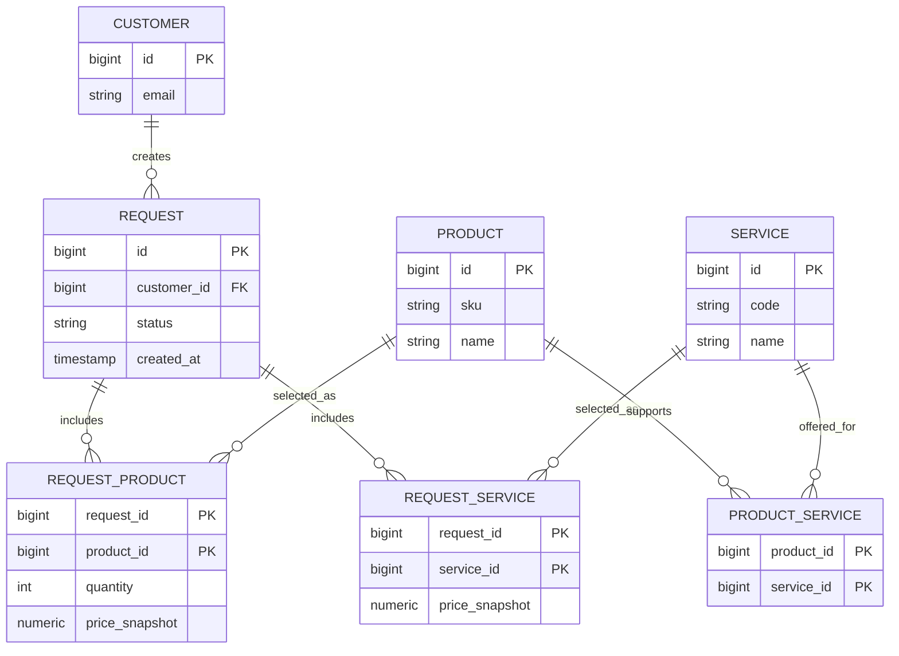
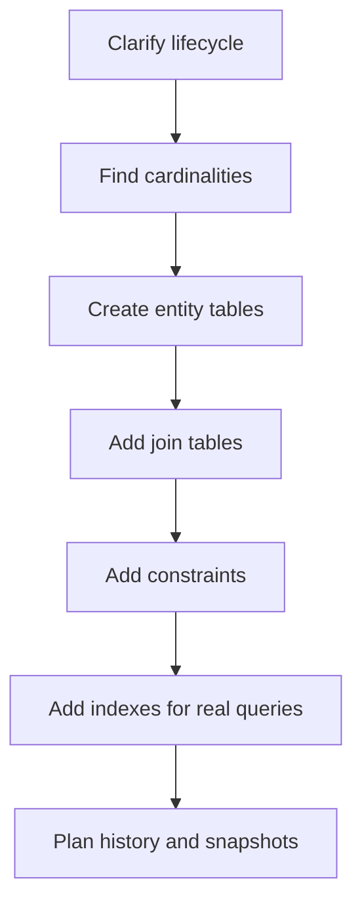

# Request, Product and Service Database Design

The interview question is not about naming three tables and stopping there. It is about showing how you discover the business rules and turn them into a schema that stays correct when the system grows. Think of a post office: before you arrange shelves and labels, you ask what kind of parcels arrive, who owns them, and how they move through the building.

## The mental model

A good first answer is: "I would start with the lifecycle and cardinalities." A request is usually a transactional record: somebody creates it, it has a status, dates, and a history. Product and Service are usually reference data: reusable definitions that many requests can point to. In kitchen terms, the request is today's order ticket, while Product and Service are items from the menu.

The most important question is cardinality:

- Can one request contain many products?
- Can one request contain many services?
- Can the same product or service appear in many requests?
- Is a service attached to a product, independent, or both?

If the answer is "many on both sides", do not put `product_id` and `service_id` directly into `request`. Use join tables. That is the same idea as a post office manifest: one parcel can have many stamps, and one stamp type can be used on many parcels, so you keep a separate line list instead of writing every stamp into the parcel row. This is the same modeling move as [many-to-many in SQL](topic:sql-many-to-many).

## A practical schema

Start with these tables and adjust after business rules are clear:

- `customers` or `users`: who created the request. This is the sender window in a post office: every parcel needs a known owner or contact.
- `requests`: the transactional header: `id`, `customer_id`, `status`, `created_at`, `updated_at`, maybe `priority` and `comment`. This is the order ticket clipped above the kitchen counter.
- `products`: stable product catalog: `id`, `sku`, `name`, `active`, maybe category fields. This is the pantry list, not a single customer order.
- `services`: stable service catalog: `id`, `code`, `name`, `active`, maybe SLA or duration. This is the service menu hanging near the counter.
- `request_products`: rows that connect a request to products, with fields that belong to the selection: `quantity`, `price_snapshot`, `comment`. This is the line item on the ticket.
- `request_services`: rows that connect a request to services, with selected options and snapshot fields. This is another line item list, but for work to perform.
- `product_services`: optional compatibility table when only certain services are allowed for certain products. This is like a traffic sign that says which lanes can turn where.
- `request_status_history`: optional but useful when audit matters: `request_id`, `old_status`, `new_status`, `changed_at`, `changed_by`. This is the post office tracking tape.

This shape follows [database normalization](topic:database-normalization): facts live in one place, and relationships are explicit. The analogy is a kitchen with separate menu cards and order tickets; if the menu price changes tomorrow, yesterday's order ticket should still show what the customer agreed to.

## Design process

Clarify lifecycle first: created, approved, fulfilled, cancelled, archived. This is the traffic route for the request; without it, you do not know which intersections need signs.

Then define cardinalities and ownership. If deleting a product should not delete old requests, the request lines must preserve snapshots. If a service belongs to a product only in some cases, model that as `product_services` instead of hiding rules in application code. In kitchen terms, the recipe book can change, but a paid receipt must not rewrite itself.

Finally add constraints:

- Primary keys on every table.
- Foreign keys from lines to headers and catalogs.
- Unique keys such as `products.sku` and `services.code`.
- `NOT NULL` for mandatory fields.
- `CHECK` constraints for statuses or positive quantities where the database supports it.
- Composite primary keys or unique constraints on join tables, for example `(request_id, product_id)`.

Constraints are the labels and locks in a warehouse: they stop invalid boxes from being put on the wrong shelf. They do not replace application validation, but they protect data when another code path writes to the same database.

## Indexes and queries

Design indexes from the queries, not from table names. Common starting indexes are:

- `requests(customer_id, created_at)` for a customer's request history.
- `requests(status, created_at)` for back-office queues.
- `request_products(product_id, request_id)` to find requests involving a product.
- `request_services(service_id, request_id)` to find requests involving a service.
- unique indexes on `products.sku` and `services.code`.

This matches the approach in [database indexes](topic:database-indexes), [query fields](topic:database-query-fields), and [index selection for query optimization](topic:indexes-for-query-optimization). The everyday analogy: do not label every kitchen drawer with every possible word; label the drawers people actually search during rush hour.

## 60-second interview answer

"I would first clarify the lifecycle of a request and the cardinalities: can a request contain multiple products and services, can products and services be reused, and whether services depend on products. A typical normalized schema has `requests` as the transactional header, `products` and `services` as catalog tables, and join tables like `request_products` and `request_services` for many-to-many relationships. If services are only valid for certain products, I would add `product_services`. I would use primary keys, foreign keys, unique codes, `NOT NULL` and `CHECK` constraints, plus indexes based on real queries such as requests by customer, by status, by product, and by service. For production, I would store snapshots such as selected price or service terms in request line tables, because catalog rows can change later. Creating the request and its lines should happen in one transaction, following [ACID](topic:acid-principles), so the database never stores a half-created request."

## Production relevance

Production schemas need to survive change. Product names, prices, service SLAs, and availability change over time. If old requests must remain legally or operationally accurate, store snapshots in the request line tables and keep audit history. This is like a restaurant receipt: the menu can change tomorrow, but yesterday's receipt remains evidence of what was ordered.

Writes should use a clear transaction boundary: insert request header, insert product lines, insert service lines, validate compatibility, and record the first status history row together. If one part fails, roll everything back. That is the database version of sending a parcel only after the label, payment, and tracking number are all ready.

For large systems, consider soft deletion or `active` flags for catalogs, tenant ownership if the system is multi-tenant, optimistic locking for concurrent edits, and partitioning or archiving for very large request history. These are traffic-management tools: you add lanes and signs where congestion actually appears, not everywhere on day one.

## Common misconceptions

- "Three entities means three tables." Usually false. Many-to-many relationships and history often require link and audit tables. A kitchen does not store the whole menu inside every order ticket.
- "`request.product_id` and `request.service_id` are enough." Only if every request has at most one product and one service. Otherwise nullable foreign keys become a messy shelf where unrelated boxes share one label.
- "A product-service relation can always live in code." If the rule matters for data integrity and reporting, the database should know it. A traffic rule painted only in one driver's notebook will be missed by other drivers.
- "Indexes should be added to every foreign key automatically." Foreign-key indexes are often useful, but query shape matters. Too many indexes slow writes, like adding too many checkpoints to a delivery route.
- "Catalog changes can update old requests." Often dangerous. Old requests need snapshots when price, terms, or names are part of the historical truth. A receipt should not change because the menu changed.
- "Normalization means no duplication ever." Normalization removes uncontrolled duplication; controlled snapshots are intentional historical data. This is the difference between copying a menu by mistake and printing a receipt on purpose.
