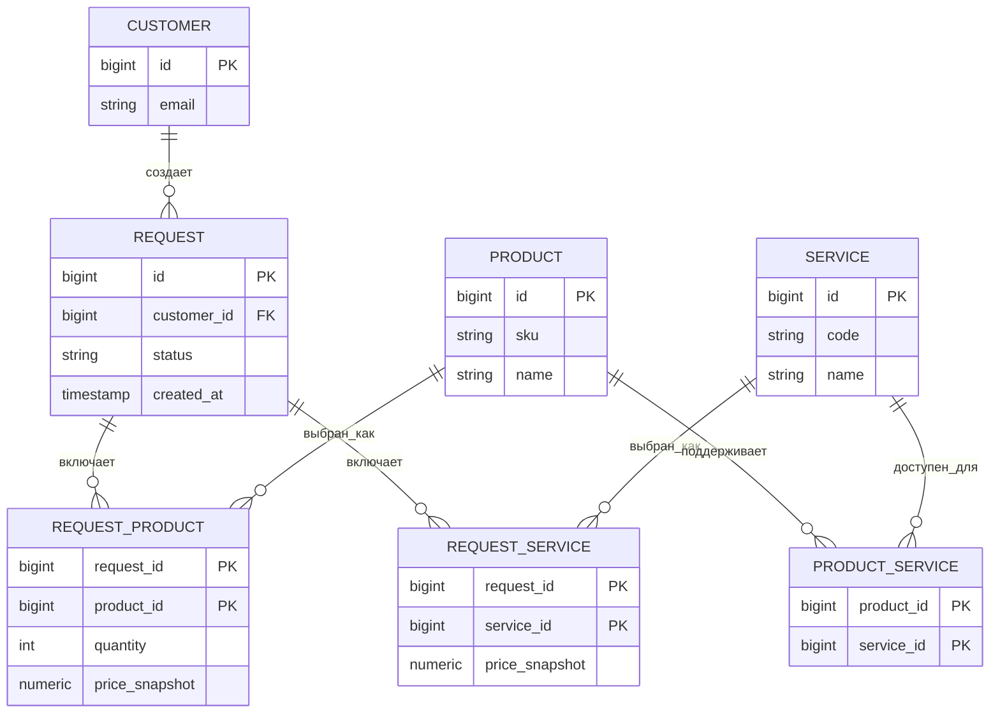
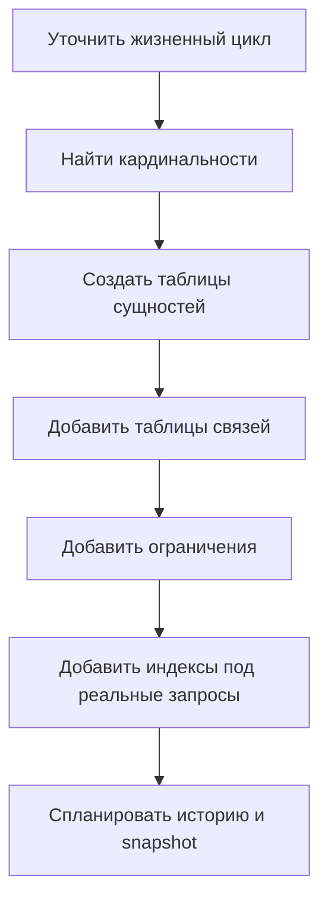

# Проектирование базы данных для заявок, продуктов и сервисов

Вопрос на собеседовании не про то, чтобы назвать три таблицы и остановиться. Он про то, как ты выясняешь бизнес-правила и превращаешь их в схему, которая остается корректной при росте системы. Представь почтовое отделение: прежде чем расставлять полки и ярлыки, нужно понять, какие посылки приходят, кому они принадлежат и как движутся по отделению.

## Ментальная модель

Хороший первый ответ: «Я начну с жизненного цикла и кардинальностей». Заявка обычно является транзакционной записью: кто-то ее создает, у нее есть статус, даты и история. Product и Service обычно являются справочниками: переиспользуемыми описаниями, на которые могут ссылаться многие заявки. На кухне заявка похожа на сегодняшний чек-заказ, а Product и Service — на позиции меню.

Самый важный вопрос — кардинальность:

- Может ли одна заявка содержать много продуктов?
- Может ли одна заявка содержать много сервисов?
- Может ли один и тот же продукт или сервис встречаться во многих заявках?
- Сервис привязан к продукту, существует отдельно или возможны оба варианта?

Если ответ — «много с обеих сторон», не клади `product_id` и `service_id` прямо в `request`. Используй таблицы связей. Это похоже на манифест в почтовом отделении: у одной посылки может быть много марок, а один тип марки используется на многих посылках, поэтому список строк хранится отдельно, а не записывается прямо в строку посылки. Это тот же прием моделирования, что и в теме [many-to-many в SQL](topic:sql-many-to-many).

## Практичная схема

Начни с этих таблиц и уточняй их после прояснения бизнес-правил:

- `customers` или `users`: кто создал заявку. Это окно отправителя на почте: у каждой посылки должен быть понятный владелец или контакт.
- `requests`: транзакционный заголовок: `id`, `customer_id`, `status`, `created_at`, `updated_at`, возможно `priority` и `comment`. Это чек-заказ, закрепленный над кухонной стойкой.
- `products`: стабильный каталог продуктов: `id`, `sku`, `name`, `active`, возможно поля категории. Это список кладовой, а не конкретный заказ клиента.
- `services`: стабильный каталог сервисов: `id`, `code`, `name`, `active`, возможно SLA или длительность. Это меню услуг рядом со стойкой.
- `request_products`: строки, которые связывают заявку с продуктами, с полями выбранной позиции: `quantity`, `price_snapshot`, `comment`. Это строка в чеке.
- `request_services`: строки, которые связывают заявку с сервисами, с выбранными опциями и snapshot-полями. Это еще один список строк, но для работ, которые нужно выполнить.
- `product_services`: необязательная таблица совместимости, если только некоторые сервисы разрешены для некоторых продуктов. Это как дорожный знак, который показывает, из каких полос куда можно повернуть.
- `request_status_history`: необязательная, но полезная таблица, если важен аудит: `request_id`, `old_status`, `new_status`, `changed_at`, `changed_by`. Это трекинг-лента в почтовом отделении.

Такая форма следует [нормализации базы данных](topic:database-normalization): факты живут в одном месте, а связи выражены явно. Аналогия — кухня с отдельными карточками меню и чеками-заказами; если завтра цена в меню изменится, вчерашний чек все равно должен показывать то, на что согласился клиент.

## Процесс проектирования

Сначала уточни жизненный цикл: создана, одобрена, выполнена, отменена, архивирована. Это маршрут движения заявки; без него непонятно, на каких перекрестках нужны знаки.

Затем определи кардинальности и владение. Если удаление продукта не должно удалять старые заявки, строки заявки должны хранить snapshot-данные. Если сервис относится к продукту только в некоторых случаях, смоделируй это через `product_services`, а не прячь правила только в коде приложения. На кухне книга рецептов может измениться, но оплаченный чек не должен переписываться сам.

После этого добавь ограничения:

- Primary key в каждой таблице.
- Foreign key от строк к заголовкам и каталогам.
- Unique key для `products.sku` и `services.code`.
- `NOT NULL` для обязательных полей.
- `CHECK` для статусов или положительного количества, если база данных это поддерживает.
- Composite primary key или unique constraint в таблицах связей, например `(request_id, product_id)`.

Ограничения — это ярлыки и замки на складе: они не дают поставить неверную коробку на неправильную полку. Они не заменяют валидацию в приложении, но защищают данные, когда в ту же базу пишет другой путь кода.

## Индексы и запросы

Проектируй индексы от запросов, а не от названий таблиц. Частые стартовые индексы:

- `requests(customer_id, created_at)` для истории заявок клиента.
- `requests(status, created_at)` для очередей бэк-офиса.
- `request_products(product_id, request_id)` для поиска заявок с конкретным продуктом.
- `request_services(service_id, request_id)` для поиска заявок с конкретным сервисом.
- Unique index для `products.sku` и `services.code`.

Это соответствует подходу из тем [индексы базы данных](topic:database-indexes), [поля запроса](topic:database-query-fields) и [выбор индексов для оптимизации запросов](topic:indexes-for-query-optimization). Бытовая аналогия: не подписывай каждый кухонный ящик всеми возможными словами; подпиши те ящики, которые люди действительно ищут в час пик.

## Ответ за 60 секунд

«Сначала я уточню жизненный цикл заявки и кардинальности: может ли заявка содержать несколько продуктов и сервисов, переиспользуются ли продукты и сервисы и зависят ли сервисы от продуктов. Типичная нормализованная схема содержит `requests` как транзакционный заголовок, `products` и `services` как таблицы каталога и таблицы связей вроде `request_products` и `request_services` для many-to-many отношений. Если сервисы допустимы только для некоторых продуктов, я добавлю `product_services`. Я использую primary key, foreign key, уникальные коды, `NOT NULL` и `CHECK`, а также индексы под реальные запросы: заявки по клиенту, статусу, продукту и сервису. Для production я сохраню snapshot-данные, например выбранную цену или условия сервиса, в строках заявки, потому что строки каталога позже могут измениться. Создание заявки и ее строк нужно выполнять в одной транзакции по [ACID](topic:acid-principles), чтобы база никогда не хранила наполовину созданную заявку».

## Практическая значимость

Production-схемы должны переживать изменения. Названия продуктов, цены, SLA сервисов и доступность меняются со временем. Если старые заявки должны оставаться юридически или операционно точными, храни snapshot-данные в строках заявки и веди историю аудита. Это как ресторанный чек: меню завтра может измениться, но вчерашний чек остается доказательством того, что было заказано.

У записей должна быть четкая граница транзакции: вставить заголовок заявки, вставить строки продуктов, вставить строки сервисов, проверить совместимость и записать первую строку истории статуса вместе. Если одна часть падает, нужно откатить все. Это версия базы данных для правила: посылка отправляется только тогда, когда готовы ярлык, оплата и номер отслеживания.

Для крупных систем подумай о soft delete или флагах `active` в каталогах, владении tenant-ом для multi-tenant систем, optimistic locking при одновременном редактировании, а также partitioning или архивировании для очень большой истории заявок. Это инструменты управления движением: полосы и знаки добавляют там, где действительно появляется пробка, а не везде в первый день.

## Частые заблуждения

- «Три сущности — значит три таблицы». Обычно неверно. Many-to-many связи и история часто требуют таблиц связей и аудита. На кухне не хранят все меню внутри каждого чека-заказа.
- «`request.product_id` и `request.service_id` достаточно». Только если каждая заявка содержит максимум один продукт и один сервис. Иначе nullable foreign key превращаются в беспорядочную полку, где неродственные коробки лежат под одной этикеткой.
- «Связь product-service всегда можно хранить в коде». Если правило важно для целостности данных и отчетности, база данных должна о нем знать. Дорожное правило, записанное только в блокноте одного водителя, пропустят другие водители.
- «Индексы нужно автоматически добавлять на каждый foreign key». Индексы на foreign key часто полезны, но важна форма запросов. Слишком много индексов замедляет запись, как слишком много контрольных пунктов на маршруте доставки.
- «Изменения каталога могут обновлять старые заявки». Часто опасно. Старым заявкам нужны snapshot-данные, когда цена, условия или названия являются частью исторической правды. Чек не должен меняться из-за изменения меню.
- «Нормализация означает, что дублирования вообще быть не должно». Нормализация убирает неконтролируемое дублирование; контролируемые snapshot-данные являются намеренной исторической информацией. Это разница между случайной копией меню и напечатанным чеком.
