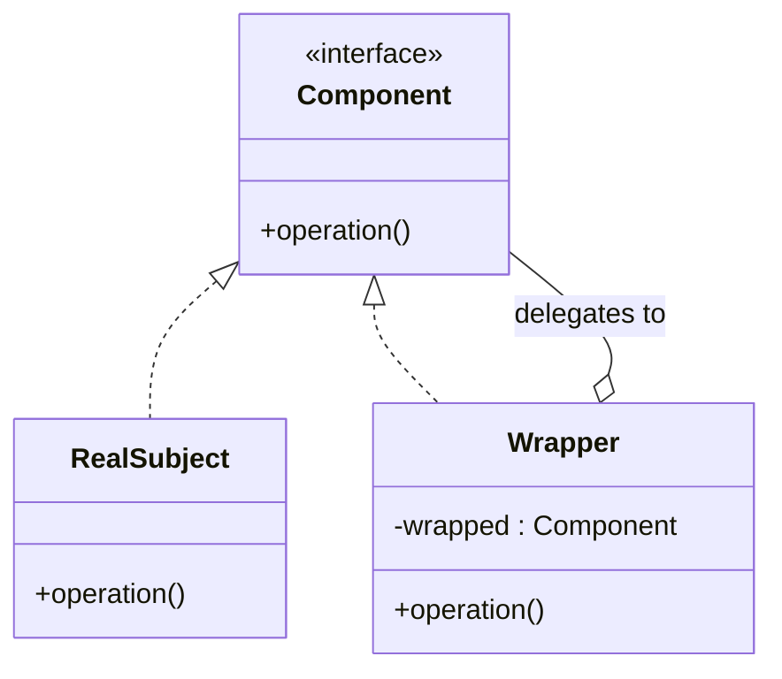

# Decorator vs Proxy

Both **Decorator** and **Proxy** are *structural* patterns, and on a class diagram
they are nearly twins: a wrapper class implements the same interface as the object
it holds, keeps a reference to it, and forwards calls to it. So you can't tell them
apart by their *shape* — only by their **intent**.

Real life: think of a parcel arriving at your door. A **Decorator** is the extra
bubble-wrap and gift paper added around the box — the parcel does more (it's now
padded and pretty), but it's still the same parcel. A **Proxy** is the building's
front-desk receptionist who decides whether the parcel even reaches you, signs for
it on your behalf, or holds it until you're home — the parcel is unchanged, but
*access* to it is controlled.

## The shared shape

Both `Decorator` and `Proxy` *are* this `Wrapper`. The client talks to the
`Component` interface and never has to know whether it's holding the real object, a
decorator, or a proxy. Real life: you order "a coffee" at the counter and don't care
whether a barista, a vending machine, or a stand-in handed it to you — the cup looks
the same from the outside.

## The difference that matters: intent

| | Decorator | Proxy |
|---|---|---|
| **Purpose** | *Add* behaviour to an object | *Control access* to an object |
| **Changes the result?** | Yes — augments what `operation()` does | No — same result, but guards *when/if/how* it runs |
| **Who supplies the wrapped object?** | The client builds it and passes it in | The proxy usually creates/finds the real subject itself |
| **How many wrappers?** | Stackable — wrap a wrapper a wrapper… | Usually a single stand-in |
| **Relationship known…** | At runtime — composed dynamically | At design time — fixed substitute |

A **Decorator** is like seasoning a dish: each layer adds flavour, and you can pile
on salt *and* pepper *and* sauce, tasting more with every layer. A **Proxy** is like
a bouncer at the club door: the music inside is exactly the same whether or not he's
there — he just decides who gets in, checks IDs, or makes you queue first.

### Decorators stack; proxies stand in

Because a Decorator wraps *another* `Component`, you compose a chain — each layer
adds one responsibility. This is the Decorator's signature move and is rare for a
Proxy.

Real life: a sandwich at the deli — bread, then cheese, then ham, then pickles. Each
hand adds one ingredient and passes it on, and the order is your choice. A Proxy,
by contrast, is the one locked display case in front of a single expensive watch:
there's just the one gatekeeper, and it's there to control access, not to add layers.

## Flavours of Proxy

The "control access" intent shows up in several classic Proxy variants — each
guards access for a different reason:

- **Virtual proxy** — delays creating an expensive object until it's first used
  (lazy loading). Real life: a museum's "image loading…" placeholder that fetches the
  full painting only when you click it.
- **Protection proxy** — checks permissions before forwarding the call. Real life: a
  nightclub bouncer checking your ID at the door.
- **Remote proxy** — a local stand-in for an object living in another JVM/machine,
  hiding the network. Real life: a embassy that lets you deal with a faraway country
  from your own city.
- **Caching proxy** — returns a stored result instead of redoing the work. Real
  life: a librarian who keeps popular books at the front desk instead of walking to
  the stacks every time.

A Decorator has no such catalogue of "kinds" — its whole job is the open-ended one of
*adding behaviour*.

## In real Java

- **Decorator:** `java.io` streams — `new BufferedReader(new InputStreamReader(in))`
  stacks buffering and char-decoding around a raw stream. Also
  `Collections.unmodifiableList(...)` and Servlet `HttpServletRequestWrapper`.
- **Proxy:** Spring's [`@Transactional` AOP proxy](topic:spring-transactional-proxy)
  wraps your bean to open/commit a transaction around each method; Hibernate's lazy
  entities are virtual proxies; `java.lang.reflect.Proxy` builds dynamic proxies at
  runtime.

Spring's transactional proxy is a great litmus test: it has the *same* interface as
your service and adds *nothing* to the business result — it only decides *when* a
transaction begins and commits. That "control, don't augment" is pure Proxy. (The
same machinery underlies [Spring IoC/DI](topic:spring-ioc-di) and AOP.)

## 60-second interview answer

> Decorator and Proxy share an almost identical structure — a wrapper that
> implements the same interface as the object it holds and delegates to it. The
> difference is **intent**. A **Decorator adds behaviour**: it augments what the
> wrapped object does, and decorators are designed to stack, so you can layer
> several. The client builds the wrapped object and passes it in. A **Proxy controls
> access**: same result, but it guards *when, whether, or how* the real object is
> used — lazy loading (virtual), permissions (protection), network (remote), or
> caching. A proxy is usually a single stand-in that manages the real subject's
> lifecycle itself, and the relationship is fixed at design time. In Java,
> `BufferedReader` wrapping a stream is a Decorator; Spring's `@Transactional` bean
> wrapper and Hibernate lazy entities are Proxies.

## Common misconceptions

- ❌ "They're different because the class diagrams differ." — They barely differ; the
  distinction is **intent**, not structure. You read it from *why* the wrapper exists.
- ❌ "A Proxy can't change behaviour." — A caching or logging proxy *does* run extra
  code; the point is it's there to **manage access**, not to enrich the result the
  caller asked for.
- ❌ "Decorators are always passive wrappers." — A Decorator deliberately *changes the
  outcome* of `operation()`; if your wrapper only gates or defers the call without
  adding to the result, it's really a Proxy.
- ❌ "Proxy = Adapter." — An [Adapter](topic:adapter) changes the interface to make two
  incompatible types fit; a Proxy keeps the **same** interface. Different intent
  again.
- ❌ "You'd never combine them." — You can: e.g. a transactional proxy around a service
  that's itself wrapped by decorators. They solve different problems and compose.
