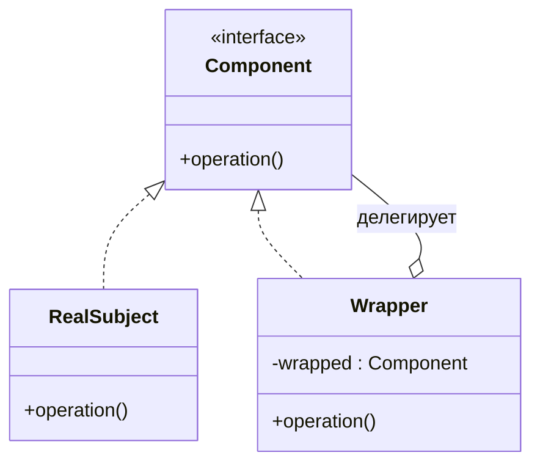
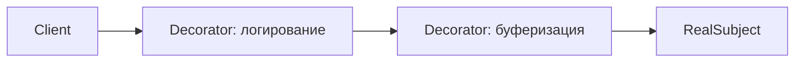

# Decorator против Proxy

И **Decorator**, и **Proxy** — это *структурные* паттерны, и на диаграмме классов
они почти близнецы: класс-обёртка реализует тот же интерфейс, что и объект, который
он держит, хранит на него ссылку и переадресует ему вызовы. Поэтому их нельзя
отличить по *форме* — только по **намерению**.

Из жизни: представьте посылку, которая пришла к вам домой. **Decorator** — это
дополнительная пузырчатая плёнка и подарочная бумага вокруг коробки: посылка делает
больше (теперь она в защите и красивая), но это всё та же посылка. **Proxy** — это
консьерж на ресепшене дома, который решает, дойдёт ли посылка до вас, распишется за
неё вместо вас или придержит её до вашего возвращения: посылка не изменилась, но
*доступ* к ней под контролем.

## Общая форма

И `Decorator`, и `Proxy` *являются* этим `Wrapper`. Клиент работает с интерфейсом
`Component` и не обязан знать, держит ли он реальный объект, декоратор или прокси.
Из жизни: вы заказываете «кофе» у стойки и вам неважно, кто протянул чашку — бариста,
вендинговый автомат или подменяющий сотрудник, — снаружи стаканчик выглядит
одинаково.

## Различие, которое важно: намерение

| | Decorator | Proxy |
|---|---|---|
| **Назначение** | *Добавить* объекту поведение | *Контролировать доступ* к объекту |
| **Меняет результат?** | Да — расширяет то, что делает `operation()` | Нет — тот же результат, но управляет *когда/если/как* он выполняется |
| **Кто передаёт обёрнутый объект?** | Клиент собирает его и передаёт внутрь | Прокси обычно сам создаёт/находит реальный объект |
| **Сколько обёрток?** | Складываются в стопку — обёртка вокруг обёртки… | Обычно одна подмена |
| **Связь известна…** | В рантайме — собирается динамически | На этапе проектирования — фиксированная замена |

**Decorator** — как приправа к блюду: каждый слой добавляет вкус, и можно навалить
соль *и* перец *и* соус, чувствуя всё больше вкуса с каждым слоем. **Proxy** — как
вышибала у двери клуба: музыка внутри ровно та же, есть он или нет, — он лишь решает,
кого пускать, проверяет документы или ставит в очередь.

### Декораторы складываются; прокси подменяет

Поскольку Decorator оборачивает *другой* `Component`, вы собираете цепочку — каждый
слой добавляет одну обязанность. Это фирменный приём Decorator и редкость для Proxy.

Из жизни: сэндвич в гастрономе — хлеб, потом сыр, потом ветчина, потом огурчики.
Каждая рука добавляет один ингредиент и передаёт дальше, и порядок выбираете вы.
Proxy, напротив, — это одна запертая витрина перед единственными дорогими часами:
есть только один привратник, и он нужен, чтобы управлять доступом, а не добавлять
слои.

## Разновидности Proxy

Намерение «контролировать доступ» проявляется в нескольких классических вариантах
Proxy — каждый сторожит доступ по своей причине:

- **Virtual proxy** — откладывает создание дорогого объекта до первого использования
  (ленивая загрузка). Из жизни: заглушка «изображение загружается…» в музее, которая
  подтягивает картину целиком только когда вы по ней кликнете.
- **Protection proxy** — проверяет права перед тем, как переадресовать вызов. Из
  жизни: вышибала в клубе, проверяющий ваш документ на входе.
- **Remote proxy** — локальная замена для объекта, живущего в другой JVM/машине,
  скрывающая сеть. Из жизни: посольство, через которое вы общаетесь с далёкой страной
  из своего города.
- **Caching proxy** — возвращает сохранённый результат вместо повторной работы. Из
  жизни: библиотекарь, который держит популярные книги на стойке, а не ходит к
  стеллажам каждый раз.

У Decorator такого каталога «видов» нет — вся его работа в открытой задаче
*добавлять поведение*.

## В реальном Java

- **Decorator:** потоки `java.io` — `new BufferedReader(new InputStreamReader(in))`
  складывает буферизацию и декодирование символов вокруг сырого потока. Также
  `Collections.unmodifiableList(...)` и сервлетный `HttpServletRequestWrapper`.
- **Proxy:** [AOP-прокси `@Transactional`](topic:spring-transactional-proxy) в Spring
  оборачивает ваш бин, чтобы открыть/зафиксировать транзакцию вокруг каждого метода;
  ленивые сущности Hibernate — это virtual proxy; `java.lang.reflect.Proxy` строит
  динамические прокси в рантайме.

Транзакционный прокси Spring — отличная лакмусовая бумажка: у него *тот же* интерфейс,
что и у вашего сервиса, и он *ничего* не добавляет к бизнес-результату — он лишь
решает, *когда* транзакция начнётся и зафиксируется. Это «контролировать, а не
расширять» — чистый Proxy. (Та же машинерия лежит в основе
[Spring IoC/DI](topic:spring-ioc-di) и AOP.)

## Ответ за 60 секунд

> У Decorator и Proxy почти одинаковая структура — обёртка, которая реализует тот же
> интерфейс, что и объект внутри, и делегирует ему. Разница в **намерении**.
> **Decorator добавляет поведение**: он расширяет то, что делает обёрнутый объект, и
> декораторы спроектированы под стопку, так что их можно навешивать слоями. Клиент
> сам собирает обёрнутый объект и передаёт его внутрь. **Proxy контролирует доступ**:
> результат тот же, но он сторожит, *когда, нужно ли и как* использовать реальный
> объект — ленивая загрузка (virtual), права (protection), сеть (remote) или
> кэширование. Прокси обычно единственная подмена, которая сама управляет жизненным
> циклом реального объекта, и связь фиксируется на этапе проектирования. В Java
> `BufferedReader` поверх потока — это Decorator; обёртка бина `@Transactional` в
> Spring и ленивые сущности Hibernate — это Proxy.

## Частые заблуждения

- ❌ «Они различаются, потому что у них разные диаграммы классов.» — Они почти не
  различаются; разница в **намерении**, а не в структуре. Её читают по тому, *зачем*
  обёртка существует.
- ❌ «Proxy не может менять поведение.» — Кэширующий или логирующий прокси *выполняет*
  лишний код; суть в том, что он нужен, чтобы **управлять доступом**, а не обогащать
  результат, который запросил вызывающий.
- ❌ «Декораторы всегда пассивные обёртки.» — Decorator намеренно *меняет результат*
  `operation()`; если ваша обёртка лишь сторожит или откладывает вызов, ничего не
  добавляя к результату, то это на самом деле Proxy.
- ❌ «Proxy = Adapter.» — [Adapter](topic:adapter) меняет интерфейс, чтобы состыковать
  два несовместимых типа; Proxy сохраняет **тот же** интерфейс. Снова разное
  намерение.
- ❌ «Их никогда не сочетают.» — Можно: например, транзакционный прокси вокруг сервиса,
  который сам обёрнут декораторами. Они решают разные задачи и комбинируются.
