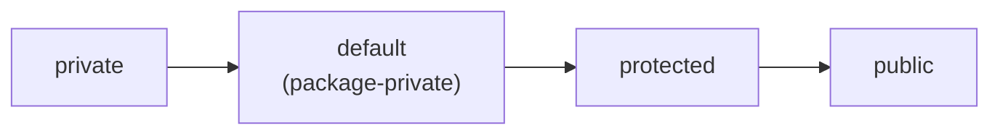
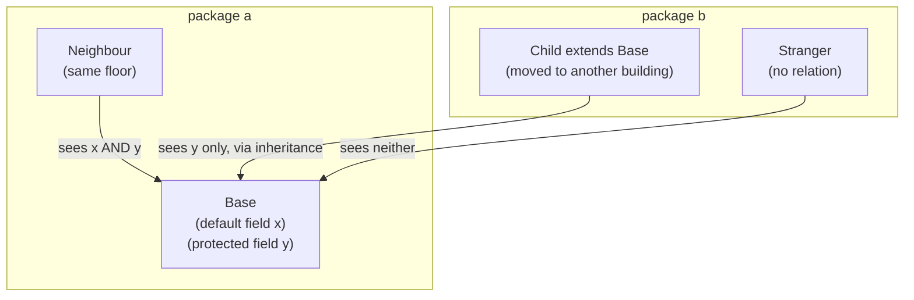

# default vs protected Access

Java has **four** access levels for a member (field or method). Think of a class
as an office building and a **package** as one floor of it. Each access level is a
different kind of door key:

- **private** — your own locked drawer; only you (the same class) open it.
- **default** (you write *no* keyword) — the shared supply room on your floor:
  anyone on the **same floor (same package)** can use it, nobody from other floors.
- **protected** — the same shared supply room, **plus** a key your relatives keep:
  your children who moved to another building (**subclasses in other packages**)
  inherited a copy and can use it as part of their own setup.
- **public** — the lobby: open to the whole world.

The whole question is the gap between the middle two. They are identical *inside*
the package — the difference is what happens **outside** it.

## Who can see what

| Caller location | private | **default** | **protected** | public |
|---|:---:|:---:|:---:|:---:|
| Same class | ✓ | ✓ | ✓ | ✓ |
| Same package | ✗ | ✓ | ✓ | ✓ |
| Subclass, **other** package | ✗ | ✗ | **✓** (inherited) | ✓ |
| Unrelated, other package | ✗ | ✗ | ✗ | ✓ |

The single row that separates them is the third one. A travelling key analogy:
**default** keys never leave the floor; **protected** keys can be passed down the
family line to relatives who moved away — but *only* down that family line.



*Left to right: each level opens one more door than the last.*

## The same package, two strangers, and a child



`Neighbour` is on the same floor, so it reads both `x` (default) and `y`
(protected). `Child` moved to another floor; it lost the default key but kept the
inherited protected one, so it sees `y` but not `x`. `Stranger` has no key at all.

## The classic trap: protected across packages is "through inheritance only"

Outside the package, a subclass may touch a protected member **only on its own
type** (itself or a further subclass) — not through a plain reference to the
parent. It is like inheriting the family key: you may use it for *your own* family's
supply room, not to open the parent's identical room for an outsider.

```java
// package b
public class Child extends Base {     // Base is in package a
    void demo(Base other, Child kin) {
        this.y = 1;   // OK    — my own protected member
        kin.y  = 1;   // OK    — kin is also a Child (my type)
        other.y = 1;  // ERROR — accessing protected via a bare Base reference
    }
}
```

This rule (JLS §6.6.2) trips up nearly everyone: people assume "subclass can see
protected" means *any* `Base` reference inside the subclass works. It doesn't.

## When to choose which

- **default** — the member is an internal collaborator meant to stay within one
  package (helper classes, package-level wiring). The default is a sensible, tight
  starting point: like keeping a tool in the floor's supply room until something
  outside genuinely needs it.
- **protected** — you are designing for **extension**: a base class wants
  subclasses (even in other packages) to reuse or override a member. Common in
  framework base classes and the [Template Method](topic:template-method) pattern,
  where subclasses fill in protected steps. It is the family key you deliberately
  hand to descendants.

Relevant background: this is one of Java's [OOP principles](topic:oop-principles) —
encapsulation. And note an [interface vs abstract class](topic:interface-vs-abstract-class)
difference here: interface members are implicitly `public`, so `protected`/`default`
visibility is a tool for *classes* (and abstract classes), not interface contracts.

## 60-second interview answer

> Both restrict visibility, and inside the same package they behave identically —
> any class in that package can access either one. The difference shows up across
> package boundaries. A **default** (no-modifier, package-private) member is visible
> *only* within its own package — full stop. A **protected** member is visible in
> its package **and** to subclasses in other packages, but only through inheritance.
> So protected = package-private **plus** subclass access. The subtle rule is that
> outside the package a subclass can reach a protected member only on its own type
> or a subtype, not via an arbitrary superclass reference.

## Common misconceptions

- ❌ "default and protected are the same." — Only within one package. Across
  packages, protected reaches subclasses and default reaches nobody.
- ❌ "default means public / accessible everywhere." — No keyword is the *most*
  restrictive of the non-private trio, not the least: it is package-private.
- ❌ "protected means subclasses only." — It is *also* visible to every class in the
  same package, exactly like default, even non-subclasses.
- ❌ "A subclass in another package can read a protected member off any parent
  reference." — Only off its own type (`this`/a `Child`), not a bare `Base` ref.
- ❌ "Interfaces can have protected members." — Interface methods are implicitly
  `public` (or `private` for helpers since Java 9); there is no `protected` member
  in an interface.
