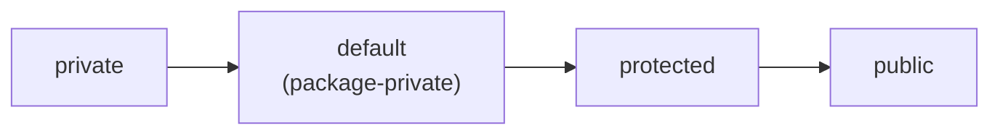
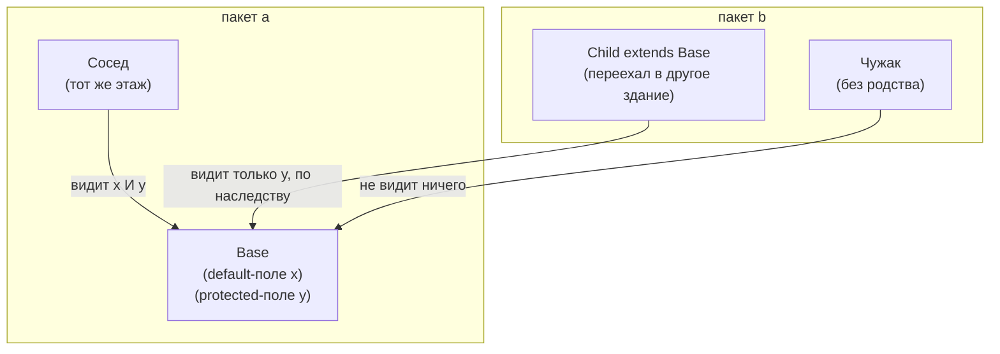

# Доступ default и protected

В Java есть **четыре** уровня доступа к члену класса (полю или методу).
Представьте класс как офисное здание, а **пакет** — как один его этаж. Каждый
уровень доступа — это свой ключ от двери:

- **private** — ваш личный запертый ящик; открываете только вы (тот же класс).
- **default** (вы не пишете ключевое слово) — общая подсобка на вашем этаже: ею
  пользуется любой на **том же этаже (в том же пакете)**, и никто с других этажей.
- **protected** — та же общая подсобка, **плюс** ключ, который хранят ваши
  родственники: дети, переехавшие в другое здание (**подклассы в других пакетах**),
  получили его копию по наследству и пользуются ею в рамках своего хозяйства.
- **public** — холл на первом этаже: открыт всему миру.

Весь вопрос — в зазоре между двумя средними. *Внутри* пакета они ведут себя
одинаково; разница в том, что происходит **за его пределами**.

## Кто что видит

| Откуда обращаются | private | **default** | **protected** | public |
|---|:---:|:---:|:---:|:---:|
| Тот же класс | ✓ | ✓ | ✓ | ✓ |
| Тот же пакет | ✗ | ✓ | ✓ | ✓ |
| Подкласс, **другой** пакет | ✗ | ✗ | **✓** (по наследству) | ✓ |
| Посторонний, другой пакет | ✗ | ✗ | ✗ | ✓ |

Различает их единственная строка — третья. Аналогия с «путешествующим ключом»:
ключи **default** никогда не покидают этаж; ключи **protected** можно передать по
семейной линии уехавшим родственникам — но *только* по этой линии.



*Слева направо: каждый уровень открывает на одну дверь больше предыдущего.*

## Тот же пакет, два чужака и ребёнок



`Сосед` на том же этаже, поэтому читает и `x` (default), и `y` (protected). `Child`
переехал на другой этаж: он потерял ключ default, но сохранил унаследованный
protected, поэтому видит `y`, но не `x`. У `Чужака` ключа нет вовсе.

## Классическая ловушка: protected между пакетами — «только через наследование»

За пределами пакета подкласс может обращаться к protected-члену **только на своём
типе** (на себе или на дальнейшем подклассе) — но не через обычную ссылку на
родителя. Это как унаследованный семейный ключ: им можно открыть подсобку *своей*
семьи, но нельзя открыть такую же родительскую комнату постороннему.

```java
// package b
public class Child extends Base {     // Base is in package a
    void demo(Base other, Child kin) {
        this.y = 1;   // OK    — my own protected member
        kin.y  = 1;   // OK    — kin is also a Child (my type)
        other.y = 1;  // ERROR — accessing protected via a bare Base reference
    }
}
```

Это правило (JLS §6.6.2) сбивает почти всех: люди думают, что «подкласс видит
protected» означает, будто работает *любая* ссылка `Base` внутри подкласса. Это не
так.

## Что когда выбирать

- **default** — член является внутренним помощником и должен оставаться в пределах
  одного пакета (вспомогательные классы, связи уровня пакета). default — разумная и
  плотная отправная точка: всё равно что держать инструмент в подсобке этажа, пока
  он по-настоящему не понадобится снаружи.
- **protected** — вы проектируете под **расширение**: базовый класс хочет, чтобы
  подклассы (даже в других пакетах) переиспользовали или переопределяли член. Часто
  встречается в базовых классах фреймворков и в паттерне
  [Template Method](topic:template-method), где подклассы заполняют protected-шаги.
  Это семейный ключ, который вы осознанно передаёте потомкам.

Полезный фон: это одна из [принципов ООП](topic:oop-principles) в Java —
инкапсуляция. И обратите внимание на различие
[интерфейс vs абстрактный класс](topic:interface-vs-abstract-class): члены
интерфейса неявно `public`, поэтому видимость `protected`/`default` — инструмент для
*классов* (и абстрактных классов), а не для контрактов интерфейса.

## Ответ за 60 секунд

> Оба ограничивают видимость, и внутри одного пакета ведут себя одинаково — любой
> класс пакета обращается к любому из них. Разница проявляется на границе пакетов.
> Член с уровнем **default** (без модификатора, package-private) виден *только*
> внутри своего пакета — и всё. Член **protected** виден в своём пакете **и**
> подклассам в других пакетах, но только через наследование. То есть protected =
> package-private **плюс** доступ для подклассов. Тонкое правило: за пределами пакета
> подкласс может обратиться к protected-члену лишь на своём типе или подтипе, а не
> через произвольную ссылку на суперкласс.

## Частые заблуждения

- ❌ «default и protected — одно и то же.» — Только внутри одного пакета. Между
  пакетами protected достаёт до подклассов, а default — ни до кого.
- ❌ «default означает public / доступен везде.» — Отсутствие ключевого слова — это
  *самый* строгий из тройки не-private, а не самый слабый: это package-private.
- ❌ «protected — это только для подклассов.» — Он *также* виден каждому классу в том
  же пакете, ровно как default, даже не-подклассам.
- ❌ «Подкласс в другом пакете может читать protected-член через любую ссылку на
  родителя.» — Только на своём типе (`this`/ссылка `Child`), а не через голую ссылку
  `Base`.
- ❌ «У интерфейсов могут быть protected-члены.» — Методы интерфейса неявно `public`
  (или `private` для вспомогательных, начиная с Java 9); protected-члена в
  интерфейсе нет.
