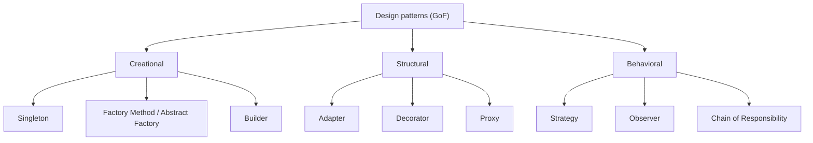

# Design Patterns Overview

A **design pattern** is a named, reusable solution to a problem that keeps coming
up in object-oriented design. Patterns aren't libraries you import — they're
*shapes* for arranging classes and objects, plus a shared vocabulary: saying "use
a Strategy here" tells a teammate the whole structure in two words.

The classic catalogue is the **Gang of Four (GoF)** — 23 patterns in three
families:

## Creational — *how objects are created*

They decouple your code from the concrete classes it instantiates.

- **Singleton** — one shared instance (config, a registry). Real life: a single
  TV remote everyone in the house uses.
- **Factory Method / Abstract Factory** — create objects without naming the exact
  class; pick the implementation at runtime. Real life: order "a coffee" and the
  café decides which machine makes it.
- **Builder** — assemble a complex object step by step (many optional fields).
  Real life: building a burger by choosing toppings one at a time.

## Structural — *how objects are composed*

They assemble objects and classes into larger structures while keeping them
flexible.

- **Adapter** — make an incompatible interface fit. Real life: a travel plug
  adapter.
- **Decorator** — wrap an object to add behaviour without changing it. Real life:
  adding milk and sugar to a coffee, each wrapper still "a drink".
- **Proxy** — a stand-in that controls access (lazy loading, caching, security).
  Real life: a spokesperson who speaks for someone.

## Behavioral — *how objects interact*

They describe communication and the assignment of responsibilities.

- **[Strategy](topic:strategy)** — interchangeable algorithms behind one
  interface; the context delegates to whichever it holds.
- **Observer** — subscribers get notified when a subject changes (events,
  listeners). Real life: a newsletter you subscribe to.
- **[Chain of Responsibility](topic:chain-of-responsibility)** — a request walks a
  chain of handlers until one handles it (filters, middleware).

> Tip: the focused topics linked above let you **build** the pattern in code and
> see its class diagram / behaviour, instead of just reading about it.

## 60-second interview answer

> Design patterns are proven, named solutions to recurring OO design problems, and
> a shared vocabulary. The GoF groups 23 of them into three families: **creational**
> (how objects are made — Singleton, Factory, Builder), **structural** (how they're
> composed — Adapter, Decorator, Proxy) and **behavioral** (how they interact —
> Strategy, Observer, Chain of Responsibility). I reach for one when a real problem
> matches its intent — e.g. Strategy to swap algorithms, Builder for complex
> construction — and I avoid forcing patterns where a plain class or function is
> clearer.

## Common misconceptions

- ❌ "More patterns = better code." — Patterns add indirection; use one only when it
  earns its keep. Over-patterning is its own anti-pattern.
- ❌ "A pattern is a piece of code to copy." — It's a structure/intent; the
  implementation varies per language and context.
- ❌ "GoF is the whole story." — There are also concurrency, integration and
  architectural patterns (e.g. transactional Outbox, CQRS) beyond the GoF 23.
- ❌ "Singleton is always fine." — A global single instance hurts testability and
  hides dependencies; often dependency injection is better.
