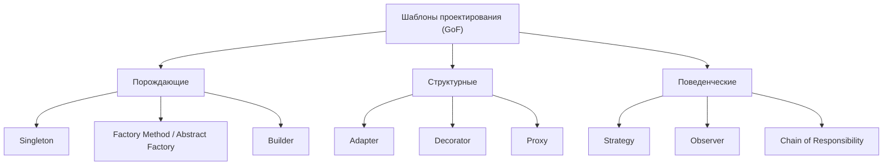

# Обзор шаблонов проектирования

**Шаблон проектирования** — это именованное переиспользуемое решение задачи, которая
постоянно возникает в объектно-ориентированном дизайне. Паттерны — не библиотеки,
которые импортируют, а *формы* организации классов и объектов плюс общий словарь:
сказать «здесь используй Strategy» — значит передать коллеге всю структуру в двух
словах.

Классический каталог — **Банда четырёх (GoF)** — 23 паттерна в трёх семействах:

## Порождающие — *как создаются объекты*

Развязывают код от конкретных классов, которые он создаёт.

- **Singleton** — один общий экземпляр (конфиг, реестр). Из жизни: один пульт от
  телевизора на всю семью.
- **Factory Method / Abstract Factory** — создать объект, не называя точный класс;
  выбрать реализацию во время выполнения. Из жизни: заказываешь «кофе», а кофейня
  сама решает, какая машина его сделает.
- **Builder** — собрать сложный объект пошагово (много опциональных полей). Из
  жизни: собираешь бургер, добавляя ингредиенты по одному.

## Структурные — *как объекты компонуются*

Собирают объекты и классы в большие структуры, сохраняя гибкость.

- **Adapter** — подогнать несовместимый интерфейс. Из жизни: переходник для
  розетки в путешествии.
- **Decorator** — обернуть объект, добавив поведение без его изменения. Из жизни:
  добавить молоко и сахар в кофе — каждая обёртка всё ещё «напиток».
- **Proxy** — заместитель, контролирующий доступ (ленивая загрузка, кэш,
  безопасность). Из жизни: пресс-секретарь, говорящий за кого-то.

## Поведенческие — *как объекты взаимодействуют*

Описывают коммуникацию и распределение обязанностей.

- **[Strategy](topic:strategy)** — взаимозаменяемые алгоритмы за одним интерфейсом;
  контекст делегирует тому, который держит.
- **Observer** — подписчики получают уведомление при изменении субъекта (события,
  слушатели). Из жизни: рассылка, на которую ты подписан.
- **[Chain of Responsibility](topic:chain-of-responsibility)** — запрос идёт по
  цепочке обработчиков, пока один не обработает (фильтры, middleware).

> Подсказка: по ссылкам выше можно **собрать** паттерн в коде и увидеть его
> диаграмму классов / поведение, а не просто прочитать о нём.

## Ответ на собеседовании (за 60 секунд)

> Шаблоны проектирования — это проверенные именованные решения повторяющихся задач
> ООП-дизайна и общий словарь. GoF группирует 23 из них в три семейства:
> **порождающие** (как создаются объекты — Singleton, Factory, Builder),
> **структурные** (как компонуются — Adapter, Decorator, Proxy) и
> **поведенческие** (как взаимодействуют — Strategy, Observer, Chain of
> Responsibility). Я беру паттерн, когда реальная задача совпадает с его замыслом —
> например, Strategy для подмены алгоритмов, Builder для сложной сборки — и избегаю
> навязывания паттернов там, где обычный класс или функция понятнее.

## Частые заблуждения

- ❌ «Больше паттернов = лучше код.» — Паттерны добавляют косвенность; применяй один,
  только когда он окупается. Переусердствовать с паттернами — само по себе
  анти-паттерн.
- ❌ «Паттерн — это код для копирования.» — Это структура/замысел; реализация
  меняется от языка и контекста.
- ❌ «GoF — это всё.» — Есть ещё паттерны многопоточности, интеграции и
  архитектурные (например, транзакционный Outbox, CQRS) помимо 23 GoF.
- ❌ «Singleton всегда уместен.» — Глобальный единственный экземпляр вредит
  тестируемости и прячет зависимости; часто лучше внедрение зависимостей.
