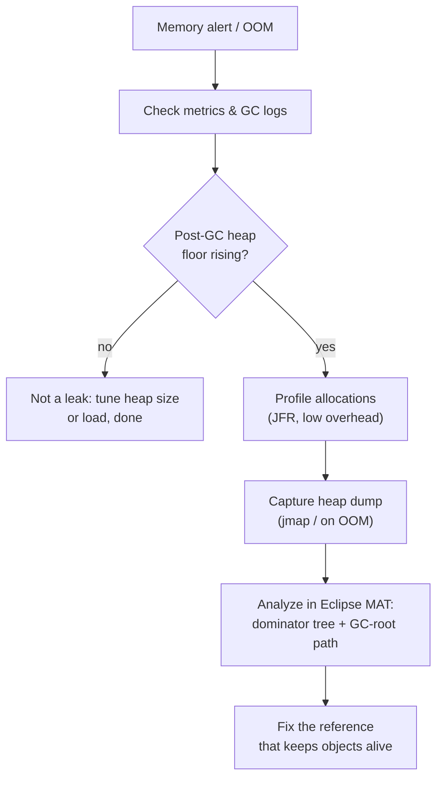
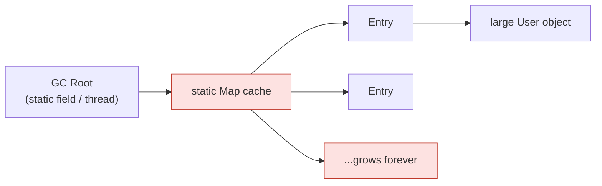

# Diagnosing Memory Growth and Leaks in Production

A Java process whose memory keeps climbing is like a **kitchen where dirty dishes
pile up faster than they're washed**: eventually there's no clean counter space
and service stops — the JVM throws `OutOfMemoryError`. The skill being tested is
*method*: don't guess, follow a chain of tools from cheap-and-broad to
expensive-and-precise.

## Step 0: is it actually a leak?

A real **memory leak** in Java means live objects the garbage collector *cannot*
reclaim because something still references them. That's different from "memory is
high right now" — a healthy heap looks like a **sawtooth**: it fills up, GC sweeps
it, it drops back down. A leak is a sawtooth whose *floor keeps rising* — like a
sink that's drained after every wash but the water level after draining creeps up
each time.

So first **confirm the trend**, don't capture dumps blindly:

- **Monitoring / metrics** — used-heap-after-GC over hours or days (Micrometer +
  Prometheus/Grafana, the cloud provider's metrics, or `jstat -gcutil <pid>`).
  This is the **CCTV in the kitchen**: cheap, always on, shows the trend without
  touching anything.
- **GC logs** (`-Xlog:gc*` on Java 9+) — rising post-GC live size and GC taking a
  larger share of wall-clock time both point at a leak. See
  [Configuring the Garbage Collector](topic:gc-configuration) and
  [JVM Heap Generations](topic:heap-generations) for what the numbers mean (a leak
  usually fills the **Old** generation).

If the floor is flat, it's not a leak — you may just need a bigger heap or fewer
concurrent requests.

## Profilers — *who is allocating, while it runs*

A **profiler** samples the running JVM to show where memory (and CPU) goes, ideally
without stopping the world. Think of it as a **time-and-motion observer on the
kitchen floor**, noting which station produces the most dishes.

- **JFR (Java Flight Recorder)** + **JDK Mission Control** — built into the JDK,
  ~1% overhead, safe to leave running in production. Start it with
  `jcmd <pid> JFR.start` and read allocation profiles and object stats. This is the
  default first choice on prod precisely because it's so cheap.
- **async-profiler** — excellent low-overhead allocation/CPU flame graphs.
- **VisualVM / JProfiler / YourKit** — richer GUIs, but heavier; usually pointed at
  staging or a reproduction, not a busy prod node.

Profilers answer **"what is being allocated and from which call path"** — great for
catching an allocation *hotspot* before the heap fills. But high allocation isn't
always a leak; for "*what is stuck in memory and why won't it leave*", you need a
heap dump.

## Heap dump — *a freeze-frame of every live object*

A **heap dump** is a full snapshot of the heap: every object, its fields, and its
references. It's a **photograph of the entire kitchen at one instant** — every
plate and who's holding it.

Capture it:

- **On failure automatically:** `-XX:+HeapDumpOnOutOfMemoryError
  -XX:HeapDumpPath=/var/dumps` — the JVM writes a dump the moment it OOMs. This is
  the single most useful flag to set *before* trouble.
- **On demand:** `jmap -dump:live,format=b,file=heap.hprof <pid>` or
  `jcmd <pid> GC.heap_dump heap.hprof`.

⚠️ Capturing a heap dump **pauses the JVM (stop-the-world)** and writes a file the
size of the live heap (often gigabytes) — like **clearing every customer out to
photograph the kitchen**. Do it deliberately: on a node taken out of the load
balancer, or accept the automatic one on OOM.

Analyze it in **Eclipse MAT** (Memory Analyzer Tool):

- **Dominator tree / Leak Suspects** — which few objects *retain* most of the heap.
  **Retained size** = everything that would be freed if this object went away (the
  whole shelf a box is propping up), versus **shallow size** = just the object
  itself.
- **Path to GC Roots** — the chain of references keeping the suspect alive. This is
  the punchline: a leak is always *something on a GC root still pointing at the
  object*. Follow the chain back to the culprit — usually a `static` collection, a
  cache, or a `ThreadLocal`.

**Classic leak causes** the GC-root path usually reveals:

- An ever-growing `static` collection or an **unbounded cache** (no eviction / size
  cap) — see [Reference Types and a Memory-Sensitive Cache](topic:reference-types-cache).
- A **`ThreadLocal`** never cleared on a pooled thread, so the value lives as long
  as the [thread pool](topic:java-thread-pool) does.
- **Listeners / callbacks** registered but never unregistered.
- **ClassLoader leaks** on redeploy (a static reference from outside pins the whole
  old app's classes).

## Thread dump — *what every thread is doing right now*

A **thread dump** is orthogonal: it's a snapshot of every thread's **stack and
state**, not the objects — the **list of which cook is at which station and what
they're waiting on**. Capture with `jstack <pid>`, `jcmd <pid> Thread.print`, or
sending `SIGQUIT` (`kill -3`).

It's the right tool when the symptom is **"hung / not responding / 100% CPU"** or a
suspected **thread leak** (thousands of threads — each costs ~1 MB of stack, so a
thread leak *looks* like a memory leak too). You'll spot:

- **Deadlocks** (jstack flags them) and threads `BLOCKED` on a lock.
- Threads stuck `WAITING` on a slow downstream call.
- An exploding thread count from creating threads instead of reusing a pool — see
  [Thread vs ThreadPool](topic:thread-vs-threadpool) and
  [Java Multithreading](topic:java-multithreading).

> Rule of thumb: **heap dump** answers *what is filling memory*; **thread dump**
> answers *what the threads are doing*; **profiler/metrics** answer *the trend over
> time*. Take **two dumps a few seconds/minutes apart** and compare — what *grew*
> between them is your suspect.

## 60-second interview answer

> First I confirm it's actually a leak, not just high usage: I look at metrics and
> GC logs for the live-heap-after-GC trend. A healthy heap is a sawtooth that
> returns to the same floor; a leak's floor keeps rising and fills the Old gen. To
> find *who* is allocating I attach a low-overhead profiler — JFR is built in and
> safe in prod — for allocation hotspots. To find *what is stuck and why*, I take a
> heap dump (`-XX:+HeapDumpOnOutOfMemoryError`, or `jmap`/`jcmd` on demand) and open
> it in Eclipse MAT: the dominator tree shows what retains the heap and the path to
> GC roots shows the reference keeping it alive — usually a static collection,
> unbounded cache, or uncleared ThreadLocal. A thread dump (`jstack`) is for a
> different symptom — hangs, deadlocks, or a thread leak. The key trick is comparing
> two snapshots over time to see what grew.

## Common misconceptions

- ❌ "High memory means a leak." — A full heap that GC reclaims is fine; only a
  *rising post-GC floor* is a leak.
- ❌ "Just take a heap dump on the live prod node." — It's stop-the-world and writes
  a multi-GB file; pull the node out of rotation or rely on the on-OOM dump.
- ❌ "A profiler and a heap dump are the same thing." — A profiler shows *allocation
  over time* with low overhead; a heap dump is a *single freeze-frame* of all live
  objects you analyze offline.
- ❌ "A thread dump shows memory." — It shows thread stacks and states; it only hints
  at memory via an excessive thread *count*.
- ❌ "Shallow size tells me the cost." — A small object can *retain* a huge graph;
  always read **retained** size in MAT.
- ❌ "`System.gc()` will fix it." — If something is still referenced, no GC can
  collect it; you must break the reference.
