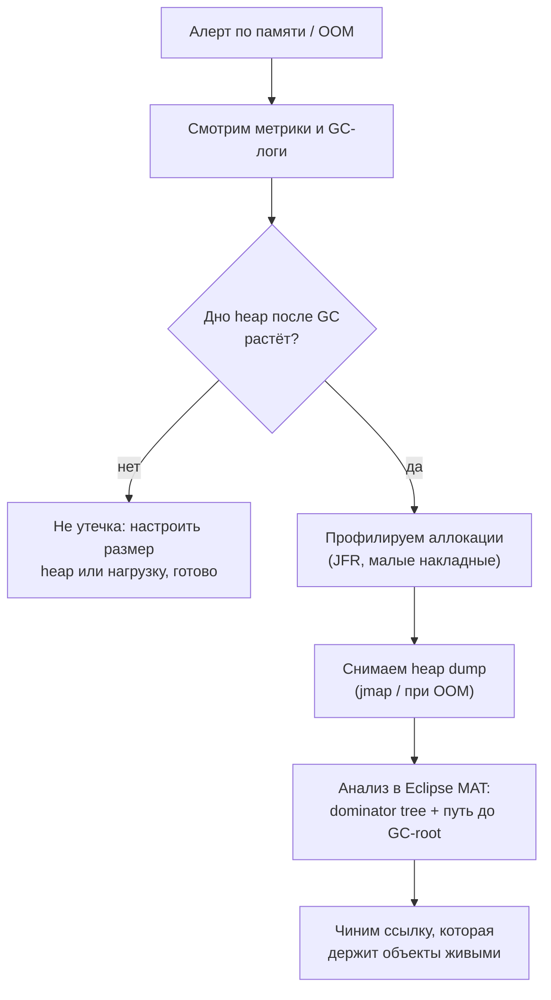
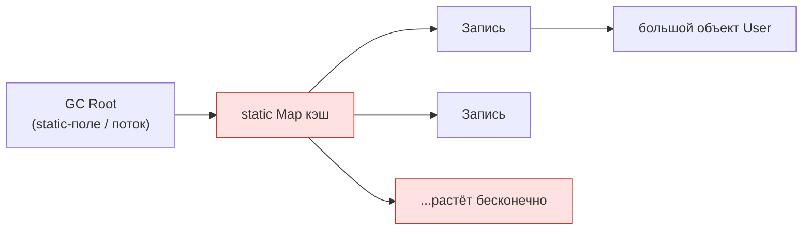

# Диагностика роста памяти и утечек на проде

Java-процесс, у которого память постоянно растёт, похож на **кухню, где грязная
посуда копится быстрее, чем её моют**: рано или поздно чистого места на столе не
остаётся и работа встаёт — JVM бросает `OutOfMemoryError`. На собеседовании
проверяют *методику*: не угадывать, а идти по цепочке инструментов от
дешёвых-и-широких к дорогим-и-точным.

## Шаг 0: а это вообще утечка?

Настоящая **утечка памяти** в Java — это живые объекты, которые сборщик мусора *не
может* освободить, потому что на них кто-то ещё ссылается. Это не то же самое, что
«памяти сейчас много»: здоровый heap выглядит как **пила** — наполняется, GC его
чистит, уровень падает обратно. Утечка — это пила, у которой *дно постоянно
растёт*: как раковина, которую сливают после каждой мойки, но уровень воды после
слива каждый раз чуть выше.

Поэтому сначала **подтвердите тренд**, а не снимайте дампы вслепую:

- **Мониторинг / метрики** — размер занятого heap после GC за часы или дни
  (Micrometer + Prometheus/Grafana, метрики облачного провайдера или
  `jstat -gcutil <pid>`). Это **видеонаблюдение на кухне**: дёшево, работает всегда,
  показывает тренд, ничего не трогая.
- **GC-логи** (`-Xlog:gc*` на Java 9+) — растущий размер живых объектов после GC и
  рост доли времени, которое GC отнимает у процесса, оба указывают на утечку. Что
  означают цифры — см. [Настройка сборщика мусора](topic:gc-configuration) и
  [Поколения heap в JVM](topic:heap-generations) (утечка обычно заполняет поколение
  **Old**).

Если дно ровное — это не утечка, и, возможно, нужен просто больший heap или меньше
одновременных запросов.

## Профилировщики — *кто аллоцирует, пока процесс работает*

**Профилировщик** сэмплирует работающую JVM и показывает, куда уходит память (и
CPU), в идеале не останавливая мир. Считайте его **наблюдателем-хронометражистом на
кухне**, который отмечает, какая станция производит больше всего посуды.

- **JFR (Java Flight Recorder)** + **JDK Mission Control** — встроен в JDK, накладные
  расходы ~1%, безопасно держать включённым на проде. Запуск через
  `jcmd <pid> JFR.start`, читаем профили аллокаций и статистику по объектам. Это
  выбор номер один на проде именно потому, что так дёшево.
- **async-profiler** — отличные flame-графы аллокаций/CPU с малыми накладными.
- **VisualVM / JProfiler / YourKit** — богаче по GUI, но тяжелее; обычно их наводят
  на staging или воспроизведение, а не на нагруженный прод-узел.

Профилировщики отвечают на вопрос **«что аллоцируется и из какого пути вызовов»** —
отлично ловят *горячую точку аллокаций* до того, как heap заполнится. Но высокая
аллокация — не всегда утечка; для вопроса «*что застряло в памяти и почему не
уходит*» нужен heap dump.

## Heap dump — *стоп-кадр всех живых объектов*

**Heap dump** — это полный снимок heap: каждый объект, его поля и его ссылки. Это
**фотография всей кухни в один момент** — каждая тарелка и кто её держит.

Как снять:

- **Автоматически при сбое:** `-XX:+HeapDumpOnOutOfMemoryError
  -XX:HeapDumpPath=/var/dumps` — JVM пишет дамп в момент OOM. Это самый полезный
  флаг, который стоит выставить *до* проблем.
- **По требованию:** `jmap -dump:live,format=b,file=heap.hprof <pid>` или
  `jcmd <pid> GC.heap_dump heap.hprof`.

⚠️ Снятие heap dump **останавливает JVM (stop-the-world)** и пишет файл размером с
живой heap (часто гигабайты) — как **выгнать всех клиентов, чтобы сфотографировать
кухню**. Делайте это осознанно: на узле, выведенном из балансировщика, либо примите
автоматический дамп при OOM.

Анализируем в **Eclipse MAT** (Memory Analyzer Tool):

- **Dominator tree / Leak Suspects** — какие немногие объекты *удерживают* большую
  часть heap. **Retained size** = всё, что освободится, если этот объект исчезнет
  (вся полка, которую подпирает коробка), в отличие от **shallow size** = только сам
  объект.
- **Path to GC Roots** — цепочка ссылок, которая держит подозреваемого живым. Это и
  есть суть: утечка — это всегда *что-то на GC-root, всё ещё указывающее на
  объект*. Пройдите по цепочке назад к виновнику — обычно это `static`-коллекция,
  кэш или `ThreadLocal`.

**Классические причины утечек**, которые обычно вскрывает путь до GC-root:

- Постоянно растущая `static`-коллекция или **неограниченный кэш** (без вытеснения /
  лимита размера) — см.
  [Ссылочные типы и кэш, чувствительный к памяти](topic:reference-types-cache).
- **`ThreadLocal`**, который не очистили на потоке из пула, поэтому значение живёт
  столько же, сколько [пул потоков](topic:java-thread-pool).
- **Слушатели / колбэки**, зарегистрированные, но так и не отписанные.
- **Утечки ClassLoader** при передеплое (статическая ссылка снаружи прибивает все
  классы старого приложения).

## Thread dump — *что прямо сейчас делает каждый поток*

**Thread dump** — про другое: это снимок **стека и состояния** каждого потока, а не
объектов — **список, какой повар у какой станции и чего он ждёт**. Снимается через
`jstack <pid>`, `jcmd <pid> Thread.print` или отправкой `SIGQUIT` (`kill -3`).

Это нужный инструмент, когда симптом — **«висит / не отвечает / 100% CPU»** или
подозрение на **утечку потоков** (тысячи потоков — каждый стоит ~1 МБ стека, так что
утечка потоков *выглядит* как утечка памяти тоже). Вы увидите:

- **Дедлоки** (jstack их помечает) и потоки в состоянии `BLOCKED` на блокировке.
- Потоки, застрявшие в `WAITING` на медленном внешнем вызове.
- Взрывной рост числа потоков из-за создания потоков вместо переиспользования пула —
  см. [Поток против пула потоков](topic:thread-vs-threadpool) и
  [Многопоточность в Java](topic:java-multithreading).

> Правило: **heap dump** отвечает на *что заполняет память*; **thread dump** — на
> *что делают потоки*; **профилировщик/метрики** — на *тренд во времени*. Снимите
> **два дампа с интервалом в несколько секунд/минут** и сравните — то, что *выросло*
> между ними, и есть подозреваемый.

## Ответ за 60 секунд

> Сначала подтверждаю, что это действительно утечка, а не просто высокое
> потребление: смотрю метрики и GC-логи на тренд живого heap после GC. Здоровый heap
> — это пила, возвращающаяся к одному и тому же дну; у утечки дно растёт и заполняет
> Old gen. Чтобы найти *кто* аллоцирует, цепляю профилировщик с малыми накладными —
> JFR встроен и безопасен на проде — и смотрю горячие точки аллокаций. Чтобы найти
> *что застряло и почему*, снимаю heap dump (`-XX:+HeapDumpOnOutOfMemoryError` либо
> `jmap`/`jcmd` по требованию) и открываю в Eclipse MAT: dominator tree показывает,
> что удерживает heap, а путь до GC-roots — ссылку, держащую объект живым: обычно это
> static-коллекция, неограниченный кэш или неочищенный ThreadLocal. Thread dump
> (`jstack`) — для другого симптома: зависания, дедлоки, утечка потоков. Главный приём
> — сравнить два снимка во времени и увидеть, что выросло.

## Частые заблуждения

- ❌ «Много памяти — значит утечка». — Полный heap, который GC освобождает, — это
  норма; утечка — только *растущее дно после GC*.
- ❌ «Просто сними heap dump на живом прод-узле». — Это stop-the-world и файл в
  несколько ГБ; выведите узел из ротации или положитесь на дамп при OOM.
- ❌ «Профилировщик и heap dump — одно и то же». — Профилировщик показывает *аллокации
  во времени* с малыми накладными; heap dump — это *один стоп-кадр* всех живых
  объектов, который анализируют офлайн.
- ❌ «Thread dump показывает память». — Он показывает стеки и состояния потоков; на
  память он намекает лишь через избыточное *число* потоков.
- ❌ «Shallow size говорит мне о стоимости». — Маленький объект может *удерживать*
  огромный граф; в MAT всегда читайте **retained** size.
- ❌ «`System.gc()` это починит». — Если на объект всё ещё ссылаются, никакой GC его не
  соберёт; нужно разорвать ссылку.
