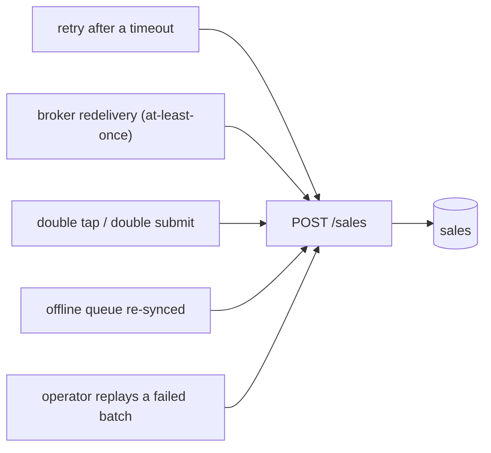
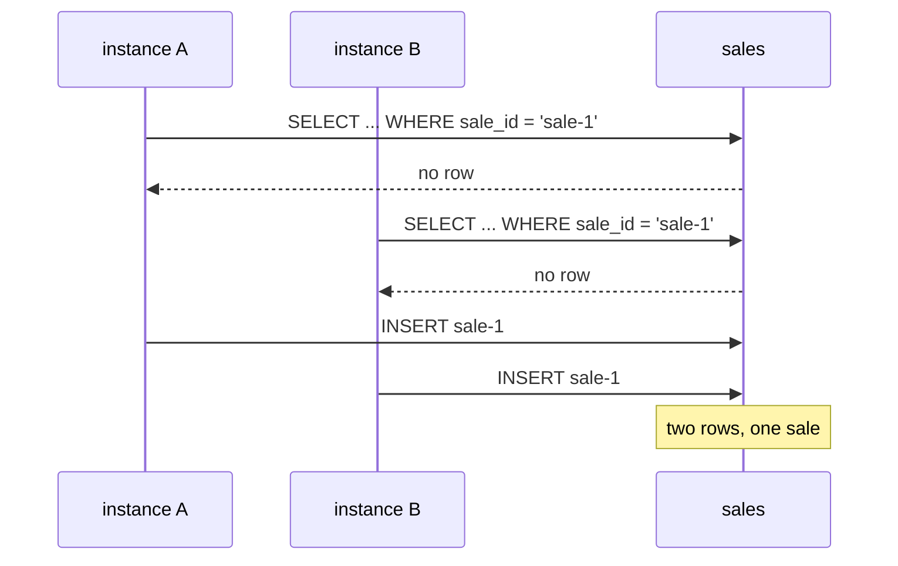
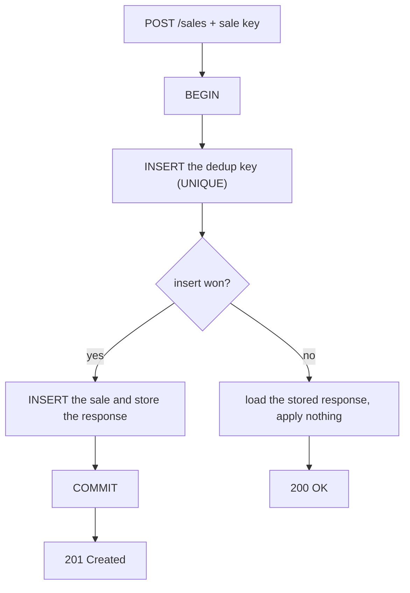

# Avoiding Duplicate Sales on Registration

A duplicate sale is not a bug in the code that creates it. It is what happens
when a correct system does the safe thing twice. The client that retries after a
timeout is behaving correctly. The broker that redelivers an unacknowledged
message is behaving correctly. The cashier who taps the button again because the
screen froze is behaving correctly. **Duplicates are prevented on the server, by
design, and nowhere else.**

## Where the second copy comes from



Every arrow is something you cannot remove. Disabling the button, making the
broker exactly-once, telling the operator to be careful — none of these are
guarantees, they are reductions in probability. The design has to assume the
second copy will arrive.

## The only question that matters: what makes two requests the same sale?

Deduplication is not a technique, it is a **definition of identity**, and
everything else follows from it. You have three candidates:

| Identity | Who assigns it | Verdict |
| --- | --- | --- |
| A client-generated key (`saleId`, `Idempotency-Key`) | the device, once, when the sale happens | the default answer |
| A natural business key (`deviceId` + per-device sequence number) | the device, implicitly | equally good, and self-auditing |
| A hash of the request body | nobody — it is derived | **wrong** |

The payload hash is the trap, and it is worth being able to explain in one
sentence: *two customers buying the same coffee for the same price at the same
second are two sales, not one.* Content equality is not identity. Run the
**Dedup by payload hash** example — the retry is caught, and so is the next
customer's real sale, which then quietly vanishes from the takings. A guard that
deletes revenue is worse than the duplicate it prevented.

The key must be minted **once per business action**, on the device, before the
first send — the same key on every attempt. Who generates it and when is covered
in depth by [registering sales over an unreliable
connection](topic:sales-api-unreliable-connection); this topic is about what the
server does with it.

## The guard that isn't: check, then insert

Almost everyone writes this first:

```java
if (!salesRepository.existsBySaleId(saleId)) {   // 1. check
    salesRepository.save(sale);                  // 2. act
}
```

It passes every test you write for it, because tests send requests one at a
time. Two overlapping deliveries defeat it:



This is an ordinary [check-then-act race](topic:race-condition-avoidance), and
notice that it does not need two instances — two threads on one instance, or one
instance and one retry from a scheduler, are enough. Nor does a higher isolation
level save you: under [MVCC](topic:mvcc) each transaction reads its own snapshot,
so neither `SELECT` can see the other's uncommitted row (see [PostgreSQL
isolation levels](topic:postgresql-isolation-levels)). The rule is the same one
that makes [compare-and-set](topic:compare-and-set) work: **the check and the
write have to be a single indivisible operation.**

## The guard that is: let the database enforce identity

Put a `UNIQUE` constraint on the identity column and the race stops being your
problem — the database serialises it for you:

```sql
ALTER TABLE sales ADD CONSTRAINT uq_sales_sale_id UNIQUE (sale_id);
```

Then pick one of two writes:

```sql
-- 1. Insert and handle the violation: you learn whether you won.
INSERT INTO sales (sale_id, device_id, item, amount) VALUES (?, ?, ?, ?);
-- on SQLState 23505 -> load the existing row and return its stored response

-- 2. Upsert: one statement, no exception, 0 rows affected means "already there".
INSERT INTO sales (sale_id, device_id, item, amount) VALUES (?, ?, ?, ?)
ON CONFLICT (sale_id) DO NOTHING;
```

Both are correct. The difference is ergonomic: the upsert avoids an exception on
a normal path, while the explicit `INSERT` makes it easy to distinguish "I
registered it" from "it was already there" — which you need if the two answers
differ. The constraint is backed by a unique index, so the lookup is cheap
anyway (see [database indexes](topic:database-indexes)).

Two refinements separate a working implementation from a good one:

- **Replay the response, don't just skip.** A retry must get the same answer as
  the original — the same receipt id, the same body. Silently returning "OK,
  nothing to do" leaves the client unable to print a receipt and unable to tell
  success from a swallowed error. Storing `key -> (status, response)` is what
  turns *deduplication* into *idempotency*.
- **A known key with a different body is not a retry.** It is a client bug — a
  key reused for a new sale. Answer `409 Conflict` and make it visible; replaying
  the old response would delete a real second sale. The **Same key, different
  body** example shows exactly this.

An application-level distributed lock (Redis, ZooKeeper) can reduce contention in
front of all this, but it is never the source of truth: locks expire, clients
crash holding them, and the lock service is a second system that can disagree
with your database. See [Redis vs PostgreSQL for unique
values](topic:redis-vs-postgresql-uniqueness) and [optimistic vs pessimistic
locking](topic:optimistic-vs-pessimistic-locking).

## Atomicity: the dedup record and the sale are one write



The `BEGIN`/`COMMIT` around both writes is not decoration. Split them into two
transactions and you get one of two failures, depending on the order:

- **Dedup row first, sale second.** A crash in between leaves a key with no sale.
  Every retry is now answered "already registered" for a sale that does not
  exist, and the money is gone with no error anywhere. Run the **Two transactions
  instead of one** example — this is the quietest failure in the whole topic,
  because nothing logs an exception and the dedup counters look healthy.
- **Sale first, dedup row second.** A crash in between leaves a sale with no key,
  so the retry registers it again — you are back to duplicates.

When both live in the same database this is free: it is the atomicity you
already have from [ACID](topic:acid-principles), and in Spring it is one
[`@Transactional`](topic:spring-transactional-proxy) boundary. Simplest of all,
make the sales table itself carry the unique key, so there is only one row to
write.

## The dedup window: how long do keys live?

Keys cannot be kept forever, and a retention window is not a detail — it is part
of the guarantee. The rule is:

> The retention window must outlast the longest possible retry, not the average
> one.

A till switched off in a drawer over a long weekend, a courier's phone with no
signal for two days, an operator replaying last week's failed batch — all of them
retry with a key you may have already purged, and the guard then treats a
duplicate as new. Thirty to ninety days is a normal window; thirty minutes is
not. Run the **Purging keys too early** example to see the hole reopen.

If keeping keys is expensive, note that you rarely need a separate store: if the
unique constraint lives on the sales table, the sales rows *are* the dedup index,
and you keep them anyway.

## Duplicates that never come through your HTTP API

- **Broker redelivery.** Kafka and RabbitMQ both give you at-least-once; a
  consumer that crashes after processing and before acknowledging will see the
  message again. The consumer-side fix has a name — the [Inbox
  pattern](topic:inbox-pattern) — and it is the same mechanism: a unique message
  id, stored in the same transaction as the effect. Kafka's "exactly-once
  semantics" is exactly-once *processing within Kafka*, not exactly-once effects
  on your database (see [Kafka vs RabbitMQ](topic:kafka-vs-rabbitmq)).
- **Your own publishing.** If registering a sale also emits an event, do not send
  it inline — write it with the sale via the [Outbox
  pattern](topic:outbox-pattern), which delivers at-least-once and therefore
  needs a deduplicating consumer on the other end.
- **Downstream side effects.** A retry that is correctly deduplicated at the
  sales endpoint can still double-decrement stock or double-charge a card if
  those calls are made before the dedup check, or made non-idempotently.
  Propagate the sale's key to every downstream call and let each service
  deduplicate on it.

## Finding the duplicates you already have

Prevention is only half the job; you also need to know whether it worked:

```sql
SELECT sale_id, COUNT(*)
FROM sales
GROUP BY sale_id
HAVING COUNT(*) > 1;
```

Run it as a monitored job, not once. Pair it with reconciliation against the
devices ("this till says 214 sales today, the server has 216"), because a device
whose queue was wiped produces the opposite error — a missing sale — and no
idempotency key will ever tell you about it.

## The 60-second interview answer

> Duplicates arrive for reasons I do not control — retries, broker redelivery,
> double taps, offline queues re-syncing — so I prevent them on the server. The
> sale gets an explicit identity generated once by the client when the sale
> happens, and carried unchanged on every attempt; I never deduplicate by hashing
> the payload, because two identical purchases are two sales. That identity gets
> a `UNIQUE` constraint in the database, and the write is either an insert whose
> constraint violation I catch or an `ON CONFLICT DO NOTHING` upsert. I do not
> use "check, then insert" — two concurrent requests both pass the check, and
> MVCC means a higher isolation level doesn't help; the check has to *be* the
> write. The dedup record and the sale are committed in one transaction,
> otherwise a crash between them either duplicates the sale or swallows it
> forever. A repeat request replays the stored response so the client can still
> print a receipt, and a known key with a different body gets a 409 instead. Keys
> are retained longer than the longest possible retry — weeks, not minutes — and
> a scheduled query plus device reconciliation tells me whether any of it is
> actually working.

## Common misconceptions

- **"Just check whether it exists first."** That is a race, not a guard, and it
  needs neither two instances nor bad luck to fail — only overlap.
- **"SERIALIZABLE isolation fixes it."** It converts the duplicate into a
  serialization failure you must catch and retry — so you still need the unique
  constraint, and you have paid for it twice.
- **"Deduplicate by the request body."** Two identical sales are two sales. This
  guard destroys revenue silently, which is strictly worse than the duplicate.
- **"The client should just not retry."** Then a lost response becomes a lost
  sale. Retrying is correct behaviour; make it safe instead of forbidding it.
- **"A Redis lock is enough."** A lock is an optimisation on top of the
  constraint. If the lock expires early or Redis fails over, the constraint is
  what is still standing.
- **"Exactly-once delivery would solve this."** It does not exist across a
  network you do not control. You get at-least-once delivery plus an idempotent
  effect, and the combination is what people call effectively-once.
- **"We use a UUID primary key, so duplicates are impossible."** A UUID generated
  *by the server, per request* makes every duplicate unique. The id must come
  from the business action, not from the handler.
