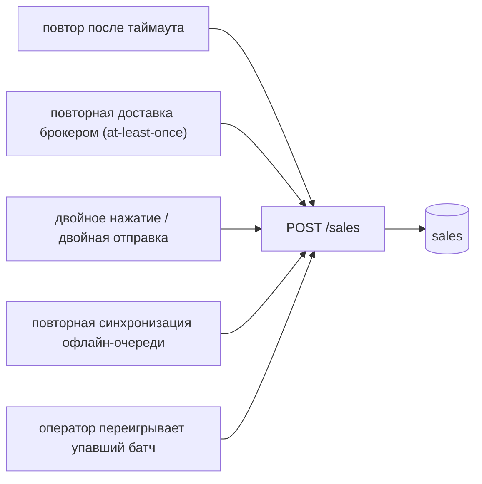
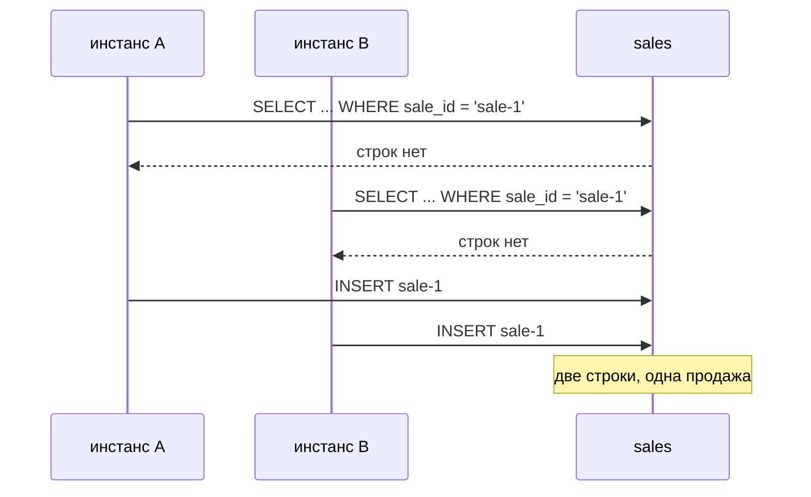
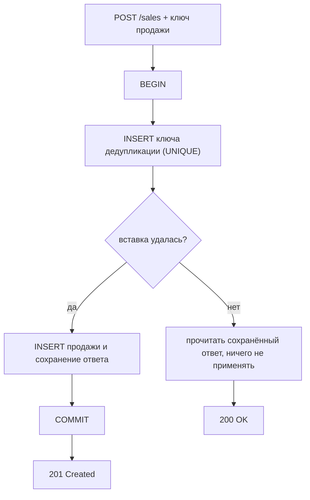

# Как избежать дублей при регистрации продаж

Дубль продажи — это не ошибка в коде, который его создал. Это то, что происходит,
когда корректная система дважды делает безопасное действие. Клиент, повторяющий
запрос после таймаута, ведёт себя правильно. Брокер, доставляющий заново
неподтверждённое сообщение, ведёт себя правильно. Кассир, снова нажимающий
кнопку, потому что экран завис, ведёт себя правильно. **Дубли предотвращаются на
сервере, осознанно, и больше нигде.**

## Откуда берётся вторая копия



Каждая стрелка — то, что нельзя убрать. Заблокировать кнопку, сделать брокер
exactly-once, попросить оператора быть внимательнее — всё это не гарантии, а
лишь снижение вероятности. Дизайн обязан исходить из того, что вторая копия
придёт.

## Единственный важный вопрос: что делает два запроса одной продажей?

Дедупликация — это не приём, а **определение идентичности**, и всё остальное
следует из него. Кандидатов три:

| Идентичность | Кто её назначает | Вердикт |
| --- | --- | --- |
| Ключ, сгенерированный клиентом (`saleId`, `Idempotency-Key`) | устройство, один раз, в момент продажи | ответ по умолчанию |
| Естественный бизнес-ключ (`deviceId` + порядковый номер устройства) | устройство, неявно | не хуже, и сам себя проверяет |
| Хэш тела запроса | никто — он выводится | **неверно** |

Хэш тела — это ловушка, и её стоит уметь объяснить одной фразой: *два покупателя,
купившие один и тот же кофе по одной цене в одну и ту же секунду, — это две
продажи, а не одна.* Равенство содержимого не является идентичностью. Запусти
пример **Дедупликация по хэшу тела** — повтор будет пойман, и вместе с ним
настоящая продажа следующего покупателя, которая затем тихо исчезнет из выручки.
Защита, которая удаляет выручку, хуже дубля, который она предотвратила.

Ключ должен создаваться **один раз на бизнес-действие**, на устройстве, до первой
отправки — и быть одним и тем же на каждой попытке. Кто и когда его генерирует,
подробно разобрано в топике [регистрация продаж при ненадёжном
соединении](topic:sales-api-unreliable-connection); здесь речь о том, что с ним
делает сервер.

## Защита, которая не защищает: сначала проверить, потом вставить

Почти все пишут сначала вот это:

```java
if (!salesRepository.existsBySaleId(saleId)) {   // 1. проверка
    salesRepository.save(sale);                  // 2. действие
}
```

Оно проходит все тесты, которые вы для него напишете, потому что тесты шлют
запросы по одному. Две пересекающиеся доставки его ломают:



Это обычная [гонка check-then-act](topic:race-condition-avoidance), и обратите
внимание: два инстанса для неё не нужны — хватит двух потоков в одном инстансе
или одного инстанса и повтора от планировщика. Повышение уровня изоляции тоже не
спасёт: при [MVCC](topic:mvcc) каждая транзакция читает свой снимок, поэтому ни
один `SELECT` не видит незакоммиченную строку другого (см. [уровни изоляции в
PostgreSQL](topic:postgresql-isolation-levels)). Правило то же, благодаря
которому работает [compare-and-set](topic:compare-and-set): **проверка и запись
должны быть одной неделимой операцией.**

## Защита, которая защищает: пусть идентичность обеспечивает база

Повесьте ограничение `UNIQUE` на колонку идентичности — и гонка перестанет быть
вашей проблемой, база сериализует её за вас:

```sql
ALTER TABLE sales ADD CONSTRAINT uq_sales_sale_id UNIQUE (sale_id);
```

Дальше выберите один из двух вариантов записи:

```sql
-- 1. Вставить и обработать нарушение: вы узнаете, выиграли ли вы.
INSERT INTO sales (sale_id, device_id, item, amount) VALUES (?, ?, ?, ?);
-- при SQLState 23505 -> прочитать существующую строку и вернуть сохранённый ответ

-- 2. Upsert: один оператор, без исключения; 0 затронутых строк означает «уже есть».
INSERT INTO sales (sale_id, device_id, item, amount) VALUES (?, ?, ?, ?)
ON CONFLICT (sale_id) DO NOTHING;
```

Оба варианта корректны. Разница в удобстве: upsert избавляет от исключения на
нормальном пути, а явный `INSERT` позволяет легко отличить «я зарегистрировал»
от «оно уже было» — это нужно, если ответы в этих случаях разные. Ограничение
опирается на уникальный индекс, поэтому поиск и так дёшев (см. [индексы в базе
данных](topic:database-indexes)).

Рабочую реализацию от хорошей отличают две детали:

- **Возвращайте сохранённый ответ, а не просто пропускайте запрос.** Повтор
  должен получить тот же ответ, что и оригинал: тот же id чека, то же тело. Тихое
  «OK, делать нечего» лишает клиента возможности напечатать чек и отличить успех
  от проглоченной ошибки. Хранение `ключ -> (статус, ответ)` — это и есть то, что
  превращает *дедупликацию* в *идемпотентность*.
- **Известный ключ с другим телом — не повтор.** Это баг клиента: ключ
  переиспользовали для новой продажи. Отвечайте `409 Conflict` и делайте баг
  заметным; возврат старого ответа удалил бы настоящую вторую продажу. Пример
  **Тот же ключ, другое тело** показывает ровно этот случай.

Распределённая блокировка на уровне приложения (Redis, ZooKeeper) может снизить
конкуренцию перед всем этим, но источником истины она не является никогда:
блокировки истекают, клиенты падают, удерживая их, а сервис блокировок — вторая
система, которая может разойтись с вашей базой. См. [Redis против PostgreSQL для
уникальных значений](topic:redis-vs-postgresql-uniqueness) и [оптимистичные и
пессимистичные блокировки](topic:optimistic-vs-pessimistic-locking).

## Атомарность: запись дедупликации и продажа — одна запись



`BEGIN`/`COMMIT` вокруг обеих записей — не украшение. Разнесите их по двум
транзакциям, и вы получите один из двух сбоев, в зависимости от порядка:

- **Сначала строка дедупликации, потом продажа.** Падение между ними оставляет
  ключ без продажи. Теперь на любой повтор отвечают «уже зарегистрировано» для
  продажи, которой не существует, и деньги пропали без единой ошибки где-либо.
  Запусти пример **Две транзакции вместо одной** — это самый тихий сбой во всём
  топике, потому что никакое исключение не логируется, а счётчики дедупликации
  выглядят здоровыми.
- **Сначала продажа, потом строка дедупликации.** Падение между ними оставляет
  продажу без ключа, поэтому повтор зарегистрирует её ещё раз — и вы снова с
  дублями.

Когда обе записи живут в одной базе, это бесплатно: это та самая атомарность,
которая уже есть у вас по [ACID](topic:acid-principles), а в Spring — одна
граница [`@Transactional`](topic:spring-transactional-proxy). Проще всего —
чтобы уникальный ключ нёс сам столбец таблицы продаж: тогда писать нужно всего
одну строку.

## Окно дедупликации: сколько живут ключи?

Ключи нельзя хранить вечно, и окно хранения — не деталь, а часть гарантии.
Правило такое:

> Окно хранения должно переживать самый долгий возможный повтор, а не средний.

Касса, выключенная и убранная в ящик на длинные выходные; телефон курьера без
связи двое суток; оператор, переигрывающий упавший батч прошлой недели — все они
повторяют запрос с ключом, который вы, возможно, уже удалили, и защита тогда
считает дубль новой продажей. Тридцать–девяносто дней — нормальное окно, тридцать
минут — нет. Запусти пример **Слишком ранняя очистка ключей**, чтобы увидеть, как
дыра открывается снова.

Если хранить ключи дорого, учтите, что отдельное хранилище обычно и не нужно:
если ограничение уникальности стоит на таблице продаж, то строки продаж *и есть*
индекс дедупликации, а их вы храните в любом случае.

## Дубли, которые вообще не проходят через ваш HTTP API

- **Повторная доставка брокером.** Kafka и RabbitMQ дают at-least-once: консьюмер,
  упавший после обработки, но до подтверждения, увидит сообщение снова. У решения
  на стороне консьюмера есть имя — [Inbox](topic:inbox-pattern) — и механизм тот
  же: уникальный id сообщения, записанный в той же транзакции, что и эффект.
  «Exactly-once semantics» в Kafka — это exactly-once *обработка внутри Kafka*, а
  не exactly-once эффекты в вашей базе (см. [Kafka против
  RabbitMQ](topic:kafka-vs-rabbitmq)).
- **Ваша собственная публикация.** Если регистрация продажи ещё и порождает
  событие, не отправляйте его встроенно — записывайте его вместе с продажей через
  [Outbox](topic:outbox-pattern), который доставляет at-least-once и потому
  требует дедуплицирующего консьюмера на другом конце.
- **Побочные эффекты вниз по цепочке.** Повтор, корректно дедуплицированный на
  эндпоинте продаж, всё ещё может дважды списать остаток на складе или дважды
  провести оплату, если эти вызовы делаются до проверки дедупликации или делаются
  неидемпотентно. Пробрасывайте ключ продажи в каждый вызов вниз по цепочке и
  дайте каждому сервису дедуплицировать по нему.

## Как найти дубли, которые у вас уже есть

Предотвращение — только половина работы; надо ещё знать, сработало ли оно:

```sql
SELECT sale_id, COUNT(*)
FROM sales
GROUP BY sale_id
HAVING COUNT(*) > 1;
```

Запускайте это как задачу с мониторингом, а не один раз. Дополните сверкой с
устройствами («касса говорит 214 продаж за день, на сервере 216»), потому что
устройство с затёртой очередью даёт обратную ошибку — пропавшую продажу, — и
никакой ключ идемпотентности о ней не расскажет.

## Ответ на собеседовании за 60 секунд

> Дубли приходят по причинам, которые я не контролирую: повторы, повторная
> доставка брокером, двойные нажатия, повторная синхронизация офлайн-очередей —
> поэтому я предотвращаю их на сервере. У продажи есть явная идентичность,
> сгенерированная клиентом один раз в момент продажи и неизменно переносимая в
> каждую попытку; я никогда не дедуплицирую по хэшу тела, потому что две
> одинаковые покупки — это две продажи. На эту идентичность в базе стоит
> ограничение `UNIQUE`, а запись — это либо INSERT, чьё нарушение ограничения я
> перехватываю, либо upsert с `ON CONFLICT DO NOTHING`. Схему «проверить, потом
> вставить» я не использую: два одновременных запроса оба проходят проверку, а
> из-за MVCC повышение уровня изоляции не помогает — проверка должна *быть*
> записью. Запись дедупликации и продажа коммитятся в одной транзакции, иначе
> падение между ними либо дублирует продажу, либо навсегда её проглатывает. На
> повторный запрос возвращается сохранённый ответ, чтобы клиент всё-таки
> напечатал чек, а известный ключ с другим телом получает 409. Ключи хранятся
> дольше самого долгого возможного повтора — недели, а не минуты, — и регулярный
> запрос плюс сверка с устройствами показывают, работает ли всё это на самом
> деле.

## Частые заблуждения

- **«Просто проверь сначала, есть ли такая запись».** Это гонка, а не защита, и
  чтобы её сломать, не нужны ни два инстанса, ни невезение — достаточно
  пересечения во времени.
- **«Уровень изоляции SERIALIZABLE решает проблему».** Он превращает дубль в
  ошибку сериализации, которую надо ловить и повторять — так что ограничение
  уникальности всё равно нужно, а заплатили вы дважды.
- **«Дедуплицируй по телу запроса».** Две одинаковые продажи — это две продажи.
  Такая защита молча уничтожает выручку, что строго хуже дубля.
- **«Клиент просто не должен повторять запросы».** Тогда потерянный ответ
  становится потерянной продажей. Повтор — корректное поведение; его надо
  сделать безопасным, а не запретить.
- **«Достаточно блокировки в Redis».** Блокировка — оптимизация поверх
  ограничения. Если блокировка истечёт раньше времени или Redis переключится на
  реплику, устоит именно ограничение.
- **«Доставка exactly-once решила бы всё».** Её не существует в сети, которую вы
  не контролируете. У вас есть доставка at-least-once плюс идемпотентный эффект,
  и эту комбинацию называют effectively-once.
- **«У нас первичный ключ — UUID, поэтому дубли невозможны».** UUID,
  сгенерированный *сервером на каждый запрос*, делает уникальным каждый дубль. Id
  должен приходить от бизнес-действия, а не от обработчика.
