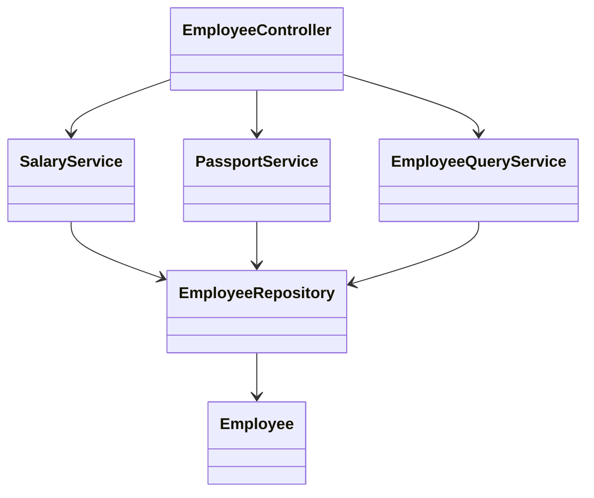

# Employee API: Design

> **Practice mode.** This is a *structural* topic: there is no "Run". You build the
> classes in the file tree on the left, press **Analyze**, and the app compiles your
> code, draws the **class diagram**, and checks the missions against the
> relationships it finds. For the concepts behind it, read
> [Employee API: REST and Separation of Concerns](topic:employee-api-rest-cqrs);
> to implement the command logic, go to
> [Employee API: Commands](topic:employee-api-commands).

## The idea

The task asks for four operations — add, get by id, change salary, change passport
— and notes that **salary and passport are changed by different departments**. Your
job here is to make that department split visible in the *structure* of the code,
not bury it inside one class.

So instead of a single `EmployeeService` with `changeSalary` and `changePassport`
sitting side by side, you split the writes by who owns them:

1. a **`SalaryService`** that owns `changeSalary` (payroll),
2. a **`PassportService`** that owns `changePassport` (HR),
3. an **`EmployeeQueryService`** for the read side (`getCard`),
4. an **`EmployeeController`** that holds all three and delegates to the right one.

All of them talk to the same `EmployeeRepository`. The point isn't the repository —
it's that each *reason to change* lives in its own class.

## The target shape



- `Employee`, `EmployeeRepository` — **given** to you and complete; don't change
  them.
- `SalaryService` — you add it; it holds an `EmployeeRepository` field and exposes
  `changeSalary(id, amount)`.
- `PassportService` — you add it; it holds an `EmployeeRepository` field and exposes
  `changePassport(id, number, date)`.
- `EmployeeQueryService` — you add it; it holds an `EmployeeRepository` field and
  returns the card for `getCard(id)`.
- `EmployeeController` — currently an empty stub; give it fields for the three
  services and delegate.

The missions pass when the diagram shows each service composing the repository and
the controller composing **both** write services.

## How to build it

In a service, "holds an `EmployeeRepository`" means a field of that type — that is
what the analyzer reads as an association edge:

```java
public class SalaryService {
    private final EmployeeRepository repository;

    public SalaryService(EmployeeRepository repository) {
        this.repository = repository;
    }

    public void changeSalary(Long id, long newSalary) {
        Employee e = repository.findById(id).orElseThrow();
        e.setSalary(newSalary);
        repository.save(e);
    }
}
```

`PassportService` and `EmployeeQueryService` follow the same shape. Then the
controller holds all three:

```java
public class EmployeeController {
    private final SalaryService salaryService;
    private final PassportService passportService;
    private final EmployeeQueryService queryService;
    // constructor + delegating methods
}
```

## 60-second interview answer

> The four operations split into two write concerns and one read concern. Because
> salary and passport are owned by different departments, I put each write in its
> own service — `SalaryService` and `PassportService` — so each has a single
> responsibility, its own validation and its own audit, and neither knows about the
> other's data. A separate `EmployeeQueryService` returns the response card. The
> controller is thin: it just holds the three services and routes each endpoint to
> the right one. All three go through one `EmployeeRepository`; if the departments
> later needed isolated storage I could split that too.

## Common traps

- ❌ **One `EmployeeService` with both methods.** It compiles and works, but it hides
  the very separation the task is testing — two unrelated reasons to change in one
  class.
- ❌ **Putting logic in the controller.** The controller should delegate, not mutate
  employees itself. Keep the change logic in the services.
- ❌ **A service that touches both salary and passport.** That re-merges the concerns
  you were asked to split.
- ❌ **No read side.** Returning the entity straight from a write service couples
  reads to writes; a small query service keeps the card mapping in one place.
