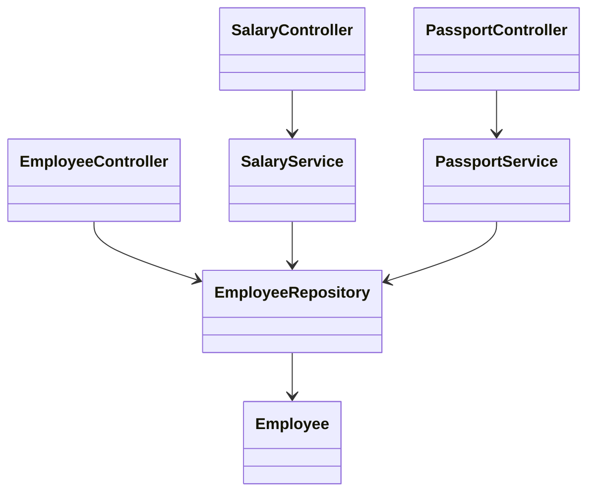

# Employee API: Design

> **Practice mode.** This is a *structural* topic: there is no "Run". You build the
> classes in the file tree on the left, press **Analyze**, and the app compiles your
> code, draws the **class diagram**, and checks the missions against the
> relationships it finds. For the concepts behind it, read
> [Employee API: REST and Separation of Concerns](topic:employee-api-rest-cqrs);
> to implement the command logic, go to
> [Employee API: Commands](topic:employee-api-commands).

## The idea

The task asks for four operations — add, get by id, change salary, change passport
— and notes that **salary and passport are changed by different departments**. Your
job here is to make that department split visible in the *structure* of the code,
and to carry it through **every layer**, not bury it inside one class.

Because payroll and HR are different callers with different permissions, you split
**both** the API surface and the logic:

1. a **`SalaryController` → `SalaryService`** stack (payroll owns `changeSalary`),
2. a **`PassportController` → `PassportService`** stack (HR owns `changePassport`),
3. a general **`EmployeeController`** for create and read (given to you, complete).

Each controller delegates to its own service, and each service talks to the shared
`EmployeeRepository`. The point isn't the repository — it's that each *reason to
change* has its own controller and its own service.

## The target shape



- `Employee`, `EmployeeRepository`, `EmployeeController` — **given** and complete;
  don't change them. `EmployeeController` is the general resource (create + read)
  and is there as a reference for the shape you'll repeat.
- `SalaryController` — you add it; it holds a `SalaryService` field and delegates
  `changeSalary`.
- `SalaryService` — you add it; it holds an `EmployeeRepository` field and does the
  salary update.
- `PassportController` / `PassportService` — the same stack for the passport
  concern.

The missions pass when the diagram shows two separate controller→service→repository
stacks, one per department.

## How to build it

Each layer "holds" the next as a field — that is what the analyzer reads as an
association edge. The service does the work:

```java
public class SalaryService {
    private final EmployeeRepository repository;

    public SalaryService(EmployeeRepository repository) {
        this.repository = repository;
    }

    public void changeSalary(Long id, long newSalary) {
        Employee e = repository.findById(id).orElseThrow();
        e.setSalary(newSalary);
        repository.save(e);
    }
}
```

…and the controller stays thin, just delegating to its service:

```java
public class SalaryController {
    private final SalaryService salaryService;

    public SalaryController(SalaryService salaryService) {
        this.salaryService = salaryService;
    }

    // PATCH /employees/{id}/salary
    public void changeSalary(Long id, long newSalary) {
        salaryService.changeSalary(id, newSalary);
    }
}
```

`PassportController` and `PassportService` follow the identical shape for the
passport fields.

## 60-second interview answer

> The four operations split into two department concerns plus a general one. Because
> salary and passport are owned by different departments, I split both layers: a
> `SalaryController` over a `SalaryService`, and a `PassportController` over a
> `PassportService`, so each department has its own independently securable endpoint
> *and* its own single-responsibility logic with its own validation and audit. A
> general `EmployeeController` handles create and read. Every controller is thin and
> just delegates; the change logic lives in the services; all of them go through one
> `EmployeeRepository`, which I could later split per department if needed.

## Common traps

- ❌ **One `EmployeeController` with both update endpoints.** It works, but it merges
  two departments' API surface and two security rules into one class — exactly the
  separation the task is testing.
- ❌ **Splitting controllers but sharing one `EmployeeService`.** The boundary leaks
  back at the service layer; split both so each concern is isolated end to end.
- ❌ **Putting logic in the controller.** Controllers should delegate, not mutate
  employees. Keep the change logic in the services.
- ❌ **A service that touches both salary and passport.** That re-merges the concerns
  you were asked to split.
