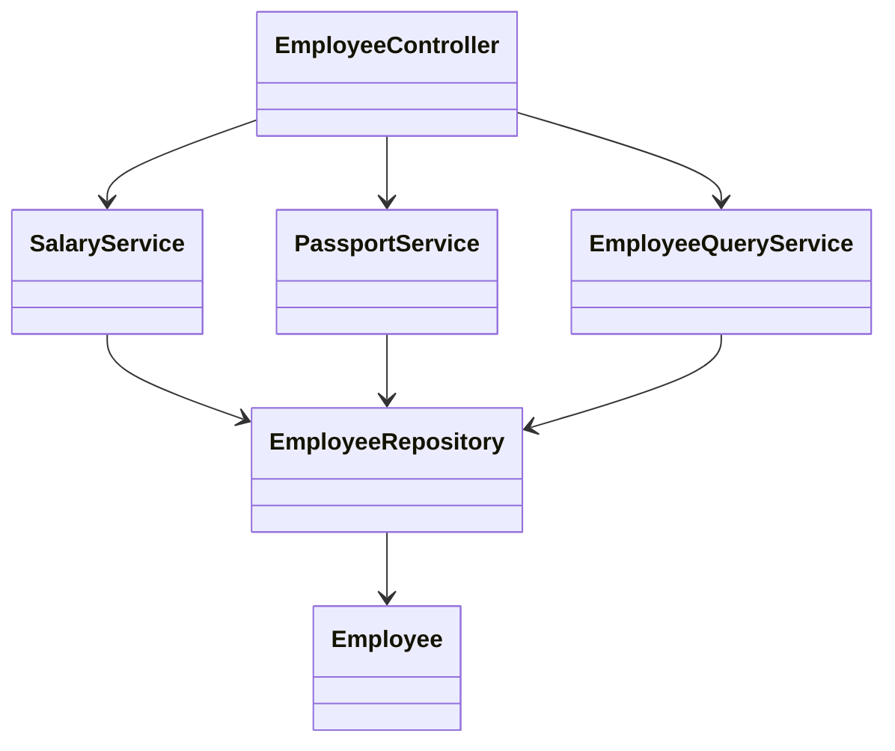

# API сотрудника: Дизайн

> **Режим практики.** Это *structural*-тема: кнопки «Run» нет. Ты собираешь классы
> в дереве файлов слева, жмёшь **Analyze**, и приложение компилирует твой код,
> рисует **диаграмму классов** и проверяет миссии по найденным связям. Концепции —
> в теме [API сотрудника: REST и разделение ответственности](topic:employee-api-rest-cqrs);
> чтобы реализовать логику команд — в
> [API сотрудника: Команды](topic:employee-api-commands).

## Идея

Задача просит четыре операции — добавить, получить по id, изменить зарплату,
изменить паспорт — и отмечает, что **зарплату и паспорт меняют разные отделы**.
Твоя цель здесь — сделать это разнесение по отделам видимым в *структуре* кода, а
не спрятать внутри одного класса.

Поэтому вместо единственного `EmployeeService` с лежащими рядом `changeSalary` и
`changePassport` ты разделяешь записи по тому, кто ими владеет:

1. **`SalaryService`**, который владеет `changeSalary` (расчётный отдел),
2. **`PassportService`**, который владеет `changePassport` (кадры),
3. **`EmployeeQueryService`** для стороны чтения (`getCard`),
4. **`EmployeeController`**, который держит все три и делегирует нужному.

Все они общаются с одним `EmployeeRepository`. Дело не в репозитории — дело в том,
что каждая *причина меняться* живёт в своём классе.

## Целевая форма



- `Employee`, `EmployeeRepository` — **даны** и готовы; не меняй их.
- `SalaryService` — добавляешь ты; держит поле `EmployeeRepository` и предоставляет
  `changeSalary(id, amount)`.
- `PassportService` — добавляешь ты; держит поле `EmployeeRepository` и
  предоставляет `changePassport(id, number, date)`.
- `EmployeeQueryService` — добавляешь ты; держит поле `EmployeeRepository` и
  возвращает карточку для `getCard(id)`.
- `EmployeeController` — пока пустая заглушка; дай ему поля под три сервиса и
  делегируй.

Миссии зачтены, когда диаграмма показывает, что каждый сервис композирует
репозиторий, а контроллер композирует **оба** сервиса записи.

## Как это собрать

В сервисе «держит `EmployeeRepository`» означает поле этого типа — именно его
анализатор читает как ребро-ассоциацию:

```java
public class SalaryService {
    private final EmployeeRepository repository;

    public SalaryService(EmployeeRepository repository) {
        this.repository = repository;
    }

    public void changeSalary(Long id, long newSalary) {
        Employee e = repository.findById(id).orElseThrow();
        e.setSalary(newSalary);
        repository.save(e);
    }
}
```

`PassportService` и `EmployeeQueryService` строятся так же. Затем контроллер держит
все три:

```java
public class EmployeeController {
    private final SalaryService salaryService;
    private final PassportService passportService;
    private final EmployeeQueryService queryService;
    // конструктор + делегирующие методы
}
```

## Ответ за 60 секунд

> Четыре операции делятся на две зоны записи и одну зону чтения. Поскольку зарплата
> и паспорт принадлежат разным отделам, каждую запись я кладу в свой сервис —
> `SalaryService` и `PassportService` — чтобы у каждого была единственная
> ответственность, своя валидация и свой аудит, и ни один не знал о данных другого.
> Отдельный `EmployeeQueryService` возвращает карточку ответа. Контроллер тонкий: он
> лишь держит три сервиса и направляет каждый эндпоинт нужному. Все три идут через
> один `EmployeeRepository`; если отделам позже понадобится изолированное хранилище,
> я смогу разделить и его.

## Типичные ловушки

- ❌ **Один `EmployeeService` с обоими методами.** Компилируется и работает, но
  прячет ровно то разделение, которое проверяет задача — две несвязанные причины
  меняться в одном классе.
- ❌ **Логика в контроллере.** Контроллер должен делегировать, а не менять
  сотрудников сам. Держи логику изменений в сервисах.
- ❌ **Сервис, который трогает и зарплату, и паспорт.** Это снова склеивает зоны,
  которые просили разделить.
- ❌ **Нет стороны чтения.** Возврат сущности прямо из сервиса записи связывает
  чтение с записью; маленький query-сервис держит маппинг карточки в одном месте.
