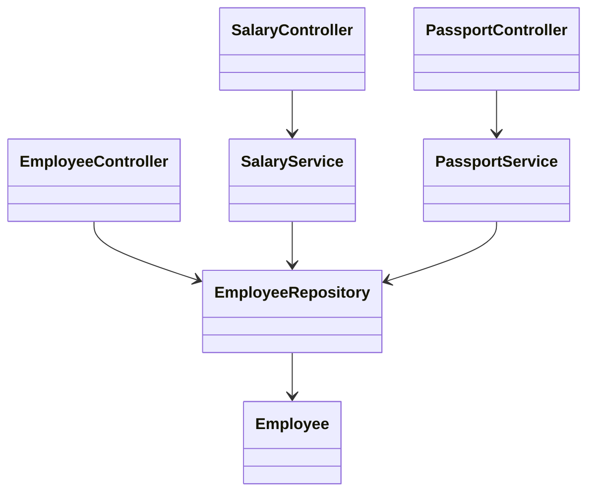

# API сотрудника: Дизайн

> **Режим практики.** Это *structural*-тема: кнопки «Run» нет. Ты собираешь классы
> в дереве файлов слева, жмёшь **Analyze**, и приложение компилирует твой код,
> рисует **диаграмму классов** и проверяет миссии по найденным связям. Концепции —
> в теме [API сотрудника: REST и разделение ответственности](topic:employee-api-rest-cqrs);
> чтобы реализовать логику команд — в
> [API сотрудника: Команды](topic:employee-api-commands).

## Идея

Задача просит четыре операции — добавить, получить по id, изменить зарплату,
изменить паспорт — и отмечает, что **зарплату и паспорт меняют разные отделы**.
Твоя цель здесь — сделать это разнесение по отделам видимым в *структуре* кода и
провести его через **каждый слой**, а не прятать внутри одного класса.

Поскольку расчётный отдел и кадры — это разные вызывающие с разными правами, ты
разделяешь **и** поверхность API, **и** логику:

1. стек **`SalaryController` → `SalaryService`** (расчётный отдел владеет
   `changeSalary`),
2. стек **`PassportController` → `PassportService`** (кадры владеют
   `changePassport`),
3. общий **`EmployeeController`** для создания и чтения (дан тебе готовым).

Каждый контроллер делегирует своему сервису, а каждый сервис общается с общим
`EmployeeRepository`. Дело не в репозитории — дело в том, что у каждой *причины
меняться* свой контроллер и свой сервис.

## Целевая форма



- `Employee`, `EmployeeRepository`, `EmployeeController` — **даны** и готовы; не
  меняй их. `EmployeeController` — это общий ресурс (создание + чтение), он здесь
  как образец формы, которую ты повторишь.
- `SalaryController` — добавляешь ты; держит поле `SalaryService` и делегирует
  `changeSalary`.
- `SalaryService` — добавляешь ты; держит поле `EmployeeRepository` и выполняет
  изменение зарплаты.
- `PassportController` / `PassportService` — такой же стек для паспортной зоны.

Миссии зачтены, когда диаграмма показывает два отдельных стека
контроллер→сервис→репозиторий, по одному на отдел.

## Как это собрать

Каждый слой «держит» следующий полем — именно это анализатор читает как
ребро-ассоциацию. Работу выполняет сервис:

```java
public class SalaryService {
    private final EmployeeRepository repository;

    public SalaryService(EmployeeRepository repository) {
        this.repository = repository;
    }

    public void changeSalary(Long id, long newSalary) {
        Employee e = repository.findById(id).orElseThrow();
        e.setSalary(newSalary);
        repository.save(e);
    }
}
```

…а контроллер остаётся тонким и лишь делегирует своему сервису:

```java
public class SalaryController {
    private final SalaryService salaryService;

    public SalaryController(SalaryService salaryService) {
        this.salaryService = salaryService;
    }

    // PATCH /employees/{id}/salary
    public void changeSalary(Long id, long newSalary) {
        salaryService.changeSalary(id, newSalary);
    }
}
```

`PassportController` и `PassportService` строятся точно так же для паспортных полей.

## Ответ за 60 секунд

> Четыре операции делятся на две зоны отделов плюс общую. Поскольку зарплата и
> паспорт принадлежат разным отделам, я разделяю оба слоя: `SalaryController` над
> `SalaryService` и `PassportController` над `PassportService`, чтобы у каждого
> отдела был свой независимо защищаемый эндпоинт *и* своя логика с единственной
> ответственностью, своей валидацией и аудитом. Общий `EmployeeController` отвечает
> за создание и чтение. Каждый контроллер тонкий и лишь делегирует; логика изменений
> живёт в сервисах; все они идут через один `EmployeeRepository`, который при
> необходимости можно потом разделить по отделам.

## Типичные ловушки

- ❌ **Один `EmployeeController` с обоими эндпоинтами изменений.** Работает, но
  смешивает поверхность API двух отделов и два правила безопасности в одном классе —
  ровно то разделение, которое проверяет задача.
- ❌ **Разделить контроллеры, но делить один `EmployeeService`.** Граница утекает
  обратно на слое сервисов; разделяй оба слоя, чтобы каждая зона была изолирована
  насквозь.
- ❌ **Логика в контроллере.** Контроллеры должны делегировать, а не менять
  сотрудников. Держи логику изменений в сервисах.
- ❌ **Сервис, который трогает и зарплату, и паспорт.** Это снова склеивает зоны,
  которые просили разделить.
