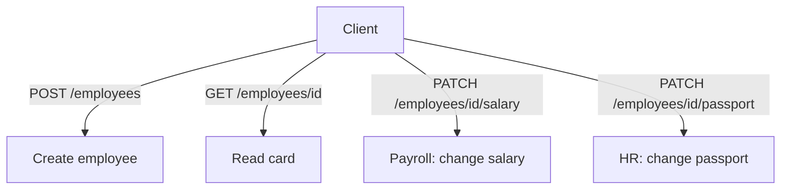
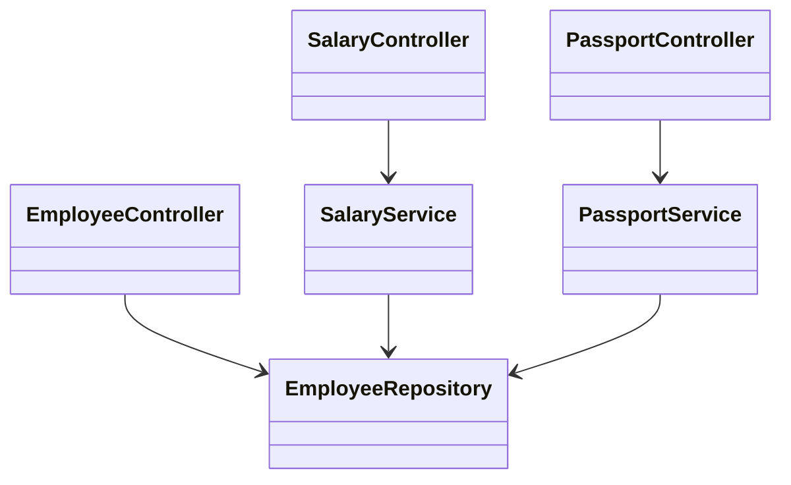

# Employee API: REST and Separation of Concerns

> **Theory topic.** There is nothing to run here — read the idea, then do the Boss
> Fight. To *design the classes* go to [Employee API: Design](topic:employee-api-design);
> to *implement the command logic* go to [Employee API: Commands](topic:employee-api-commands).

## The task, and what it is really testing

> Create an API for an employee. We must be able to add a new employee, change an
> employee's salary, change their passport data, and get an employee by id. The
> response card is: `name`, `surname`, `passportNumber`, `passportDate`, `salary`.

On the surface this is plain CRUD. The interesting sentence is the note at the end:

> Salary changes and passport changes are made by **different departments**, and
> may require a **separation of responsibility** in the architecture.

That note is the whole point. The interviewer wants to see whether you reach for
one fat "update the employee" endpoint, or whether you model the two changes as
**separate operations owned by separate parts of the system**. A junior answer is
a single `PUT /employees/{id}` that overwrites every field. A stronger answer
splits the writes by *who* does them and *why* they change.

## RESTful shape of the four operations

Model the employee as a resource and use HTTP methods for their meaning:

| Operation | Method + path | Notes |
|---|---|---|
| Add employee | `POST /employees` | returns `201 Created` + `Location: /employees/{id}` |
| Get by id | `GET /employees/{id}` | returns the card, or `404` |
| Change salary | `PATCH /employees/{id}/salary` | partial update of one concern |
| Change passport | `PATCH /employees/{id}/passport` | partial update of another concern |

Why `PATCH` on **sub-resources** and not one `PUT`:

- A `PUT` replaces the whole resource, so the caller must send *every* field. The
  payroll department would then have to send passport data it has no business
  touching, and vice versa.
- Separate paths make the two concerns independently authorizable: `PATCH
  …/salary` for role `PAYROLL`, `PATCH …/passport` for role `HR`.
- `PATCH` is the honest verb for "change part of this resource".

## Separation of concerns: commands, not setters

The note about different departments is an invitation to talk about **Command–Query
Separation (CQS)** and the **Single Responsibility Principle**. Instead of one
mutable "god setter", you express each change as its own command, handled by its
own service:

- `SalaryService.changeSalary(id, amount)` — owned by payroll. It can carry payroll
  rules (caps, approval, audit) without knowing anything about passports.
- `PassportService.changePassport(id, number, date)` — owned by HR/compliance. It can
  validate passport format and effective dates.
- `EmployeeController` — the general employee resource: create and read the card.

Each service has its **own reason to change** (that is the SRP test). In a larger
system these could even be separate bounded contexts, separate tables, or separate
deployables — but even in one module, keeping the two commands apart is the win the
note is asking for.

## Split the controllers too, not just the services

The "different departments" hint reaches the **API layer**, not only the services.
Because payroll and HR are different *callers* with different permissions, it is
usually stronger to give each department its **own controller** — `SalaryController`
(role `PAYROLL`) and `PassportController` (role `HR`) — each delegating to its own
service, with `EmployeeController` left for the general create/read of the resource.

Two layouts are both legitimate REST; know the trade-off:

- **One `EmployeeController` with sub-resources** (`PATCH /employees/{id}/salary`,
  `…/passport`). Pros: everything about the `employees` resource lives in one
  cohesive place. Cons: one class mixes two departments' concerns and two security
  rules; it grows as more per-department actions appear.
- **Separate controllers per department.** Pros: the department boundary is explicit
  in the code, each controller is independently securable, documentable, and even
  separately deployable later; each stays small and single-responsibility. Cons: a
  few more classes, and you must keep the URL design consistent across them.

Given that the task *explicitly* names different departments, splitting the
controllers is the answer that shows you heard the hint — the separation then runs
all the way through: **controller → service**, per department.

## The response card is a DTO, not the entity

The "card" — `name, surname, passportNumber, passportDate, salary` — is a **response
DTO**. Keep it distinct from the `Employee` entity:

- The entity may have more fields (id, audit columns, internal flags) that you do
  not want to leak over the wire.
- The two write commands take **their own request models** (`ChangeSalaryRequest`,
  `ChangePassportRequest`), not the full card — so each department sends only what
  it owns.
- Mapping entity → card happens in one place, so the API contract is stable even if
  the entity changes.

## 60-second interview answer

> I'd model the employee as a REST resource. `POST /employees` creates it and
> returns `201` with a `Location`; `GET /employees/{id}` returns the card DTO or
> `404`. For the two updates I would *not* use one `PUT` — the note says salary and
> passport are owned by different departments, so I'd expose `PATCH
> /employees/{id}/salary` and `PATCH /employees/{id}/passport` as separate
> sub-resources, each taking its own small request body and each independently
> authorizable. I'd carry that split into the code: a `SalaryController` and a
> `PassportController` per department, each delegating to its own `SalaryService`
> or `PassportService` command, while a general `EmployeeController` handles create
> and read. Each piece has a single responsibility and its own validation. The
> response card is a DTO mapped from the entity, never the entity itself.

## Common traps

- ❌ **One `PUT` for everything.** Forces every caller to send all fields and erases
  the department boundary the task highlights.
- ❌ **Returning the entity directly.** Leaks internal fields and couples the API
  contract to your persistence model. Map to the card DTO.
- ❌ **`POST` for the updates.** Use `PATCH` (or `PUT` on a sub-resource) for
  changing an existing employee; reserve `POST /employees` for creation.
- ❌ **Ignoring the hint.** If you never mention separation of concerns / CQS /
  responsibility split, you answered a different (easier) question than the one
  asked.
- ❌ **No validation or status codes.** Salary ≥ 0, passport format/date, `404` for
  unknown id, `201` + `Location` on create — these signal you've built real APIs.
