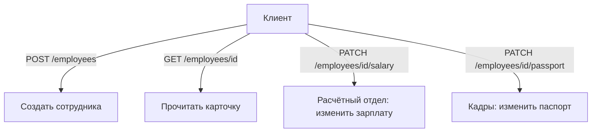
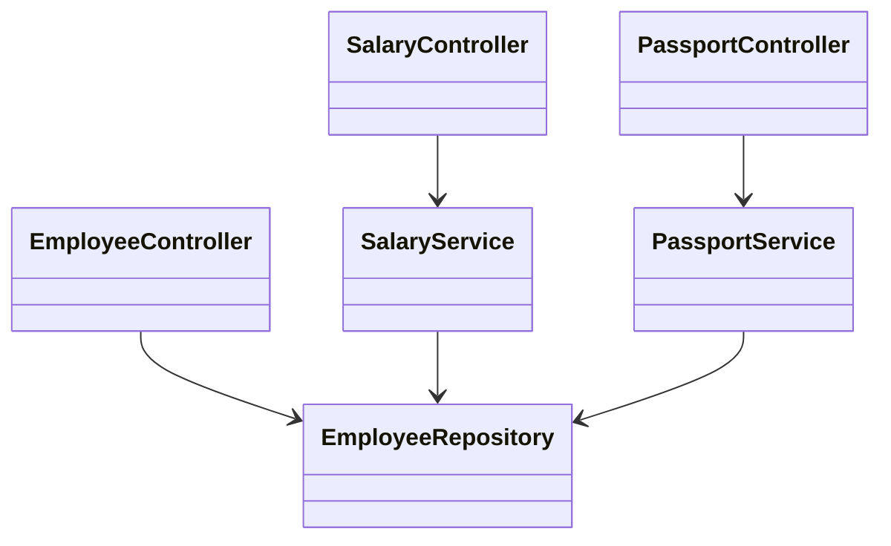

# API сотрудника: REST и разделение ответственности

> **Теоретическая тема.** Здесь нечего запускать — прочитай идею и пройди Boss
> Fight. Чтобы *спроектировать классы*, перейди в
> [API сотрудника: Дизайн](topic:employee-api-design); чтобы *реализовать логику
> команд* — в [API сотрудника: Команды](topic:employee-api-commands).

## Задача и что на самом деле проверяют

> Создать API для работы с сотрудником. Нужно уметь добавить нового сотрудника,
> изменить ему зарплату, изменить паспортные данные и получить сотрудника по id.
> Карточка ответа: `name`, `surname`, `passportNumber`, `passportDate`, `salary`.

На первый взгляд это обычный CRUD. Самое интересное — фраза в конце:

> Изменение зарплаты и изменение паспорта производят **разные отделы**, и это
> может потребовать **разделения ответственности** в архитектуре.

Именно в этой фразе вся суть. Интервьюер хочет увидеть, потянешься ли ты к одному
«толстому» эндпоинту обновления сотрудника, или смоделируешь два изменения как
**отдельные операции, принадлежащие разным частям системы**. Junior-ответ — один
`PUT /employees/{id}`, перезаписывающий все поля. Более сильный ответ разделяет
записи по тому, *кто* их делает и *почему* они меняются.

## RESTful-форма четырёх операций

Смоделируй сотрудника как ресурс и используй HTTP-методы по их смыслу:

| Операция | Метод + путь | Примечания |
|---|---|---|
| Добавить сотрудника | `POST /employees` | возвращает `201 Created` + `Location: /employees/{id}` |
| Получить по id | `GET /employees/{id}` | возвращает карточку или `404` |
| Изменить зарплату | `PATCH /employees/{id}/salary` | частичное изменение одной зоны ответственности |
| Изменить паспорт | `PATCH /employees/{id}/passport` | частичное изменение другой зоны ответственности |

Почему `PATCH` по **под-ресурсам**, а не один `PUT`:

- `PUT` заменяет ресурс целиком, поэтому вызывающий обязан прислать *все* поля.
  Тогда расчётному отделу пришлось бы слать паспортные данные, которых он касаться
  не должен, и наоборот.
- Отдельные пути позволяют выдавать права независимо: `PATCH …/salary` для роли
  `PAYROLL`, `PATCH …/passport` для роли `HR`.
- `PATCH` — честный глагол для «изменить часть этого ресурса».

## Разделение ответственности: команды, а не сеттеры

Заметка про разные отделы — это приглашение поговорить про **разделение команд и
запросов (CQS)** и **принцип единственной ответственности (SRP)**. Вместо одного
изменяемого «god-сеттера» каждое изменение выражается своей командой, которую
обрабатывает свой сервис:

- `SalaryService.changeSalary(id, amount)` — принадлежит расчётному отделу. Может
  нести правила зарплаты (лимиты, согласование, аудит), ничего не зная про паспорта.
- `PassportService.changePassport(id, number, date)` — принадлежит кадрам/комплаенсу.
  Может валидировать формат паспорта и даты.
- `EmployeeController` — общий ресурс сотрудника: создание и чтение карточки.

У каждого сервиса **своя причина меняться** (это и есть проверка по SRP). В большой
системе это могли бы быть отдельные bounded contexts, отдельные таблицы или
отдельные сервисы для развёртывания — но даже в одном модуле разнесение двух команд
и есть тот выигрыш, о котором просит заметка.

## Разноси и контроллеры, не только сервисы

Подсказка про «разные отделы» достаёт до **слоя API**, а не только до сервисов.
Поскольку расчётный отдел и кадры — это разные *вызывающие* с разными правами,
обычно сильнее дать каждому отделу **свой контроллер** — `SalaryController` (роль
`PAYROLL`) и `PassportController` (роль `HR`), каждый делегирует своему сервису, а
`EmployeeController` остаётся для общего создания/чтения ресурса.

Обе раскладки — валидный REST; знай компромисс:

- **Один `EmployeeController` с под-ресурсами** (`PATCH /employees/{id}/salary`,
  `…/passport`). Плюсы: всё про ресурс `employees` живёт в одном когезивном месте.
  Минусы: один класс смешивает зоны двух отделов и два правила безопасности; он
  растёт по мере появления новых действий по отделам.
- **Отдельные контроллеры по отделам.** Плюсы: граница отдела явно видна в коде,
  каждый контроллер независимо защищаем, документируем и потом даже отдельно
  развёртываем; каждый остаётся маленьким и с единственной ответственностью. Минусы:
  чуть больше классов, и нужно держать дизайн URL согласованным между ними.

Раз задача *явно* называет разные отделы, разнесение контроллеров — это ответ,
который показывает, что ты услышал подсказку: разделение тогда идёт насквозь —
**контроллер → сервис**, по отделам.

## Карточка ответа — это DTO, а не сущность

«Карточка» — `name, surname, passportNumber, passportDate, salary` — это **response
DTO**. Держи её отдельно от сущности `Employee`:

- У сущности могут быть лишние поля (id, аудит-колонки, внутренние флаги), которые
  не нужно отдавать наружу.
- Две команды записи принимают **свои request-модели** (`ChangeSalaryRequest`,
  `ChangePassportRequest`), а не всю карточку — чтобы каждый отдел слал только то,
  чем владеет.
- Маппинг сущность → карточка происходит в одном месте, поэтому контракт API
  стабилен, даже если сущность изменится.

## Ответ за 60 секунд

> Я смоделирую сотрудника как REST-ресурс. `POST /employees` создаёт его и
> возвращает `201` с `Location`; `GET /employees/{id}` возвращает карточку-DTO или
> `404`. Для двух изменений я *не* стал бы использовать один `PUT` — в заметке
> сказано, что зарплата и паспорт принадлежат разным отделам, поэтому я выставлю
> `PATCH /employees/{id}/salary` и `PATCH /employees/{id}/passport` как отдельные
> под-ресурсы, каждый со своим небольшим телом запроса и независимой авторизацией.
> Это разделение я проведу и в код: по контроллеру на отдел — `SalaryController` и
> `PassportController`, каждый делегирует своей команде `SalaryService` или
> `PassportService`, а общий `EmployeeController` отвечает за создание и чтение. У
> каждой части единственная ответственность и своя валидация. Карточка ответа — это
> DTO, смаппленный из сущности, а не сама сущность.

## Типичные ловушки

- ❌ **Один `PUT` на всё.** Заставляет каждого слать все поля и стирает границу
  между отделами, которую подсвечивает задача.
- ❌ **Возврат сущности напрямую.** Утечка внутренних полей и привязка контракта API
  к модели хранения. Маппь в DTO-карточку.
- ❌ **`POST` для изменений.** Используй `PATCH` (или `PUT` по под-ресурсу) для
  изменения существующего сотрудника; `POST /employees` оставь для создания.
- ❌ **Игнор подсказки.** Если ты ни разу не упомянул разделение ответственности /
  CQS / разнесение зон, ты ответил на другую (более простую) задачу, чем спросили.
- ❌ **Нет валидации и статус-кодов.** Зарплата ≥ 0, формат/дата паспорта, `404` на
  неизвестный id, `201` + `Location` при создании — это сигналы, что ты строил
  реальные API.
