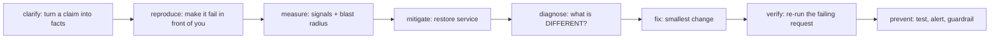
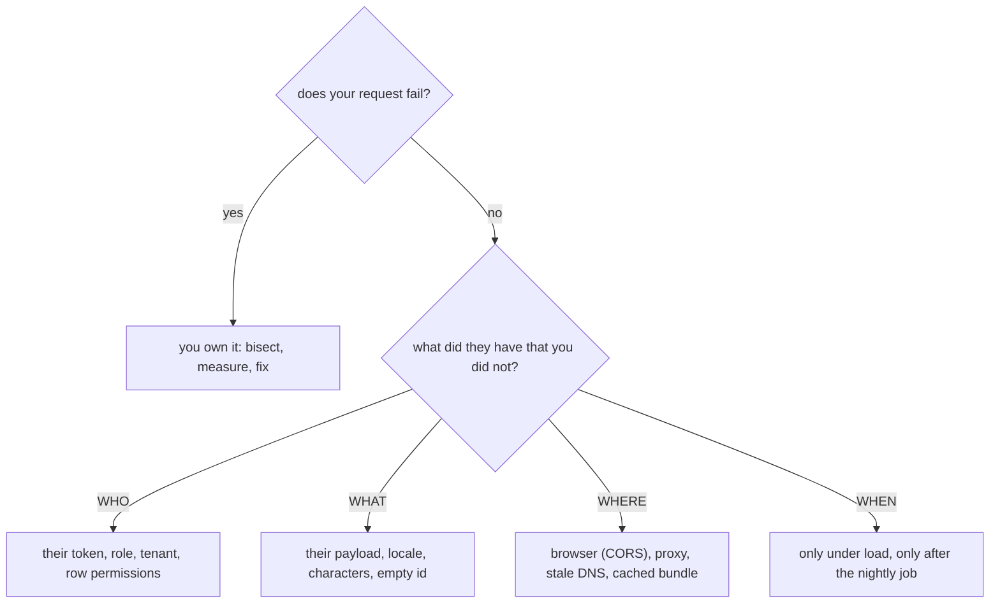
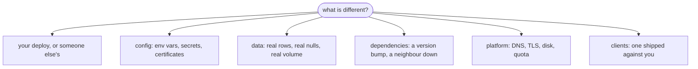

# It Passed Tests and Broke in Production

This is not a question about a bug. It is a question about whether you have a
**procedure** — and the interviewer will hear the answer in your first sentence.
If it starts with "well, it works on my machine" or "I'd look at the code", you
have already answered. If it starts with "first I'd ask which request, and then
I'd try to reproduce it", the rest is detail.

The procedure, in order:

Two rules govern the order. **Nothing before `reproduce` involves your editor**,
and **`mitigate` comes before `diagnose`** whenever the radius is wide — restoring
service and fixing the bug are different jobs with different clocks.

## 1. "Nothing works" is a claim, not a measurement

It is almost never literally true. It usually means one flow, tried once, by one
person, in one browser. But *almost* is not *never*, so the move is not to argue
— it is to convert the sentence into something with a status code in it. Five
questions, asked **together** (asking them one at a time turns a five-minute
triage into an afternoon of ping-pong):

| Question | Why it earns its place |
|---|---|
| **Which** request? Method and path, not "the page" | One screen can fire eight calls; seven may be fine |
| **Who** sees it? One account, one tenant, everyone? | Separates a data/permission bug from an outage |
| **Since when**? Before or after the release? | Decides how strong a suspect your deploy is |
| **What** exactly comes back? | A status, an error code, a `traceId`, the network tab |
| **How often**? Every time, or one in twenty? | Deterministic vs. load-, cache- or instance-dependent |

The single most valuable artefact you can ask for is a **`traceId`** — if your
error responses carry one (see
[managing errors and error codes](topic:api-error-handling)), the whole
investigation collapses into one log query.

And the answer you must not give, however true it is: *"but it passed the
tests."* The reporter never claimed your tests failed. They claimed their users
are stuck. Both statements are true at once — that is precisely what a
production-only bug *is*.

## 2. Reproduce before you touch anything

Until you can send the failing request yourself, you are debugging a sentence.
A reproduction gives you three things at once: the ability to bisect, the ability
to change one variable at a time, and — crucially — **the thing you will re-run
later to prove the fix**.

If it reproduces, the incident is yours. If it does **not**, that is a narrowing,
not a dead end: whatever is broken needs something you did not send.

The **WHERE** branch is worth rehearsing, because a browser-only failure looks
exactly like a broken endpoint and is not one: a missing `Access-Control-Allow-Origin`
makes `curl` succeed and the app fail — see [CORS](topic:cors) and
[preflight requests](topic:preflight-requests). Likewise a client holding a
cached bundle that calls your previous path, which is why
[how the frontend and the backend talk](topic:frontend-backend-interaction)
matters here.

## 3. Ask the graphs before you ask the code

Read the boring signals first. Each one partitions the search space in a glance:

- **`5xx` spike** → the failure is *inside you*, and the stack traces are already
  written down.
- **`4xx` spike** → the failure is *at the contract*. Somebody is sending
  requests you now reject — very often a client that shipped against the shape
  you changed, or auth that behaves differently in production
  ([endpoint security](topic:endpoint-security-design)).
- **Latency up, errors flat** → a dependency, a lock, a connection pool, or a
  query plan that flipped ([why an index is not used](topic:postgresql-index-not-used)).
- **Nothing moved at all** → the most useful of the four. Whatever is wrong, it
  is not what they think it is.

Also check the layers that are not your code: the [gateway](topic:api-gateway) can
return `502`/`504` without your service ever being called, and a downstream
timeout can surface as your `500`
([timeouts, fallbacks and circuit breakers](topic:service-timeouts-fallbacks)).

**If the dashboards are empty, say so out loud.** A human noticing before any
system did means the outage lasted as long as somebody's patience. That is the
highest-value follow-up in the whole incident, because the same blind spot will
hide the next one too.

## 4. Measure the radius, then stop the bleeding

Severity comes from a number, not from the volume of the complaint. "6 of 41
departments, 18% of requests, hitting the HR client and the payroll sync" is an
answer that neither contradicts the reporter nor accepts "everything".

Then, if it is wide: **restore service before you understand anything.**

| | Mitigation | Fix |
|---|---|---|
| Needs the root cause? | No | Yes |
| Reversible? | Yes | Not really |
| Examples | roll back, flip the feature flag off, drain the bad instance, raise a timeout, scale out | the code change |
| When | while the clock is running | when it is not |

The one check before any rollback: **did the release write data or migrate a
schema?** A rollback undoes code, never writes. Rolling back onto data the old
version cannot read turns one incident into two. Additive migrations
(expand/contract) are what make rollback safe in the first place.

## 5. The real question: not "what is wrong", but "what is *different*"

The code passed its tests. So the disagreement is between the code and its
environment, and the honest shortlist of what changed is short:

**A day's delay is itself evidence.** If the release broke it instantly,
monitoring (or the deploy itself) would have caught it. A gap points at things
with their **own clock**: the nightly batch, a cache expiring, a token or
certificate ageing out, a [memory leak](topic:memory-leaks) reaching the ceiling
([diagnosing memory growth](topic:diagnosing-memory-leaks)), a table that grew
past the point where the plan flips, or simply *nobody exercised that path until
business hours*.

Two disciplines make this stage converge instead of circling:

- **Every suspect leaves with evidence attached** — never "it's probably not
  that". Written down, in a shared channel, in real time: those notes are also
  the status update people would otherwise interrupt you for.
- **A cause must explain the timing and the affected callers**, not just the
  error message. A hypothesis that explains the `500` but not "why 09:12 and not
  17:40" is the second-most-likely story, and shipping a fix for it costs you the
  outage twice.

## 6. Why the suite was green

This is the half of the answer that is about engineering rather than
firefighting, and skipping it is how the same class of bug returns next quarter
under a different name. A green suite never claimed the endpoint works — it
claimed *the cases somebody thought of behave as somebody expected, on data
somebody invented, in a process with one thread and no neighbours*.

| Production has… | …and the test did not |
|---|---|
| Real rows: nulls, duplicates, 30-year-old records, emoji in names | fixtures written by the same person who wrote the mapper |
| Volume: a table where the query plan flips ([indexes](topic:database-indexes)) | ten rows, so [N+1](topic:hibernate-n-plus-one) never hurt |
| Concurrent callers | one thread, so [race conditions](topic:race-condition-avoidance) never appeared |
| Its own config, secrets, certificates, feature flags | a profile you wrote to make the test pass |
| Real auth, real CORS, a real gateway | `MockMvc`, which skips all three |
| Clients you did not write, retrying | a test client that behaves |

## 7. Fix, verify, prevent

**Fix** the smallest thing that addresses the confirmed cause and nothing else.
The refactoring you noticed on the way is a ticket, not part of this deploy — and
the fix goes out through the normal pipeline. An incident is a reason to be
careful, not a licence to push straight to production.

**Verify** means: *the exact request that failed now succeeds, run against the
environment it failed in.* Not a unit test, not a local run, not "the error
stopped appearing". Then watch the graphs return to where they were, and tell the
person who reported it — in one sentence, without jargon. That last step is what
converts an incident into trust.

**Prevent** — ask one question of every incident: *what would have made this
cheaper?* There are only three useful answers:

1. a **test** that reproduces it, so it cannot come back silently;
2. a **signal** that would have paged you before a human did — this is what turns
   "the next day" into "five minutes";
3. a **guardrail** that makes the class of failure impossible or reversible: a
   feature flag, a canary release, a contract test against the real client, a
   staging database restored from a production snapshot.

Assign it, size it, and put it in the same backlog as features. Anywhere else it
is a note nobody reads.

## The 60-second interview answer

> First I'd make the report concrete, because "nothing works" is a claim, not a
> measurement: which request, who sees it, since when, what exactly comes back —
> ideally a `traceId` — and whether it fails every time. Then I'd reproduce it
> against production before touching any code; if my request succeeds, the
> difference is in who, what, where or when, and I go and get theirs. In
> parallel I'd read the signals I already have: a `5xx` spike means it's inside
> us, a `4xx` spike means the contract or a client, latency without errors means
> a dependency, and a flat graph means it isn't what they think. Then I'd measure
> the blast radius — that number, not the volume of the complaint, sets severity
> — and if it's wide I'd restore service first: roll back or turn the flag off,
> checking that the release didn't migrate data. Mitigating isn't fixing. Only
> then the real question: the code passed its tests, so what's *different* —
> our deploy, someone else's, config, data, a dependency, the platform, or a
> client that shipped too. A day's delay is a clue in itself; it points at
> something with its own clock, like a nightly job or an expiring cache. I'd rule
> suspects out with evidence, and I wouldn't call anything the cause until it
> explains the timing as well as the error. Then the smallest fix, verified by
> re-running the exact request that failed, a message to the person who reported
> it, and a follow-up — a test, an alert, or a guardrail — so the next one is
> five minutes instead of a day.

## Why it matters in production

- **Mean time to *restore* is the metric users feel**, and it is dominated by how
  fast you mitigate — not by how fast you understand. Teams that conflate the two
  routinely turn a five-minute rollback into a two-hour debugging session with
  users locked out the whole time.
- **A reproduction is the cheapest asset in an incident.** Without it, "fixed"
  and "stopped happening while I was watching" are indistinguishable, and you
  will find out which one it was at 3 a.m.
- **Guessing against production destroys evidence.** You have added a second
  untested change to a misbehaving system, and if symptoms move you no longer
  know which change moved them.
- **The follow-up is the only permanent output.** The bug gets fixed either way;
  the alert that fires at *deploy + 5 minutes* is what stops the next one being
  reported by a human, a day late.
- **How you answer the Product Owner determines what you hear next time.** Answer
  "it works on my machine" once and the next report comes later, through someone
  else, or not at all.

## Common misconceptions

- **"It passed the tests, so the endpoint is fine."** The tests and production
  disagree; that is the finding, not a defence. Tests cover the cases someone
  imagined, on data someone invented.
- **"The deploy is obviously the cause."** It is the strongest *prior*, not the
  conclusion. Correlation with a release is a reason to roll back (cheap,
  reversible) — it is not a reason to stop investigating.
- **"I couldn't reproduce it, so there is nothing wrong."** You reproduced the
  absence of the bug in *your* conditions. The difference between your request
  and theirs *is* the bug.
- **"Rolling back fixed it."** Rolling back *mitigated* it. If you close the
  ticket there, the same change ships again next sprint with the same bug.
- **"Let's just push a quick fix and see."** Guessing is fine; guessing against
  production is not. A guess belongs in an environment where being wrong is free.
- **"Root cause means the line of code."** It means the explanation that accounts
  for the whole shape of the incident — when it started, who it hit, and why the
  suite was green. A cause that explains the error but not the timing is the
  wrong cause.
- **"Restart it and move on."** A restart that "fixes" it has told you something
  specific — state, a leak, a pool, a stuck connection — and you have just thrown
  the evidence away.
- **"Postmortems are about finding who broke it."** They are about finding what
  made it expensive. The person who shipped the change is usually the one with
  the most useful information, which is exactly the thing blame destroys.
