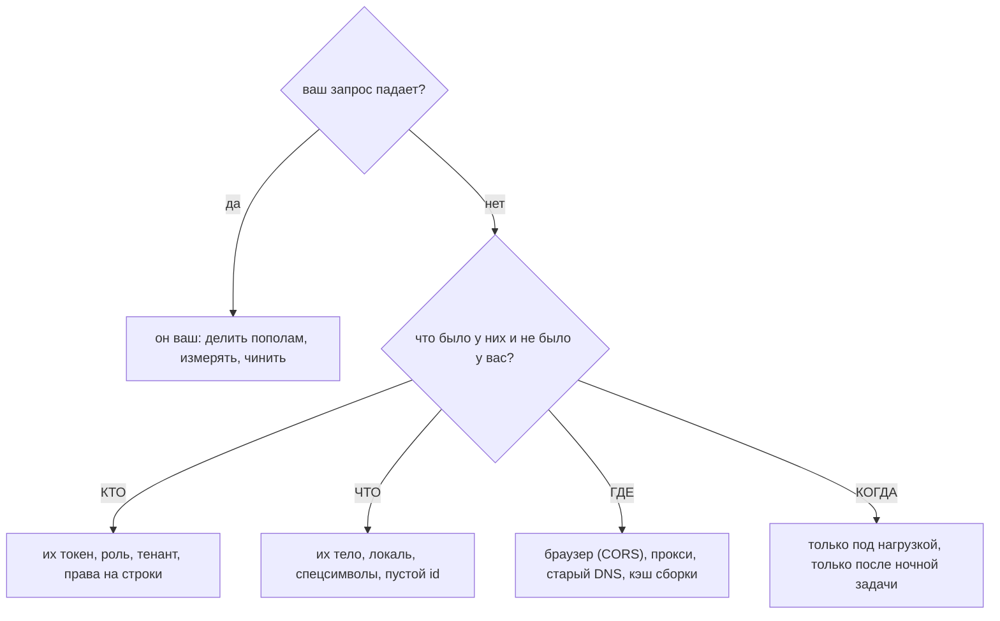
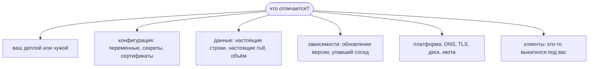

# Прошло тесты и сломалось в проде

Это вопрос не про баг. Это вопрос про то, есть ли у вас **процедура**, — и
интервьюер услышит ответ уже в вашей первой фразе. Если она начинается с «ну, у
меня на машине работает» или «я бы посмотрел код», вы уже ответили. Если она
начинается с «сначала я спрошу, какой именно запрос, а потом попробую
воспроизвести», всё остальное — детали.

Процедура по порядку:

```mermaid
flowchart LR
  A["уточнить: превратить утверждение в факты"] --> B["воспроизвести: пусть упадёт при мне"]
  B --> C["измерить: сигналы и радиус"]
  C --> D["смягчить: восстановить работу"]
  D --> E["диагностировать: что ОТЛИЧАЕТСЯ?"]
  E --> F["исправить: минимальное изменение"]
  F --> G["проверить: перезапустить упавший запрос"]
  G --> H["предотвратить: тест, алерт, ограничитель"]
```

Порядком управляют два правила. **Ничто до шага «воспроизвести» не требует
редактора**, и **«смягчить» идёт раньше «диагностировать»**, когда радиус широк:
восстановить работу и починить баг — разные работы с разными часами.

## 1. «Ничего не работает» — это утверждение, а не измерение

Буквально это почти никогда не так. Обычно это один сценарий, попробованный один
раз, одним человеком, в одном браузере. Но «почти» — это не «никогда», поэтому
ход не в том, чтобы спорить, а в том, чтобы превратить фразу в нечто, содержащее
код ответа. Пять вопросов, задаваемых **вместе** (по одному — это превращает
пятиминутный разбор в переписку на полдня):

| Вопрос | Почему он здесь не зря |
|---|---|
| **Какой** запрос? Метод и путь, а не «страница» | Один экран может делать восемь вызовов; семь могут быть в порядке |
| **Кто** это видит? Один аккаунт, один тенант, все? | Отделяет баг данных/прав от аварии |
| **С какого момента**? До релиза или после? | Определяет, насколько силён подозреваемый «ваш деплой» |
| **Что** именно возвращается? | Статус, код ошибки, `traceId`, вкладка сети |
| **Как часто**? Каждый раз или один раз из двадцати? | Детерминированно против зависимости от нагрузки, кэша или инстанса |

Самый ценный артефакт, который можно попросить, — **`traceId`**: если ваши ответы
с ошибками его несут (см.
[управление ошибками и коды ошибок](topic:api-error-handling)), всё расследование
схлопывается в один запрос к логам.

И ответ, которого давать нельзя, какой бы правдой он ни был: *«но ведь тесты
прошли»*. Сообщивший не утверждал, что ваши тесты упали. Он утверждал, что его
пользователи застряли. Оба высказывания верны одновременно — именно это и ЕСТЬ
баг, живущий только в проде.

## 2. Воспроизведите, прежде чем что-то трогать

Пока вы не можете сами отправить падающий запрос, вы отлаживаете фразу.
Воспроизведение даёт сразу три вещи: возможность делить пополам, возможность
менять по одной переменной за раз и — главное — **то, что вы перезапустите потом,
чтобы доказать исправление**.

Если воспроизвелось — инцидент ваш. Если **нет**, это сужение, а не тупик:
сломанному нужно что-то, чего вы не отправляли.

Ветку **ГДЕ** стоит отрепетировать: сбой только в браузере выглядит ровно как
сломанный эндпоинт, но им не является — отсутствующий `Access-Control-Allow-Origin`
делает так, что `curl` проходит, а приложение падает; см. [CORS](topic:cors) и
[preflight-запросы](topic:preflight-requests). Аналогично клиент с закэшированной
сборкой, зовущий ваш прежний путь, — поэтому здесь важно и
[как общаются фронтенд и бэкенд](topic:frontend-backend-interaction).

## 3. Спросите графики раньше, чем код

Читайте скучные сигналы первыми. Каждый одним взглядом делит область поиска:

- **Всплеск `5xx`** → сбой *внутри вас*, и стеки уже записаны.
- **Всплеск `4xx`** → сбой *на контракте*. Кто-то шлёт запросы, которые вы теперь
  отвергаете, — очень часто это клиент, выкатившийся под форму, которую вы
  поменяли, или аутентификация, ведущая себя в проде иначе
  ([безопасность эндпоинтов](topic:endpoint-security-design)).
- **Задержка выросла, ошибки ровные** → зависимость, блокировка, пул соединений
  или переключившийся план запроса
  ([почему индекс не используется](topic:postgresql-index-not-used)).
- **Ничего не сдвинулось** → самый полезный из четырёх. Что бы ни сломалось, это
  не то, о чём думают.

Проверьте и слои, которые не являются вашим кодом:
[шлюз](topic:api-gateway) может вернуть `502`/`504`, вообще не вызвав ваш сервис,
а таймаут вниз по цепочке всплывает как ваш `500`
([таймауты, фолбэки и предохранители](topic:service-timeouts-fallbacks)).

**Если на дашбордах пусто, скажите это вслух.** Если человек заметил раньше любой
системы, значит длительность аварии равнялась чьему-то терпению. Это самая ценная
последующая задача во всём инциденте, потому что то же слепое пятно спрячет и
следующий.

## 4. Измерьте радиус, потом остановите кровотечение

Критичность выводится из числа, а не из громкости жалобы. «6 отделов из 41, 18%
запросов, задеты HR-клиент и синхронизация зарплат» — это ответ, который и не
спорит с сообщившим, и не соглашается со словом «всё».

А затем, если радиус широк: **восстановите работу до того, как что-то поняли.**

| | Смягчение | Исправление |
|---|---|---|
| Нужна корневая причина? | Нет | Да |
| Обратимо? | Да | Не особо |
| Примеры | откатить, выключить фича-флаг, вывести плохой инстанс, поднять таймаут, добавить реплик | изменение кода |
| Когда | пока часы тикают | когда уже не тикают |

Единственная проверка перед любым откатом: **писал ли релиз данные и мигрировал
ли схему?** Откат отменяет код, но никогда не отменяет записи. Откат на данные,
которые старая версия не умеет читать, превращает один инцидент в два. Именно
аддитивные миграции (expand/contract) и делают откат безопасным.

## 5. Настоящий вопрос: не «что не так», а «что *отличается*»

Код прошёл свои тесты. Значит, спор идёт между кодом и его окружением, и честный
список того, что изменилось, короток:

**Сутки задержки — сами по себе улика.** Если бы релиз сломал всё мгновенно, это
поймал бы мониторинг (или сама выкатка). Разрыв указывает на вещи с
**собственными часами**: ночной пакетный процесс, истекающий кэш, стареющий токен
или сертификат, [утечку памяти](topic:memory-leaks), дошедшую до потолка
([диагностика роста памяти](topic:diagnosing-memory-leaks)), таблицу, переросшую
точку переключения плана, — или попросту то, что *до начала рабочего дня этот путь
никто не выполнял*.

Две дисциплины заставляют этот этап сходиться, а не ходить по кругу:

- **Каждый подозреваемый уходит с приложенной уликой** — никаких «наверное, не
  оно». Записанное, в общем канале, в реальном времени: эти заметки заодно и есть
  тот статус, ради которого вас иначе будут дёргать.
- **Причина обязана объяснять время и то, каких вызывающих задело**, а не только
  текст ошибки. Гипотеза, объясняющая `500`, но не «почему в 09:12, а не в 17:40»,
  — вторая по правдоподобию версия, и выкатка исправления под неё стоит вам аварии
  дважды.

## 6. Почему прогон был зелёным

Это та половина ответа, которая про инженерию, а не про тушение пожара, и её
пропуск — причина, по которой тот же класс багов вернётся через квартал под другим
именем. Зелёный прогон никогда не утверждал, что эндпоинт работает: он утверждал,
что *случаи, которые кто-то придумал, ведут себя так, как кто-то ожидал, на данных,
которые кто-то выдумал, в процессе с одним потоком и без соседей*.

| В проде есть… | …а в тесте не было |
|---|---|
| Настоящие строки: null, дубли, записи 30-летней давности, эмодзи в именах | фикстуры, написанные тем же человеком, что и маппер |
| Объём: таблица, на которой план запроса переключается ([индексы](topic:database-indexes)) | десять строк, поэтому [N+1](topic:hibernate-n-plus-one) не жал |
| Конкурентные вызывающие | один поток, поэтому [гонки](topic:race-condition-avoidance) не проявлялись |
| Своя конфигурация, секреты, сертификаты, фича-флаги | профиль, который вы написали, чтобы тест прошёл |
| Настоящая аутентификация, настоящий CORS, настоящий шлюз | `MockMvc`, который пропускает все три |
| Клиенты, которых писали не вы, ещё и с повторами | тестовый клиент, который ведёт себя прилично |

## 7. Исправить, проверить, предотвратить

**Исправляйте** минимальным изменением, закрывающим подтверждённую причину и
больше ничего. Рефакторинг, замеченный по дороге, — это задача, а не часть этой
выкатки, и исправление едет обычным конвейером. Инцидент — повод быть аккуратнее,
а не право пушить прямо в прод.

**Проверить** означает: *тот самый запрос, который падал, теперь проходит, и
выполнен он в том окружении, где падал*. Не юнит-тест, не локальный запуск и не
«ошибка перестала появляться». Затем дождитесь, чтобы графики вернулись туда, где
были, и скажите тому, кто сообщил, — одной фразой и без жаргона. Именно этот
последний шаг превращает инцидент в доверие.

**Предотвратить** — задайте каждому инциденту один вопрос: *что сделало бы его
дешевле?* Полезных ответов всего три:

1. **тест**, который его воспроизводит, чтобы он не вернулся молча;
2. **сигнал**, который поднял бы вас раньше человека, — именно он превращает «на
   следующий день» в «через пять минут»;
3. **ограничитель**, делающий целый класс сбоев невозможным или обратимым:
   фича-флаг, канареечная выкатка, контрактный тест против настоящего клиента,
   стенд с базой, восстановленной из снимка прода.

Назначьте ответственного, оцените и положите в тот же бэклог, что и фичи. В любом
другом месте это заметка, которую никто не читает.

## Ответ на собеседовании за 60 секунд

> Сначала я сделаю сообщение конкретным, потому что «ничего не работает» — это
> утверждение, а не измерение: какой запрос, кто его видит, с какого момента, что
> именно возвращается — в идеале `traceId` — и падает ли каждый раз. Затем
> воспроизведу это на проде, не трогая код; если мой запрос проходит, разница в
> том, кто, что, где или когда, и я иду за их запросом. Параллельно прочитаю уже
> имеющиеся сигналы: всплеск `5xx` — значит внутри нас, всплеск `4xx` — контракт
> или клиент, задержка без ошибок — зависимость, а ровный график — значит дело не
> в том, о чём думают. Потом измерю радиус поражения: именно это число, а не
> громкость жалобы, задаёт критичность, — и если он широк, сначала восстановлю
> работу: откачу или выключу флаг, проверив, что релиз не мигрировал данные.
> Смягчение — это не исправление. И только потом настоящий вопрос: код прошёл
> тесты, значит, что *отличается* — наш деплой, чужой, конфигурация, данные,
> зависимость, платформа или клиент, который тоже выкатился. Сутки задержки — уже
> подсказка: они указывают на что-то с собственными часами, вроде ночной задачи
> или истекающего кэша. Подозреваемых буду исключать уликами и не назову причиной
> ничего, пока оно не объяснит и время, и ошибку. Затем минимальное исправление,
> проверенное перезапуском того самого упавшего запроса, сообщение тому, кто
> сообщил, и последующая задача — тест, алерт или ограничитель, — чтобы следующий
> раз занял пять минут, а не сутки.

## Почему это важно в проде

- **Время до *восстановления* — это метрика, которую чувствуют пользователи**, и
  определяется она скоростью смягчения, а не скоростью понимания. Команды,
  смешивающие эти два понятия, регулярно превращают пятиминутный откат в
  двухчасовую отладку с заблокированными пользователями всё это время.
- **Воспроизведение — самый дешёвый актив в инциденте.** Без него «починили» и
  «перестало воспроизводиться, пока я смотрел» неразличимы, и какой из вариантов
  был верен, вы узнаете в три часа ночи.
- **Догадки на проде уничтожают улики.** Вы добавили второе непроверенное
  изменение в систему, которая и так ведёт себя плохо, и если симптомы сдвинутся,
  вы больше не знаете, какое изменение их сдвинуло.
- **Последующая задача — единственный постоянный результат.** Баг починят в любом
  случае; а вот алерт, срабатывающий на *«деплой + 5 минут»*, — это то, что не
  даст сообщить о следующем человеку и на сутки позже.
- **От того, как вы ответите владельцу продукта, зависит, что вы услышите в
  следующий раз.** Ответьте один раз «у меня на машине работает» — и следующее
  сообщение придёт позже, через кого-то другого или не придёт вовсе.

## Частые заблуждения

- **«Тесты прошли, значит с эндпоинтом всё в порядке».** Тесты и прод
  противоречат друг другу — это находка, а не оправдание. Тесты покрывают случаи,
  которые кто-то вообразил, на данных, которые кто-то выдумал.
- **«Причина, очевидно, в деплое».** Это самая сильная *априорная гипотеза*, а не
  вывод. Корреляция с релизом — повод откатить (дёшево, обратимо), но не повод
  прекратить расследование.
- **«Я не смог воспроизвести, значит ничего не сломано».** Вы воспроизвели
  отсутствие бага в *своих* условиях. Разница между вашим запросом и их запросом
  *и есть* баг.
- **«Откат починил».** Откат *смягчил*. Если закрыть задачу на этом, то же
  изменение уедет снова в следующем спринте с тем же багом.
- **«Давайте просто выкатим быстрое исправление и посмотрим».** Догадываться
  можно; догадываться на проде — нельзя. Место догадки — в окружении, где
  ошибиться бесплатно.
- **«Корневая причина — это строка кода».** Это объяснение, покрывающее всю форму
  инцидента: когда началось, кого задело и почему прогон был зелёным. Причина,
  объясняющая ошибку, но не время, — неверная причина.
- **«Перезапустить и жить дальше».** Перезапуск, который «чинит», сказал вам
  что-то конкретное — состояние, утечка, пул, зависшее соединение, — а вы только
  что выбросили улику.
- **«Разбор инцидента — это поиск того, кто сломал».** Это поиск того, что
  сделало инцидент дорогим. У человека, выкатившего изменение, обычно больше всего
  полезной информации — а именно её и уничтожает поиск виноватых.
