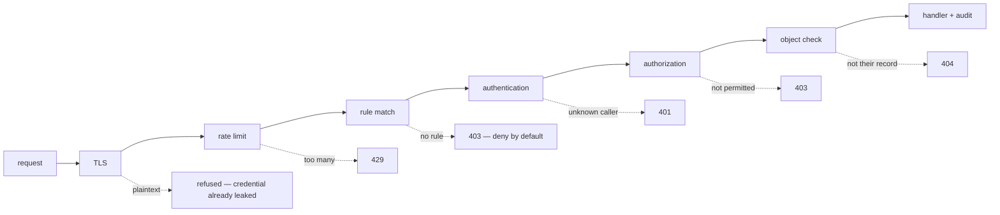
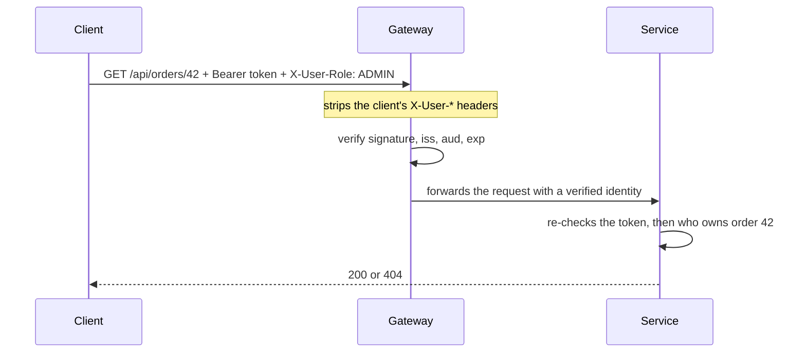

# Designing a security scheme for your endpoints

**A security scheme is two artifacts: an ordered rule list saying what each
endpoint requires, and a chain of checks every request walks before a handler
runs.** Everything else — JWT or session, gateway or service, roles or scopes —
is a decision *inside* that frame. Answering the interview question well means
walking the chain in order and saying what each step is for.



The order is not decoration. Rate limiting has to precede the expensive checks or
it protects nothing; authentication has to precede authorization, because you
cannot decide what a caller may do before you know who they are; and the object
check has to come *after* both, because it needs the identity and the record.

## Gate 0: the default stance

The first thing to decide is what happens to a request that matches **no rule at
all**.

- **Permit by default**: the rule list must enumerate everything that needs
  protecting — including the endpoint a colleague adds next sprint. Forgetting a
  rule ships an open endpoint, and nothing in the system reports it.
- **Deny by default**: everything is closed until a rule opens it. Forgetting a
  rule breaks a feature, and somebody files a ticket the same day.

Both stances fail — the difference is *how*. Choose the one whose failure mode is
loud. In Spring Security that is `anyRequest().denyAll()` (or
`.authenticated()`) as the final line of the chain.

Ordering matters just as much, because the list is read top to bottom and **the
first match wins**:

```java
// The stricter rule below is dead code — /api/** already matched.
.requestMatchers("/api/**").authenticated()
.requestMatchers("/api/admin/**").hasRole("ADMIN")
```

Specific patterns first, broad fallbacks last. This is one of the few security
bugs that a five-minute test can catch and code review reliably misses.

## Gate 1: authentication — who is calling?

Authentication produces a **principal** from something the caller **cannot
forge**. Two mainstream options:

| | Server-side session | Stateless token (JWT) |
|---|---|---|
| State | session store / sticky sessions | none — the token carries the claims |
| Revocation | immediate: delete the session | hard: valid until it expires |
| Scaling | shared store between instances | any instance can verify locally |
| Typical use | classic web app, cookies | APIs, mobile, service-to-service |

The usual compromise is short-lived access tokens (minutes) plus a long-lived
refresh token that *is* revocable, so a stolen access token expires on its own.

If you accept a JWT, "trusting" it means checking **all** of:

1. **Signature** — with the issuer's public key, and with the algorithm pinned
   (a token asking for `alg: none`, or an RS256 key fed to an HMAC verifier, is
   the classic bypass).
2. **Issuer (`iss`)** — a real signature from the wrong authority is not
   authorization here.
3. **Audience (`aud`)** — a token minted for another API must not be replayable
   against yours.
4. **Expiry (`exp`/`nbf`)** — the only thing that limits the damage of a leak.

Skip step 1 and the token is just JSON the client typed. A JWT is base64, not
encryption: anyone holding it can read the claims, edit them, and send them back.
The same applies to *any* identity input the client controls — an `X-User-Id`
header is user input with a colon in it. It is acceptable only when a trusted
gateway **strips** incoming `X-User-*` headers and re-adds its own, and nothing
can reach the service around the gateway. Both conditions are one network change
away from being false, which is why zero-trust designs re-verify at the service.



## Gate 2: authorization — may this caller do this?

Two different questions, often confused:

- A **role** (or permission) says what the *user* may do: `ADMIN`, `SUPPORT`,
  `orders.refund`.
- A **scope** says what *this token* may do on the user's behalf. That is how a
  third-party integration gets `orders:read` without getting the account.

A request needs both to pass. Roles come from your model, scopes from the consent
that issued the token.

Rules are **method-aware** — reading and writing the same path are different
endpoints, so `GET /api/orders/**` and `POST /api/orders` deserve different
requirements ([PUT vs PATCH](topic:put-vs-patch) matters here too). Coarse URL
rules are best kept as a backstop, with the real decision annotated on the
method:

```java
@PreAuthorize("hasRole('ADMIN') or #userId == authentication.name")
public UserDto get(@PathVariable String userId) { ... }
```

Spring implements those annotations with proxies —
see [Spring AOP and cross-cutting code](topic:spring-aop-basics) — which is why
they only apply to calls that go through the proxy.

**401 vs 403** is the classic follow-up:

| | Meaning | Client should |
|---|---|---|
| `401 Unauthorized` | I do not know who you are (missing, expired or invalid credential) | authenticate and retry |
| `403 Forbidden` | I know exactly who you are, and no | stop; retrying changes nothing |
| `404 Not Found` | (deliberately) I will not tell you whether it exists | stop |

## Gate 3: object-level authorization — whose record is it?

This is the gate that is actually missing in production systems.

`GET /api/orders/42` with a valid token passes every check above: the caller is
authenticated, has role `USER`, and `/api/orders/**` allows `USER`. Nothing says
order 42 belongs to *them*. Changing one digit in the URL is the entire exploit,
there is no error in the logs, and the response is a perfectly successful `200`.
It is the most common API vulnerability there is (OWASP calls it *broken object
level authorization*).

The fix is a check that involves the record: load it and compare the owner, or —
better — scope the query itself (`findByIdAndOwner(id, principal)`), so the
authorization is in the same statement as the fetch and cannot be forgotten.
Return **404** rather than 403 for someone else's record, so an attacker cannot
enumerate which ids exist.

The same reasoning extends to **fields**: a `PATCH /api/users/42` that binds the
whole body to the entity lets a user set `role: ADMIN` on themselves. Bind to an
explicit DTO, never straight to the entity.

## What authentication and authorization cannot see

- **Transport.** TLS everywhere, plus HSTS. A credential sent over plain HTTP is
  compromised whether or not you reject the request — rejecting it does not
  un-send it, and the fix is to rotate the credential. Never put tokens in a
  query string: they land in access logs, proxies and `Referer` headers.
- **Rate limiting and quotas.** Password guessing, token stuffing and scraping
  consist entirely of individually valid requests; only their *rate* is the
  attack. Key the limit by client and by route, and put it in front of the
  expensive gates.
- **Input validation.** Injection, oversized payloads and unbounded page sizes
  are unaffected by who is calling — see
  [prepared statements](topic:prepared-statements). Validate at the edge of the
  controller, allow-list rather than deny-list.
- **Browser-specific risks.** If you authenticate with cookies you need CSRF
  defence (`SameSite`, tokens); if you authenticate with an `Authorization`
  header you largely do not. [CORS](topic:cors) is *not* part of your
  authorization — it protects the user's browser, and `curl` ignores it
  completely.
- **Audit.** Every decision — allowed and refused — is a log line with the
  principal, the route, the decision and a correlation id, and **never** the
  token, password or personal data. It is how a breach is discovered at all.

## Where the chain runs

At the edge ([an API gateway](topic:api-gateway)) put the things that are
identical everywhere and cheap to do once: TLS termination, rate limiting, token
verification, CORS. Inside each service keep what only it can know: the role and
scope rules of its own endpoints and every object-level check. A gateway cannot
know that order 42 belongs to Bob.

Do **not** conclude that a service behind a gateway is therefore safe. Services
should authenticate each other (mTLS or a service token), because "the network is
private" is not a security control — that is the same assumption
that [sharing endpoints across an organization](topic:sharing-api-endpoints) and
[inter-service communication](topic:inter-service-communication-options) quietly
break the first time a new caller appears.

## The 60-second interview answer

> I'd describe it as a chain every request walks. TLS first, so credentials are
> never on the wire in plaintext, then rate limiting to bound brute force. Then
> the rule list — deny by default, specific patterns before broad ones, so an
> endpoint nobody wrote a rule for is closed rather than open. Then
> authentication: a principal derived from something the client cannot forge —
> for an API, a short-lived JWT whose signature, issuer, audience and expiry I
> all verify, never a header the caller could set. Then authorization: the role
> says what the user may do, the scope says what this token may do, and reads and
> writes get separate rules. Then the check people forget — object-level
> authorization: does *this* record belong to *this* caller? That's where the
> `/orders/42` → `/orders/43` bug lives, and I'd solve it by scoping the query by
> owner rather than checking afterwards. 401 means I don't know you, 403 means I
> do and the answer is no, 404 when even existence is sensitive. Around all of
> it: input validation, secrets outside the repo, and an audit log of every
> decision. And I'd put the shared parts at the gateway while keeping per-object
> checks in the service, because the gateway cannot know who owns a record.

## Why it matters in production

- **Most incidents are missing checks, not broken crypto.** Nobody breaks your
  signature algorithm; they change an id in a URL, or find the endpoint that was
  never added to the rule list.
- **Failures are silent.** An over-permissive scheme produces `200`s. There is no
  exception, no alert, no anomaly — which is why the audit log and automated
  tests are part of the design, not extras.
- **Tests are the only regression net.** A test per rule — anonymous gets 401,
  wrong role gets 403, another user's id gets 404 — costs minutes and survives
  every refactoring of the security config.
- **Revocation is a design decision, not a feature you add later.** With
  stateless tokens, "log this user out everywhere, now" requires a deny-list or
  very short lifetimes. Decide up front.
- **Secrets and keys need somewhere to live** — an environment-specific store,
  rotated, never in the repository — and key rotation must work without a
  redeploy.

## Common misconceptions

- **"The endpoint is authenticated, so it is secure."** Authentication answers
  *who*, not *what* or *which record*. Object-level authorization is a separate
  gate.
- **"Nobody knows this URL."** Obscurity is not a control: URLs leak through
  logs, browser history, JavaScript bundles, `Referer` headers and crawlers.
- **"It's an internal service, it's behind the gateway."** Until someone exposes
  a port, deploys to a shared cluster, or an SSRF turns an outside request into
  an inside one.
- **"We validate the token — we decode it and read the user id."** Decoding is
  not verifying. Without the signature check the claims are client input.
- **"CORS protects my API."** It protects the user's browser. Anything that is
  not a browser ignores it.
- **"403 for another user's record."** That confirms the record exists and lets
  an attacker enumerate ids; return 404 when existence itself is sensitive.
- **"The frontend hides the button, so the endpoint is safe."** The UI is a
  convenience; every check must exist on the server.
- **"Rate limiting is a performance feature."** It is the only control that sees
  brute force, credential stuffing and scraping at all.
- **"We'll add security later."** The default stance, the identity source and the
  object-level check are structural: retrofitting them means touching every
  endpoint.
