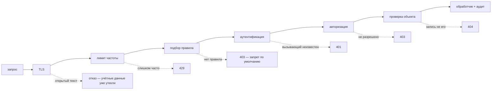
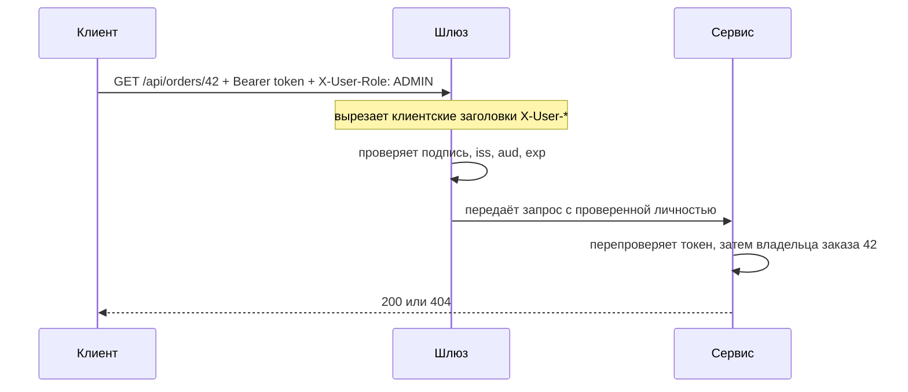

# Проектирование схемы безопасности эндпоинтов

**Схема безопасности — это два артефакта: упорядоченный список правил, который
говорит, что требуется на каждом эндпоинте, и цепочка проверок, через которую
проходит каждый запрос до обработчика.** Всё остальное — JWT или сессия, шлюз или
сервис, роли или scope — это решения *внутри* этой рамки. Хорошо ответить на
вопрос с собеседования — значит пройти по цепочке по порядку и сказать, зачем
нужен каждый шаг.



Порядок здесь не украшение. Ограничение частоты обязано стоять до дорогих
проверок, иначе оно ничего не защищает; аутентификация обязана идти до
авторизации, потому что нельзя решить, что вызывающему можно, не зная, кто он; а
проверка объекта обязана быть *после* обеих, потому что ей нужны и личность, и
запись.

## Проверка 0: позиция по умолчанию

Первое, что нужно решить, — что происходит с запросом, который не подошёл **ни
под одно правило**.

- **Разрешать по умолчанию**: список правил обязан перечислить всё, что нужно
  защитить, — включая эндпоинт, который коллега добавит в следующем спринте.
  Забытое правило выкатывает открытый эндпоинт, и в системе об этом никто не
  сообщит.
- **Запрещать по умолчанию**: всё закрыто, пока правило не откроет. Забытое
  правило ломает функцию, и тикет заводят в тот же день.

Обе позиции ошибаются — разница в том, *как*. Выбирайте ту, чей отказ громкий. В
Spring Security это `anyRequest().denyAll()` (или `.authenticated()`) последней
строкой цепочки.

Порядок важен ровно так же, потому что список читается сверху вниз и **побеждает
первое совпадение**:

```java
// Более строгое правило ниже — мёртвый код: /api/** уже подошло.
.requestMatchers("/api/**").authenticated()
.requestMatchers("/api/admin/**").hasRole("ADMIN")
```

Сначала конкретные шаблоны, общие запасные варианты — в конце. Это одна из
немногих ошибок безопасности, которую пятиминутный тест ловит, а ревью
стабильно пропускает.

## Проверка 1: аутентификация — кто вызывает?

Аутентификация производит **principal** из того, что вызывающий **подделать не
может**. Два основных варианта:

| | Серверная сессия | Stateless-токен (JWT) |
|---|---|---|
| Состояние | хранилище сессий / sticky sessions | нет — токен несёт поля в себе |
| Отзыв | мгновенный: удалить сессию | сложно: действителен до истечения |
| Масштабирование | общее хранилище между инстансами | любой инстанс проверяет локально |
| Типичное применение | классическое веб-приложение, куки | API, мобильные клиенты, сервис-сервис |

Обычный компромисс — короткоживущие access-токены (минуты) плюс долгоживущий
refresh-токен, который *можно* отозвать: тогда украденный access-токен истекает
сам.

Если вы принимаете JWT, «доверять» ему означает проверить **всё** из этого:

1. **Подпись** — открытым ключом издателя и с зафиксированным алгоритмом (токен с
   `alg: none` или ключ RS256, скормленный HMAC-проверке, — классический обход).
2. **Издатель (`iss`)** — настоящая подпись не того центра здесь не авторизация.
3. **Аудитория (`aud`)** — токен, выпущенный для другого API, не должен работать
   против вашего.
4. **Срок действия (`exp`/`nbf`)** — единственное, что ограничивает ущерб от
   утечки.

Пропустите пункт 1 — и токен станет просто JSON, который вписал клиент. JWT —
это base64, а не шифрование: любой, у кого он в руках, читает поля, правит их и
отправляет обратно. То же касается *любого* источника личности, которым управляет
клиент: заголовок `X-User-Id` — это пользовательский ввод с двоеточием. Он
допустим, только если доверенный шлюз **вырезает** входящие заголовки `X-User-*`
и добавляет свои, и до сервиса нельзя дотянуться в обход шлюза. Оба условия
нарушаются одним изменением в сети — поэтому в zero-trust-схемах сервис
перепроверяет всё сам.



## Проверка 2: авторизация — можно ли этому вызывающему это делать?

Два разных вопроса, которые часто путают:

- **Роль** (или разрешение) говорит, что может делать *пользователь*: `ADMIN`,
  `SUPPORT`, `orders.refund`.
- **Scope** говорит, что может делать *этот токен* от имени пользователя. Именно
  так сторонняя интеграция получает `orders:read`, не получая аккаунт.

Запрос должен пройти обе проверки. Роли берутся из вашей модели, scope — из
согласия, по которому был выпущен токен.

Правила **учитывают метод**: чтение и запись по одному пути — это разные
эндпоинты, поэтому `GET /api/orders/**` и `POST /api/orders` заслуживают разных
требований (здесь важно и [PUT против PATCH](topic:put-vs-patch)). Грубые
правила по URL лучше оставлять страховкой, а настоящее решение писать на самом
методе:

```java
@PreAuthorize("hasRole('ADMIN') or #userId == authentication.name")
public UserDto get(@PathVariable String userId) { ... }
```

Spring реализует такие аннотации через прокси —
см. [Spring AOP и сквозной код](topic:spring-aop-basics), — поэтому они
действуют только на вызовы, которые идут через прокси.

**401 против 403** — классический уточняющий вопрос:

| | Смысл | Что делать клиенту |
|---|---|---|
| `401 Unauthorized` | я не знаю, кто ты (учётных данных нет, они просрочены или неверны) | аутентифицироваться и повторить |
| `403 Forbidden` | я точно знаю, кто ты, и — нет | прекратить; повтор ничего не изменит |
| `404 Not Found` | (намеренно) я не скажу даже, существует ли это | прекратить |

## Проверка 3: авторизация на уровне объекта — чья это запись?

Именно этой проверки на практике и не хватает.

`GET /api/orders/42` с корректным токеном проходит всё, что выше: вызывающий
аутентифицирован, у него роль `USER`, а `/api/orders/**` разрешает `USER`. Нигде
не сказано, что заказ 42 принадлежит *ему*. Весь эксплойт — поменять одну цифру в
URL, ошибки в логах нет, а ответ — совершенно успешный `200`. Это самая частая
уязвимость API из существующих (OWASP называет её *broken object level
authorization*).

Лечится проверкой, в которой участвует сама запись: загрузить её и сравнить
владельца или — лучше — сузить сам запрос (`findByIdAndOwner(id, principal)`),
чтобы авторизация оказалась в том же выражении, что и выборка, и её нельзя было
забыть. На чужую запись возвращайте **404**, а не 403, чтобы злоумышленник не мог
перебрать существующие идентификаторы.

То же рассуждение распространяется на **поля**: `PATCH /api/users/42`, который
привязывает всё тело к сущности, позволяет пользователю выставить себе
`role: ADMIN`. Привязывайтесь к явному DTO, а не прямо к сущности.

## Чего не видят аутентификация и авторизация

- **Транспорт.** TLS везде плюс HSTS. Учётные данные, отправленные по обычному
  HTTP, скомпрометированы вне зависимости от того, отклонили вы запрос или нет:
  отклонение не отменяет отправки, и лечится это заменой этих учётных данных.
  Никогда не кладите токены в query string — они оседают в логах доступа, на
  прокси и в заголовках `Referer`.
- **Ограничение частоты и квоты.** Подбор паролей, перебор токенов и выкачивание
  данных состоят целиком из по отдельности корректных запросов; атака — это их
  *частота*. Считайте лимит по клиенту и по маршруту и ставьте его перед дорогими
  проверками.
- **Валидация ввода.** Инъекции, гигантские тела запросов и неограниченные
  размеры страниц не зависят от того, кто вызывает, — см.
  [подготовленные выражения](topic:prepared-statements). Валидируйте на входе в
  контроллер, по «белому списку», а не по «чёрному».
- **Риски, специфичные для браузера.** Если аутентификация идёт через куки, нужна
  защита от CSRF (`SameSite`, токены); если через заголовок `Authorization` — в
  основном не нужна. [CORS](topic:cors) — *не* часть вашей авторизации: он
  защищает браузер пользователя, а `curl` его полностью игнорирует.
- **Аудит.** Каждое решение — и разрешение, и отказ — это строка лога с
  principal, маршрутом, решением и идентификатором корреляции и **никогда** с
  токеном, паролем или персональными данными. Именно так утечку вообще
  обнаруживают.

## Где выполняется цепочка

На границе ([API-шлюз](topic:api-gateway)) держат то, что одинаково везде и
дёшево сделать один раз: терминацию TLS, ограничение частоты, проверку токена,
CORS. Внутри каждого сервиса остаётся то, что знает только он: правила по ролям и
scope для его собственных эндпоинтов и все проверки на уровне объекта. Шлюз не
может знать, что заказ 42 принадлежит Бобу.

Не делайте из этого вывод, что сервис за шлюзом в безопасности. Сервисы должны
аутентифицировать друг друга (mTLS или сервисный токен), потому что «сеть
приватная» — это не средство защиты: ровно это предположение тихо ломается в
первый же раз, когда появляется новый вызывающий, — и при
[совместном использовании эндпоинтов в организации](topic:sharing-api-endpoints),
и при [межсервисном взаимодействии](topic:inter-service-communication-options).

## Ответ за 60 секунд на собеседовании

> Я бы описал это как цепочку, через которую проходит каждый запрос. Сначала
> TLS, чтобы учётные данные никогда не шли по сети открытым текстом, затем
> ограничение частоты, чтобы сдержать перебор. Дальше список правил — запрет по
> умолчанию, конкретные шаблоны перед широкими, чтобы эндпоинт, про который
> правило не написали, оказался закрытым, а не открытым. Затем аутентификация:
> principal берётся из того, что клиент подделать не может, — для API это
> короткоживущий JWT, у которого я проверяю подпись, издателя, аудиторию и срок
> действия, а не заголовок, который вызывающий выставит сам. Затем авторизация:
> роль говорит, что может пользователь, scope — что может этот токен, а чтение и
> запись получают разные правила. Затем проверка, о которой забывают, —
> авторизация на уровне объекта: принадлежит ли *эта* запись *этому* вызывающему?
> Здесь и живёт баг «`/orders/42` → `/orders/43`», и решал бы я его сужением
> запроса по владельцу, а не проверкой постфактум. 401 — я тебя не знаю, 403 — я
> знаю, и ответ «нет», 404 — когда чувствителен сам факт существования. И вокруг
> всего этого: валидация ввода, секреты вне репозитория и журнал аудита по
> каждому решению. Общие части я бы вынес на шлюз, а проверки по объектам оставил
> в сервисе, потому что шлюз не знает, кто владеет записью.

## Почему это важно в продакшене

- **Большинство инцидентов — это отсутствующие проверки, а не сломанная
  криптография.** Никто не ломает ваш алгоритм подписи; меняют идентификатор в
  URL или находят эндпоинт, который так и не попал в список правил.
- **Провалы молчаливы.** Слишком разрешительная схема отдаёт `200`. Ни исключения,
  ни алерта, ни аномалии — поэтому журнал аудита и автотесты являются частью
  проекта, а не дополнением.
- **Тесты — единственная страховка от регрессий.** Тест на правило — анонимный
  получает 401, не та роль получает 403, чужой идентификатор получает 404 —
  стоит минуты и переживает любой рефакторинг конфигурации безопасности.
- **Отзыв доступа — проектное решение, а не фича «потом».** Со stateless-токенами
  «разлогинить этого пользователя везде, прямо сейчас» требует списка
  запрещённых токенов или очень коротких сроков жизни. Решать нужно заранее.
- **Секретам и ключам нужно где-то жить** — в хранилище по окружениям, с
  ротацией, никогда в репозитории, — и ротация ключей должна работать без
  передеплоя.

## Частые заблуждения

- **«Эндпоинт под аутентификацией, значит он защищён».** Аутентификация отвечает
  на вопрос *кто*, а не *что* и не *какая запись*. Авторизация на уровне объекта
  — отдельная проверка.
- **«Этот URL никто не знает».** Неизвестность — не средство защиты: URL утекают
  через логи, историю браузера, JavaScript-бандлы, заголовки `Referer` и
  краулеров.
- **«Это внутренний сервис, он за шлюзом».** Ровно до того, как кто-то откроет
  порт, задеплоит в общий кластер или SSRF превратит внешний запрос во
  внутренний.
- **«Мы валидируем токен — мы его декодируем и читаем идентификатор».**
  Декодирование — не проверка. Без проверки подписи поля токена — это ввод
  клиента.
- **«CORS защищает мой API».** Он защищает браузер пользователя. Всё, что не
  браузер, его игнорирует.
- **«На чужую запись — 403».** Это подтверждает, что запись существует, и
  позволяет перебрать идентификаторы; возвращайте 404, когда чувствителен сам
  факт существования.
- **«Фронтенд прячет кнопку, значит эндпоинт защищён».** Интерфейс — это удобство;
  каждая проверка обязана существовать на сервере.
- **«Ограничение частоты — это про производительность».** Это единственное
  средство, которое вообще видит перебор паролей, перебор украденных учётных
  данных и выкачивание данных.
- **«Безопасность добавим потом».** Позиция по умолчанию, источник личности и
  проверка на уровне объекта — вещи структурные: добавлять их задним числом
  значит трогать каждый эндпоинт.
