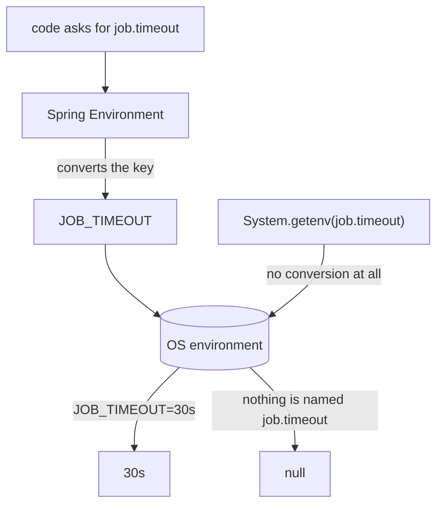

# What Environment Variable Overrides `job.timeout`

## The short answer

`JOB_TIMEOUT`.

```bash
export JOB_TIMEOUT=30s
```

Nothing in the code changes. `@Value("${job.timeout}")` and a
`@ConfigurationProperties` field keep asking for `job.timeout`, and they get
`30s` instead of whatever `application.properties` said.

## The rule

There are three steps, and they always run in the same order:

1. replace every `.` with `_`
2. **delete** every `-`
3. uppercase the result


| property | environment variable |
| --- | --- |
| `job.timeout` | `JOB_TIMEOUT` |
| `job.read-timeout` | `JOB_READTIMEOUT` |
| `spring.datasource.url` | `SPRING_DATASOURCE_URL` |
| `spring.jpa.hibernate.ddl-auto` | `SPRING_JPA_HIBERNATE_DDLAUTO` |
| `job.targets[0].url` | `JOB_TARGETS_0_URL` |

## Why the dot cannot survive

A shell variable name may contain only letters, digits and underscores. `export
job.timeout=30s` is not a variable with an unusual name — it is a syntax error,
because `.` is not allowed in an identifier. The underscore is the only
separator the platform leaves you, so the dot has to become one.

The capitals are a different story: nothing on Linux requires them. It is a
convention as old as `sh`, kept so that an exported configuration variable never
collides with a lowercase variable of your own. Spring's lookup happens to fold
case, so `job_timeout` also resolves — but write the uppercase name anyway,
because that is what every reviewer, every manifest and every piece of
documentation expects.

## Why the dash disappears instead of becoming `_`

This is the step people get wrong, and it is worth being able to justify: the
underscore is already spoken for. It means *"there was a dot here"*. If a dash
became an underscore too, then `JOB_READ_TIMEOUT` could mean either
`job.read.timeout` or `job.read-timeout`, and the name would no longer identify
one property. So the documented rule simply drops the dash:
`job.read-timeout` → `JOB_READTIMEOUT`.

In practice Spring Boot also still accepts `JOB_READ_TIMEOUT` for historical
reasons — useful when you are reading someone else's manifest, not something to
write yourself.

## The conversion only runs in one direction

Spring does not read your environment and try to invent property names from it.
It takes **the key it was asked for**, converts that key, and looks for the
result. Your code never learns that a variable exists.



That single arrow explains the classic puzzle: in the very same process,
`environment.getProperty("job.timeout")` returns `30s` while
`System.getenv("job.timeout")` returns `null`. The conversion belongs to Spring,
not to the JVM. It is also the reason to read configuration through the
`Environment` (or through injected properties — see
[Spring IoC and Dependency Injection](topic:spring-ioc-di)) rather than through
`System.getenv`: the latter hard-codes the shouty name into every caller and
quietly loses every other property source.

## Lists

A list element is addressed by its index with an underscore on each side:

```bash
export JOB_TARGETS_0_URL=https://prod.example/a
```

And then the part that bites: **lists are replaced, not merged.** The
highest-priority source that defines *any* element owns the *entire* list, so
that one variable does not patch element 0 — it makes the environment the owner
of the whole list, and everything the file said about the other elements is
gone. If you override an element, set every element you still need, or model the
property as one comma-separated string instead.

## Where you actually write it

```bash
export JOB_TIMEOUT=30s                     # shell, for the session
JOB_TIMEOUT=30s java -jar app.jar          # one run only
docker run -e JOB_TIMEOUT=30s app:1.0      # docker
```

```yaml
# docker compose
environment:
  JOB_TIMEOUT: "30s"
```

```yaml
# Kubernetes
env:
  - name: JOB_TIMEOUT
    value: "30s"
```

Two neighbours are *not* environment variables and therefore keep their dots:
`--job.timeout=30s` as a command line argument and `-Djob.timeout=30s` as a JVM
flag. Both sit above the environment in the order of precedence — the full
ladder is in
[application.properties vs Environment Variables](topic:spring-config-property-precedence).

## The 60-second interview answer

> `JOB_TIMEOUT`. Spring Boot's relaxed binding converts the property name into
> the variable name: dots become underscores, dashes are deleted, everything is
> uppercased. So `job.timeout` is `JOB_TIMEOUT` and `job.read-timeout` is
> `JOB_READTIMEOUT` — the dash disappears, it does not become another
> underscore, because an underscore already means "there was a dot here". The
> conversion runs from the property to the variable, on the key the code asked
> for, which is why `System.getenv("job.timeout")` returns `null` even when the
> property resolves. The value stays a plain string and is converted to a
> `Duration` afterwards. And a wrong name is completely silent — the application
> simply keeps the value from `application.properties`.

## In production

This rule is what makes one artefact deployable everywhere. You build the image
once (see
[Building a Docker Image from a Spring Boot Application](topic:spring-boot-docker-image)),
promote the same bytes from staging to production, and each environment supplies
its own `SPRING_DATASOURCE_URL`, `SPRING_DATASOURCE_PASSWORD` and `JOB_TIMEOUT`.
Everything nobody overrode stays identical, which is exactly what makes staging a
meaningful rehearsal.

It is also why teams prefix their own properties (`job.*`, `app.*`): a bare
`timeout` would become the variable `TIMEOUT`, which is far too likely to
already mean something else on the machine.

## Common traps

- **Turning the dash into an underscore.** `JOB_READ_TIMEOUT` looks right and is
  the single most common mistake. The documented name is `JOB_READTIMEOUT`.
- **Dropping the dot instead of converting it.** `JOBTIMEOUT` matches nothing.
- **Expecting a complaint.** A wrong variable name is indistinguishable from no
  variable at all: no warning, no log line, no failed startup. "My override is
  being ignored" is almost always a spelling question.
- **Setting the variable without exporting it.** `JOB_TIMEOUT=30s` on its own
  line sets a shell variable that child processes never see; `export` it, or put
  it in front of the command.
- **Changing it after start.** The environment is read when the process starts.
  Editing it in your shell — or `kubectl set env`, which restarts the pods —
  changes nothing for an already-running JVM.
- **Believing the value is converted too.** Only the *name* is converted. The
  value arrives as a string and is turned into a `Duration`/`int`/enum
  afterwards, so `JOB_TIMEOUT=thirty` fails at startup, not at the shell.
- **Forgetting the quotes in YAML.** `value: 30` in a Kubernetes manifest is an
  integer and the manifest is rejected; environment values must be strings.
- **Assuming the key must already exist in a file.** It need not. A variable is
  a full property source of its own, not a patch applied to
  `application.properties`.
- **Overriding one list element and expecting the rest to survive.** The whole
  list is replaced.
- **Reaching for `System.getenv`.** It matches the exact name only, sees no
  files, no defaults and no profiles.
- **Putting secrets in plain variables.** They show up in `docker inspect`, in
  crash dumps and in child processes; prefer a mounted secret or a secrets
  manager for passwords and tokens.
