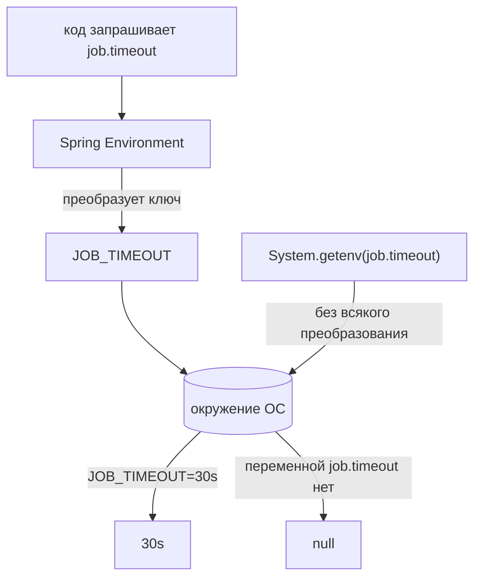

# Какая переменная окружения переопределяет `job.timeout`

## Короткий ответ

`JOB_TIMEOUT`.

```bash
export JOB_TIMEOUT=30s
```

В коде не меняется ничего. И `@Value("${job.timeout}")`, и поле
`@ConfigurationProperties` продолжают запрашивать `job.timeout` — и получают
`30s` вместо того, что было написано в `application.properties`.

## Правило

Шагов три, и выполняются они всегда в одном порядке:

1. каждую `.` заменить на `_`
2. каждый `-` **удалить**
3. результат перевести в верхний регистр


| свойство | переменная окружения |
| --- | --- |
| `job.timeout` | `JOB_TIMEOUT` |
| `job.read-timeout` | `JOB_READTIMEOUT` |
| `spring.datasource.url` | `SPRING_DATASOURCE_URL` |
| `spring.jpa.hibernate.ddl-auto` | `SPRING_JPA_HIBERNATE_DDLAUTO` |
| `job.targets[0].url` | `JOB_TARGETS_0_URL` |

## Почему точка не может уцелеть

Имя переменной оболочки состоит только из букв, цифр и подчёркиваний. `export
job.timeout=30s` — это не переменная с необычным именем, а синтаксическая
ошибка: `.` в идентификаторе недопустима. Подчёркивание — единственный
разделитель, который платформа вам оставляет, поэтому точке приходится стать им.

С верхним регистром история другая: Linux его не требует. Это соглашение
возрастом с сам `sh`, и держатся его для того, чтобы экспортированная переменная
конфигурации никогда не столкнулась с вашей собственной переменной в нижнем
регистре. Поиск в Spring к регистру нечувствителен, поэтому `job_timeout` тоже
разрешится, — но пишите всё-таки имя капсом, потому что именно его ожидают любой
ревьюер, любой манифест и любая документация.

## Почему дефис исчезает, а не становится `_`

Именно на этом шаге ошибаются, и уметь обосновать его стоит: подчёркивание уже
занято. Оно означает *«здесь была точка»*. Если бы дефис тоже превращался в
подчёркивание, то `JOB_READ_TIMEOUT` мог бы означать и `job.read.timeout`, и
`job.read-timeout`, и имя перестало бы однозначно указывать на одно свойство.
Поэтому документированное правило дефис просто выбрасывает:
`job.read-timeout` → `JOB_READTIMEOUT`.

На практике Spring Boot по историческим причинам всё ещё принимает и
`JOB_READ_TIMEOUT` — это полезно знать, когда разбираешь чужой манифест, но не
стоит писать так самому.

## Преобразование идёт только в одну сторону

Spring не читает ваше окружение, пытаясь придумать по нему имена свойств. Он
берёт **тот ключ, который у него запросили**, преобразует его и ищет результат.
Ваш код так и не узнаёт, что какая-то переменная существует.



Эта одна стрелка объясняет классическую загадку: в одном и том же процессе
`environment.getProperty("job.timeout")` возвращает `30s`, а
`System.getenv("job.timeout")` — `null`. Преобразование принадлежит Spring, а не
JVM. По той же причине конфигурацию читают через `Environment` (или через
внедряемые свойства — см.
[Spring IoC и внедрение зависимостей](topic:spring-ioc-di)), а не через
`System.getenv`: второй вариант зашивает имя капсом в каждого вызывающего и молча
теряет все остальные источники свойств.

## Списки

Элемент списка адресуется индексом с подчёркиванием с обеих сторон:

```bash
export JOB_TARGETS_0_URL=https://prod.example/a
```

А дальше — то, что больно: **списки заменяются, а не сливаются.** Источник с
наивысшим приоритетом, задающий *хотя бы один* элемент, владеет *всем* списком,
поэтому та единственная переменная не правит элемент 0 — она делает владельцем
всего списка окружение, и всё, что файл говорил про остальные элементы,
исчезает. Переопределяете элемент — задавайте все элементы, которые вам ещё
нужны, или храните свойство одной строкой через запятую.

## Где это в самом деле пишут

```bash
export JOB_TIMEOUT=30s                     # оболочка, на сессию
JOB_TIMEOUT=30s java -jar app.jar          # только на один запуск
docker run -e JOB_TIMEOUT=30s app:1.0      # docker
```

```yaml
# docker compose
environment:
  JOB_TIMEOUT: "30s"
```

```yaml
# Kubernetes
env:
  - name: JOB_TIMEOUT
    value: "30s"
```

Два соседа переменными окружения *не* являются и поэтому сохраняют точки:
`--job.timeout=30s` как аргумент командной строки и `-Djob.timeout=30s` как флаг
JVM. Оба стоят выше окружения по приоритету — вся лестница разобрана в теме
[application.properties или переменные окружения](topic:spring-config-property-precedence).

## Ответ на собеседовании за 60 секунд

> `JOB_TIMEOUT`. Relaxed binding в Spring Boot преобразует имя свойства в имя
> переменной: точки становятся подчёркиваниями, дефисы удаляются, всё переводится
> в верхний регистр. Поэтому `job.timeout` — это `JOB_TIMEOUT`, а
> `job.read-timeout` — это `JOB_READTIMEOUT`: дефис исчезает, а не превращается в
> ещё одно подчёркивание, потому что подчёркивание уже означает «здесь была
> точка». Преобразование идёт от свойства к переменной и применяется к тому
> ключу, который запросил код, — поэтому `System.getenv("job.timeout")` вернёт
> `null` даже тогда, когда свойство успешно разрешается. Значение остаётся
> обычной строкой и превращается в `Duration` уже потом. А неверное имя абсолютно
> молчаливо: приложение просто оставит значение из `application.properties`.

## В продакшене

Это правило и делает один артефакт пригодным для любого окружения. Образ
собирают один раз (см.
[Сборка Docker-образа из приложения Spring Boot](topic:spring-boot-docker-image)),
продвигают те же самые байты со staging в прод, и каждое окружение подаёт свои
`SPRING_DATASOURCE_URL`, `SPRING_DATASOURCE_PASSWORD` и `JOB_TIMEOUT`. Всё, что
никто не переопределял, остаётся одинаковым — именно это и делает staging
осмысленной репетицией.

По той же причине командам стоит делать собственным свойствам префикс (`job.*`,
`app.*`): голый `timeout` превратился бы в переменную `TIMEOUT`, а она слишком
вероятно уже что-то значит на этой машине.

## Частые ловушки

- **Превратить дефис в подчёркивание.** `JOB_READ_TIMEOUT` выглядит правильно и
  является самой частой ошибкой. Документированное имя — `JOB_READTIMEOUT`.
- **Выбросить точку вместо того, чтобы её преобразовать.** `JOBTIMEOUT` не
  совпадает ни с чем.
- **Ждать возмущения.** Неверное имя переменной неотличимо от полного её
  отсутствия: ни предупреждения, ни строчки в логе, ни падения при старте. «Моё
  переопределение игнорируется» почти всегда вопрос про написание.
- **Задать переменную, не экспортировав её.** `JOB_TIMEOUT=30s` отдельной строкой
  создаёт переменную оболочки, которую дочерние процессы не видят: нужен `export`
  или запись перед самой командой.
- **Менять её после старта.** Окружение читается при запуске процесса.
  Правка в оболочке — или `kubectl set env`, который перезапускает поды, — для
  уже работающей JVM не значит ничего.
- **Думать, что значение тоже преобразуется.** Преобразуется только *имя*.
  Значение приходит строкой и превращается в `Duration`/`int`/enum уже потом,
  поэтому `JOB_TIMEOUT=thirty` упадёт при старте приложения, а не в оболочке.
- **Забыть кавычки в YAML.** `value: 30` в манифесте Kubernetes — это число, и
  манифест не примут: значения переменных должны быть строками.
- **Считать, что ключ обязан заранее быть в файле.** Не обязан. Переменная —
  полноценный самостоятельный источник свойств, а не заплатка к
  `application.properties`.
- **Переопределить один элемент списка и ждать, что остальные уцелеют.** Список
  заменяется целиком.
- **Тянуться к `System.getenv`.** Он совпадает только по точному имени и не видит
  ни файлов, ни значений по умолчанию, ни профилей.
- **Класть секреты в обычные переменные.** Они видны в `docker inspect`, в дампах
  падений и в дочерних процессах; для паролей и токенов лучше смонтированный
  секрет или менеджер секретов.
