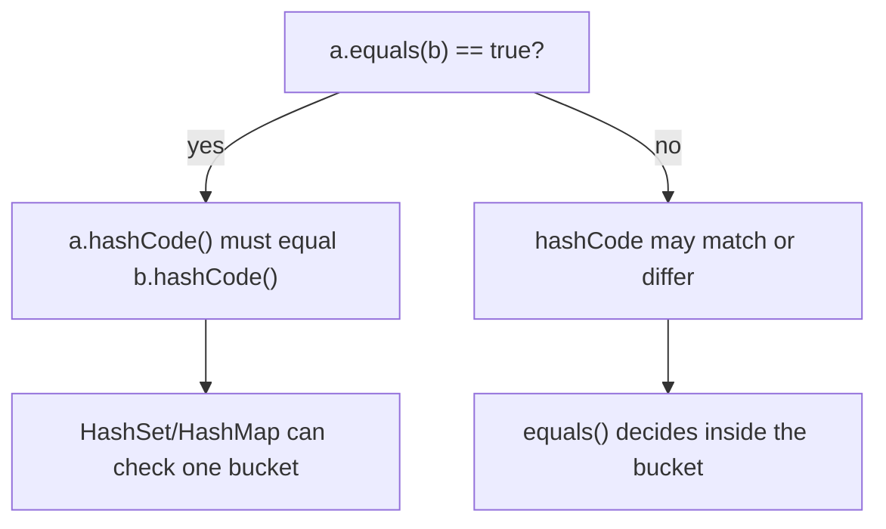
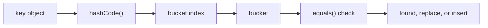

# equals() and hashCode() Contract

A value class represents a value, not an identity. Two `Money(100, "USD")`
objects or two `UserKey(42, "eu")` objects should be interchangeable when their
business fields match. In everyday terms, this is like two parcel labels with
the same address: the paper objects are different, but the delivery meaning is
the same.

Hash-based collections such as [HashMap](topic:hashmap) and
[HashMap basics](topic:hashmap-basics) first use `hashCode()` to choose a bucket,
then use `equals()` inside that bucket to confirm the exact key. Think of a post
office sorting letters by postal code first, then checking the recipient name
inside one shelf.



## The Contract

`equals()` must be reflexive, symmetric, transitive, consistent, and return
`false` for `null`. Like a traffic rule, every driver must interpret it the same
way: if `a` says it equals `b`, then `b` must say the same about `a`.

The link between the two methods is strict: if `a.equals(b)` is `true`, then
`a.hashCode() == b.hashCode()` must also be true. Equal values need the same
sorting label, just like two copies of the same parcel destination must go to
the same post-office shelf.

The reverse is not required. Equal hash codes do not prove equality, because
collisions are legal. A kitchen can have two jars on the same shelf, but you
still read the labels before taking one.

Both methods must use the same stable business fields. If `equals()` uses
`id` and `region`, then `hashCode()` must also use `id` and `region`. Do not
include mutable fields unless the object will never be used as a key after those
fields change. A delivery label should not change its postal code while the
parcel is already on a shelf.



## How To Implement A Value Class

1. Decide the identity fields. Use fields that define the value from the business
   point of view, such as `id`, `tenantId`, `currency`, or `sku`. This is like
   deciding which fields on a postal form actually identify the destination.
2. In `equals(Object o)`, first handle the same reference, then reject `null` and
   incompatible types, then compare every identity field. Use `Objects.equals`
   for nullable object fields. It is like checking the street, house number, and
   apartment line by line.
3. In `hashCode()`, combine exactly the same identity fields. `Objects.hash(...)`
   is concise; manual `31 * result + fieldHash` is common and avoids varargs
   allocation. It is like producing one routing sticker from the same postal
   form fields.
4. Prefer immutable fields, often `final`, for value keys. The [final keyword](topic:final)
   helps keep the routing data stable. [String immutability](topic:string-immutability)
   is one reason strings are safe pieces of such keys.
5. Consider `record` for small immutable value carriers. It generates correct
   `equals()` and `hashCode()` from all record components. Lombok can also
   generate these methods, but verify the selected fields when using
   [@Data from Lombok](topic:lombok-data).

```java
final class UserKey {
    private final int id;
    private final String region;

    UserKey(int id, String region) {
        this.id = id;
        this.region = region;
    }

    @Override
    public boolean equals(Object o) {
        return o instanceof UserKey other
                && id == other.id
                && region.equals(other.region);
    }

    @Override
    public int hashCode() {
        int result = Integer.hashCode(id);
        result = 31 * result + region.hashCode();
        return result;
    }
}
```

## 60-Second Interview Answer

For a value class, `equals()` should compare the fields that define the logical
value, and `hashCode()` must be computed from the same fields. The contract is:
if `a.equals(b)` is true, then `a.hashCode()` must equal `b.hashCode()`. Equal
hash codes do not guarantee equality, because collisions are allowed. `equals()`
itself must be reflexive, symmetric, transitive, consistent, and false for
`null`. In practice I make key fields immutable, keep the field list identical
between both methods, avoid changing key state after insertion into `HashMap` or
`HashSet`, and consider `record` for simple immutable value objects.

## Production Relevance

Broken contracts usually appear as "missing" data in hash-based collections.
`map.get(new UserKey(42, "eu"))` can return `null` even though a visually similar
key was inserted. In post-office terms, the lookup clerk checks shelf 3 while
the equal parcel was filed on shelf 7.

Duplicates are another symptom. A `HashSet` may keep two objects that `equals()`
claims are equal if their `hashCode()` values route them to different buckets.
That is like two identical order tickets being placed in different kitchen rails,
so both meals are cooked.

Mutable keys are especially dangerous. If a field used by `hashCode()` changes
after insertion, the object remains in its old bucket but future lookups compute
a new bucket. It is like changing the room number on a hotel key card after the
card has already been stored in the old room's box.

Class hierarchies make `equals()` harder. `instanceof` can support subclasses,
but it can also break symmetry if the subclass adds more identity fields.
`getClass()` is stricter and often safer for value classes. It is like deciding
whether "any delivery vehicle" may match a ticket, or only the exact van type.

## Common Misconceptions

- "If hash codes are equal, objects are equal." No. A hash collision only means
  the objects reached the same shelf; `equals()` still checks the label.
- "I can override equals() without hashCode()." No. Equal objects may then use
  identity-based hash codes and land in different buckets.
- "All fields must be included." Not always. Include only fields that define
  logical equality. A cached display name is like a sticky note on the parcel,
  not part of the address.
- "Mutable keys are fine if I am careful." They are fragile. Once a key enters
  `HashMap` or `HashSet`, changing identity fields is like moving the mailbox
  while the mail carrier still uses the old route.
- "Generated methods are always correct." Records are usually ideal when all
  components are identity fields. Lombok and IDE generation are helpful, but the
  chosen field list still needs human review.
