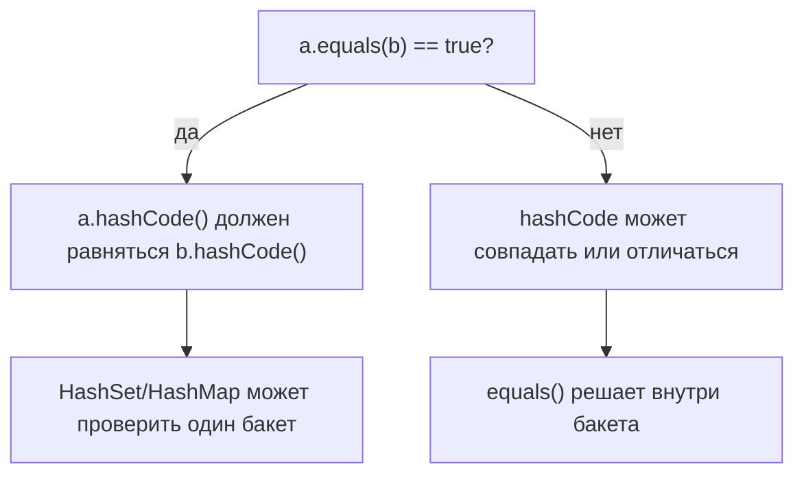
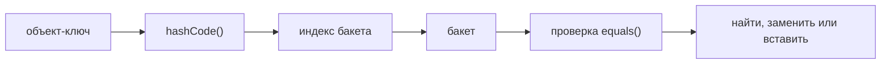

# Контракт equals() и hashCode()

Класс-значение представляет значение, а не личность объекта. Два
`Money(100, "USD")` или два `UserKey(42, "eu")` должны быть взаимозаменяемы,
если их бизнес-поля совпадают. В бытовом смысле это как две почтовые наклейки с
одним и тем же адресом: бумажки разные, но смысл доставки одинаковый.

Hash-based коллекции, такие как [HashMap](topic:hashmap) и
[HashMap basics](topic:hashmap-basics), сначала используют `hashCode()`, чтобы
выбрать бакет, а затем используют `equals()` внутри этого бакета, чтобы
подтвердить точный ключ. Представь почту: письма сначала сортируют по индексу,
а потом на одной полке проверяют имя получателя.



## Контракт

`equals()` должен быть рефлексивным, симметричным, транзитивным, стабильным и
возвращать `false` для `null`. Это похоже на правило дорожного движения: все
водители должны понимать его одинаково. Если `a` говорит, что равно `b`, то `b`
должно сказать то же самое про `a`.

Связь между двумя методами строгая: если `a.equals(b)` возвращает `true`, то
`a.hashCode() == b.hashCode()` тоже должен быть true. Равным значениям нужна
одинаковая сортировочная метка, как двум копиям одного адреса нужна одна и та же
полка на почте.

Обратное не требуется. Одинаковые hash codes не доказывают равенство, потому
что коллизии допустимы. На кухне две банки могут стоять на одной полке, но перед
тем как взять банку, ты всё равно читаешь этикетку.

Оба метода должны использовать одни и те же стабильные бизнес-поля. Если
`equals()` использует `id` и `region`, то `hashCode()` тоже должен использовать
`id` и `region`. Не включай изменяемые поля, если объект может использоваться
как ключ после изменения этих полей. Почтовая наклейка не должна менять индекс,
пока посылка уже лежит на полке.



## Как реализовать класс-значение

1. Выбери поля идентичности. Используй поля, которые определяют значение с точки
   зрения бизнеса, например `id`, `tenantId`, `currency` или `sku`. Это как
   решить, какие строки в почтовом бланке действительно задают адрес доставки.
2. В `equals(Object o)` сначала обработай ту же ссылку, затем отвергни `null` и
   несовместимые типы, затем сравни каждое поле идентичности. Для nullable
   object-полей используй `Objects.equals`. Это как сверять улицу, номер дома и
   квартиру строка за строкой.
3. В `hashCode()` объединяй ровно те же поля идентичности. `Objects.hash(...)`
   краток; ручной `31 * result + fieldHash` распространён и избегает varargs
   allocation. Это как сделать одну маршрутную наклейку из тех же полей
   почтового бланка.
4. Для value keys предпочитай неизменяемые поля, часто `final`. [Ключевое слово final](topic:final)
   помогает сохранить маршрутные данные стабильными. [Неизменяемость String](topic:string-immutability)
   - одна из причин, почему строки безопасны как части таких ключей.
5. Для маленьких неизменяемых носителей значений рассматривай `record`. Он
   генерирует корректные `equals()` и `hashCode()` по всем record components.
   Lombok тоже может генерировать эти методы, но при использовании
   [@Data from Lombok](topic:lombok-data) всё равно проверь выбранные поля.

```java
final class UserKey {
    private final int id;
    private final String region;

    UserKey(int id, String region) {
        this.id = id;
        this.region = region;
    }

    @Override
    public boolean equals(Object o) {
        return o instanceof UserKey other
                && id == other.id
                && region.equals(other.region);
    }

    @Override
    public int hashCode() {
        int result = Integer.hashCode(id);
        result = 31 * result + region.hashCode();
        return result;
    }
}
```

## Ответ за 60 секунд

Для класса-значения `equals()` должен сравнивать поля, которые определяют
логическое значение, а `hashCode()` должен вычисляться по тем же полям. Контракт
такой: если `a.equals(b)` возвращает true, то `a.hashCode()` должен быть равен
`b.hashCode()`. Одинаковые hash codes не гарантируют равенство, потому что
коллизии допустимы. Сам `equals()` должен быть рефлексивным, симметричным,
транзитивным, стабильным и возвращать false для `null`. На практике я делаю
ключевые поля неизменяемыми, держу одинаковый список полей в обоих методах, не
меняю состояние ключа после вставки в `HashMap` или `HashSet` и рассматриваю
`record` для простых immutable value objects.

## Значение в production

Нарушенный контракт часто выглядит как "пропавшие" данные в hash-based
коллекциях. `map.get(new UserKey(42, "eu"))` может вернуть `null`, хотя визуально
похожий ключ был вставлен. В почтовых терминах сотрудник ищет на полке 3, хотя
равная посылка лежит на полке 7.

Другая проблема - дубликаты. `HashSet` может хранить два объекта, которые
`equals()` считает равными, если их `hashCode()` отправил их в разные бакеты. Это
как два одинаковых заказа, поставленные на разные кухонные направляющие, из-за
чего оба блюда готовятся.

Изменяемые ключи особенно опасны. Если поле, участвующее в `hashCode()`,
изменится после вставки, объект останется в старом бакете, а будущие поиски
вычислят новый бакет. Это как поменять номер комнаты на гостиничной карточке
после того, как карточку уже положили в коробку старой комнаты.

Иерархии классов усложняют `equals()`. `instanceof` может поддерживать подклассы,
но может и сломать симметрию, если подкласс добавляет новые поля идентичности.
`getClass()` строже и часто безопаснее для value classes. Это как решить, должен
ли билет подходить к "любому доставочному транспорту" или только к точному типу
фургона.

## Частые заблуждения

- "Если hash codes равны, объекты равны." Нет. Hash collision означает только,
  что объекты попали на одну полку; `equals()` всё ещё проверяет этикетку.
- "Можно переопределить equals() без hashCode()." Нет. Равные объекты тогда
  могут получить identity-based hash codes и попасть в разные бакеты.
- "Нужно включать все поля." Не всегда. Включай только поля, определяющие
  логическое равенство. Кэшированное отображаемое имя похоже на стикер на
  посылке, а не на часть адреса.
- "Mutable keys нормальны, если быть аккуратным." Они хрупкие. После попадания
  ключа в `HashMap` или `HashSet` изменение полей идентичности похоже на перенос
  почтового ящика, когда почтальон всё ещё идёт по старому маршруту.
- "Сгенерированные методы всегда правильные." Records обычно идеальны, если все
  components являются полями идентичности. Lombok и генерация IDE полезны, но
  список выбранных полей всё равно должен проверить человек.
