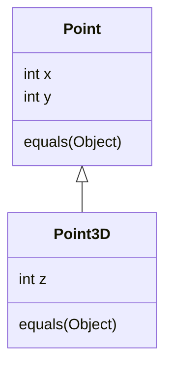
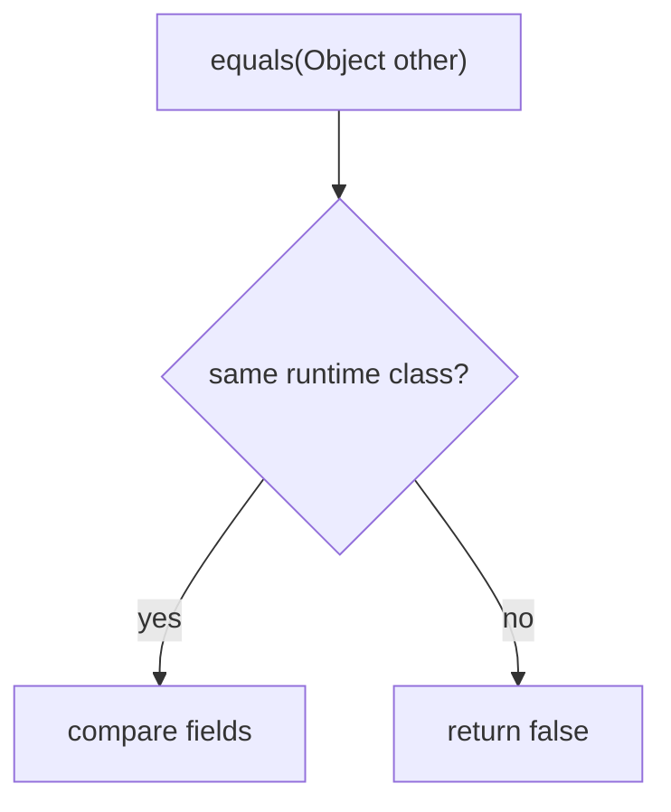

# equals() and Inheritance

## Intuition

`equals(Object)` is not just a helper method. It is a contract: it must be
reflexive, symmetric, transitive, consistent, and return `false` for `null`. Think
of it like a post office rule for matching parcels: if parcel A is treated as the
same delivery as parcel B, the rule must also work when the clerk checks B against
A.

Inheritance makes that rule harder because a subclass may add new state. A base
`Point` knows only `x` and `y`; `Point3D` also knows `z`. If `Point.equals` uses
`instanceof Point`, it accepts `Point3D` and compares only `x/y`. That is like a
kitchen scale that weighs only the plate and ignores the extra ingredient on top:
the old tool gives an answer, but it did not see the whole object.

## What Breaks With instanceof

Symmetry can break first. `point.equals(point3d)` may return `true` because the
base class sees matching `x/y`, while `point3d.equals(point)` returns `false`
because the subclass requires another `Point3D` and a matching `z`. It is like a
traffic checkpoint where the city gate accepts any vehicle with the right plate,
but the underground garage requires both the plate and a height tag.

Transitivity can break when `Point3D` tries to be "friendly" and treats a plain
`Point` as equal by ignoring `z`. Then `Point3D(1,2,10)` can equal `Point(1,2)`,
and `Point(1,2)` can equal `Point3D(1,2,20)`, but the two `Point3D` objects are
not equal to each other. That is like a post office merging two parcels through a
shared street address while their apartment numbers disagree.

Collections expose the bug. `HashSet` and [HashMap internals](topic:hashmap)
depend on `equals()` and `hashCode()` being coherent. If equality is asymmetric,
`contains(...)` can depend on which object was stored and which object is used as
the probe. In a warehouse analogy, the shelf lookup works only if every clerk uses
the same label rule in both directions.

This is related to [OOP principles](topic:oop-principles): inheritance says a
subclass is substitutable as the base type, but value equality often wants a strict
definition of "same value". The two ideas can pull in different directions.

## What getClass() Changes

`getClass()` draws a hard boundary: two objects are equal only if they have the
exact same runtime class. `Point` and `Point3D` are never equal to each other, even
when `x/y` match. This keeps symmetry simple, like a post office that never mixes
letters and parcels in the same matching rule.

The tradeoff is that `getClass()` rejects cross-class equality. That is often good
for value classes with extra subclass state, but it can be too strict if your
domain truly says different classes may represent the same value. If the class is
`final`, this problem mostly disappears because there is no subclass to smuggle in
extra state; see [final](topic:final).

`instanceof` is not wrong by itself. It is safe when the class is final, when the
hierarchy is carefully designed for equality, or when subclasses do not add value
state. It is risky in open value hierarchies because future subclasses can change
what "same" should mean. Like a kitchen recipe card, the rule is safe only while
all cooks agree which ingredients count.

## Practical Choices

Prefer final value classes, records, or composition when equality is central.
`Point3D` can contain a `Point` instead of extending it; then each value type has
its own local equality rule. This is like keeping kitchen containers labeled by
purpose instead of pretending every container is the same because it has the same
base shape.

Use `getClass()` when instances of different runtime classes must never be equal.
Use `instanceof` only when the hierarchy explicitly supports cross-class equality
and you can preserve the full contract. Some libraries use a `canEqual` pattern so
subclasses can opt in or out, but it is still a design choice that needs tests and
documentation.

Also remember that overriding `equals()` means overriding `hashCode()`. If two
objects are equal, their hash codes must be equal. This matters directly in
[HashMap basics](topic:hashmap-basics), `HashSet`, caches, and deduplication code.
The shelf label and the parcel comparison must describe the same delivery.

## 60-Second Interview Answer

If a base class implements `equals()` with `instanceof`, it accepts subclass
instances as the same kind of value. That can be dangerous when a subclass adds
state. In the classic `Point` / `Point3D` case, `Point.equals(point3d)` may return
`true` because it compares only `x/y`, while `Point3D.equals(point)` returns
`false` because it needs `z`. That violates symmetry. A "friendly" subclass that
also accepts plain `Point` can violate transitivity: two 3D points with different
`z` values can both equal the same 2D point but not each other.

`getClass()` requires exact runtime class equality, so `Point` and `Point3D` are
never equal to each other. This preserves symmetry more easily, but it rejects
cross-class equality and can be stricter than `instanceof`. In practice I avoid
open value-class inheritance, prefer final classes, records, or composition, and
test the equals/hashCode contract when a hierarchy is unavoidable.

## Production Relevance

Broken equality is rarely isolated. It leaks into `HashSet`, `HashMap`, ORM entity
identity, cache keys, message deduplication, and tests. A bad equality rule is
like a warehouse scanner that sometimes says two boxes are the same and sometimes
says they are different depending on who scans first.

It also interacts with method behavior: the `equals(Object)` implementation is an
override, so the runtime object decides which body runs. If that distinction feels
unclear, review [Overriding vs Overloading](topic:override-vs-overload).

## Common Misconceptions

- "`instanceof` is always more polymorphic, so it is always better." It is more
  permissive, but permissive equality can ignore subclass state.
- "`getClass()` is always better." It is safer for exact value types, but it forbids
  equality across classes even when the domain might allow it.
- "Symmetry is the only problem." Transitivity and `hashCode()` consistency are
  just as important.
- "Collections are broken if `contains()` surprises me." Collections assume your
  equality contract is correct; they are just revealing the inconsistency.
- "A subclass can always fix the base equals." It cannot fully fix a base rule that
  has already promised equality with objects it does not understand.
