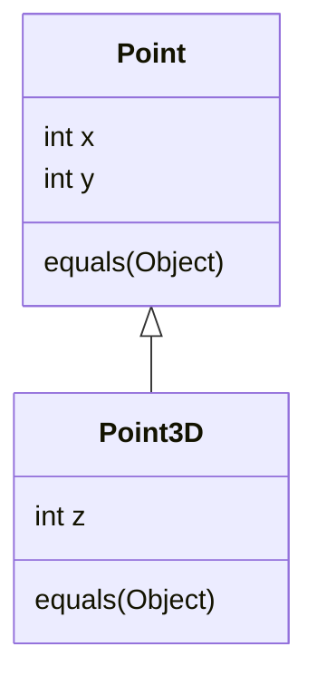
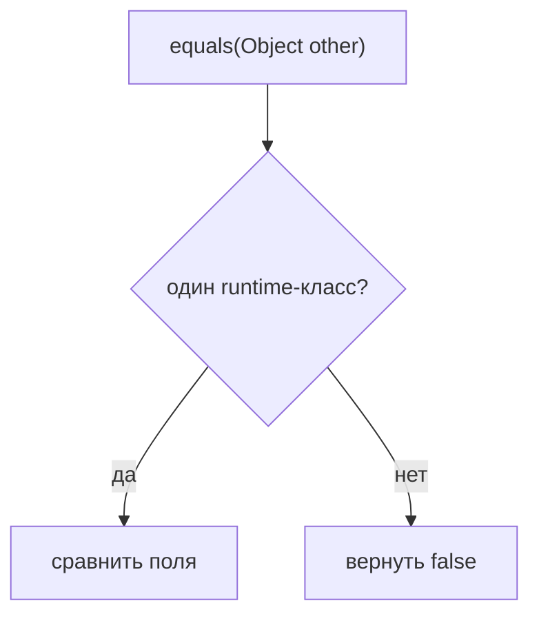

# equals() и наследование

## Интуиция

`equals(Object)` - это не просто вспомогательный метод. Это контракт: он должен
быть рефлексивным, симметричным, транзитивным, консистентным и возвращать `false`
для `null`. Представь правило на почте для сопоставления посылок: если посылка A
считается той же доставкой, что и посылка B, правило должно работать и когда
сотрудник проверяет B против A.

Наследование усложняет это правило, потому что подкласс может добавить новое
состояние. Базовый `Point` знает только `x` и `y`; `Point3D` знает еще и `z`. Если
`Point.equals` использует `instanceof Point`, он принимает `Point3D` и сравнивает
только `x/y`. Это похоже на кухонные весы, которые взвешивают только тарелку и
игнорируют дополнительный ингредиент сверху: старый инструмент дает ответ, но он
не увидел весь объект.

## Что ломает instanceof

Сначала может сломаться симметрия. `point.equals(point3d)` может вернуть `true`,
потому что базовый класс видит совпадающие `x/y`, а `point3d.equals(point)`
вернет `false`, потому что подклассу нужен другой `Point3D` и совпадающий `z`.
Это похоже на дорожный пункт контроля: городские ворота принимают любую машину с
правильным номером, а подземная парковка требует и номер, и метку высоты.

Транзитивность может сломаться, когда `Point3D` пытается быть "дружелюбным" и
считает обычный `Point` равным, игнорируя `z`. Тогда `Point3D(1,2,10)` может быть
равен `Point(1,2)`, и `Point(1,2)` может быть равен `Point3D(1,2,20)`, но два
объекта `Point3D` не равны друг другу. Это похоже на почту, которая объединяет
две посылки через общий адрес улицы, хотя номера квартир у них разные.

Коллекции быстро показывают баг. `HashSet` и [устройство HashMap](topic:hashmap)
зависят от согласованности `equals()` и `hashCode()`. Если равенство
асимметрично, `contains(...)` может зависеть от того, какой объект уже хранится и
какой объект используется для поиска. В аналогии со складом поиск по полке
работает только если все сотрудники используют одно и то же правило маркировки в
обоих направлениях.

Это связано с [принципами ООП](topic:oop-principles): наследование говорит, что
подкласс можно подставить вместо базового типа, но value equality часто хочет
строгое определение "того же значения". Эти две идеи могут тянуть в разные
стороны.

## Что меняет getClass()

`getClass()` проводит жесткую границу: два объекта равны только если у них один и
тот же runtime-класс. `Point` и `Point3D` никогда не равны друг другу, даже когда
`x/y` совпадают. Это упрощает симметрию, как почта, которая никогда не смешивает
письма и посылки в одном правиле сопоставления.

Компромисс в том, что `getClass()` отвергает равенство между разными классами.
Это часто хорошо для value classes с дополнительным состоянием в подклассе, но
может быть слишком строго, если домен действительно говорит, что разные классы
могут представлять одно и то же значение. Если класс `final`, проблема почти
исчезает, потому что подкласс не может пронести дополнительное состояние; смотри
[final](topic:final).

`instanceof` сам по себе не ошибочен. Он безопасен, когда класс final, когда
иерархия специально спроектирована для равенства или когда подклассы не добавляют
value state. Он рискован в открытых value-иерархиях, потому что будущие
подклассы могут изменить смысл "того же". Как карточка рецепта на кухне, правило
безопасно только пока все повара согласны, какие ингредиенты считаются важными.

## Практические решения

Предпочитай final value classes, records или композицию, когда равенство важно.
`Point3D` может хранить `Point` внутри себя, а не наследовать его; тогда у каждого
value type свое локальное правило равенства. Это похоже на кухонные контейнеры с
подписями по назначению вместо попытки считать все контейнеры одинаковыми только
из-за общей базовой формы.

Используй `getClass()`, когда экземпляры разных runtime-классов никогда не должны
быть равны. Используй `instanceof` только когда иерархия явно поддерживает
межклассовое равенство и ты можешь сохранить весь контракт. Некоторые библиотеки
используют шаблон `canEqual`, чтобы подклассы могли согласиться или отказаться,
но это все равно проектное решение, которому нужны тесты и документация.

Также помни: если переопределяешь `equals()`, нужно переопределить и
`hashCode()`. Если два объекта равны, их hash codes должны быть равны. Это важно
для [основ HashMap](topic:hashmap-basics), `HashSet`, кешей и кода дедупликации.
Метка на полке и сравнение посылок должны описывать одну и ту же доставку.

## Ответ за 60 секунд

Если базовый класс реализует `equals()` через `instanceof`, он принимает
экземпляры подклассов как тот же вид значения. Это опасно, когда подкласс
добавляет состояние. В классическом примере `Point` / `Point3D`
`Point.equals(point3d)` может вернуть `true`, потому что сравнивает только `x/y`,
а `Point3D.equals(point)` вернет `false`, потому что ему нужен `z`. Это нарушает
симметрию. "Дружелюбный" подкласс, который тоже принимает обычный `Point`, может
нарушить транзитивность: две 3D-точки с разными `z` могут быть равны одной и той
же 2D-точке, но не равны друг другу.

`getClass()` требует точного совпадения runtime-класса, поэтому `Point` и
`Point3D` никогда не равны друг другу. Это проще сохраняет симметрию, но
запрещает межклассовое равенство и может быть строже, чем `instanceof`. На
практике я избегаю открытого наследования value classes, предпочитаю final
classes, records или композицию и тестирую контракт equals/hashCode, если
иерархии избежать нельзя.

## Производственная значимость

Сломанное равенство редко остается локальной проблемой. Оно протекает в
`HashSet`, `HashMap`, identity у ORM-сущностей, cache keys, дедупликацию сообщений
и тесты. Плохое правило равенства похоже на складской сканер, который иногда
говорит, что две коробки одинаковые, а иногда - что разные, в зависимости от
того, кто сканирует первым.

Это также связано с поведением методов: реализация `equals(Object)` является
override, поэтому runtime-объект решает, какое тело метода выполнится. Если это
различие кажется неочевидным, повтори [переопределение и перегрузку](topic:override-vs-overload).

## Частые заблуждения

- "`instanceof` всегда более полиморфен, значит он всегда лучше." Он более
  разрешающий, но разрешающее равенство может игнорировать состояние подкласса.
- "`getClass()` всегда лучше." Он безопаснее для точных value types, но запрещает
  равенство между классами даже когда домен мог бы это разрешить.
- "Проблема только в симметрии." Транзитивность и согласованность `hashCode()` не
  менее важны.
- "Коллекции сломаны, если `contains()` удивляет." Коллекции предполагают, что
  контракт равенства корректен; они только показывают несогласованность.
- "Подкласс всегда может починить equals базового класса." Он не может полностью
  исправить базовое правило, которое уже пообещало равенство с объектами, которых
  не понимает.
