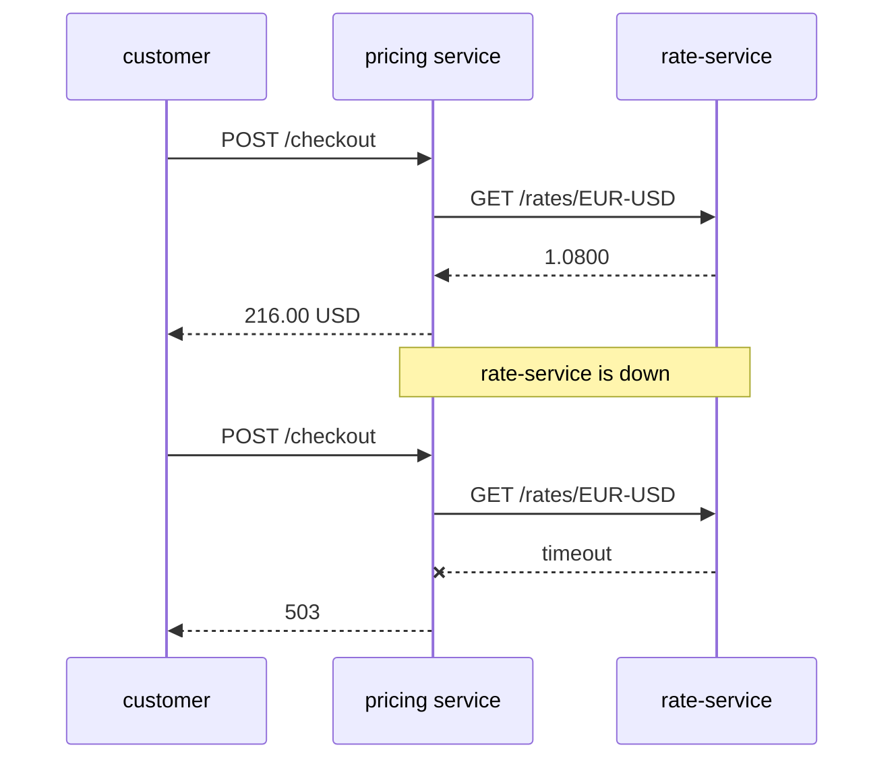
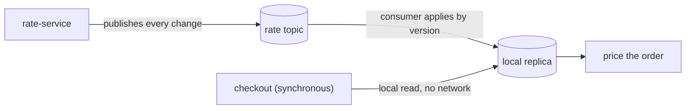
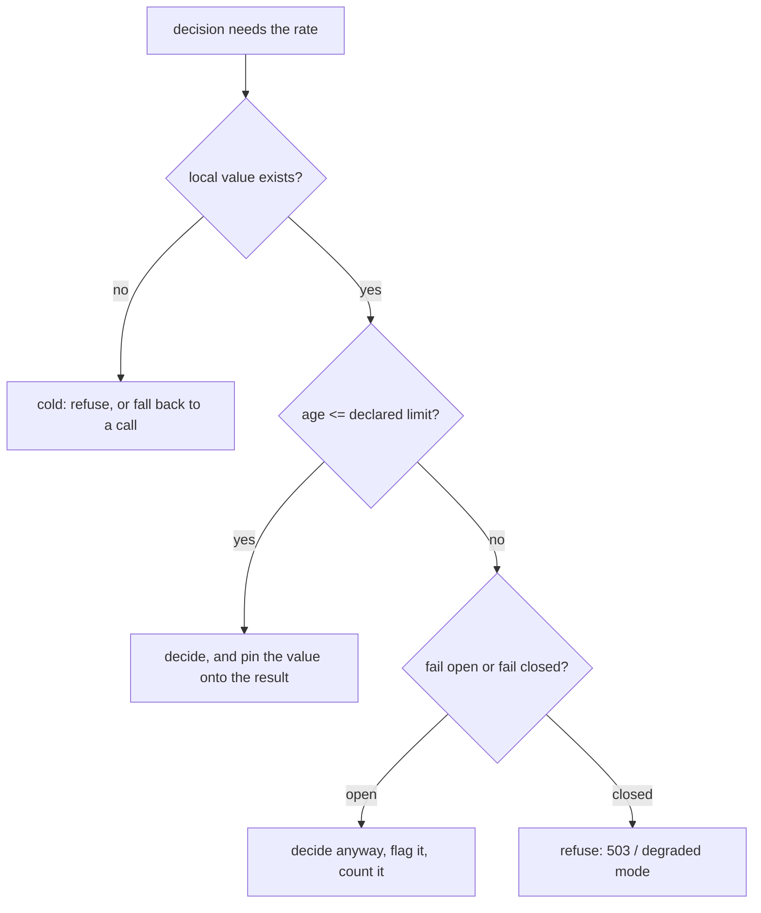

# Async Data at a Synchronous Decision Point

Two clocks are running. The exchange rate changes on **rate-service's** schedule —
whenever the market moves, whenever a scheduled import finishes. The checkout
happens on the **customer's** schedule, and it has to be priced before the button
finishes animating. The question is what bridges those clocks, and every answer
is a trade between *how current the number is* and *how much of someone else's
fragility you take on*.

There are only two shapes. You fetch the value inside the decision, or you keep a
copy of it and decide locally. Everything else — TTLs, events, snapshots, circuit
breakers — is detail on top of that choice.

## Option 1: ask the owner, inside the decision



This is the honest baseline and it is right more often than architecture diagrams
suggest: the answer is always current, there is no copy to keep correct, and
there is nothing to explain to the next engineer. Run the **Call the owner every
time** example and watch what it actually costs.

- **Latency adds up.** Every decision pays a network round trip, and they compose:
  three such lookups in one request is three round trips on the critical path.
- **Availability multiplies.** Checkout is now up only when pricing *and*
  rate-service are up. Two services at 99.9% give you 99.8%, and that arithmetic
  gets worse with every dependency you add. Run **The owner goes down**: the
  pricing service is healthy, its database is healthy, and checkout is dead.
- **You have imported someone's capacity problem.** Your traffic spike is now
  their traffic spike.

Timeouts, retries and a circuit breaker (see [service timeouts and
fallbacks](topic:service-timeouts-fallbacks)) make the failure *fast* rather than
absent — and the fallback a breaker opens onto is, almost always, a locally
cached value. Which means you end up building option 2 anyway; better to build it
deliberately.

## Option 2: keep the value locally



A local copy turns a distributed question into a local one. The decision reads
memory or a local table and cannot fail because of somebody else. Two ways to
fill that copy:

| | **Read-through cache (TTL)** | **Event-carried state transfer** |
| --- | --- | --- |
| Who initiates | the consumer, on a miss | the owner, on every change |
| Staleness | up to the TTL, always | delivery lag, usually milliseconds |
| Load on the owner | one call per key per TTL | one publish per change |
| Cold start | first request pays for it | replay the log / snapshot |
| Owner is down | misses fail or serve expired data | replica keeps serving; it just stops updating |
| Coupling | consumer knows the owner's API | consumer knows the owner's *event schema* |

The cache is the cheaper thing to build and needs no cooperation from the owner.
Event-carried state transfer needs the owner to publish, but it removes the call
from the decision path entirely — and it is what people mean when they say a
service should be able to answer using only its own data. It appears in every
pattern catalogue for that reason (see [microservice
patterns](topic:microservice-patterns) and [types of
interaction](topic:microservice-interaction-types)).

### A TTL is not a freshness guarantee

It is a **bound on how wrong you are allowed to be**. A 60-second TTL does not
mean the value is at most 60 seconds old — it means that when the owner changed
the rate one second after your fetch, you served the old one for the remaining 59.
Run **A local cache with a TTL** and watch exactly that happen. The right way to
choose a TTL is to ask "how wrong can this be before someone loses money", not
"how much load do I want to save".

Two more things the cache brings along: on expiry, many concurrent requests miss
at once and stampede the owner (mitigate with jitter, a single-flight refresh, or
refresh-ahead), and the copy has to live *somewhere* — an in-process map is
fastest but is per-instance and dies on deploy, while Redis is shared but is one
more service on the critical path. A memory-sensitive in-process cache is exactly
the use case for [soft references](topic:reference-types-cache).

## Event-carried state transfer, concretely

The owner publishes an event that **carries the state**, not just a notification:

```json
{ "pair": "EUR/USD", "rate": "1.0950", "version": 7, "validFrom": "2026-07-27T10:15:00Z" }
```

The difference matters. A notification-only event ("the EUR/USD rate changed")
forces every consumer to call back for the value, which reintroduces the coupling
you were removing and multiplies it by the number of consumers. Carrying the state
means the consumer never has to ask.

The consumer keeps a **read model**: its own copy, shaped for its own decisions,
which it may read but must never treat as the truth of record. It is a
denormalization across a service boundary — the same trade as [denormalizing a
table](topic:database-normalization), with a network in the middle. Writes still
go to the owner; the replica answers reads.

For the producer this is [asynchronous
communication](topic:sync-vs-async-communication) with all its usual obligations:
publish reliably (the [Outbox pattern](topic:outbox-pattern), or at least a
[transactional event listener](topic:spring-transactional-event-listener) so you
never publish something you rolled back), and make the topic a real one —
[Kafka's compacted topics](topic:kafka-vs-rabbitmq) keep the last event per key
forever, which is what makes a replica rebuildable.

## The decision that actually shapes the design: how stale may it be?

This is the question interviewers are listening for, and it is a **business**
question, not a technical one:



The limit is per-decision, not per-service. On the same rate, in the same system:

- showing an approximate price on a product page — minutes are fine, fail open;
- pricing a cart at checkout — seconds, fail closed;
- settling a payment or writing an accounting entry — the rate must come from a
  record you can defend in an audit, so it is not a cache question at all.

Without a declared limit, the code has no way to know the data is too old, so it
silently prices whatever it has. That is what the **An expired cache during an
outage** example shows: the expired entry is served, the outage never surfaces,
and "stale-if-error" happens to you rather than being chosen by you. Declaring the
limit turns the same read into either a visible degradation or an honest refusal.

## The failure this topic exists for

An asynchronous feed does not fail loudly. It stops.

A stuck listener thread, a consumer group that never rejoined after a rebalance, a
partition with no assigned consumer, a deserialization error swallowed in a `catch`
— and the replica simply stops changing. Every request still succeeds. Latency
looks great. The error rate is zero. And every price is half an hour old. Run **The
feed stops, nothing fails** — the run looks healthier than the correct one.

So you monitor the thing that actually moved: **the age of the data and the lag of
the consumer**, not the error rate.

- Export `now - lastAppliedEventTimestamp` per key group as a gauge and alert on it.
- Export consumer lag (Kafka) or queue depth (RabbitMQ) and alert on it.
- Publish **heartbeats** for slowly-changing data — otherwise a key that legitimately
  has not changed for an hour is indistinguishable from a broken pipe.
- Note what catching up does and does not fix: after the feed resumes, the backlog
  is delivered, but the newest event in it may itself be half an hour old. Being
  caught up is not the same as being current.

## Making a local copy trustworthy

1. **Every event carries a version (or a monotonic timestamp) and a key.** Apply an
   event only when its version is greater than the one you hold; drop the rest.
   That single rule makes the consumer idempotent under at-least-once delivery and
   immune to reordering after a rebalance — run **Duplicate and out-of-order
   events**. It is the same mechanism as the [Inbox
   pattern](topic:inbox-pattern) and the same reasoning as [avoiding duplicate
   sales](topic:duplicate-sale-prevention).
2. **The replica must be rebuildable from the log.** Replay a compacted topic or load
   a snapshot; do not depend on the owner being up to do it. A replica you cannot
   rebuild is a cache with extra steps — see **Cold start and rebuild**.
3. **Decide where it lives.** In-memory is fastest and empty after every deploy; a
   local table survives restarts and lets you rebuild lazily. If it is in memory, it
   is written by the listener thread and read by request threads, so it needs a
   [concurrent map](topic:concurrenthashmap-vs-synchronized-map), not a `HashMap`.
4. **Pin the value onto the decision.** Store `rate`, its `version` and its
   `validFrom` on the order. A quote made at 10:15 must still be explainable at
   16:00, and "what rate did we use" must never be answered by looking at today's
   rate table.
5. **Version the event schema.** The owner will add fields. Consumers must ignore
   unknown ones and keep working; a breaking change is published as a new event
   type or a new topic, with both live during the migration.
6. **Have an answer for "no data at all."** A brand-new instance, a brand-new
   currency pair: refuse, fall back to one synchronous call, or use a documented
   default. Choose deliberately — the default is what production will do.

## When not to keep a local copy

- **The data is huge or high-cardinality.** Replicating a full product catalogue
  into six services to answer one field is worse than a call.
- **It is sensitive.** Every replica is another place PII lives, another place to
  audit, another place to delete on request.
- **You need a transactional guarantee, not a value.** "Is this seat still free"
  cannot be answered by a replica; you need the owner to reserve it.
- **It changes far faster than you read it.** If the value is different on every
  read, you are maintaining a replica to never use it.
- **Only one consumer, rarely used.** A call is simpler; keep the option to change
  your mind later.

## The 60-second interview answer

> The decision is synchronous, so it must not depend on a synchronous call to the
> service that owns the data. I keep the value locally — for something like an FX
> rate, by event-carried state transfer: rate-service publishes every change with
> the value, a version and a validity timestamp, my consumer applies events by
> version into its own read model, and checkout reads that model with no network
> call. Applying by version makes redelivery and reordering harmless, and the topic
> is compacted so a new instance rebuilds its replica by replaying it — which works
> even while rate-service is down. Then the part that actually decides the design:
> I declare how old the value may be for each decision. A product page can be
> minutes stale and fails open; a checkout is seconds and fails closed; a
> settlement uses a stored rate, not a cached one. Whatever rate a decision used
> gets pinned onto the order with its version, so the price stays explainable
> afterwards. And because a stopped feed raises no exception, I alert on data age
> and consumer lag rather than on the error rate. A read-through cache with a TTL
> is the lighter version of the same idea when the owner cannot publish events —
> but a TTL is a bound on how wrong I am willing to be, not a freshness guarantee.

## Common misconceptions

- **"A cache makes the data fresh."** A cache makes it *available*. It makes it
  staler by design; the TTL only bounds by how much.
- **"Nothing is failing, so the data is fine."** Staleness throws no exception.
  Health checks, error rates and latency all look perfect while a stopped consumer
  serves an hour-old rate.
- **"The event is a notification; the consumer will fetch the details."** Then you
  have kept the synchronous call and added a broker. Carry the state in the event.
- **"Events arrive in order and exactly once."** They do not. Apply by version and
  the assumption stops mattering.
- **"The replica is my data now."** It is a read model. Writes go to the owner, and
  when the two disagree, the owner wins.
- **"We will rebuild the replica from the owner's API if we lose it."** That
  couples recovery to the owner's availability and rate limits, exactly when things
  are worst. Rebuild from the log.
- **"Just make the TTL short."** A one-second TTL is a synchronous call with extra
  steps, and it hands the owner your full traffic.
- **"Eventual consistency means we may show anything."** It means bounded
  staleness that you chose, measured, and can explain — a bound nobody wrote down
  is not eventual consistency, it is an unmonitored bug.
